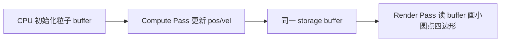

# WebGPU · 02 Compute 粒子

> Demo：[21-webgpu-compute](http://localhost:5173/examples/21-webgpu-compute/)  
> 对照 WebGL 版 [11-particles](http://localhost:5173/examples/11-particles/) 与 [进阶 02 粒子](../advanced/02-particles.md)。

WebGL **没有 Compute Shader**——粒子位置通常在 CPU 或 Transform Feedback 里更新。WebGPU 的 Compute 可以在 GPU 上并行更新 thousands 粒子，再交给 Render Pass 画点。

---

## 数据流



同一 `GPUBuffer` 绑定两次：

| Pass | Shader 访问 | Usage |
|------|-------------|-------|
| Compute | `var<storage, read_write>` | `STORAGE` |
| Render | `var<storage, read>` | `STORAGE` + `VERTEX`（可选） |

---

## 粒子结构（WGSL）

```wgsl
struct Particle {
  pos: vec2f,
  vel: vec2f,
}; // 16 字节，与 Float32Array 一一对应

@group(0) @binding(0) var<storage, read_write> particles: array<Particle>;
@group(0) @binding(1) var<uniform> params: Params;

struct Params {
  dt: f32,
  count: u32,
  _pad: vec2u,
};
```

CPU 侧：

```js
const particles = new Float32Array(COUNT * 4); // x,y,vx,vy
device.queue.writeBuffer(particleBuffer, 0, particles);
```

---

## Compute Shader

```wgsl
@compute @workgroup_size(64)
fn update(@builtin(global_invocation_id) gid: vec3u) {
  let i = gid.x;
  if (i >= params.count) { return; }
  var p = particles[i];
  p.pos += p.vel * params.dt;
  // 边界反弹 …
  particles[i] = p;
}
```

调度：

```js
pass.dispatchWorkgroups(Math.ceil(PARTICLE_COUNT / 64));
```

`global_invocation_id.x` 即粒子索引；workgroup 大小 64 是常见起点，可按 GPU 调优。

---

## Render Shader（读 storage）

顶点阶段用 `@builtin(vertex_index)` 当数组下标，**不需要** vertex buffer：

```wgsl
@vertex
fn vs(@builtin(vertex_index) i: u32) -> VSOut {
  let p = particles[i];
  out.pos = vec4f(p.pos, 0.0, 1.0);
  out.psize = 4.0;
  return out;
}
```

绘制：

```js
pass.setPipeline(renderPipeline);
pass.setBindGroup(0, renderBG); // 同一 particleBuffer，shader 为 read
pass.draw(PARTICLE_COUNT);
```

`primitive: { topology: 'triangle-list' }`；每粒子 6 顶点小四边形，片元 `discard` 成圆（WebGPU **不支持** `point_size`）。

---

## 一帧完整顺序

```js
device.queue.writeBuffer(paramsBuffer, 0, new Float32Array([dt, COUNT, 0, 0]));

const encoder = device.createCommandEncoder();

// 1. Compute
const cpass = encoder.beginComputePass();
cpass.setPipeline(computePipeline);
cpass.setBindGroup(0, computeBG);
cpass.dispatchWorkgroups(Math.ceil(COUNT / 64));
cpass.end();

// 2. Render
const rpass = encoder.beginRenderPass({ colorAttachments: [...] });
rpass.setPipeline(renderPipeline);
rpass.setBindGroup(0, renderBG);
rpass.draw(COUNT);
rpass.end();

device.queue.submit([encoder.finish()]);
```

**顺序很重要**：同一帧内先 compute 再 render；WebGPU 会保证 pass 间依赖。

---

## 与 WebGL 粒子 Demo 对照

| 项目 | WebGL 11-particles | WebGPU 21-compute |
|------|-------------------|-------------------|
| 位置更新 | CPU `requestAnimationFrame` 写 buffer | Compute shader 并行 |
| 绘制 | `gl.POINTS` + `gl_PointSize` | 小四边形 `triangle-list`（WebGPU 无 point_size） |
| 规模 | ~几千（CPU 瓶颈） | 8k+ 仍流畅 |
| Shader | GLSL vertex 读 attribute | WGSL 读 storage |

Three.js 侧可用 `WebGPURenderer` + 内置节点或自定义 compute；见 [Three.js Lab 11](http://localhost:5174/labs/11-webgpu-renderer/) 与 [交叉对照](../practices/03-webgl-threejs-crosswalk.md)。

---

## 练习

1. 把边界从「反弹」改成「从另一侧穿出」（wrap）。
2. 增加第三维 `z`，用透视投影画 3D 点云。
3. 在 Compute 里加简单「引力点」，观察 flocking 雏形。
4. 对比关闭 Compute、改回 CPU 更新时的帧率（DevTools Performance）。

---

## 导航

- 上一篇：[01 第一个三角形](./01-first-triangle.md)
- 选型：[WebGPU README](./README.md)
- WebGL 粒子：[进阶 02](../advanced/02-particles.md)
- 交叉对照：[WebGL ↔ Three.js](../practices/03-webgl-threejs-crosswalk.md)
