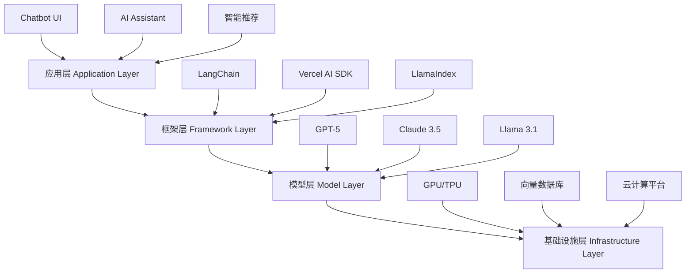
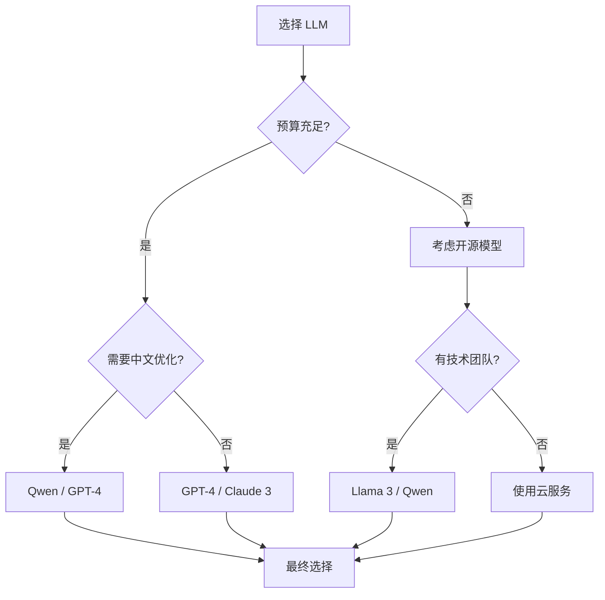

# 前端开发者的 AI 入门指南：你需要知道的所有概念

> 用前端开发者熟悉的思维方式，快速理解 AI、ML、LLM 等核心概念


## 📚 目录

- [为什么前端开发者需要关注 AI](#为什么前端开发者需要关注-ai)
- [AI 技术栈全景图](#ai-技术栈全景图)
- [核心概念详解](#核心概念详解)
- [主流大语言模型对比](#主流大语言模型对比)
- [AI 在前端的应用场景](#ai-在前端的应用场景)
- [如何开始你的 AI 之旅](#如何开始你的-ai-之旅)
- [总结与下一步](#总结与下一步)

---

## 为什么前端开发者需要关注 AI

### 行业变革正在发生

如果你还在认为 AI 只是后端或算法工程师的事情，那就大错特错了。事实上，**前端正处于 AI 应用的最前线**：

**现实案例：**
- GitHub Copilot 已经成为 60%+ 开发者的标配工具
- Vercel、Netlify 等平台全面集成 AI 功能
- ChatGPT、Claude 等对话式 UI 成为新的交互范式
- AI 生成的动态内容和个性化体验成为新标准

### 前端开发者的独特优势

作为前端开发者，你在 AI 时代拥有三大优势：

✅ **用户体验敏感度**
- 你知道如何让 AI 交互更自然流畅
- 理解加载状态、错误处理、反馈机制
- 擅长设计对话式界面和渐进式披露

✅ **工程化能力**
- 模块化思维和组件化开发
- 熟悉异步编程和事件驱动架构
- 了解性能优化和最佳实践

✅ **丰富的生态系统**
- JavaScript/TypeScript 生态中有大量 AI 库
- React、Vue 等框架完美适配 AI 应用
- 强大的工具链支持快速原型开发

### 职业发展的必然选择

根据 2024 年的调查数据：
- 具备 AI 技能的前端开发者薪资平均高出 **30-50%**
- 70% 的科技公司在招聘中明确要求 AI 相关经验
- AI + 全栈能力成为高级前端工程师的标配

**结论：** 学习 AI 不是可选项，而是必选项。

---

## AI 技术栈全景图

让我们用前端开发者熟悉的分层架构来理解 AI 技术栈：



### 类比前端技术栈

| AI 技术栈 | 前端技术栈类比 | 说明 |
|-----------|---------------|------|
| 应用层 | React/Vue 组件 | 用户直接交互的界面 |
| 框架层 | Next.js/Nuxt.js | 提供抽象和工具 |
| 模型层 | Browser API | 核心能力提供者 |
| 基础设施层 | Webpack/Vite | 底层支撑系统 |

---

## 核心概念详解

### 1. AI（Artificial Intelligence）- 人工智能

**定义：** 让机器模拟人类智能行为的技术总称。

**前端类比：** 
```javascript
// AI 就像一个超级智能的函数
function artificialIntelligence(input) {
    // 能够理解、推理、学习、创造
    return intelligentResponse(input);
}
```

**包含的子领域：**
- 机器学习（ML）
- 深度学习（DL）
- 自然语言处理（NLP）
- 计算机视觉（CV）
- 语音识别

### 2. ML（Machine Learning）- 机器学习

**定义：** 让计算机从数据中学习规律，而不是通过显式编程。

**传统编程 vs 机器学习：**

```javascript
// 传统编程：你告诉计算机怎么做
function calculatePrice(quantity, unitPrice) {
    return quantity * unitPrice;
}

// 机器学习：计算机从数据中学习规律
// 输入：历史销售数据
// 输出：价格预测模型
const priceModel = trainModel(salesData);
const predictedPrice = priceModel.predict(features);
```

**常见应用场景：**
- 推荐系统（淘宝、抖音的推荐算法）
- 垃圾邮件过滤
- 图像分类
- 异常检测

### 3. DL（Deep Learning）- 深度学习

**定义：** 基于人工神经网络的机器学习方法，能够处理更复杂的模式。

**神经网络类比：**

想象一个多层的过滤器系统：

```
输入层 (Input Layer)
    ↓
隐藏层 1 (Hidden Layer 1) - 提取基础特征
    ↓
隐藏层 2 (Hidden Layer 2) - 组合特征
    ↓
隐藏层 3 (Hidden Layer 3) - 高级抽象
    ↓
输出层 (Output Layer) - 最终结果
```

**前端类比：** 就像 CSS 的选择器特异性计算，每一层都在做特征提取和转换。

**典型应用：**
- 图像识别（人脸识别）
- 语音转文字
- 机器翻译
- **大语言模型（LLM）** ← 这就是我们重点关注的！

### 4. LLM（Large Language Model）- 大语言模型

**定义：** 基于海量文本训练的大型神经网络，能够理解和生成自然语言。

**核心特点：**
- 📊 **大规模**: 参数量从数十亿到万亿级别
- 📚 **预训练**: 在大量文本数据上学习语言规律
- 🎯 **通用性**: 可以完成多种任务（问答、翻译、创作等）
- 💬 **自然交互**: 用自然语言即可沟通

**工作原理简化版：**

```javascript
// LLM 本质上是一个超级的"下一个词预测器"
class LargeLanguageModel {
    constructor() {
        this.parameters = 175_000_000_000; // GPT-3 的参数量
    }
    
    predictNextToken(context) {
        // 基于上下文，预测下一个最可能的词
        const probabilities = this.neuralNetwork(context);
        return this.sample(probabilities);
    }
    
    generate(text, maxLength = 100) {
        let result = text;
        for (let i = 0; i < maxLength; i++) {
            const nextToken = this.predictNextToken(result);
            result += nextToken;
            if (nextToken === '<END>') break;
        }
        return result;
    }
}

// 使用示例
const gpt = new LargeLanguageModel();
const response = gpt.generate('前端开发最重要的技能是');
// 输出："JavaScript、CSS 和 HTML，以及..."
```

### 5. Transformer - 革命性的架构

**定义：** 2017 年提出的神经网络架构，是当前所有主流 LLM 的基础。

**为什么叫 Transformer？**
因为它能够"转换"输入序列为输出序列，核心创新是 **Attention Mechanism（注意力机制）**。

**Attention 机制的直观理解：**

当你阅读这句话时，你的大脑会自动关注重要的词汇，忽略不重要的词。Attention 机制让模型也具备这种能力。

```javascript
// 简化的 Attention 机制
function attention(query, key, value) {
    // 计算 query 和 key 的相关性
    const scores = computeSimilarity(query, key);
    
    // 归一化为概率分布
    const weights = softmax(scores);
    
    // 根据权重聚合 value
    const output = weightedSum(weights, value);
    
    return output;
}

// 实际应用：翻译句子
// "I love programming" → "我爱编程"
// 当翻译 "programming" 时，模型会重点关注源句中的 "programming"
```

**Transformer 的优势：**
- ✅ 并行计算（比 RNN 快得多）
- ✅ 长距离依赖建模
- ✅ 更好的上下文理解

### 6. Token - LLM 的基本单位

**定义：** LLM 处理文本的最小单位，可以是单词、子词或字符。

**Tokenization 示例：**

```javascript
// 英文分词
"I love programming" 
→ ["I", " love", " programming"]  // 3 tokens

// 中文分词
"我喜欢编程"
→ ["我", "喜欢", "编程"]  // 3 tokens

// 复杂词汇
"unbelievable"
→ ["un", "believ", "able"]  // 3 tokens (子词分割)
```

**重要知识点：**
- GPT-3 的词表大小：约 50,000 个 token
- 1 个 token ≈ 4 个英文字符或 1.5 个中文字符
- LLM 的成本通常按 token 数量计算

**成本计算示例：**
```javascript
// GPT-4 的价格（假设）
const pricing = {
    input: 0.03,   // $0.03 / 1K tokens
    output: 0.06   // $0.06 / 1K tokens
};

// 一次对话的成本
const inputTokens = 500;
const outputTokens = 300;
const cost = (inputTokens / 1000) * pricing.input + 
             (outputTokens / 1000) * pricing.output;
// cost = $0.033
```

### 7. Embedding - 向量化表示

**定义：** 将文本转换为高维向量，捕捉语义信息。

**可视化理解：**

```
"国王" - "男性" + "女性" ≈ "女王"

在向量空间中：
vec("国王") - vec("男性") + vec("女性") ≈ vec("女王")
```

**应用场景：**
- 语义搜索（不只是关键词匹配）
- 文本相似度计算
- 推荐系统
- RAG（检索增强生成）

**代码示例：**
```javascript
import { OpenAI } from 'openai';

const openai = new OpenAI({ apiKey: process.env.OPENAI_API_KEY });

async function getEmbedding(text) {
    const response = await openai.embeddings.create({
        model: "text-embedding-3-small",
        input: text
    });
    
    return response.data[0].embedding; // 1536 维向量
}

// 计算文本相似度
function cosineSimilarity(vecA, vecB) {
    const dotProduct = vecA.reduce((sum, a, i) => sum + a * vecB[i], 0);
    const magnitudeA = Math.sqrt(vecA.reduce((sum, a) => sum + a * a, 0));
    const magnitudeB = Math.sqrt(vecB.reduce((sum, b) => sum + b * b, 0));
    
    return dotProduct / (magnitudeA * magnitudeB);
}

// 使用
const vec1 = await getEmbedding("我喜欢编程");
const vec2 = await getEmbedding("我热爱写代码");
const similarity = cosineSimilarity(vec1, vec2);
// similarity ≈ 0.85 (非常相似)
```

---

## 主流大语言模型对比

### 主要玩家概览

| 模型 | 提供商 | 开源 | 最大上下文 | 特点 |
|------|--------|------|-----------|------|
| GPT-5/GPT-4o | OpenAI | ❌ | 256K/128K | 最强综合能力，推理能力大幅提升 |
| Claude 4/3.5 Sonnet | Anthropic | ❌ | 256K/200K | 推理能力强，代码能力优秀，支持 Computer Use |
| Gemini 2.0/1.5 Pro | Google | ❌ | 2M/1M | 超长上下文，多模态能力强 |
| Llama 4 | Meta | ✅ | 256K | 最强开源模型，支持多模态 |
| Qwen 3 | 阿里云 | ✅ | 256K | 中文能力最强，推理能力大幅提升 |
| Mistral Large 3 | Mistral AI | ✅ | 128K | 高效轻量，多语言支持好 |

### 详细对比分析

#### 1. GPT 系列（OpenAI）

**优势：**
- 🏆 综合能力最强，GPT-5 推理能力大幅提升，接近专家水平
- 🛠️ 工具调用（Function Calling）成熟，支持并行函数调用和 Structured Outputs
- 📚 文档和社区资源最丰富
- 🔌 生态系统完善（LangChain、Vercel AI SDK 等优先支持）
- 🎤 支持语音、图像、视频多模态输入输出
- 🧠 GPT-5 具备更强的逻辑推理和复杂问题解决能力

**劣势：**
- 🔒 闭源，无法本地部署
- 🇨🇳 中文能力略逊于专门优化的模型
- 💰 GPT-5 价格较高

**适用场景：**
- 通用 AI 应用
- 需要稳定可靠的生产环境
- 快速原型开发
- 多模态应用（图像理解、语音交互）
- 复杂推理和分析任务

**定价参考（2026）：**
```
GPT-5:          $5.00/1K input,    $15.00/1K output
GPT-4o:         $2.50/1K input,    $10.00/1K output
GPT-4o-mini:    $0.15/1K input,    $0.60/1K output
```

#### 2. Claude 系列（Anthropic）

**优势：**
- 📖 超长上下文窗口（256K tokens）
- 🛡️ 内置安全防护，减少有害输出
- 📝 优秀的文档分析和总结能力
- 💬 更自然的对话风格
- 🖥️ 支持 Computer Use，可操作计算机
- 🧠 Claude 4 推理能力大幅提升，接近 GPT-5 水平

**劣势：**
- 🌍 可用地区有限
- 💰 Claude 4 价格较高

**适用场景：**
- 长文档处理和分析
- 需要高安全性的应用
- 内容创作和编辑
- 代码生成和审查（Claude 代码能力很强）
- 复杂推理和分析任务

#### 3. Llama 系列（Meta）

**优势：**
- ✅ 完全开源，可自由修改
- 🏠 可本地部署，数据隐私有保障
- 💸 无 API 调用成本（只需计算资源）
- 🔧 高度可定制
- 🚀 Llama 4 是目前最强的开源模型，支持多模态

**劣势：**
- ⚙️ 需要自己搭建基础设施
- 📊 需要专业知识进行微调
- 🚀 大参数版本需要大量 GPU 资源

**适用场景：**
- 对数据隐私要求高的企业
- 需要定制化模型
- 有充足技术团队的公司

**本地部署要求：**
```
Llama 4 8B:    ~16GB GPU 内存
Llama 4 70B:   ~140GB GPU 内存
Llama 4 405B:  ~800GB GPU 内存（8x A100 80GB）
```

#### 4. Qwen 系列（阿里云）

**优势：**
- 🇨🇳 中文理解和生成能力最强
- 💰 性价比高
- 🔧 提供多种尺寸（0.5B - 72B）
- 📊 优秀的代码生成能力
- 🧮 Qwen 3 推理能力大幅提升，支持 256K 上下文
- 🎯 支持多模态（图像、音频）

**劣势：**
- 🌍 国际社区资源相对较少
- 🔌 部分工具生态不如 OpenAI 完善

**适用场景：**
- 面向中文用户的应用
- 需要高性价比的方案
- 国内企业级应用

### 选型建议

**根据场景选择：**



**快速决策表：**

| 需求 | 推荐模型 | 理由 |
|------|---------|------|
| 快速原型开发 | GPT-4o-mini | 便宜、快速、易用 |
| 生产环境应用 | GPT-4o/GPT-5 | 稳定、能力强、多模态 |
| 复杂推理任务 | GPT-5/Claude 4 | 推理能力最强 |
| 长文档处理 | Claude 4 / Gemini 2.0 | 256K/2M 上下文窗口 |
| 中文应用 | Qwen 3 | 中文优化最好 |
| 数据隐私敏感 | Llama 4 | 可本地部署，支持多模态 |
| 成本控制 | GPT-4o-mini / 开源模型 | 性价比高 |
| 多模态需求 | GPT-5 / Gemini 2.0 | 图像、语音、视频处理能力强 |

---

## AI 在前端的应用场景

### 1. 智能客服/聊天机器人

**实现方式：**
```typescript
import { createOpenAI } from '@ai-sdk/openai';
import { streamText } from 'ai';

export async function POST(req: Request) {
    const { messages } = await req.json();
    
    const openai = createOpenAI({
        apiKey: process.env.OPENAI_API_KEY
    });
    
    const result = streamText({
        model: openai.chat('gpt-4'),
        messages,
        system: `你是某电商平台的智能客服助手。
        请友好、专业地回答用户问题。
        如果不确定，请引导用户联系人工客服。`
    });
    
    return result.toDataStreamResponse();
}
```

**实际案例：**
- Shopify 的智能客服
- 阿里云小蜜
- 各大银行的在线客服

### 2. AI 辅助编程

**应用场景：**
- 代码补全（GitHub Copilot）
- 代码审查和优化建议
- Bug 诊断和修复
- 代码注释生成
- 单元测试自动生成

**前端集成示例：**
```typescript
// 代码解释助手
async function explainCode(code: string): Promise<string> {
    const prompt = `请解释以下 JavaScript 代码的功能：

\`\`\`javascript
${code}
\`\`\`

请用简洁的语言解释：
1. 这段代码的主要功能
2. 关键逻辑说明
3. 可能的优化点`;

    const response = await openai.chat.completions.create({
        model: "gpt-4",
        messages: [{ role: "user", content: prompt }]
    });
    
    return response.choices[0].message.content;
}
```

### 3. 内容生成助手

**应用类型：**
- AI 写作助手（文章、文案）
- 社交媒体内容生成
- SEO 优化建议
- 多语言翻译
- 图片描述生成

**实战案例：**
```typescript
// SEO 标题生成器
async function generateSEOTitles(topic: string): Promise<string[]> {
    const prompt = `为以下主题生成 5 个吸引人的 SEO 优化标题：
    
    主题：${topic}
    
    要求：
    - 每个标题不超过 60 字符
    - 包含关键词
    - 具有吸引力
    - 返回 JSON 数组格式`;

    const response = await openai.chat.completions.create({
        model: "gpt-4",
        messages: [{ role: "user", content: prompt }]
    });
    
    return JSON.parse(response.choices[0].message.content);
}

// 使用
const titles = await generateSEOTitles("React Hooks");
// [
//   "React Hooks 完全指南：从入门到精通",
//   "10 个实用的 React Hooks 技巧",
//   ...
// ]
```

### 4. 数据分析与可视化

**功能特性：**
- 自然语言查询数据
- 自动生成图表
- 数据洞察和建议
- 趋势预测

**实现思路：**
```typescript
// 自然语言转 SQL
async function nl2sql(question: string, schema: string): Promise<string> {
    const prompt = `基于以下数据库结构，将自然语言问题转换为 SQL 查询：

数据库结构：
${schema}

问题：${question}

SQL 查询：`;

    const response = await openai.chat.completions.create({
        model: "gpt-4",
        messages: [{ role: "user", content: prompt }]
    });
    
    return response.choices[0].message.content;
}

// 使用示例
const sql = await nl2sql(
    "上个月销售额最高的前 10 个产品",
    "products(id, name, price), orders(product_id, quantity, created_at)"
);
// SELECT p.name, SUM(o.quantity * p.price) as total_sales
// FROM products p JOIN orders o ON p.id = o.product_id
// WHERE o.created_at >= DATE_SUB(CURDATE(), INTERVAL 1 MONTH)
// GROUP BY p.id ORDER BY total_sales DESC LIMIT 10;
```

### 5. 个性化推荐

**应用场景：**
- 内容推荐（新闻、视频）
- 商品推荐（电商）
- 学习路径推荐（教育平台）
- 动态 UI 调整

**简单实现：**
```typescript
interface UserProfile {
    interests: string[];
    behaviorHistory: Array<{
        action: string;
        timestamp: number;
        item: string;
    }>;
}

async function generateRecommendations(
    user: UserProfile,
    availableItems: string[]
): Promise<string[]> {
    const prompt = `基于用户画像，从可用项目中推荐最相关的 5 个项目：

用户兴趣：${user.interests.join(', ')}
最近行为：${JSON.stringify(user.behaviorHistory.slice(-5))}
可用项目：${availableItems.join(', ')}

请返回推荐的项目列表（JSON 数组格式），并简要说明推荐理由。`;

    const response = await openai.chat.completions.create({
        model: "gpt-4",
        messages: [{ role: "user", content: prompt }]
    });
    
    return JSON.parse(response.choices[0].message.content);
}
```

### 6. 无障碍辅助

**功能包括：**
- 图像自动描述（alt text 生成）
- 语音交互界面
- 实时字幕生成
- 内容简化（为认知障碍用户）

**示例：自动生成图片描述**
```typescript
async function generateAltText(imageUrl: string): Promise<string> {
    const response = await openai.chat.completions.create({
        model: "gpt-4-vision-preview",
        messages: [
            {
                role: "user",
                content: [
                    { 
                        type: "text", 
                        text: "请为这张图片生成简洁的 alt 文本描述，用于无障碍访问。" 
                    },
                    {
                        type: "image_url",
                        image_url: { url: imageUrl }
                    }
                ]
            }
        ]
    });
    
    return response.choices[0].message.content;
}
```

### 7. 智能表单和验证

**应用场景：**
- 智能表单填充
- 自然语言输入解析
- 动态表单生成
- 智能错误提示

**示例：解析自然语言输入**
```typescript
interface AppointmentRequest {
    date: string;
    time: string;
    purpose: string;
    duration: number;
}

async function parseAppointmentRequest(
    userInput: string
): Promise<AppointmentRequest> {
    const prompt = `从以下用户输入中提取预约信息：

用户输入："我想下周三下午 3 点预约一个小时的会议，讨论项目进度"

请以 JSON 格式返回：
{
    "date": "YYYY-MM-DD",
    "time": "HH:mm",
    "purpose": "会议目的",
    "duration": 分钟数
}`;

    const response = await openai.chat.completions.create({
        model: "gpt-4",
        messages: [{ role: "user", content: prompt }]
    });
    
    return JSON.parse(response.choices[0].message.content);
}

// 使用
const appointment = await parseAppointmentRequest(
    "我想下周三下午 3 点预约一个小时的会议，讨论项目进度"
);
// {
//     date: "2024-05-22",
//     time: "15:00",
//     purpose: "讨论项目进度",
//     duration: 60
// }
```

---

## 如何开始你的 AI 之旅

### 第一步：注册和体验主流平台

**必须注册的平台：**

1. **OpenAI Platform**
   - 网址：https://platform.openai.com
   - 免费额度：$5（新用户）
   - 必玩：Playground 在线测试

2. **Anthropic Claude**
   - 网址：https://claude.ai
   - 免费版：每天有限次数
   - 特色：长文档处理

3. **Google Gemini**
   - 网址：https://gemini.google.com
   - 免费版：可用
   - 特色：多模态能力

**体验清单：**
- [ ] 尝试对话式交互
- [ ] 测试代码生成能力
- [ ] 上传文档进行分析
- [ ] 探索不同模型的差异

### 第二步：学习 Prompt Engineering

**推荐资源：**

1. **官方文档**
   - [OpenAI Prompt Engineering Guide](https://platform.openai.com/docs/guides/prompt-engineering)
   - [Anthropic Prompt Library](https://docs.anthropic.com/claude/prompt-library)

2. **免费课程**
   - [DeepLearning.AI - ChatGPT Prompt Engineering](https://www.deeplearning.ai/short-courses/chatgpt-prompt-engineering-for-developers/)
   - 吴恩达出品，强烈推荐！

3. **实践平台**
   - OpenAI Playground
   - Claude.ai
   - PromptHero（查看优秀 prompt 示例）

**第一个练习：**
```
任务：创建一个通用的代码审查 prompt 模板

要求：
1. 能够审查 JavaScript/TypeScript 代码
2. 指出潜在问题
3. 提供改进建议
4. 保持友好的语气

尝试编写并在 Playground 中测试！
```

### 第三步：构建第一个 AI 应用

**推荐项目（由易到难）：**

**Level 1: CLI 聊天机器人（1-2 小时）**
```bash
npm install openai commander
```

```typescript
#!/usr/bin/env node
import OpenAI from 'openai';
import { Command } from 'commander';

const openai = new OpenAI({
    apiKey: process.env.OPENAI_API_KEY
});

const program = new Command();

program
    .name('ai-chat')
    .description('简单的 CLI 聊天机器人')
    .argument('<message>', '要发送的消息')
    .action(async (message) => {
        console.log('🤔 AI 正在思考...\n');
        
        const completion = await openai.chat.completions.create({
            model: "gpt-3.5-turbo",
            messages: [
                { role: "system", content: "你是一个友好的助手。" },
                { role: "user", content: message }
            ]
        });
        
        console.log('💡 回答：');
        console.log(completion.choices[0].message.content);
    });

program.parse();
```

**Level 2: 网页版聊天界面（半天）**
- 使用 Vercel AI SDK
- 实现流式响应
- 添加打字机效果

**Level 3: RAG 问答系统（2-3 天）**
- 导入自己的文档
- 实现语义搜索
- 构建问答界面

### 第四步：加入社区

**推荐的社区和资源：**

1. **Discord/Slack 群组**
   - LangChain Discord
   - Hugging Face Discord
   - OpenAI Community

2. **Twitter/X 关注**
   - @karpathy (Andrej Karpathy)
   - @ylecun (Yann LeCun)
   - @AndrewYNg (Andrew Ng)

3. **Reddit**
   - r/MachineLearning
   - r/artificial
   - r/LangChain

4. **中文社区**
   - 知乎 AI 话题
   - 微信公众号：AI科技评论、机器之心
   - B站 AI 教程

### 第五步：持续学习和实践

**学习路线图：**

```
第 1-2 周：AI 基础概念 + Prompt Engineering
    ↓
第 3-4 周：OpenAI API 实战 + 小项目
    ↓
第 5-8 周：Agent 概念 + Tools 系统
    ↓
第 9-12 周：RAG + 前端集成
    ↓
持续：深入学习和项目开发
```

**每周学习计划（10-15 小时）：**
- 📖 理论学习：3-4 小时
- 💻 编码实践：5-6 小时
- ✍️ 博客写作：2-3 小时
- 👥 社区交流：1-2 小时

---

## 总结与下一步

### 核心要点回顾

✅ **AI 技术栈层次：**
- 应用层 → 框架层 → 模型层 → 基础设施层

✅ **关键概念：**
- AI > ML > DL > LLM（层层递进）
- Transformer 是当前 LLM 的基础架构
- Token 是 LLM 处理的基本单位
- Embedding 将文本转换为向量

✅ **主流模型选择：**
- 通用场景：GPT-5 / GPT-4o
- 长文本：Claude 4 / Gemini 2.0
- 中文应用：Qwen 3
- 私有部署：Llama 4

✅ **前端应用场景：**
- 智能客服、代码助手、内容生成
- 数据分析、个性化推荐、无障碍辅助

### 常见误区澄清

❌ **误区 1：AI 会取代前端开发者**
✅ **真相：** AI 是工具，会提升效率，但不会取代创造性工作

❌ **误区 2：学习 AI 需要深厚的数学基础**
✅ **真相：** 应用层开发只需要理解基本概念，不需要推导公式

❌ **误区 3：AI 应用都很昂贵**
✅ **真相：** GPT-3.5 很便宜，很多场景成本可控

❌ **误区 4：必须等完全学会再开始项目**
✅ **真相：** 边做边学是最好的方式，从小项目开始

### 下一步行动清单

**立即行动（今天）：**
- [ ] 注册 OpenAI 账号
- [ ] 访问 Playground 体验 GPT
- [ ] 收藏本文提到的资源链接

**本周完成：**
- [ ] 完成 Prompt Engineering 基础课程
- [ ] 编写 5 个不同场景的 prompt
- [ ] 创建第一个 CLI 聊天机器人

**本月目标：**
- [ ] 构建一个完整的 AI 应用（如智能客服）
- [ ] 撰写第一篇 AI 技术博客
- [ ] 加入至少 2 个 AI 社区

**长期规划：**
- [ ] 深入学习 Agent 架构
- [ ] 掌握 RAG 技术
- [ ] 参与开源 AI 项目
- [ ] 建立个人 AI 作品集

### 鼓励的话

学习 AI 是一段激动人心的旅程。作为前端开发者，你已经具备了很好的基础：

🎯 **你有优势：**
- 理解用户体验
- 熟悉异步编程
- 掌握工程化思维

🚀 **你有机会：**
- AI 应用爆发期
- 市场需求旺盛
- 职业发展蓝海

💪 **你能成功：**
- 循序渐进，不要急于求成
- 动手实践，理论结合实践
- 持续学习，保持好奇心

**记住：** 最好的学习时机是现在，第二好的时机是...也是现在！

---

## 参考资料

### 官方文档
- [OpenAI Documentation](https://platform.openai.com/docs)
- [Anthropic Claude Docs](https://docs.anthropic.com)
- [Google Gemini API](https://ai.google.dev/docs)
- [Meta Llama](https://llama.meta.com)

### 学习资源
- [DeepLearning.AI Courses](https://www.deeplearning.ai/courses/)
- [Hugging Face Course](https://huggingface.co/learn)
- [The Illustrated Transformer](http://jalammar.github.io/illustrated-transformer/)

### 工具和平台
- [OpenAI Playground](https://platform.openai.com/playground)
- [Vercel AI SDK](https://sdk.vercel.ai/docs)
- [LangChain](https://python.langchain.com)
- [PromptHero](https://prompthero.com)

### 社区
- [r/MachineLearning](https://www.reddit.com/r/MachineLearning/)
- [Hugging Face Discord](https://discord.gg/huggingface)
- [LangChain Discord](https://discord.gg/langchain)

---

**下一篇预告：** 《LLM 工作原理：用前端思维理解 Transformer》

我们将深入探讨 Transformer 架构，用前端开发者熟悉的类比来理解这个改变世界的技术。敬请期待！
