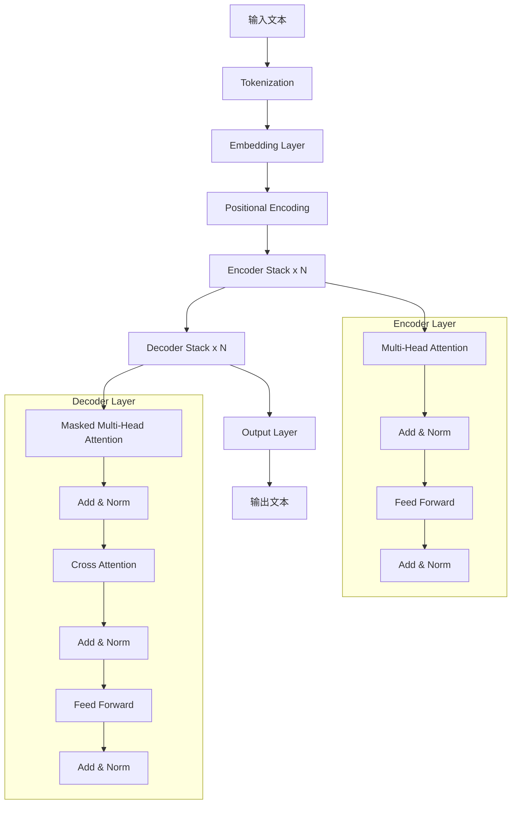
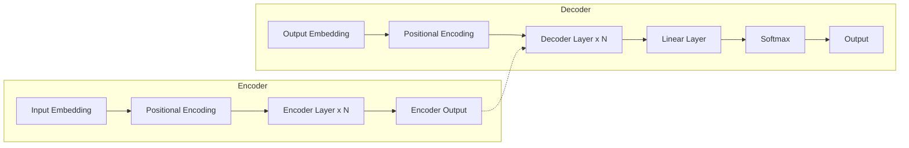
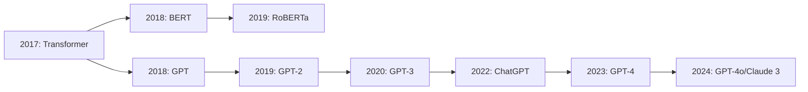

# LLM 工作原理：用前端思维理解 Transformer

> 不需要数学博士学历！用前端开发者熟悉的类比，深入理解改变世界的 Transformer 架构

## 📚 目录

- [为什么需要理解 Transformer](#为什么需要理解-transformer)
- [从 RNN 到 Transformer 的演进](#从-rnn-到-transformer-的演进)
- [Transformer 核心组件详解](#transformer-核心组件详解)
- [Attention 机制深度剖析](#attention-机制深度剖析)
- [Encoder-Decoder 架构](#encoder-decoder-架构)
- [训练过程揭秘](#训练过程揭秘)
- [从 Transformer 到现代 LLM](#从-transformer-到现代-llm)
- [实际代码实现](#实际代码实现)
- [总结与练习](#总结与练习)

---

## 为什么需要理解 Transformer

### 你可能有的疑问

🤔 **"我只是应用层开发者，需要了解底层原理吗？"**

**答案：** 不一定需要深入数学细节，但理解核心概念能帮助你：

✅ **更好地使用 LLM API**
- 理解 token 限制的原因
- 优化 prompt 结构
- 调试奇怪的行为

✅ **设计更高效的 AI 应用**
- 知道何时使用 caching
- 理解上下文窗口的重要性
- 优化成本和性能

✅ **与技术团队有效沟通**
- 理解算法工程师的建议
- 参与技术方案讨论
- 做出更明智的技术选型

✅ **职业竞争力提升**
- 面试中的加分项
- 展示技术深度
- 打开更多职业机会

### 学习目标

完成本文后，你将能够：
- ✅ 解释 Transformer 的核心思想
- ✅ 理解 Attention 机制的工作原理
- ✅ 说明为什么 Transformer 比 RNN 更适合 LLM
- ✅ 用代码实现简化的 Attention 机制
- ✅ 理解现代 LLM 的架构基础

---

## 从 RNN 到 Transformer 的演进

### 早期方案：RNN（循环神经网络）

**RNN 的工作原理：**

想象你在读一本书，RNN 就像逐字阅读并记住内容：

```javascript
// RNN 的简化模型
class RNN {
    constructor() {
        this.hiddenState = null; // 记忆状态
    }
    
    processWord(word) {
        // 结合当前单词和之前的记忆
        this.hiddenState = this.updateState(word, this.hiddenState);
        return this.hiddenState;
    }
    
    processSentence(sentence) {
        const words = sentence.split(' ');
        
        // 逐个处理单词（串行处理）
        for (const word of words) {
            this.processWord(word);
        }
        
        return this.hiddenState;
    }
}

// 使用示例
const rnn = new RNN();
const meaning = rnn.processSentence("我喜欢机器学习");
```

**RNN 的问题：**

❌ **问题 1：长距离依赖丢失**
```
句子："虽然今天下雨了，但是我心情很好，因为我和朋友约好晚上一起去看电影，这让我很期待。"

当处理到"期待"时，RNN 可能已经忘记了开头的"虽然"
```

类比：就像你读一本很长的小说，读到第 100 页时，可能忘记了第 1 页的细节。

❌ **问题 2：无法并行计算**
```javascript
// RNN 必须按顺序处理
word1 → word2 → word3 → word4 → ...
// 不能同时处理多个单词
```

类比：就像只能一个人通过的单行道，无法提高吞吐量。

❌ **问题 3：梯度消失/爆炸**
- 训练深层网络时困难
- 难以学习长期依赖关系

### 改进方案：LSTM（长短期记忆网络）

**LSTM 的创新：**

引入了"门控机制"来控制信息的流动：

```javascript
class LSTM {
    constructor() {
        this.cellState = null;  // 长期记忆
        this.hiddenState = null; // 短期记忆
    }
    
    processWord(word) {
        // 遗忘门：决定丢弃什么信息
        const forgetGate = this.calculateForgetGate(word);
        
        // 输入门：决定添加什么新信息
        const inputGate = this.calculateInputGate(word);
        
        // 输出门：决定输出什么信息
        const outputGate = this.calculateOutputGate(word);
        
        // 更新记忆
        this.cellState = this.updateCellState(forgetGate, inputGate);
        this.hiddenState = this.updateHiddenState(outputGate);
    }
}
```

**LSTM 的优势：**
- ✅ 更好地处理长距离依赖
- ✅ 缓解梯度消失问题

**LSTM 的局限：**
- ❌ 仍然是串行处理，无法并行
- ❌ 对于超长序列仍然有困难
- ❌ 计算复杂度高

### 革命性突破：Transformer（2017）

**论文：** "Attention Is All You Need" (Vaswani et al., 2017)

**核心思想：**
> 完全抛弃循环和卷积，只用 Attention 机制！

**Transformer 的优势：**

✅ **完全并行化**
```javascript
// Transformer 可以同时处理所有单词
[word1, word2, word3, word4] → 同时处理 → [embedding1, embedding2, ...]
```

✅ **捕捉长距离依赖**
- 任意两个词之间的距离都是 1
- 直接建立全局依赖关系

✅ **更好的可扩展性**
- 可以轻松扩展到更大的模型
- 训练效率更高

**影响：**
- 🏆 成为 NLP 领域的标准架构
- 🚀 催生了 BERT、GPT 等划时代模型
- 🌍 推动了整个 AI 领域的发展

---

## Transformer 核心组件详解

### 整体架构概览



### 1. Tokenization（分词）

**作用：** 将文本拆分为模型可处理的 token 序列

**不同分词策略：**

```javascript
// 1. Word-level（按单词）
"I love programming" → ["I", "love", "programming"]
// 问题：词表巨大，无法处理新词

// 2. Character-level（按字符）
"I love programming" → ["I", " ", "l", "o", "v", "e", ...]
// 问题：序列太长，失去语义信息

// 3. Subword-level（子词，主流方案）
"I love programming" → ["I", " love", " program", "ming"]
// 优势：平衡词表大小和序列长度
```

**主流分词算法：**

| 算法 | 代表模型 | 特点 |
|------|---------|------|
| BPE | GPT 系列 | Byte-Pair Encoding |
| WordPiece | BERT | Google 提出 |
| SentencePiece | T5, Llama | 支持多语言 |

**实际示例：**
```python
# 使用 tiktoken（OpenAI 的分词器）
import tiktoken

encoding = tiktoken.encoding_for_model("gpt-4")

text = "我喜欢编程"
tokens = encoding.encode(text)
print(tokens)  # [105633, 113967, 100946]

# 解码
decoded = encoding.decode(tokens)
print(decoded)  # "我喜欢编程"

# Token 数量
print(len(tokens))  # 3
```

### 2. Embedding Layer（嵌入层）

**作用：** 将离散的 token 转换为连续的向量表示

**直观理解：**

每个词被映射到一个高维空间中的点，语义相似的词在空间中距离更近。

```javascript
// 简化的 Embedding 层
class EmbeddingLayer {
    constructor(vocabSize, embeddingDim = 512) {
        this.vocabSize = vocabSize;
        this.embeddingDim = embeddingDim;
        // 随机初始化嵌入矩阵
        this.embeddings = this.initializeEmbeddings();
    }
    
    initializeEmbeddings() {
        // 实际中使用预训练的权重
        return new Array(this.vocabSize)
            .fill(null)
            .map(() => this.randomVector(this.embeddingDim));
    }
    
    randomVector(dim) {
        return Array.from({ length: dim }, () => Math.random() * 2 - 1);
    }
    
    // 将 token ID 转换为向量
    forward(tokenIds) {
        return tokenIds.map(id => this.embeddings[id]);
    }
}

// 使用示例
const embedding = new EmbeddingLayer(50000, 512);
const tokenIds = [101, 2054, 3415]; // "I love AI"
const vectors = embedding.forward(tokenIds);
// vectors: [[0.1, -0.3, ...], [0.5, 0.2, ...], ...]
// 每个向量是 512 维
```

**可视化理解：**

```
2D 投影示例（实际是 512 维）：

         ↑
    king |     queen
         |   *
         | *
         |* man
---------+----------→
         |*
         | * woman
         |   *
         |
```

在这个空间中：
- `vec(king) - vec(man) + vec(woman) ≈ vec(queen)`
- 语义关系可以通过向量运算捕捉

### 3. Positional Encoding（位置编码）

**问题：** Transformer 没有内置的顺序概念

与 RNN 不同，Transformer 并行处理所有 token，因此需要显式地注入位置信息。

**解决方案：** 为每个位置添加一个独特的向量

```javascript
// 正弦位置编码（原始论文方案）
class PositionalEncoding {
    constructor(maxLen, dModel) {
        this.maxLen = maxLen;
        this.dModel = dModel;
        this.pe = this.createPositionalEncoding();
    }
    
    createPositionalEncoding() {
        const pe = [];
        
        for (let pos = 0; pos < this.maxLen; pos++) {
            const positionVec = [];
            
            for (let i = 0; i < this.dModel; i += 2) {
                // 使用不同频率的正弦和余弦函数
                const divTerm = Math.pow(10000, (2 * i) / this.dModel);
                
                positionVec[i] = Math.sin(pos / divTerm);
                positionVec[i + 1] = Math.cos(pos / divTerm);
            }
            
            pe.push(positionVec);
        }
        
        return pe;
    }
    
    // 将位置编码添加到嵌入向量
    forward(embeddings) {
        return embeddings.map((emb, pos) => {
            return emb.map((val, i) => val + this.pe[pos][i]);
        });
    }
}

// 使用示例
const posEncoding = new PositionalEncoding(512, 512);
const embeddedTokens = [[0.1, 0.2, ...], [0.3, 0.4, ...], ...];
const positionedTokens = posEncoding.forward(embeddedTokens);
```

**为什么用正弦函数？**

✅ 可以 extrapolate 到未见过的序列长度
✅ 每个位置有唯一的编码
✅ 相对位置可以通过线性变换表示

**可视化：**

```
位置编码的不同维度（不同频率）：

维度 0: ~~~~~~~~~~~~~~~~ (低频)
维度 1: ~~ ~~ ~~ ~~ ~~ ~~ 
维度 2: ~ ~ ~ ~ ~ ~ ~ ~ ~ (高频)
...

每个位置得到独特的编码组合
```

### 4. Self-Attention（自注意力机制）

**这是 Transformer 的核心！**

**直觉理解：**

当你阅读这句话时，你的大脑会自动关注相关的词：

> "The **animal** didn't cross the **street** because it was too **tired**."

- 理解 "it" 时，你会关注 "animal"
- 理解 "tired" 时，你也会关注 "animal"

Self-Attention 让模型做类似的事情。

#### Attention 的计算过程

**Step 1: 创建 Q、K、V 向量**

```javascript
// 对每个 token，生成三个向量
class SelfAttention {
    constructor(dModel) {
        this.dModel = dModel;
        this.dK = dModel; // Key 维度
        this.dV = dModel; // Value 维度
        
        // 可学习的权重矩阵
        this.W_Q = this.randomMatrix(dModel, dModel);
        this.W_K = this.randomMatrix(dModel, dModel);
        this.W_V = this.randomMatrix(dModel, dModel);
    }
    
    randomMatrix(rows, cols) {
        // 实际中使用 Xavier 初始化
        return Array.from({ length: rows }, () =>
            Array.from({ length: cols }, () => Math.random() * 2 - 1)
        );
    }
    
    // 为每个 token 生成 Q, K, V
    createQKV(embeddings) {
        const queries = embeddings.map(e => this.matmul(e, this.W_Q));
        const keys = embeddings.map(e => this.matmul(e, this.W_K));
        const values = embeddings.map(e => this.matmul(e, this.W_V));
        
        return { queries, keys, values };
    }
    
    matmul(vector, matrix) {
        // 矩阵乘法
        return matrix[0].map((_, colIndex) =>
            vector.reduce((sum, val, rowIndex) => 
                sum + val * matrix[rowIndex][colIndex], 0
            )
        );
    }
}
```

**Q、K、V 的含义：**
- **Query (Q)**: 我在寻找什么？
- **Key (K)**: 我提供什么？
- **Value (V)**: 我的实际内容是什么？

类比数据库查询：
```sql
SELECT value FROM tokens 
WHERE similarity(query, key) > threshold
```

**Step 2: 计算注意力分数**

```javascript
calculateAttentionScores(queries, keys) {
    const scores = [];
    
    for (let i = 0; i < queries.length; i++) {
        const queryScores = [];
        
        for (let j = 0; j < keys.length; j++) {
            // 计算 Query 和 Key 的点积
            const score = this.dotProduct(queries[i], keys[j]);
            
            // 缩放（防止梯度消失）
            const scaledScore = score / Math.sqrt(this.dK);
            
            queryScores.push(scaledScore);
        }
        
        scores.push(queryScores);
    }
    
    return scores;
}

dotProduct(vecA, vecB) {
    return vecA.reduce((sum, a, i) => sum + a * vecB[i], 0);
}
```

**Step 3: Softmax 归一化**

```javascript
softmax(scores) {
    return scores.map(row => {
        // 数值稳定性：减去最大值
        const maxScore = Math.max(...row);
        const expScores = row.map(s => Math.exp(s - maxScore));
        const sumExp = expScores.reduce((sum, e) => sum + e, 0);
        
        // 归一化为概率分布
        return expScores.map(e => e / sumExp);
    });
}
```

**Softmax 的作用：**
- 将分数转换为概率分布
- 所有注意力权重之和为 1
- 突出重要的 token，抑制不重要的

**Step 4: 加权求和**

```javascript
applyAttention(weights, values) {
    const output = [];
    
    for (let i = 0; i < weights.length; i++) {
        const weightedSum = values[0].map((_, dim) => {
            return weights[i].reduce((sum, weight, j) => {
                return sum + weight * values[j][dim];
            }, 0);
        });
        
        output.push(weightedSum);
    }
    
    return output;
}
```

**完整的 Self-Attention 流程：**

```javascript
forward(embeddings) {
    // 1. 创建 Q, K, V
    const { queries, keys, values } = this.createQKV(embeddings);
    
    // 2. 计算注意力分数
    const scores = this.calculateAttentionScores(queries, keys);
    
    // 3. Softmax 归一化
    const weights = this.softmax(scores);
    
    // 4. 加权求和
    const output = this.applyAttention(weights, values);
    
    return output;
}
```

#### 可视化示例

假设有 4 个 token：["I", "love", "AI", "technology"]

**注意力权重矩阵：**

```
         I    love   AI   technology
I      [0.4   0.3   0.2    0.1   ]
love   [0.2   0.4   0.3    0.1   ]
AI     [0.1   0.2   0.5    0.2   ]
tech   [0.1   0.1   0.3    0.5   ]
```

解读：
- "I" 最关注自己（0.4），其次是 "love"（0.3）
- "AI" 最关注自己（0.5），表明它是重要概念
- "technology" 也最关注自己（0.5）

### 5. Multi-Head Attention（多头注意力）

**为什么要多头？**

单头注意力可能只捕捉一种关系，多头可以并行捕捉多种不同类型的关系。

**类比：**
- 单头：只用一种方式理解句子
- 多头：同时从语法、语义、情感等多个角度理解

```javascript
class MultiHeadAttention {
    constructor(dModel, numHeads) {
        this.dModel = dModel;
        this.numHeads = numHeads;
        this.dK = dModel / numHeads; // 每个头的维度
        
        // 为每个头创建独立的 Attention
        this.heads = Array.from({ length: numHeads }, 
            () => new SelfAttention(this.dK)
        );
        
        // 输出投影矩阵
        this.W_O = this.randomMatrix(dModel, dModel);
    }
    
    forward(embeddings) {
        // 1. 将输入分割为多个头
        const headInputs = this.splitIntoHeads(embeddings);
        
        // 2. 每个头独立计算 attention
        const headOutputs = this.heads.map((head, i) => 
            head.forward(headInputs[i])
        );
        
        // 3. 拼接所有头的输出
        const concatenated = this.concatHeads(headOutputs);
        
        // 4. 线性投影
        const output = concatenated.map(vec => 
            this.matmul(vec, this.W_O)
        );
        
        return output;
    }
    
    splitIntoHeads(embeddings) {
        // 将 dModel 维度的向量分割为 numHeads 个 dK 维度的向量
        // 实现省略...
    }
    
    concatHeads(headOutputs) {
        // 将所有头的输出拼接回 dModel 维度
        // 实现省略...
    }
}
```

**GPT-3 的配置：**
- `dModel = 12288`
- `numHeads = 96`
- `dK = 128` (每个头)

**不同头学到的模式（研究观察到）：**
- Head 1: 句法关系（主谓宾）
- Head 2: 共指消解（代词指向）
- Head 3: 语义相似性
- Head 4: 位置关系
- ...

### 6. Add & Norm（残差连接 + 层归一化）

**残差连接（Residual Connection）：**

```javascript
// 公式：Output = Input + Sublayer(Input)
const output = embeddings.map((emb, i) => {
    const sublayerOutput = attentionOutput[i];
    return emb.map((val, j) => val + sublayerOutput[j]);
});
```

**作用：**
- 缓解梯度消失问题
- 允许信息直接流过网络
- 使训练更深的网络成为可能

**层归一化（Layer Normalization）：**

```javascript
layerNorm(x) {
    // 计算均值和方差
    const mean = x.reduce((sum, val) => sum + val, 0) / x.length;
    const variance = x.reduce((sum, val) => sum + Math.pow(val - mean, 2), 0) / x.length;
    
    // 归一化
    const normalized = x.map(val => (val - mean) / Math.sqrt(variance + 1e-8));
    
    // 可学习的缩放和平移
    return normalized.map((val, i) => this.gamma[i] * val + this.beta[i]);
}
```

**作用：**
- 稳定训练过程
- 加速收敛
- 减少对初始化的敏感性

### 7. Feed Forward Network（前馈神经网络）

**结构：**

```javascript
class FeedForwardNetwork {
    constructor(dModel, dFF = 2048) {
        this.dModel = dModel;
        this.dFF = dFF;
        
        // 两层线性变换
        this.W1 = this.randomMatrix(dModel, dFF);
        this.W2 = this.randomMatrix(dFF, dModel);
        this.b1 = new Array(dFF).fill(0);
        this.b2 = new Array(dModel).fill(0);
    }
    
    forward(x) {
        // 第一层：线性变换 + ReLU
        const hidden = x.map(vec => {
            const result = this.matmul(vec, this.W1);
            return result.map((val, i) => Math.max(0, val + this.b1[i])); // ReLU
        });
        
        // 第二层：线性变换
        const output = hidden.map(vec => {
            const result = this.matmul(vec, this.W2);
            return result.map((val, i) => val + this.b2[i]);
        });
        
        return output;
    }
}
```

**为什么需要 FFN？**
- Attention 负责捕捉依赖关系
- FFN 负责对每个位置进行非线性变换
- 增加模型的表达能力

---

## Encoder-Decoder 架构

### 完整架构图



### Encoder（编码器）

**作用：** 理解输入序列，生成上下文感知的表示

**结构：**
```
Encoder = Stack of N identical layers
Each layer has:
  1. Multi-Head Self-Attention
  2. Add & Norm
  3. Feed Forward Network
  4. Add & Norm
```

**典型应用：**
- BERT（只有 Encoder）
- 文本分类
- 命名实体识别
- 情感分析

### Decoder（解码器）

**作用：** 基于编码器的输出，生成目标序列

**结构：**
```
Decoder = Stack of N identical layers
Each layer has:
  1. Masked Multi-Head Self-Attention
  2. Add & Norm
  3. Cross-Attention (attend to encoder output)
  4. Add & Norm
  5. Feed Forward Network
  6. Add & Norm
```

**关键区别：Masked Attention**

在训练时，decoder 不能看到未来的 token：

```javascript
// 掩码矩阵示例（4x4）
const mask = [
    [1, 0, 0, 0],  // 第 1 个 token 只能看到自己
    [1, 1, 0, 0],  // 第 2 个 token 能看到前 2 个
    [1, 1, 1, 0],  // 第 3 个 token 能看到前 3 个
    [1, 1, 1, 1]   // 第 4 个 token 能看到所有
];

// 应用掩码
function applyMask(scores, mask) {
    return scores.map((row, i) => 
        row.map((score, j) => 
            mask[i][j] === 0 ? -Infinity : score
        )
    );
}
```

**为什么需要掩码？**
- 防止信息泄露（不能偷看答案）
- 模拟推理时的场景（逐个生成）
- 保证因果性

**典型应用：**
- GPT 系列（只有 Decoder）
- 机器翻译
- 文本生成
- 摘要生成

### Encoder-Decoder 模型

**同时使用两者：**

**典型应用：**
- 机器翻译（T5, BART）
- 文本摘要
- 问答系统

**工作流程：**
```
输入（英文）: "Hello world"
    ↓
Encoder: 理解输入，生成表示
    ↓
Decoder: 基于编码器输出，生成翻译
    ↓
输出（中文）: "你好世界"
```

---

## 训练过程揭秘

### 1. 数据准备

**训练数据规模：**
- GPT-3: 45 TB 文本数据
- 包含：书籍、网页、代码、论文等
- Token 数量：约 3000 亿 tokens

**数据预处理：**
```python
# 简化的数据处理流程
def prepare_training_data(raw_text):
    # 1. 清洗数据
    cleaned = clean_text(raw_text)
    
    # 2. 分词
    tokens = tokenize(cleaned)
    
    # 3. 创建训练样本
    samples = []
    for i in range(len(tokens) - sequence_length):
        input_seq = tokens[i:i+sequence_length]
        target_seq = tokens[i+1:i+sequence_length+1]
        samples.append((input_seq, target_seq))
    
    return samples
```

### 2. 损失函数

**交叉熵损失（Cross-Entropy Loss）：**

```javascript
// 计算单个位置的损失
function crossEntropyLoss(predicted, target) {
    // predicted: 概率分布 [0.1, 0.7, 0.1, 0.1]
    // target: 真实 token 索引 1
    
    const probability = predicted[target];
    return -Math.log(probability);
}

// 整个序列的平均损失
function sequenceLoss(predictions, targets) {
    const losses = predictions.map((pred, i) => 
        crossEntropyLoss(pred, targets[i])
    );
    
    return losses.reduce((sum, loss) => sum + loss, 0) / losses.length;
}
```

**目标：** 最小化预测分布与真实分布的差异

### 3. 优化过程

**Adam 优化器：**

```javascript
class AdamOptimizer {
    constructor(learningRate = 1e-4) {
        this.lr = learningRate;
        this.beta1 = 0.9;
        this.beta2 = 0.999;
        this.epsilon = 1e-8;
        
        this.m = null; // 一阶矩估计
        this.v = null; // 二阶矩估计
        this.t = 0;    // 时间步
    }
    
    update(parameters, gradients) {
        this.t++;
        
        // 更新矩估计
        this.m = this.beta1 * this.m + (1 - this.beta1) * gradients;
        this.v = this.beta2 * this.v + (1 - this.beta2) * gradients * gradients;
        
        // 偏差修正
        const mHat = this.m / (1 - Math.pow(this.beta1, this.t));
        const vHat = this.v / (1 - Math.pow(this.beta2, this.t));
        
        // 更新参数
        parameters = parameters.map((param, i) => 
            param - this.lr * mHat[i] / (Math.sqrt(vHat[i]) + this.epsilon)
        );
        
        return parameters;
    }
}
```

**训练循环：**
```python
for epoch in range(num_epochs):
    for batch in training_data:
        # 1. 前向传播
        predictions = model(batch.input)
        
        # 2. 计算损失
        loss = compute_loss(predictions, batch.target)
        
        # 3. 反向传播
        gradients = backward(loss)
        
        # 4. 更新参数
        optimizer.update(model.parameters, gradients)
        
        # 5. 记录指标
        log_metrics(loss)
```

### 4. 训练挑战

**计算资源需求：**

| 模型 | GPU 小时 | 成本估算 |
|------|---------|---------|
| GPT-3 | ~355 年（单 GPU） | $460 万 |
| GPT-4 | 未知（估计更高） | 数千万美元 |
| Llama-2-70B | ~184,000 A100 小时 | 数百万美元 |

**技术挑战：**
- 分布式训练（数千 GPU）
- 混合精度训练（FP16/BF16）
- 梯度累积
- 检查点保存和恢复

---

## 从 Transformer 到现代 LLM

### 演化时间线



### 主要变体

#### 1. BERT（Bidirectional Encoder Representations）

**创新：**
- 双向上下文（同时看到左右）
- Masked Language Modeling（MLM）

**预训练任务：**
```
输入: "I love [MASK] learning"
目标: 预测 [MASK] = "machine"
```

**应用：**
- 文本分类
- 命名实体识别
- 问答系统

#### 2. GPT（Generative Pre-trained Transformer）

**创新：**
- 单向语言建模（从左到右）
- 专注于文本生成

**预训练任务：**
```
输入: "I love machine"
目标: 预测下一个词 = "learning"
```

**应用：**
- 文本生成
- 对话系统
- 代码生成

#### 3. T5（Text-to-Text Transfer Transformer）

**创新：**
- 统一所有 NLP 任务为 text-to-text

**示例：**
```
翻译: "translate English to French: Hello" → "Bonjour"
摘要: "summarize: [long text]" → "[short summary]"
分类: "classify sentiment: Great!" → "positive"
```

### 现代 LLM 的改进

#### 1. 更大的规模

| 模型 | 参数量 | 年份 |
|------|--------|------|
| GPT-1 | 1.17 亿 | 2018 |
| GPT-2 | 15 亿 | 2019 |
| GPT-3 | 1750 亿 | 2020 |
| GPT-4 | 估计万亿级 | 2023 |

#### 2. 更好的训练数据

- 更高质量的数据筛选
- 去重和过滤
- 多样化数据源

#### 3. 指令微调（Instruction Tuning）

**目的：** 让模型更好地遵循人类指令

**方法：**
```
预训练: 学习语言规律
    ↓
指令微调: 学习遵循指令
    ↓
RLHF: 与人类偏好对齐
```

#### 4. RLHF（Reinforcement Learning from Human Feedback）

**ChatGPT 的关键技术：**

```
步骤 1: 收集人类标注数据
步骤 2: 训练奖励模型（Reward Model）
步骤 3: 使用 PPO 算法优化策略
```

**效果：**
- 更有用的回答
- 更安全的输出
- 更符合人类偏好

---

## 实际代码实现

### 简化的 Transformer 实现

```typescript
// 完整的简化版 Transformer（用于教学）

interface TransformerConfig {
    vocabSize: number;
    dModel: number;
    numHeads: number;
    numLayers: number;
    dFF: number;
    maxSeqLength: number;
    dropout?: number;
}

class Transformer {
    private config: TransformerConfig;
    private embedding: EmbeddingLayer;
    private positionalEncoding: PositionalEncoding;
    private encoderLayers: EncoderLayer[];
    private decoderLayers: DecoderLayer[];
    private outputLayer: LinearLayer;
    
    constructor(config: TransformerConfig) {
        this.config = config;
        
        // 初始化组件
        this.embedding = new EmbeddingLayer(config.vocabSize, config.dModel);
        this.positionalEncoding = new PositionalEncoding(
            config.maxSeqLength, 
            config.dModel
        );
        
        // 创建多层 Encoder
        this.encoderLayers = Array.from({ length: config.numLayers }, 
            () => new EncoderLayer(config)
        );
        
        // 创建多层 Decoder
        this.decoderLayers = Array.from({ length: config.numLayers }, 
            () => new DecoderLayer(config)
        );
        
        // 输出层
        this.outputLayer = new LinearLayer(config.dModel, config.vocabSize);
    }
    
    // 前向传播
    forward(
        sourceTokens: number[], 
        targetTokens: number[]
    ): number[][] {
        // 1. 编码器
        const encoderOutput = this.encode(sourceTokens);
        
        // 2. 解码器
        const decoderOutput = this.decode(targetTokens, encoderOutput);
        
        // 3. 输出投影
        const logits = this.outputLayer.forward(decoderOutput);
        
        // 4. Softmax 获取概率
        const probabilities = logits.map(logits => this.softmax(logits));
        
        return probabilities;
    }
    
    // 编码过程
    private encode(tokens: number[]): number[][] {
        // Embedding
        let embeddings = this.embedding.forward(tokens);
        
        // 位置编码
        embeddings = this.positionalEncoding.forward(embeddings);
        
        // 通过多层 Encoder
        let output = embeddings;
        for (const layer of this.encoderLayers) {
            output = layer.forward(output);
        }
        
        return output;
    }
    
    // 解码过程
    private decode(
        tokens: number[], 
        encoderOutput: number[][]
    ): number[][] {
        // Embedding + 位置编码
        let embeddings = this.embedding.forward(tokens);
        embeddings = this.positionalEncoding.forward(embeddings);
        
        // 通过多层 Decoder
        let output = embeddings;
        for (const layer of this.decoderLayers) {
            output = layer.forward(output, encoderOutput);
        }
        
        return output;
    }
    
    softmax(logits: number[]): number[] {
        const maxLogit = Math.max(...logits);
        const expLogits = logits.map(l => Math.exp(l - maxLogit));
        const sumExp = expLogits.reduce((sum, e) => sum + e, 0);
        
        return expLogits.map(e => e / sumExp);
    }
}

// Encoder Layer
class EncoderLayer {
    private selfAttention: MultiHeadAttention;
    private feedForward: FeedForwardNetwork;
    private norm1: LayerNorm;
    private norm2: LayerNorm;
    
    constructor(config: TransformerConfig) {
        this.selfAttention = new MultiHeadAttention(
            config.dModel, 
            config.numHeads
        );
        this.feedForward = new FeedForwardNetwork(
            config.dModel, 
            config.dFF
        );
        this.norm1 = new LayerNorm(config.dModel);
        this.norm2 = new LayerNorm(config.dModel);
    }
    
    forward(x: number[][]): number[][] {
        // Self-Attention + Residual + Norm
        const attnOutput = this.selfAttention.forward(x);
        let h = this.addAndNorm(x, attnOutput, this.norm1);
        
        // Feed Forward + Residual + Norm
        const ffOutput = this.feedForward.forward(h);
        const output = this.addAndNorm(h, ffOutput, this.norm2);
        
        return output;
    }
    
    private addAndNorm(
        x: number[][], 
        sublayerOutput: number[][], 
        norm: LayerNorm
    ): number[][] {
        const added = x.map((vec, i) => 
            vec.map((val, j) => val + sublayerOutput[i][j])
        );
        
        return norm.forward(added);
    }
}

// Decoder Layer（类似，但有额外的 Cross-Attention）
class DecoderLayer {
    private maskedAttention: MultiHeadAttention;
    private crossAttention: MultiHeadAttention;
    private feedForward: FeedForwardNetwork;
    private norm1: LayerNorm;
    private norm2: LayerNorm;
    private norm3: LayerNorm;
    
    forward(x: number[][], encoderOutput: number[][]): number[][] {
        // Masked Self-Attention
        const selfAttnOutput = this.maskedAttention.forward(x, useMask=true);
        let h = this.addAndNorm(x, selfAttnOutput, this.norm1);
        
        // Cross-Attention（关注编码器输出）
        const crossAttnOutput = this.crossAttention.forward(
            h, 
            encoderOutput
        );
        h = this.addAndNorm(h, crossAttnOutput, this.norm2);
        
        // Feed Forward
        const ffOutput = this.feedForward.forward(h);
        const output = this.addAndNorm(h, ffOutput, this.norm3);
        
        return output;
    }
}
```

### 使用示例

```typescript
// 创建一个小型 Transformer
const config: TransformerConfig = {
    vocabSize: 10000,
    dModel: 512,
    numHeads: 8,
    numLayers: 6,
    dFF: 2048,
    maxSeqLength: 512
};

const transformer = new Transformer(config);

// 编码-解码示例（机器翻译）
const sourceTokens = [1, 234, 567, 89];  // "Hello world"
const targetTokens = [2, 345, 678];       // "Bonjour le"

// 预测下一个 token 的概率分布
const probabilities = transformer.forward(sourceTokens, targetTokens);

// 获取最可能的下一个 token
const nextTokenProbabilities = probabilities[probabilities.length - 1];
const nextToken = argmax(nextTokenProbabilities);

console.log(`Next token: ${nextToken}`);
```

---

## 总结与练习

### 核心要点回顾

✅ **Transformer 的革命性：**
- 完全基于 Attention，抛弃循环和卷积
- 完全并行化，训练效率高
- 捕捉长距离依赖能力强

✅ **核心组件：**
1. **Tokenization**: 文本 → token 序列
2. **Embedding**: token → 向量
3. **Positional Encoding**: 注入位置信息
4. **Self-Attention**: 捕捉 token 间关系
5. **Multi-Head**: 多角度理解
6. **Add & Norm**: 稳定训练
7. **Feed Forward**: 非线性变换

✅ **Attention 机制：**
```
Q (Query): 我在找什么？
K (Key): 我提供什么？
V (Value): 我的内容是什么？

Attention(Q,K,V) = softmax(QK^T/√d)V
```

✅ **架构类型：**
- Encoder-only: BERT（理解任务）
- Decoder-only: GPT（生成任务）
- Encoder-Decoder: T5（转换任务）

### 常见误解澄清

❌ **误解 1：Transformer 很难理解**
✅ **真相：** 核心思想很简单，就是加权平均

❌ **误解 2：需要深厚的数学背景**
✅ **真相：** 应用开发只需要理解概念，不需要推导公式

❌ **误解 3：Attention 就是全部**
✅ **真相：** Embedding、Normalization、FFN 等都同样重要

❌ **误解 4：更大的模型一定更好**
✅ **真相：** 需要权衡性能、成本、延迟

### 实践练习

**练习 1：手动计算 Attention**

给定 3 个 token 的 Q、K、V：
```
Q = [[1, 0], [0, 1], [1, 1]]
K = [[1, 0], [0, 1], [1, 1]]
V = [[1, 2], [3, 4], [5, 6]]
```

计算第一个 token 的 attention 输出。

**练习 2：实现 Softmax**

```typescript
function softmax(scores: number[]): number[] {
    // 你的实现
}

// 测试
console.log(softmax([1, 2, 3]));
// 应该输出: [0.09, 0.24, 0.67]
```

**练习 3：可视化 Attention**

使用工具可视化预训练模型的 attention 权重：
- [BERT Vision](https://exbert.net/)
- [Transformer Lens](https://github.com/neelnanda-io/transformer-lens)

**练习 4：微调小模型**

尝试在 Hugging Face 上微调一个小模型：
```python
from transformers import AutoTokenizer, AutoModelForSequenceClassification

tokenizer = AutoTokenizer.from_pretrained("bert-base-uncased")
model = AutoModelForSequenceClassification.from_pretrained(
    "bert-base-uncased", 
    num_labels=2
)

# 在你的数据集上训练
```

### 进阶学习路径

**想深入了解？推荐资源：**

1. **原始论文**
   - [Attention Is All You Need](https://arxiv.org/abs/1706.03762)
   - 必读经典！

2. **详细教程**
   - [The Illustrated Transformer](http://jalammar.github.io/illustrated-transformer/)
   - [Transformer from Scratch](https://e2eml.school/transformers.html)

3. **视频课程**
   - [Stanford CS224N](https://web.stanford.edu/class/cs224n/)
   - [Hugging Face Course](https://huggingface.co/learn)

4. **代码实现**
   - [NanoGPT](https://github.com/karpathy/nanoGPT) - Karpathy 的简化实现
   - [MinGPT](https://github.com/karpathy/minGPT)

5. **可视化工具**
   - [Transformer Explorer](https://transformer-explorer.com/)
   - [BERTology](https://github.com/jessevig/bertviz)

### 下一步

现在你已经理解了 Transformer 的核心原理，下一步可以：

📖 **阅读下一篇：** 《主流大模型对比与选型指南》

🛠️ **动手实践：**
- 使用 Hugging Face Transformers 库
- 微调一个文本分类模型
- 构建简单的问答系统

🎯 **项目建议：**
- 实现一个简化的 Attention 可视化界面
- 创建 Attention 权重的交互式探索工具

---

## 结语

Transformer 看似复杂，但核心思想非常优雅：**用 Attention 机制捕捉序列中所有元素之间的关系**。

作为前端开发者，你不需要成为深度学习专家，但理解这些基本概念将帮助你：
- 更好地使用 LLM API
- 设计更高效的 AI 应用
- 与技术团队顺畅沟通
- 把握 AI 技术的发展方向

**记住：** 理解原理不是为了重新发明轮子，而是为了更好地使用工具！

继续加油，AI 之旅才刚刚开始！🚀
