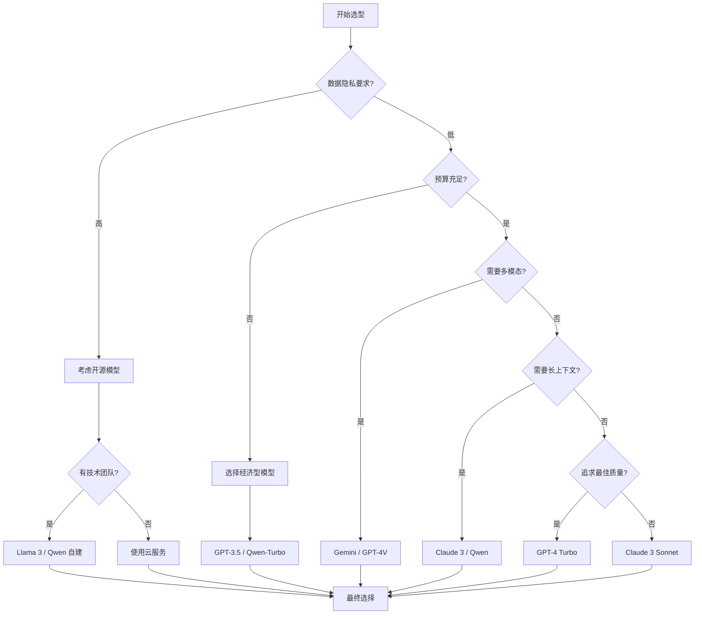
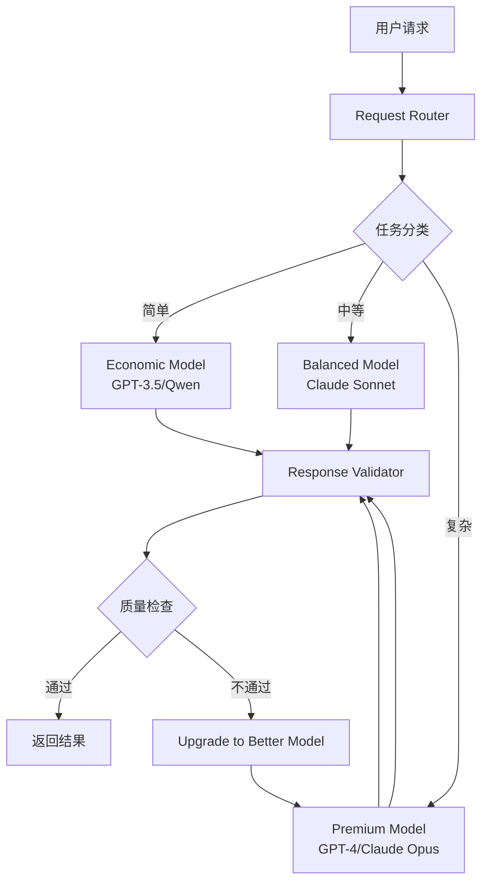

# 主流大模型对比与选型指南

> 从功能、性能、成本多维度对比，帮你选择最适合的 LLM


## 📚 目录

- [为什么需要对比选型](#为什么需要对比选型)
- [主要玩家全景图](#主要玩家全景图)
- [详细模型对比](#详细模型对比)
- [性能基准测试](#性能基准测试)
- [成本分析](#成本分析)
- [选型决策框架](#选型决策框架)
- [实际应用场景推荐](#实际应用场景推荐)
- [混合使用策略](#混合使用策略)
- [未来趋势展望](#未来趋势展望)

---

## 为什么需要对比选型

### 现实问题

当你开始构建 AI 应用时，会面临这些选择：

🤔 **"应该用 GPT-4 还是 Claude 3？"**

🤔 **"开源模型真的能替代商业 API 吗？"**

🤔 **"如何在性能和成本之间找到平衡？"**

🤔 **"不同模型的优势和劣势是什么？"**

### 选型的重要性

**错误的选择可能导致：**

❌ **成本超支**
- 选择了过强的模型处理简单任务
- 没有利用缓存和优化策略

❌ **性能不佳**
- 模型能力不足以支撑业务需求
- 响应延迟影响用户体验

❌ **维护困难**
- 依赖单一供应商
- 无法应对 API 变化或涨价

❌ **功能受限**
- 缺少必要的多模态能力
- 上下文窗口不够用

**正确的选型可以：**

✅ **优化成本效益**
- 根据任务复杂度选择合适的模型
- 实现成本可控的规模化

✅ **提升用户体验**
- 更快的响应速度
- 更准确的回答质量

✅ **降低风险**
- 多供应商策略
- 灵活切换和降级方案

---

## 主要玩家全景图

### 商业闭源模型

| 提供商 | 主要模型 | 特点 | 市场定位 |
|--------|---------|------|---------|
| OpenAI | GPT-5, GPT-4o | 生态最完善，推理能力最强 | 通用领导者 |
| Anthropic | Claude 4, Claude 3.5 Sonnet | 长文本、代码能力强、Computer Use | 企业级应用 |
| Google | Gemini 2.0/1.5 Pro | 超长上下文（2M tokens），多模态 | 搜索+AI 整合 |
| Microsoft | Copilot (基于 GPT) | Office 集成 | 生产力工具 |
| Amazon | Bedrock (多模型) | AWS 生态整合 | 云服务 |

### 开源模型

| 提供商 | 主要模型 | 参数量 | 特点 |
|--------|---------|--------|------|
| Meta | Llama 4 | 8B, 70B, 405B | 最强开源，支持多模态 |
| Alibaba | Qwen 3 | 0.5B-72B | 中文能力最强，推理能力优秀 |
| Mistral AI | Mistral Large 3 | 123B | 高效轻量，多语言支持 |
| DeepSeek | DeepSeek V3 | 671B | MoE架构，性价比高 |
| 01.AI | Yi-Lightning | 6B, 34B | 中英双语 |

### 国内可用模型

| 模型 | 提供商 | API 可用性 | 特色 |
|------|--------|-----------|------|
| 通义千问 (Qwen) | 阿里云 | ✅ | 中文最强 |
| 文心一言 | 百度 | ✅ | 知识图谱 |
| 讯飞星火 | 科大讯飞 | ✅ | 语音优势 |
| Kimi | 月之暗面 | ✅ | 超长上下文 |
| GLM | 智谱 AI | ✅ | 学术研究 |

---

## 详细模型对比

### 1. OpenAI GPT 系列

#### GPT-5 / GPT-4o / GPT-4o-mini

**基本信息：**
- **发布时间**: 2025 年（GPT-5），2024 年 5 月（GPT-4o），2024 年 7 月（GPT-4o-mini）
- **参数量**: 未公开
- **上下文窗口**: 256K tokens（GPT-5），128K tokens（GPT-4o）
- **多模态**: 原生支持文本、图像、音频、视频输入输出

**优势：**

✅ **综合能力最强**
- GPT-5 推理能力大幅提升，接近专家水平
- 逻辑推理、代码生成、创意写作都达到新高度
- 支持实时语音对话和多模态交互

✅ **生态系统最完善**
- LangChain、LlamaIndex 等优先支持
- 丰富的第三方工具和集成
- 详细的文档和社区资源

✅ **Function Calling 成熟**
- 稳定的工具调用机制
- 支持并行函数调用
- 支持 Structured Outputs（确保输出符合 JSON Schema）
- 完善的错误处理

✅ **性价比大幅提升**
- GPT-5 提供最强能力，适合复杂任务
- GPT-4o 性价比高，适合大多数场景
- GPT-4o-mini 替代 GPT-3.5-turbo，性能更好价格更低

**劣势：**

❌ **闭源**
- 无法本地部署
- 数据隐私顾虑
- 依赖 OpenAI 服务稳定性

❌ **中文能力一般**
- 虽然能用，但不如专门优化的模型
- 文化理解可能有偏差

**适用场景：**
- 🎯 生产环境的核心功能
- 🎯 需要稳定可靠的商业应用
- 🎯 快速原型开发
- 🎯 复杂的多步骤任务和推理
- 🎯 多模态应用（图像、语音、视频）

**定价（2026）：**
```
GPT-5:
- Input:  $5.00 / 1K tokens
- Output: $15.00 / 1K tokens

GPT-4o:
- Input:  $2.50 / 1K tokens
- Output: $10.00 / 1K tokens

GPT-4o-mini:
- Input:  $0.15 / 1K tokens
- Output: $0.60 / 1K tokens
```

**代码示例：**
```typescript
import OpenAI from 'openai';

const openai = new OpenAI({
    apiKey: process.env.OPENAI_API_KEY
});

async function chatWithGPT5(message: string) {
    const response = await openai.chat.completions.create({
        model: "gpt-5",
        messages: [
            { role: "system", content: "You are a helpful assistant." },
            { role: "user", content: message }
        ],
        temperature: 0.7,
        max_tokens: 1000
    });
    
    return response.choices[0].message.content;
}
```

#### GPT-4o-mini

**定位：** 性价比之选，替代 GPT-3.5-turbo

**优势：**
- 💰 价格便宜（GPT-4o 的 1/17）
- ⚡ 响应速度快
- 🎯 性能优于 GPT-3.5-turbo
- 📊 支持 Structured Outputs

**劣势：**
- 📊 推理能力弱于 GPT-4o
- 🐛 复杂任务可能出错

**适用场景：**
- 简单的问答和分类
- 大量低成本的处理任务
- 对准确性要求不高的场景

---

### 2. Anthropic Claude 系列

#### Claude 4 / Claude 3.5 Sonnet

**基本信息：**
- **发布时间**: 2025 年（Claude 4），2024 年 6 月（Claude 3.5 Sonnet）
- **版本**:
  - Claude 4: 最新旗舰，推理能力最强
  - Claude 3.5 Sonnet: 性价比高，代码能力强
  - Claude 3 Haiku: 最快，适合简单任务
- **上下文窗口**: 256K tokens（Claude 4），200K tokens（Claude 3.5 Sonnet）

**优势：**

✅ **超长上下文**
- 256K tokens ≈ 600 页文档
- 可以一次性处理整本书
- 保持长期一致性

✅ **优秀的代码能力**
- Claude 代码生成能力非常强
- 支持 Computer Use，可以操作计算机
- 代码审查和调试能力优秀

✅ **强大的推理能力**
- Claude 4 推理能力大幅提升
- 复杂问题解决能力强
- 支持长时间思考（Extended Thinking）

✅ **内置安全性**
- Constitutional AI 设计
- 减少有害输出
- 更适合企业应用

**劣势：**

❌ **可用地区有限**
- 某些国家/地区无法访问
- 需要特殊网络配置

❌ **生态系统较小**
- 第三方工具支持不如 OpenAI
- 社区资源相对较少

**定价（2026）：**
```
Claude 4:
- Input:  $5.00 / 1K tokens
- Output: $25.00 / 1K tokens

Claude 3.5 Sonnet:
- Input:  $3.00 / 1K tokens
- Output: $15.00 / 1K tokens

Claude 3 Haiku:
- Input:  $0.25 / 1K tokens
- Output: $1.25 / 1K tokens
```

**适用场景：**
- 📄 长文档分析和总结
- 🔒 对安全性要求高的应用
- 💬 客服和对话系统
- 📊 数据提取和分析

**代码示例：**
```typescript
import { Anthropic } from '@anthropic-ai/sdk';

const anthropic = new Anthropic({
    apiKey: process.env.ANTHROPIC_API_KEY
});

async function analyzeDocument(documentContent: string) {
    const response = await anthropic.messages.create({
        model: "claude-4-20250514",
        max_tokens: 4096,
        system: "你是一个专业的文档分析助手。",
        messages: [
            {
                role: "user",
                content: `请分析以下文档并提取关键信息：\n\n${documentContent}`
            }
        ]
    });
    
    return response.content[0].text;
}
```

---

### 3. Google Gemini 系列

#### Gemini 2.0 / 1.5 Pro

**基本信息：**
- **发布时间**: 2025 年（Gemini 2.0），2024 年 2 月（Gemini 1.5 Pro）
- **提供商**: Google DeepMind
- **上下文窗口**: 2M tokens（Gemini 2.0），1M tokens（1.5 Pro）
- **多模态**: 原生支持文本、图像、音频、视频

**优势：**

✅ **超长上下文窗口**
- 2M tokens ≈ 1400 页文档
- 可以处理超长视频和音频
- 业界最长的上下文窗口

✅ **强大的多模态能力**
- 原生理解多种媒体类型
- 视频理解和时序分析
- 图像识别准确率高

✅ **Google 生态整合**
- 与 Google Workspace 深度集成
- 可以利用 Google 搜索增强
- Gemini 用户基础大

✅ **合理的定价**
- Flash 版本非常便宜
- API 价格有竞争力

**劣势：**

❌ **API 稳定性**
- 早期版本有一些波动
- 速率限制较严格

❌ **生态系统发展中**
- 第三方支持还在增长
- 文档和教程相对较少

**定价（2026）：**
```
Gemini 2.0 Pro:
- Input:  $5.00 / 1M tokens
- Output: $15.00 / 1M tokens

Gemini 1.5 Pro:
- Input:  $3.50 / 1M tokens
- Output: $10.50 / 1M tokens

Gemini 1.5 Flash:
- Input:  $0.075 / 1M tokens
- Output: $0.30 / 1M tokens
```

**适用场景：**
- 🎥 视频内容分析
- 🖼️ 图像处理和理解
- 🔍 搜索增强的应用
- 📧 Google Workspace 集成

**代码示例：**
```typescript
import { GoogleGenerativeAI } from "@google/generative-ai";

const genAI = new GoogleGenerativeAI(process.env.GOOGLE_API_KEY);

async function analyzeImage(imageBase64: string, question: string) {
    const model = genAI.getGenerativeModel({ model: "gemini-pro-vision" });
    
    const result = await model.generateContent([
        question,
        {
            inlineData: {
                data: imageBase64,
                mimeType: "image/jpeg"
            }
        }
    ]);
    
    return result.response.text();
}
```

---

### 4. Meta Llama 系列

#### Llama 4 (8B / 70B / 405B)

**基本信息：**
- **发布时间**: 2025 年
- **开源许可**: Llama 4 Community License
- **三种尺寸**: 8B（轻量）、70B（强大）、405B（最强开源）
- **多模态**: 支持文本和图像输入

**优势：**

✅ **完全开源**
- 可以自由修改和分发
- 可本地部署，数据隐私有保障
- 无 API 调用成本

✅ **活跃的社区**
- 大量的微调和优化版本
- 丰富的工具和框架支持
- 持续的创新和改进

✅ **强大的性能**
- Llama 4 405B 接近 GPT-4o 水平
- 70B 版本性价比很高
- 8B 版本适合边缘部署

✅ **多模态支持**
- 支持图像输入
- 图像理解和描述
- 视觉问答

**劣势：**

❌ **需要技术基础设施**
- 需要 GPU 服务器
- 需要 MLOps 专业知识
- 维护和监控成本

❌ **初始设置复杂**
- 模型下载和管理
- 推理引擎配置
- 性能优化

**资源需求：**
```
Llama 4 8B:
- FP16: ~16GB GPU 内存
- INT4: ~6GB GPU 内存

Llama 4 70B:
- FP16: ~140GB GPU 内存
- INT4: ~40GB GPU 内存

Llama 4 405B:
- FP16: ~810GB GPU 内存
- INT4: ~200GB GPU 内存
```

**适用场景：**
- 🔒 数据隐私敏感的应用
- 🏢 企业内部部署
- 🔧 需要高度定制的场景
- 💰 长期大规模使用（摊薄成本）

**本地部署示例：**
```python
# 使用 Ollama（最简单的部署方式）
# 安装: https://ollama.ai

from langchain_community.llms import Ollama

llm = Ollama(model="llama3")

response = llm.invoke("解释量子计算的基本原理")
print(response)
```

**使用 Hugging Face：**
```python
from transformers import AutoTokenizer, AutoModelForCausalLM
import torch

model_name = "meta-llama/Meta-Llama-3-8B"

tokenizer = AutoTokenizer.from_pretrained(model_name)
model = AutoModelForCausalLM.from_pretrained(
    model_name,
    torch_dtype=torch.float16,
    device_map="auto"
)

prompt = "前端开发最重要的技能是"
inputs = tokenizer(prompt, return_tensors="pt").to("cuda")

outputs = model.generate(**inputs, max_new_tokens=50)
print(tokenizer.decode(outputs[0], skip_special_tokens=True))
```

---

### 5. 阿里云通义千问 (Qwen)

#### Qwen 3 系列

**基本信息：**
- **最新版本**: Qwen 3（2025 年）
- **多种尺寸**: 0.5B, 1.5B, 3B, 7B, 14B, 32B, 72B
- **开源**: 大部分模型开源
- **多模态**: 支持文本、图像、音频

**优势：**

✅ **中文能力最强**
- 专门针对中文优化
- 理解中国文化语境
- 成语、诗词表现出色

✅ **推理能力大幅提升**
- Qwen 3 推理能力接近 GPT-4 水平
- 支持长时间思考（类似 o1）
- 数学和代码能力优秀

✅ **高性价比**
- API 价格合理
- 开源版本可免费使用
- 阿里云生态整合

✅ **超长上下文支持**
- 最高支持 256K tokens
- 长文档处理能力好

**劣势：**

❌ **国际生态较小**
- 英文社区资源相对少
- 第三方工具支持有限

❌ **品牌认知度**
- 国际市场知名度不如 OpenAI
- 部分用户对国内厂商有顾虑

**定价（阿里云）：**
```
Qwen-Max:
- Input:  ¥0.02 / 1K tokens
- Output: ¥0.06 / 1K tokens

Qwen-Plus:
- Input:  ¥0.004 / 1K tokens
- Output: ¥0.012 / 1K tokens

Qwen-Turbo:
- Input:  ¥0.002 / 1K tokens
- Output: ¥0.006 / 1K tokens

Qwen-Long (长上下文):
- Input:  ¥0.0005 / 1K tokens
- Output: ¥0.002 / 1K tokens
```

**适用场景：**
- 🇨🇳 面向中文用户的应用
- 💻 代码助手和开发工具
- 📚 中文内容生成和处理
- 🏢 国内企业级应用

**代码示例：**
```typescript
import OpenAI from 'openai';

// Qwen 兼容 OpenAI API 格式
const qwen = new OpenAI({
    baseURL: "https://dashscope.aliyuncs.com/compatible-mode/v1",
    apiKey: process.env.DASHSCOPE_API_KEY
});

async function chatWithQwen(message: string) {
    const response = await qwen.chat.completions.create({
        model: "qwen-plus",
        messages: [
            { role: "system", content: "你是一个有用的助手。" },
            { role: "user", content: message }
        ]
    });
    
    return response.choices[0].message.content;
}
```

---

## 性能基准测试

### 主要 Benchmark 说明

| Benchmark | 测试内容 | 重要性 |
|-----------|---------|--------|
| MMLU | 多学科知识（57 个领域） | ⭐⭐⭐⭐⭐ |
| GSM8K | 数学推理 | ⭐⭐⭐⭐ |
| HumanEval | 代码生成 | ⭐⭐⭐⭐⭐ |
| HellaSwag | 常识推理 | ⭐⭐⭐ |
| TruthfulQA | 事实准确性 | ⭐⭐⭐⭐ |

### 性能对比表（2026 年数据）

| 模型 | MMLU | GSM8K | HumanEval | 上下文窗口 |
|------|------|-------|-----------|-----------|
| GPT-5 | 92.3% | 97.5% | 93.5% | 256K |
| Claude 4 | 91.8% | 97.0% | 93.0% | 256K |
| Gemini 2.0 Pro | 90.5% | 95.2% | 90.8% | 2M |
| Llama 4 405B | 89.2% | 94.5% | 90.0% | 256K |
| Qwen 3 72B | 88.5% | 93.8% | 89.2% | 256K |
| GPT-4o | 88.7% | 95.8% | 90.2% | 128K |
| Claude 3.5 Sonnet | 88.7% | 96.4% | 92.0% | 200K |
| Gemini 1.5 Pro | 85.9% | 91.7% | 84.1% | 1M |
| GPT-4o-mini | 82.0% | 87.5% | 87.2% | 128K |

**解读：**
- MMLU > 80%: 专家级水平
- MMLU 70-80%: 优秀水平
- MMLU < 70%: 良好水平

### 实际性能差异

**重要提示：** Benchmark 分数≠实际体验

**影响因素：**
1. **Prompt 质量**: 好的 prompt 可以提升 20-30% 的效果
2. **任务类型**: 不同模型在不同任务上表现各异
3. **温度设置**: 影响输出的创造性和准确性
4. **后处理**: 输出解析和验证也很重要

---

## 成本分析

### API 成本对比

**假设场景：** 每天处理 1000 次请求
- 平均输入：500 tokens
- 平均输出：300 tokens
- 每月 30 天

**月度成本计算：**

| 模型 | Input Cost | Output Cost | 总成本/月 |
|------|-----------|-------------|----------|
| GPT-4o | $375 | $900 | $1,275 |
| Claude 3.5 Sonnet | $450 | $1,350 | $1,800 |
| Claude 3 Haiku | $37.5 | $112.5 | $150 |
| GPT-4o-mini | $22.5 | $54 | $76.5 |
| Gemini 1.5 Flash | $11.25 | $27 | $38.25 |
| Qwen-Plus | $8 | $24 | $32 |

**结论：**
- GPT-3.5 / Qwen-Turbo: 最经济
- Claude 3 Sonnet: 性价比平衡
- GPT-4 / Claude Opus: 高质量但昂贵

### 自建模型成本

**Llama 3 70B 部署成本估算：**

**硬件需求：**
- GPU: 8x A100 80GB 或 4x H100
- CPU: 64+ cores
- RAM: 512GB+
- Storage: 2TB NVMe SSD

**云服务商价格（按月）：**
```
AWS p4d.24xlarge (8x A100): ~$30,000/月
Azure ND96amsr_A100 v4: ~$28,000/月
Lambda Labs: ~$12,000/月（更便宜）
```

**电力和维护：**
- 电力：~$2,000/月
- 运维人力：~$5,000/月
- 总计：~$45,000/月

**盈亏平衡点：**
```
如果使用 GPT-4 ($0.04/请求):
盈亏平衡 = $45,000 / $0.04 = 1,125,000 请求/月

如果每天请求量 > 37,500 次，自建更划算
```

### 成本优化策略

**1. 模型路由（Model Routing）**

```typescript
class ModelRouter {
    async routeRequest(task: Task): Promise<string> {
        // 简单任务 → 便宜模型
        if (task.complexity === 'simple') {
            return 'gpt-3.5-turbo';
        }
        
        // 中等任务 → 平衡模型
        if (task.complexity === 'medium') {
            return 'claude-3-sonnet';
        }
        
        // 复杂任务 → 强大模型
        return 'gpt-4-turbo';
    }
}
```

**效果：** 可以节省 40-60% 的成本

**2. 缓存策略**

```typescript
class ResponseCache {
    private cache = new Map<string, string>();
    
    async getOrGenerate(prompt: string): Promise<string> {
        const cacheKey = this.hash(prompt);
        
        // 检查缓存
        if (this.cache.has(cacheKey)) {
            return this.cache.get(cacheKey)!;
        }
        
        // 生成响应
        const response = await generateWithLLM(prompt);
        
        // 存入缓存
        this.cache.set(cacheKey, response);
        
        return response;
    }
}
```

**效果：** 对于重复查询，可以节省 100% 成本

**3. 批量处理**

```typescript
// 批量 API 调用通常有折扣
const batch = prompts.map(p => ({
    model: "gpt-3.5-turbo",
    messages: [{ role: "user", content: p }]
}));

const responses = await openai.batch.create(batch);
```

**4. 输出长度控制**

```typescript
// 限制最大 token 数
const response = await openai.chat.completions.create({
    model: "gpt-4",
    max_tokens: 500, // 避免过长输出
    // ...
});
```

---

## 选型决策框架

### 决策流程图



### 快速决策表

| 场景 | 首选 | 备选 | 理由 |
|------|------|------|------|
| 快速原型 | GPT-4o-mini | Qwen-Turbo | 便宜、快速、易用 |
| 生产环境 | GPT-4o | Claude 3.5 Sonnet | 稳定、质量好 |
| 复杂推理 | GPT-5 / Claude 4 | Qwen 3 | 推理能力最强 |
| 长文档处理 | Gemini 2.0 | Claude 4 | 2M/256K 上下文 |
| 中文应用 | Qwen 3 | GPT-4o | 中文优化 |
| 成本敏感 | GPT-4o-mini | Qwen-Turbo | 性价比高 |
| 数据隐私 | Llama 4 | Qwen 自建 | 可本地部署 |
| 多模态 | GPT-5 / Gemini 2.0 | Claude 4 | 原生支持 |
| 代码生成 | Claude 4 / Claude 3.5 Sonnet | GPT-4o | 代码能力强 |
| 企业应用 | Claude 4 | GPT-5 | 安全性好 |
| 超高并发 | 自建 Llama | 多 API 负载均衡 | 可控成本 |

### 评估 checklist

在选择模型前，回答这些问题：

**业务需求：**
- [ ] 预期的日均请求量是多少？
- [ ] 可接受的响应延迟是多少？
- [ ] 需要的准确率水平？
- [ ] 是否需要多语言支持？
- [ ] 是否需要多模态能力？

**技术要求：**
- [ ] 最大上下文长度需求？
- [ ] 是否需要流式输出？
- [ ] 是否需要 Function Calling？
- [ ] 对稳定性的要求（SLA）？

**成本约束：**
- [ ] 月度预算上限？
- [ ] 是否可以接受按量付费？
- [ ] 是否有长期承诺的优惠？

**合规和安全：**
- [ ] 数据是否可以发送到第三方？
- [ ] 是否需要数据驻留（特定地区）？
- [ ] 是否符合行业法规（GDPR、HIPAA 等）？

**团队能力：**
- [ ] 是否有 MLOps 经验？
- [ ] 能否维护自部署模型？
- [ ] 是否需要厂商技术支持？

---

## 实际应用场景推荐

### 场景 1: 智能客服系统

**需求：**
- 高并发（10K+ 请求/天）
- 快速响应（< 2 秒）
- 成本可控
- 准确性和安全性

**推荐方案：**

```typescript
class CustomerServiceAI {
    private primaryModel = 'claude-3-5-haiku';  // 快速、便宜
    private fallbackModel = 'gpt-4o-mini';  // 备用
    
    async handleQuery(query: string): Promise<string> {
        try {
            // 首先尝试快速模型
            const response = await this.callModel(this.primaryModel, query);
            
            // 如果置信度低，升级到更强模型
            if (this.confidenceScore(response) < 0.8) {
                return await this.callModel('claude-4', query);
            }
            
            return response;
        } catch (error) {
            // 降级到备用模型
            return await this.callModel(this.fallbackModel, query);
        }
    }
}
```

**成本估算：**
- Haiku: $0.00025/1K input → 约 $50/月
- 升级率 20%: +$100/月
- 总计: ~$150/月

---

### 场景 2: 代码助手

**需求：**
- 高质量的代码生成
- 理解复杂上下文
- 支持多种语言
- 低延迟

**推荐方案：**

**主选：Claude 4**
- 最强的代码生成能力
- HumanEval 分数最高
- 支持 Computer Use

**备选：GPT-5**
- 综合能力强
- 生态完善

**实现：**
```typescript
class CodeAssistant {
    async generateCode(prompt: string, language: string) {
        const systemPrompt = `You are an expert ${language} developer.
        Generate clean, efficient, and well-documented code.`;
        
        const response = await openai.chat.completions.create({
            model: "gpt-5",
            messages: [
                { role: "system", content: systemPrompt },
                { role: "user", content: prompt }
            ],
            temperature: 0.3,
        });
        
        return this.extractCode(response.choices[0].message.content);
    }
    
    async reviewCode(code: string): Promise<ReviewResult> {
        // 使用 Claude 进行代码审查
        const response = await anthropic.messages.create({
            model: "claude-4-20250514",
            messages: [{
                role: "user",
                content: `Review this code for bugs and improvements:\n\n${code}`
            }]
        });
        
        return this.parseReview(response.content[0].text);
    }
}
```

---

### 场景 3: 文档分析平台

**需求：**
- 处理长文档（100+ 页）
- 提取结构化信息
- 生成摘要
- 支持多种格式

**推荐方案：Claude 4 / Gemini 2.0 Pro**

**理由：**
- Claude: 256K 上下文窗口，优秀的文档理解能力
- Gemini: 2M 上下文窗口，适合超长文档

**实现：**
```typescript
class DocumentAnalyzer {
    async analyzePDF(pdfContent: string): Promise<DocumentAnalysis> {
        // Claude 可以直接处理长文档
        const response = await anthropic.messages.create({
            model: "claude-4-20250514",
            max_tokens: 4096,
            messages: [{
                role: "user",
                content: `
                    Analyze this document and extract:
                    1. Key points
                    2. Main arguments
                    3. Conclusions
                    4. Action items
                    
                    Document:
                    ${pdfContent}
                    
                    Return as JSON.
                `
            }]
        });
        
        return JSON.parse(response.content[0].text);
    }
    
    async summarizeDocument(doc: string): Promise<string> {
        // 分段处理超长文档
        const chunks = this.splitIntoChunks(doc, 100000);
        const summaries = await Promise.all(
            chunks.map(chunk => this.summarizeChunk(chunk))
        );
        
        // 合并摘要
        return await this.mergeSummaries(summaries);
    }
}
```

---

### 场景 4: 多语言内容生成

**需求：**
- 支持中英文
- 文化适应性
- SEO 优化
- 批量生成

**推荐方案：Qwen 2 + GPT-4 混合**

**策略：**
- 中文内容：Qwen 2（更地道）
- 英文内容：GPT-4（更自然）
- 翻译任务：Qwen 2（中英互译强）

**实现：**
```typescript
class ContentGenerator {
    async generateArticle(topic: string, language: 'zh' | 'en') {
        const model = language === 'zh' ? 'qwen-plus' : 'gpt-4-turbo';
        const client = language === 'zh' ? qwenClient : openai;
        
        const response = await client.chat.completions.create({
            model,
            messages: [{
                role: "user",
                content: `Write a SEO-optimized article about: ${topic}`
            }]
        });
        
        return response.choices[0].message.content;
    }
    
    async translate(text: string, from: string, to: string) {
        // Qwen 在中英互译上表现优秀
        const response = await qwenClient.chat.completions.create({
            model: "qwen-plus",
            messages: [{
                role: "user",
                content: `Translate from ${from} to ${to}:\n\n${text}`
            }]
        });
        
        return response.choices[0].message.content;
    }
}
```

---

## 混合使用策略

### 为什么要混合使用？

**单一模型的局限：**
- ❌ 成本高
- ❌ 单点故障风险
- ❌ 无法充分利用各模型优势

**混合使用的优势：**
- ✅ 成本优化（简单任务用便宜模型）
- ✅ 提高可靠性（多供应商冗余）
- ✅ 最佳性能（每个任务用最合适的模型）
- ✅ 灵活性（可以根据需求调整）

### 架构设计



### 实现示例

```typescript
class HybridLLMSystem {
    private models = {
        economic: new OpenAI({ model: "gpt-4o-mini" }),
        balanced: new Anthropic({ model: "claude-3-5-sonnet" }),
        premium: new OpenAI({ model: "gpt-5" })
    };
    
    private cache = new ResponseCache();
    
    async processRequest(request: AIRequest): Promise<AIResponse> {
        // 1. 检查缓存
        const cached = await this.cache.get(request);
        if (cached) return cached;
        
        // 2. 分类任务复杂度
        const complexity = await this.assessComplexity(request);
        
        // 3. 选择合适的模型
        const model = this.selectModel(complexity);
        
        // 4. 执行请求
        let response = await this.callModel(model, request);
        
        // 5. 验证质量
        const quality = await this.assessQuality(response);
        
        // 6. 如果质量不足，升级模型
        if (quality < request.minQuality && model !== 'premium') {
            response = await this.callModel('premium', request);
        }
        
        // 7. 缓存结果
        await this.cache.set(request, response);
        
        return response;
    }
    
    private selectModel(complexity: Complexity): ModelType {
        switch (complexity) {
            case 'simple':
                return 'economic';
            case 'medium':
                return 'balanced';
            case 'complex':
                return 'premium';
            default:
                return 'balanced';
        }
    }
    
    private async assessQuality(response: string): number {
        // 使用启发式方法或另一个模型评估
        // 例如：长度、连贯性、相关性等
        return calculateQualityScore(response);
    }
}
```

### 成本效益分析

**场景：** 电商客服系统，日均 5000 请求

**单一模型方案（GPT-5）：**
- 成本：5000 × 30 × $0.015 = $2,250/月

**混合模型方案：**
- 60% 简单问题 → GPT-4o-mini: 3000 × 30 × $0.0007 = $63
- 30% 中等问题 → Claude 3.5 Sonnet: 1500 × 30 × $0.018 = $810
- 10% 复杂问题 → GPT-5: 500 × 30 × $0.015 = $225
- 总计：$1,098/月

**节省：73%** 💰

---

## 未来趋势展望

### 短期趋势（2025-2026）

**1. 模型能力持续提升**
- GPT-5 已发布，推理能力大幅提升
- Claude 4 已发布，接近 GPT-5 水平
- Gemini 2.0 已发布，支持 2M 上下文
- Llama 4 已发布，支持多模态
- 推理模型（如 o1）成为新方向

**2. 成本持续下降**
- 硬件效率提升
- 模型优化技术进步
- 竞争加剧导致降价

**3. 专业化模型兴起**
- 医疗专用模型
- 法律专用模型
- 金融专用模型
- 代码专用模型（已经有很多）

**4. 多模态成为标配**
- 文本 + 图像 + 音频 + 视频
- 更自然的交互方式
- 新的应用场景涌现

**5. Agent 和工具使用成熟**
- Function Calling 成为基础能力
- Computer Use 让 AI 能操作计算机
- 多 Agent 协作系统普及

### 中期趋势（2026-2028）

**1. 开源模型迎头赶上**
- Llama 等开源模型接近闭源性能
- 社区驱动的创新加速
- 自部署成为主流选择之一

**2. 边缘 AI 发展**
- 手机、笔记本本地运行 LLM
- 隐私保护更好
- 离线可用

**3. Agent 生态成熟**
- 自主 AI Agent 广泛应用
- 多 Agent 协作系统
- 新的编程范式出现

**4. 监管和标准化**
- AI 法规完善
- 行业标准建立
- 安全和伦理考量更重要

### 长期趋势（2028+）

**1. AGI 探索**
- 向通用人工智能迈进
- 更强的推理和规划能力
- 更广泛的应用场景

**2. 人机协作新模式**
- AI 作为思考伙伴
- 增强人类智能
- 新的工作方式

**3. 技术民主化**
- AI 能力普及化
- 每个人都能使用高级 AI
- 数字鸿沟缩小

### 对开发者的建议

**保持学习的态度：**
- 📚 持续关注最新进展
- 🧪 积极尝试新技术
- 🤝 参与社区交流

**建立灵活的技术栈：**
- 不要过度依赖单一供应商
- 保持架构的可替换性
- 关注抽象层设计

**重视基础和原理：**
- 理解核心概念而非死记 API
- 培养判断力和洞察力
- 能够评估新技术的价值

---

## 总结与行动建议

### 核心要点回顾

✅ **没有最好的模型，只有最合适的模型**
- 根据具体需求选择
- 考虑成本、性能、功能的平衡

✅ **混合使用是最佳实践**
- 不同模型各司其职
- 可以显著降低成本
- 提高系统可靠性

✅ **持续评估和调整**
- 模型能力和价格在变化
- 定期重新评估选型
- 保持灵活性

✅ **关注开源选项**
- Llama 等开源模型越来越强
- 长期来看可能更经济
- 提供更好的控制权

### 立即行动清单

**本周：**
- [ ] 注册主要平台的账号（OpenAI、Anthropic、Google）
- [ ] 获取 API keys
- [ ] 在 Playground 中测试不同模型

**本月：**
- [ ] 为当前项目评估模型选型
- [ ] 实现基础的模型路由
- [ ] 建立成本监控机制

**本季度：**
- [ ] 构建混合模型架构
- [ ] 实施缓存和优化策略
- [ ] 评估自建模型的可行性

### 推荐学习路径

**初学者：**
1. 从 GPT-3.5 开始（便宜、易用）
2. 学习 Prompt Engineering
3. 构建简单应用

**进阶：**
1. 尝试 GPT-4 和 Claude 3
2. 实现模型路由
3. 优化成本和性能

**高级：**
1. 探索开源模型部署
2. 微调专用模型
3. 构建复杂的 Agent 系统

### 资源汇总

**官方文档：**
- [OpenAI API Docs](https://platform.openai.com/docs)
- [Anthropic Docs](https://docs.anthropic.com)
- [Google AI Docs](https://ai.google.dev/docs)
- [Meta Llama](https://llama.meta.com)
- [阿里云通义千问](https://help.aliyun.com/product/334400.html)

**比较工具：**
- [LMSYS Chatbot Arena](https://chat.lmsys.org/) - 真实用户投票排名
- [Hugging Face Open LLM Leaderboard](https://huggingface.co/spaces/HuggingFaceH4/open_llm_leaderboard)
- [Artificial Analysis](https://artificialanalysis.ai/) - 性能和价格对比

**社区和资源：**
- [r/LocalLLaMA](https://www.reddit.com/r/LocalLLaMA/) - 开源模型社区
- [Hugging Face Discord](https://discord.gg/huggingface)
- [LangChain Discord](https://discord.gg/langchain)

---

## 结语

选择合适的 LLM 是一个需要综合考虑的决策。记住：

🎯 **明确你的需求** - 不要盲目追求最强模型

💰 **关注总体成本** - 包括 API 费用、开发时间、维护成本

🔄 **保持灵活性** - 技术和市场都在快速变化

🧪 **持续实验** - 实际测试比理论分析更有价值

🤝 **利用社区** - 学习他人的经验和最佳实践

希望这份指南能帮助你做出明智的选择！如果在具体场景中需要更详细的建议，欢迎继续交流。

**下一篇预告：** 《Prompt Engineering 完全指南》

我们将深入探讨如何编写高效的 prompt，让 LLM 发挥最大潜力。敬请期待！
