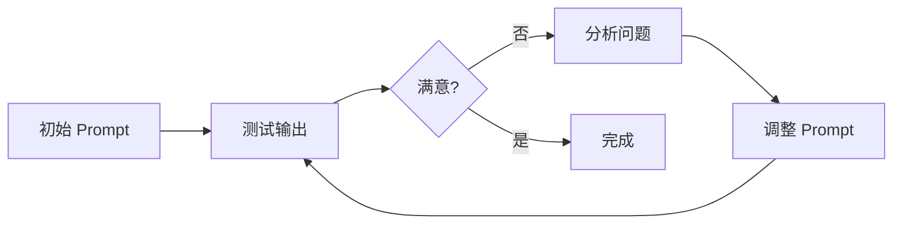

# Prompt Engineering 完全指南：让 AI 听懂你的话

> 掌握与 LLM 高效沟通的艺术，从入门到精通


## 📚 目录

- [什么是 Prompt Engineering](#什么是-prompt-engineering)
- [为什么需要学习 Prompt Engineering](#为什么需要学习-prompt-engineering)
- [基础原则和技巧](#基础原则和技巧)
- [高级 Prompt 模式](#高级-prompt-模式)
- [实战案例详解](#实战案例详解)
- [调试和优化技巧](#调试和优化技巧)
- [常见错误和避免方法](#常见错误和避免方法)
- [工具和资源](#工具和资源)
- [练习和挑战](#练习和挑战)

---

## 什么是 Prompt Engineering

### 定义

**Prompt Engineering（提示工程）** 是设计和优化输入文本（prompt）的艺术和科学，目的是引导 LLM 生成高质量、准确、相关的输出。

**简单类比：**

```
传统编程：你编写代码告诉计算机怎么做
Prompt Engineering：你用自然语言告诉 AI 做什么
```

### 核心思想

LLM 就像一个超级聪明但需要明确指导的助手：

- ✅ 你说得越清楚，它做得越好
- ✅ 提供上下文和示例，它能更好地理解
- ✅ 指定格式和要求，输出更符合预期

### Prompt 的组成要素

一个完整的 prompt 通常包含：

```
1. 角色设定 (Role)     - "你是一个资深前端工程师"
2. 任务描述 (Task)     - "请审查以下代码"
3. 上下文 (Context)    - "这是一个电商网站的购物车功能"
4. 约束条件 (Constraints) - "关注性能和安全性"
5. 输出格式 (Format)   - "以 JSON 格式返回结果"
6. 示例 (Examples)     - "例如：..."
```

---

## 为什么需要学习 Prompt Engineering

### 实际影响

**好的 prompt vs 差的 prompt：**

❌ **差的 Prompt：**
```
写点关于 React 的东西
```

**可能的输出：** 泛泛而谈，缺乏重点，可能不是你想要的

✅ **好的 Prompt：**
```
你是一个资深前端技术作家。请用 300 字向初学者介绍 React Hooks 的核心概念，
重点说明 useState 和 useEffect 的使用场景。使用通俗易懂的语言，
并提供一个简单的代码示例。
```

**输出质量：** 结构化、针对性强、实用价值高

### 数据说话

根据研究和实践经验：

📊 **Prompt 质量可以提升 50-200% 的输出质量**

📊 **良好的 prompt 可以减少 70% 的迭代次数**

📊 **专业的 prompt engineering 可以节省 40-60% 的 token 成本**

### 对前端开发者的价值

✅ **提高开发效率**
- 快速生成代码片段
- 自动完成重复性任务
- 加速原型开发

✅ **改善代码质量**
- 获得更好的代码审查建议
- 发现潜在的 bug 和优化点
- 学习最佳实践

✅ **增强产品能力**
- 构建更智能的用户界面
- 提供更个性化的体验
- 实现自然语言交互

---

## 基础原则和技巧

### 原则 1：清晰明确（Be Clear and Specific）

**核心理念：** LLM 无法读心，必须明确表达你的需求。

**对比示例：**

❌ **模糊：**
```
帮我写个函数
```

✅ **明确：**
```
用 TypeScript 编写一个函数，实现以下功能：
- 接收一个字符串数组
- 过滤出长度大于 5 的字符串
- 按字母顺序排序
- 返回新数组

函数签名：function filterAndSort(arr: string[]): string[]
```

**技巧：**
- 使用具体的动词（生成、分析、转换、总结）
- 指定输入和输出的格式
- 说明边界条件和特殊情况

### 原则 2：提供上下文（Provide Context）

**核心理念：** 背景信息帮助 LLM 做出更合适的决策。

**对比示例：**

❌ **缺少上下文：**
```
这个代码有什么问题？

const data = fetchData();
```

✅ **提供上下文：**

我正在开发一个 React 组件，用于显示用户列表。以下是我的代码：

```typescript
const UserList = () => {
    const [users, setUsers] = useState([]);
    
    useEffect(() => {
        const data = fetchData();
        setUsers(data);
    }, []);
    
    return <div>{users.map(u => <UserCard key={u.id} user={u} />)}</div>;
};
```

问题：页面初次加载时不显示任何用户，需要刷新才能看到数据。请分析原因并提供修复方案。

**技巧：**
- 说明项目类型和技术栈
- 描述当前的问题或目标
- 提供相关的代码或数据

### 原则 3：使用分隔符（Use Delimiters）

**核心理念：** 清晰区分指令和内容，避免混淆。

**常用分隔符：**
- 三重引号：`"""` 或 `'''`
- 三重反引号：` ``` `
- XML 标签：`<text></text>`
- 破折号：`---`

**示例：**

```
请分析以下文本的情感倾向：

"""
这个产品真的很棒！我非常喜欢它的设计和功能。
客服态度也很好，响应速度快。强烈推荐！
"""

请以 JSON 格式返回：
{
    "sentiment": "positive/negative/neutral",
    "confidence": 0-1,
    "key_phrases": ["phrase1", "phrase2"]
}
```

**好处：**
- 防止 prompt 注入攻击
- 清晰区分不同部分
- 提高解析准确性

### 原则 4：指定输出格式（Specify Output Format）

**核心理念：** 明确的格式要求让输出更易用。

**常见格式：**

**JSON 格式：**
```
请提取以下文章的关键信息，以 JSON 格式返回：

文章：...

{
    "title": "文章标题",
    "author": "作者",
    "date": "YYYY-MM-DD",
    "summary": "100字以内的摘要",
    "keywords": ["关键词1", "关键词2"],
    "category": "分类"
}
```

**Markdown 格式：**
```
请用 Markdown 格式总结以下内容：

- 使用二级标题作为章节
- 每个要点使用无序列表
- 重要概念使用加粗
- 代码示例使用代码块
```

**表格格式：**
```
请比较 React、Vue 和 Angular，以表格形式呈现：

| 特性 | React | Vue | Angular |
|------|-------|-----|---------|
| ...  | ...   | ... | ...     |
```

**技巧：**
- 提供模板或示例
- 说明必填和选填字段
- 指定数据类型和范围

### 原则 5：分解复杂任务（Break Down Complex Tasks）

**核心理念：** 将大任务拆分为小步骤，提高成功率。

**对比示例：**

❌ **一次性完成复杂任务：**
```
创建一个完整的电商网站
```

✅ **分步骤执行：**
```
步骤 1：设计数据库 schema，包含用户、商品、订单表

步骤 2：创建商品列表页面的 React 组件结构

步骤 3：实现购物车的状态管理逻辑

步骤 4：编写结账流程的 API 接口

让我们先从步骤 1 开始...
```

**技巧：**
- 使用编号列表明确步骤
- 每步聚焦一个子任务
- 逐步验证和调整

---

## 高级 Prompt 模式

### 模式 1：Few-Shot Learning（少样本学习）

**原理：** 通过提供示例，让 LLM 学习模式和格式。

**基本结构：**
```
任务描述

示例 1：
输入：...
输出：...

示例 2：
输入：...
输出：...

现在处理新的输入：
输入：{your_input}
输出：
```

**实际应用：**

**情感分类：**
```
将以下评论分类为正面、负面或中性：

评论："这个手机太棒了！"
情感：正面

评论："服务很差，不会再来了。"
情感：负面

评论："今天天气不错。"
情感：中性

评论："快递速度一般，包装还可以。"
情感：
```

**代码转换：**
```
将以下 JavaScript 函数转换为 TypeScript：

示例 1：
JS: function add(a, b) { return a + b; }
TS: function add(a: number, b: number): number { return a + b; }

示例 2：
JS: function greet(name) { return "Hello, " + name; }
TS: function greet(name: string): string { return `Hello, ${name}`; }

现在转换：
JS: function multiply(x, y) { return x * y; }
TS:
```

**优势：**
- 无需微调模型
- 快速适应新任务
- 提高输出一致性

**最佳实践：**
- 提供 3-5 个多样化的示例
- 示例要覆盖常见情况
- 确保示例的准确性

### 模式 2：Chain of Thought（思维链）

**原理：** 引导 LLM 逐步推理，提高复杂问题的准确性。

**基本技巧：** 添加 "Let's think step by step" 或 "请逐步分析"

**对比示例：**

❌ **直接回答：**
```
如果小明有 5 个苹果，给了小红 2 个，又买了 3 个，现在有几个？
```

可能出错或不解释过程

✅ **思维链：**
```
如果小明有 5 个苹果，给了小红 2 个，又买了 3 个，现在有几个？

请逐步分析：
1. 初始数量
2. 给出后的数量
3. 购买后的数量
4. 最终答案
```

**输出：**
```
1. 初始数量：5 个苹果
2. 给了小红 2 个：5 - 2 = 3 个
3. 又买了 3 个：3 + 3 = 6 个
4. 最终答案：小明现在有 6 个苹果
```

**复杂推理示例：**

```
一个房间里有 3 个人，每个人养了 2 只猫，每只猫有 4 条腿。
房间里总共有多少条腿？

请逐步推理：
```

**输出：**
```
让我逐步分析：

1. 人的腿数：
   - 3 个人 × 2 条腿 = 6 条腿

2. 猫的数量：
   - 3 个人 × 2 只猫 = 6 只猫

3. 猫的腿数：
   - 6 只猫 × 4 条腿 = 24 条腿

4. 总腿数：
   - 人的腿 + 猫的腿 = 6 + 24 = 30 条腿

答案：房间里总共有 30 条腿。
```

**适用场景：**
- 数学问题
- 逻辑推理
- 复杂分析
- 决策制定

### 模式 3：Role Playing（角色扮演）

**原理：** 赋予 LLM 特定角色，调整其回答风格和专业知识。

**常见角色：**

**技术专家：**
```
你是一个有 10 年经验的全栈工程师，精通 React、Node.js 和数据库设计。
请审查以下代码架构并提出优化建议...
```

**教师/导师：**
```
你是一位耐心的编程教师，擅长用简单的语言解释复杂概念。
请向初学者解释什么是闭包...
```

**产品经理：**
```
你是一个经验丰富的产品经理，专注于用户体验和产品策略。
请分析以下功能的优缺点...
```

**创意作家：**
```
你是一个富有创意的文案撰写人，擅长吸引人的标题和描述。
请为以下产品写 5 个营销文案...
```

**效果对比：**

**无角色：**
```
解释 React Hooks
```

**有角色：**
```
你是一位资深 React 开发者和技术讲师。
请用通俗易懂的语言，配合实际例子，向中级开发者解释 React Hooks 的核心概念和最佳实践。
```

**技巧：**
- 明确角色的专业领域
- 说明角色的经验和风格
- 指定目标受众

### 模式 4：Tree of Thoughts（思维树）

**原理：** 探索多个推理路径，选择最优解。

**实现方式：**

```
问题：如何优化这个 React 应用的性能？

请考虑以下三个不同的优化方向，并分别分析：

方向 1：组件层面的优化
- 可能的方案
- 优点
- 缺点

方向 2：数据获取优化
- 可能的方案
- 优点
- 缺点

方向 3：打包和加载优化
- 可能的方案
- 优点
- 缺点

最后，综合评估哪个方向优先级最高，并给出具体实施建议。
```

**适用场景：**
- 需要权衡多个方案
- 复杂决策问题
- 创意设计任务

### 模式 5：Self-Consistency（自洽性）

**原理：** 多次采样，选择最一致的答案。

**手动实现：**

```
请回答以下问题 3 次，每次独立思考：

问题：JavaScript 中 == 和 === 的区别是什么？

回答 1：
[等待第一次回答]

回答 2：
[等待第二次回答]

回答 3：
[等待第三次回答]

现在，综合三次回答，给出最准确和完整的答案。
```

**自动化实现（代码）：**
```typescript
async function selfConsistentAnswer(
    question: string,
    times = 3
): Promise<string> {
    const answers = await Promise.all(
        Array(times).fill(null).map(() => 
            askLLM(question)
        )
    );
    
    // 找到最相似的答案（简化版）
    const bestAnswer = findMostCommonAnswer(answers);
    
    return bestAnswer;
}
```

**优势：**
- 减少随机性错误
- 提高答案可靠性
- 适用于关键任务

### 模式 6：Retrieval Augmented Generation (RAG) Prompt

**原理：** 结合外部知识，提高准确性和时效性。

**模板：**

```
基于以下上下文信息回答问题。如果上下文中没有相关信息，请说明你不知道。

上下文：
"""
{retrieved_documents}
"""

问题：{question}

答案：
```

**实际应用：**

```
基于以下产品文档回答问题：

文档内容：
"""
Product X 是一款智能家居设备。
- 价格：$99
- 电池续航：30 天
- 支持 WiFi 和 Bluetooth
- 兼容 iOS 和 Android
- 保修期：2 年
"""

问题：Product X 的电池能用多久？

答案：
```

**优势：**
- 减少幻觉（编造信息）
- 提供可追溯的答案
- 支持私有知识库

---

## 实战案例详解

### 案例 1：代码生成

**场景：** 生成一个防抖函数

**差的 Prompt：**
```
写个防抖函数
```

**好的 Prompt：**
```
请用 TypeScript 实现一个通用的防抖（debounce）函数。

要求：
1. 函数签名：function debounce<T extends (...args: any[]) => any>(
       func: T, 
       wait: number
   ): (...args: Parameters<T>) => void

2. 功能说明：
   - 在 wait 毫秒内只执行最后一次调用
   - 支持传递参数给原函数
   - 保持 this 上下文

3. 添加详细的 JSDoc 注释

4. 提供使用示例

5. 考虑边缘情况（如立即执行的需求）

请先解释实现思路，然后提供代码。
```

**期望输出结构：**
```typescript
/**
 * 防抖函数：在指定时间内只执行最后一次调用
 * @param func - 要防抖的函数
 * @param wait - 等待时间（毫秒）
 * @returns 防抖后的函数
 */
function debounce<T extends (...args: any[]) => any>(
    func: T,
    wait: number
): (...args: Parameters<T>) => void {
    let timeoutId: ReturnType<typeof setTimeout> | null = null;
    
    return function(...args: Parameters<T>) {
        if (timeoutId !== null) {
            clearTimeout(timeoutId);
        }
        
        timeoutId = setTimeout(() => {
            func.apply(this, args);
        }, wait);
    };
}

// 使用示例
const handleResize = debounce(() => {
    console.log('Window resized');
}, 300);

window.addEventListener('resize', handleResize);
```

### 案例 2：代码审查

**场景：** 审查 React 组件

**Prompt 模板：**

````text
你是一个资深 React 开发者。请审查以下组件代码，重点关注：

1. 性能问题
2. 潜在 bug
3. 最佳实践遵循情况
4. 可维护性
5. 类型安全

对于每个发现的问题：
- 说明问题所在
- 解释为什么这是问题
- 提供修复建议
- 给出改进后的代码

组件代码：
```typescript
{code_here}
```

请以结构化格式返回审查结果。
````

**示例输出：**
```markdown
## 代码审查报告

### 🔴 严重问题

**问题 1：缺少依赖项数组**
- 位置：useEffect hook
- 说明：useEffect 缺少依赖项数组，导致每次渲染都执行
- 修复：添加 [userId] 作为依赖

### 🟡 警告

**问题 2：未处理的加载状态**
- 位置：数据获取逻辑
- 说明：没有处理 loading 状态，可能导致用户体验差
- 建议：添加 isLoading 状态和 UI 反馈

### 💡 优化建议

**建议 1：使用 useMemo 优化计算**
- 位置：filteredUsers 计算
- 说明：每次渲染都重新计算，可以缓存结果
```

### 案例 3：文本摘要

**场景：** 生成长文章摘要

**Prompt：**

```
你是一个专业的内容编辑。请为以下文章生成三种不同长度的摘要：

1. 一句话摘要（20 字以内）
2. 短摘要（100 字以内）
3. 详细摘要（300 字以内，包含主要观点）

要求：
- 保持客观中立
- 突出核心信息
- 使用简洁清晰的语言
- 不要添加原文中没有的信息

文章内容：
"""
{article_content}
"""

请以 JSON 格式返回：
{
    "one_liner": "...",
    "short_summary": "...",
    "detailed_summary": "..."
}
```

### 案例 4：API 设计

**场景：** 设计 RESTful API

**Prompt：**

```
你是一个经验丰富的后端架构师。请为一个博客平台设计 RESTful API。

功能需求：
- 用户注册和登录
- 创建、读取、更新、删除文章
- 评论功能
- 点赞和收藏

设计要求：
1. 遵循 RESTful 原则
2. 使用合理的 HTTP 方法和状态码
3. 考虑分页、过滤、排序
4. 包含认证和授权
5. 提供请求/响应示例

请以以下格式输出：

## API 端点列表

### 1. 用户相关
- `POST /api/v1/users` - 注册用户
  - Request: {...}
  - Response: {...}

...

## 认证机制
...

## 错误处理
...
```

### 案例 5：Bug 诊断

**场景：** 调试异步代码问题

**Prompt：**

````text
你是一个 JavaScript 调试专家。我遇到了一个异步代码的问题。

问题描述：
我的代码应该按顺序执行三个异步操作，但实际执行顺序混乱。

代码：
```javascript
async function processData() {
    fetchUserData().then(user => {
        console.log('User:', user);
    });
    
    fetchPosts().then(posts => {
        console.log('Posts:', posts);
    });
    
    fetchComments().then(comments => {
        console.log('Comments:', comments);
    });
}
```

期望输出顺序：User → Posts → Comments
实际输出：顺序不确定

请：
1. 分析问题原因
2. 提供至少两种解决方案
3. 解释每种方案的优缺点
4. 推荐最佳实践
````

---

## 调试和优化技巧

### 技巧 1：迭代优化

**流程：**



**实例：**

**第 1 版：**
```
写一个排序函数
```

**输出：** 基本的冒泡排序

**第 2 版：**
```
用 JavaScript 实现快速排序算法，包含注释
```

**输出：** 快速排序，但有 bug

**第 3 版：**
```
用 TypeScript 实现快速排序算法。
要求：
- 泛型支持
- 处理边界情况（空数组、单元素）
- 添加单元测试
- 详细的 JSDoc 注释
```

**输出：** 完整、健壮的的实现 ✅

### 技巧 2：A/B 测试

**方法：** 同时尝试多个 prompt 变体，选择最佳结果

**示例：**

```typescript
const prompts = [
    "用简洁的语言解释 React",
    "用比喻的方式解释 React",
    "用代码示例解释 React"
];

const results = await Promise.all(
    prompts.map(p => askLLM(p))
);

// 人工或使用另一个 LLM 评估哪个最好
const best = selectBestResult(results);
```

### 技巧 3：温度调优

**Temperature 参数：**
- 0.0-0.3：确定性高，适合事实性问题
- 0.4-0.7：平衡创造性和准确性
- 0.8-1.0：创造性高，适合创意任务

**调优策略：**

```typescript
// 代码生成 - 低温度
const code = await llm.generate(prompt, { temperature: 0.2 });

// 文案创作 - 高温度
const copy = await llm.generate(prompt, { temperature: 0.8 });

// 通用对话 - 中等温度
const chat = await llm.generate(prompt, { temperature: 0.7 });
```

### 技巧 4：系统化测试

**建立测试集：**

```typescript
interface PromptTest {
    name: string;
    prompt: string;
    expectedBehavior: string;
}

const tests: PromptTest[] = [
    {
        name: "基本功能",
        prompt: "生成一个加法函数",
        expectedBehavior: "返回正确的 TypeScript 函数"
    },
    {
        name: "边界情况",
        prompt: "处理空输入的排序函数",
        expectedBehavior: "返回空数组而不报错"
    }
];

// 运行测试
for (const test of tests) {
    const result = await askLLM(test.prompt);
    const passed = evaluateResult(result, test.expectedBehavior);
    console.log(`${test.name}: ${passed ? '✅' : '❌'}`);
}
```

### 技巧 5：Token 优化

**目标：** 用最少的 token 获得最好的结果

**优化策略：**

1. **去除冗余词汇**
   ```
   ❌ "我希望你能够帮助我写一个函数..."
   ✅ "写一个函数..."
   ```

2. **使用缩写和术语**
   ```
   ❌ "超文本标记语言"
   ✅ "HTML"
   ```

3. **结构化而非冗长**
   ```
   ❌ 长篇大论的描述
   ✅ 清晰的要点列表
   ```

4. **复用上下文**
   ```typescript
   // 在对话中引用之前的内容
   "基于上面的代码，添加错误处理"
   ```

**监控 Token 使用：**

```typescript
import { encode } from 'gpt-tokenizer';

const prompt = "Your prompt here";
const tokens = encode(prompt).length;
console.log(`Prompt uses ${tokens} tokens`);

// 估算成本
const cost = (tokens / 1000) * 0.002; // GPT-3.5 价格
console.log(`Estimated cost: $${cost}`);
```

---

## 常见错误和避免方法

### 错误 1：过于模糊

❌ **错误示例：**
```
帮我优化代码
```

✅ **修正：**
```
请优化以下 React 组件的性能，重点关注：
1. 减少不必要的重渲染
2. 优化事件处理
3. 改进数据获取逻辑

代码：...
```

### 错误 2：一次性要求太多

❌ **错误示例：**
```
创建一个完整的社交媒体应用，包括用户系统、动态发布、评论、点赞、私信、通知等功能
```

✅ **修正：**
```
让我们分步骤构建社交媒体应用。

第一步：设计用户认证系统的数据库 schema
- 用户表字段
- 密码加密策略
- session 管理

请先完成这一步，我们再继续下一步。
```

### 错误 3：缺少必要的上下文

❌ **错误示例：**
```
这个为什么报错？

data.map(x => x.value)
```

✅ **修正：**

TypeScript 报错：Property 'value' does not exist on type 'unknown'.

代码：

```typescript
interface ApiResponse {
    data: any[];
}

function processResponse(response: ApiResponse) {
    return response.data.map(x => x.value);
}
```

我已经尝试将 `data` 的类型改为 `unknown[]`，但还是有错。请提供类型安全的解决方案。

### 错误 4：忽略输出格式

❌ **错误示例：**
```
列出 5 个 JavaScript 数组方法
```

输出可能是段落、列表或其他格式，需要额外解析

✅ **修正：**
```
列出 5 个常用的 JavaScript 数组方法，以 JSON 数组格式返回：

["method1", "method2", "method3", "method4", "method5"]
```

### 错误 5：没有验证输出

❌ **错误做法：**
直接使用 LLM 的输出，不进行验证

✅ **正确做法：**
```typescript
const result = await askLLM(prompt);

// 验证 JSON 格式
try {
    const parsed = JSON.parse(result);
    // 验证必需字段
    if (!parsed.title || !parsed.content) {
        throw new Error('Missing required fields');
    }
    return parsed;
} catch (error) {
    // 重试或降级处理
    console.error('Invalid output, retrying...');
    return await retryWithStricterPrompt();
}
```

### 错误 6：忽视安全性

❌ **危险做法：**
```
执行用户输入的代码：${userInput}
```

✅ **安全做法：**
```typescript
// 1. 输入验证和清理
const sanitizedInput = sanitizeInput(userInput);

// 2. 使用沙箱环境
const result = await executeInSandbox(sanitizedInput);

// 3. 限制权限和资源
// 4. 设置超时
// 5. 审计日志
```

---

## 工具和资源

### Prompt 开发工具

**1. OpenAI Playground**
- 网址：https://platform.openai.com/playground
- 功能：实时测试和调试 prompt
- 特色：可视化界面，参数调节

**2. Prompt Perfect**
- 网址：https://promptperfect.jina.ai/
- 功能：自动优化 prompt
- 特色：AI 辅助改进

**3. LangSmith**
- 网址：https://smith.langchain.com/
- 功能：追踪、调试和评估 LLM 应用
- 特色：完整的观测性平台

**4. Promptfoo**
- 网址：https://www.promptfoo.dev/
- 功能：批量测试和评估 prompt
- 特色：开源，支持多种模型

### 学习资源

**官方文档：**
- [OpenAI Prompt Engineering Guide](https://platform.openai.com/docs/guides/prompt-engineering)
- [Anthropic Prompt Library](https://docs.anthropic.com/claude/prompt-library)
- [Google Prompting Guide](https://ai.google.dev/docs/prompt_best_practices)

**课程：**
- [DeepLearning.AI - ChatGPT Prompt Engineering](https://www.deeplearning.ai/short-courses/chatgpt-prompt-engineering-for-developers/)
- [Learn Prompting](https://learnprompting.org/)

**社区和资源：**
- [PromptHero](https://prompthero.com/) - 优秀 prompt 示例
- [Awesome Prompt Engineering](https://github.com/promptslab/Awesome-Prompt-Engineering)
- [r/PromptEngineering](https://www.reddit.com/r/PromptEngineering/)

### 实用库

**Token 计算：**
```bash
npm install gpt-tokenizer
npm install tiktoken
```

**Prompt 管理：**
```bash
npm install langchain
npm install @langchain/core
```

**测试框架：**
```bash
npm install promptfoo
```

---

## 练习和挑战

### 练习 1：基础 Prompt 改进

**原始 Prompt：**
```
写个排序算法
```

**任务：** 改进这个 prompt，使其能生成高质量的 TypeScript 排序函数实现。

**要求：**
- 指定排序算法类型
- 要求泛型支持
- 包含测试用例
- 添加性能分析

### 练习 2：Few-Shot 示例设计

**任务：** 设计一个 few-shot prompt，用于将自然语言转换为 SQL 查询。

**示例输入：**
- "找出上个月销售额最高的产品"
- "显示每个用户的订单数量"

**期望输出：**
- 对应的 SQL 查询语句

### 练习 3：Chain of Thought 应用

**问题：**
```
一个农场有鸡和兔子，总共有 35 个头和 94 条腿。
问：鸡和兔子各有多少只？
```

**任务：** 编写一个 prompt，引导 LLM 使用 Chain of Thought 解决这个问题。

### 练习 4：角色扮演设计

**场景：** 构建一个面试助手

**任务：** 设计一个 system prompt，让 LLM 扮演技术面试官。

**要求：**
- 针对前端开发岗位
- 能够提出合适的问题
- 评估候选人的回答
- 提供建设性反馈

### 练习 5：Prompt 模板化

**任务：** 创建一个可复用的代码审查 prompt 模板。

**模板变量：**
- `{language}`: 编程语言
- `{framework}`: 框架（可选）
- `{focus_areas}`: 关注的方面
- `{code}`: 待审查的代码

**要求：** 模板应该灵活且产生一致的输出格式。

---

## Prompt 库：常用模板

### 模板 1：代码生成

```
你是一个经验丰富的 {language} 开发者。

任务：{task_description}

要求：
1. {requirement_1}
2. {requirement_2}
3. {requirement_3}

约束：
- {constraint_1}
- {constraint_2}

输出格式：
- 先解释思路
- 提供完整代码
- 添加注释
- 给出使用示例

代码：
{code}
```

### 模板 2：代码审查

```
角色：资深 {language} 代码审查员

请审查以下代码，关注：
- {focus_area_1}
- {focus_area_2}
- {focus_area_3}

对于每个问题：
1. 问题描述
2. 严重程度（高/中/低）
3. 修复建议
4. 改进后的代码

代码：
{code}

以 Markdown 格式返回审查报告。
```

### 模板 3：文档生成

```
你是一个技术文档作家。

任务：为以下 {item_type} 编写文档

内容：
{content}

要求：
- 目标读者：{audience}
- 语气：{tone}
- 长度：{length}

包含章节：
1. 概述
2. 使用方法
3. 参数说明
4. 示例
5. 常见问题

使用 Markdown 格式。
```

### 模板 4：数据分析

```
你是一个数据分析师。

数据集描述：
{dataset_description}

问题：{question}

请：
1. 解释分析方法
2. 提供分析步骤
3. 给出结论
4. 如有必要，提供可视化建议

数据：
{data}
```

### 模板 5：Bug 修复

```
你是一个调试专家。

问题描述：
{problem_description}

错误信息：
{error_message}

相关代码：
{code}

已尝试的解决方案：
{attempted_solutions}

请：
1. 分析根本原因
2. 提供解决方案
3. 解释为什么这样修复
4. 预防措施
```

---

## 总结与最佳实践

### 核心原则回顾

✅ **CLARITY（清晰）**
- 明确表达需求
- 避免歧义
- 具体而非抽象

✅ **CONTEXT（上下文）**
- 提供背景信息
- 说明目标和约束
- 给出相关示例

✅ **CONSTRAINTS（约束）**
- 指定输出格式
- 设定边界条件
- 明确质量标准

✅ **COMPOSITION（结构化）**
- 分解复杂任务
- 使用分隔符
- 逻辑清晰的组织

✅ **CONSISTENCY（一致性）**
- 保持风格统一
- 使用模板
- 建立规范

### Prompt Engineering Checklist

在发送 prompt 前，检查：

- [ ] 目标是否明确？
- [ ] 上下文是否充分？
- [ ] 输出格式是否指定？
- [ ] 是否有示例（如需要）？
- [ ] 是否考虑了边界情况？
- [ ] 是否使用了分隔符？
- [ ] 语言是否简洁清晰？
- [ ] 是否避免了歧义？
- [ ] 是否适合任务的复杂度？
- [ ] 是否考虑了安全性？

### 进阶学习路径

**Level 1: 基础**
- 掌握基本原则
- 练习常见模式
- 建立 prompt 库

**Level 2: 中级**
- 熟练使用高级模式
- 优化 token 使用
- 系统化测试

**Level 3: 高级**
- 自定义 prompt 框架
- 自动化评估系统
- 贡献开源项目

### 持续改进

**每周实践：**
- 📝 记录成功的 prompt
- 🧪 实验新的技巧
- 📊 分析失败案例
- 🤝 分享和交流

**建立个人 Prompt 库：**
```
prompts/
├── code-generation/
│   ├── typescript-function.md
│   ├── react-component.md
│   └── api-endpoint.md
├── code-review/
│   ├── security-focus.md
│   └── performance-focus.md
├── documentation/
│   ├── api-docs.md
│   └── readme.md
└── debugging/
    ├── runtime-error.md
    └── type-error.md
```

---

## 结语

Prompt Engineering 是一门需要持续练习的技能。记住：

🎯 **没有完美的 prompt，只有不断优化的过程**

🧪 **实验是关键 - 多尝试不同的方法**

📚 **学习他人的经验 - 研究优秀的 prompt**

🔄 **迭代改进 - 每次都比上次更好**

💡 **理解原理 - 不只是复制粘贴**

随着 practice，你会发展出自己的风格和技巧。最重要的是：**开始行动，现在就写出你的第一个精心设计的 prompt！**

**下一篇：** [05 高级 Prompt 技巧](./05-advanced-prompt-techniques.md)

**系列导航：** [总索引](./README.md) · [04 本文](./04-prompt-engineering-guide.md) · [07 Agent 架构](./07-ai-agent-architecture.md)

我们将深入探讨这些强大的技术，并通过更多实战案例展示它们的应用。敬请期待！

---

## 参考资料

- [OpenAI Prompt Engineering Guide](https://platform.openai.com/docs/guides/prompt-engineering)
- [Anthropic Prompt Library](https://docs.anthropic.com/claude/prompt-library)
- [Learn Prompting](https://learnprompting.org/)
- [Prompt Engineering Guide](https://www.promptingguide.ai/)
- [DeepLearning.AI Prompt Engineering Course](https://www.deeplearning.ai/short-courses/chatgpt-prompt-engineering-for-developers/)
