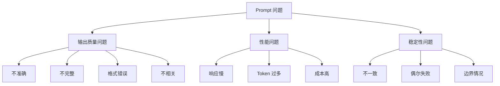
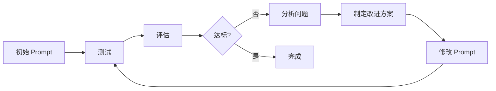

# Prompt 调试与优化实战

> 系统化地诊断、调试和优化你的 prompt，提升 AI 应用质量


## 📚 目录

- [为什么需要系统化调试](#为什么需要系统化调试)
- [常见问题诊断框架](#常见问题诊断框架)
- [调试工具和方法](#调试工具和方法)
- [优化策略和技巧](#优化策略和技巧)
- [自动化测试框架](#自动化测试框架)
- [性能监控和分析](#性能监控和分析)
- [实战案例：从问题到优化](#实战案例从问题到优化)
- [最佳实践清单](#最佳实践清单)

---

## 为什么需要系统化调试

### Prompt 开发的挑战

**与传统代码的不同：**

| 传统代码 | Prompt |
|---------|--------|
| 确定性输出 | 概率性输出 |
| 明确的错误信息 | 模糊的问题表现 |
| 单元测试容易 | 评估标准主观 |
| 调试工具成熟 | 调试方法新兴 |

**实际困难：**

❌ **问题 1：输出不稳定**
```
同样的 prompt，多次运行结果不同
有时好，有时坏，难以复现问题
```

❌ **问题 2：难以定位原因**
```
输出不好，是 prompt 的问题？
还是模型的问题？还是参数的问题？
```

❌ **问题 3：优化方向不明确**
```
不知道改哪里能改善
尝试很多方法，效果不明显
```

❌ **问题 4：回归测试困难**
```
修改后，怎么确保没有破坏之前的功能？
如何持续保证质量？
```

### 系统化调试的价值

✅ **提高效率**
- 快速定位问题根源
- 减少试错次数
- 缩短开发周期

✅ **保证质量**
- 建立质量标准
- 持续监控和改进
- 防止退化

✅ **降低成本**
- 减少 token 浪费
- 优化模型选择
- 提高成功率

✅ **可维护性**
- 文档化的调试过程
- 可复用的解决方案
- 团队协作更高效

---

## 常见问题诊断框架

### 问题分类体系



### 诊断流程图

**Step 1: 问题识别**

```typescript
interface ProblemSymptom {
    symptom: string;        // 观察到的现象
    frequency: number;      // 出现频率（%）
    severity: 'low' | 'medium' | 'high';
    examples: string[];     // 具体例子
}

function identifyProblem(outputs: Output[]): ProblemSymptom {
    // 分析输出模式
    const issues = analyzePatterns(outputs);
    
    // 分类问题
    const category = categorizeIssue(issues);
    
    // 评估严重程度
    const severity = assessSeverity(issues);
    
    return {
        symptom: describeIssue(issues),
        frequency: calculateFrequency(issues),
        severity,
        examples: getWorstExamples(issues)
    };
}
```

**Step 2: 根因分析**

使用 **5 Whys** 方法：

```
问题：输出格式不正确

Why 1: 为什么格式不正确？
→ 模型没有遵循格式要求

Why 2: 为什么没有遵循？
→ Prompt 中的格式说明不够清晰

Why 3: 为什么不够清晰？
→ 只用了文字描述，没有示例

Why 4: 为什么没有示例？
→ 初始设计时忽略了 few-shot 的重要性

Why 5: 为什么会忽略？
→ 缺乏系统化的 prompt 设计检查清单

根因：缺少标准化的 prompt 设计流程和验证机制
```

**Step 3: 问题分类**

**类别 1：指令不清（Instruction Ambiguity）**

**症状：**
- 输出偏离预期
- 遗漏关键信息
- 理解偏差

**诊断方法：**
```typescript
function checkInstructionClarity(prompt: string): ClarityReport {
    return {
        hasClearTask: /请|必须|应该/.test(prompt),
        hasSpecificFormat: /JSON|列表|格式/.test(prompt),
        hasConstraints: /不要|避免|限制/.test(prompt),
        hasExamples: /例如|示例/.test(prompt),
        ambiguityScore: calculateAmbiguity(prompt)
    };
}
```

**类别 2：上下文不足（Insufficient Context）**

**症状：**
- 泛泛而谈的回答
- 缺少针对性
- 假设错误

**诊断方法：**
```typescript
function checkContextSufficiency(prompt: string): ContextReport {
    return {
        hasBackground: prompt.length > 100, // 是否有背景信息
        hasAudience: /面向|用户|读者/.test(prompt),
        hasGoal: /目标|目的|希望/.test(prompt),
        hasConstraints: /限制|约束|要求/.test(prompt),
        contextScore: calculateContextScore(prompt)
    };
}
```

**类别 3：示例问题（Example Issues）**

**症状：**
- few-shot 效果差
- 模型模仿错误
- 格式不一致

**诊断方法：**
```typescript
function checkExampleQuality(examples: Example[]): QualityReport {
    return {
        count: examples.length,
        diversity: calculateDiversity(examples),
        consistency: checkConsistency(examples),
        accuracy: verifyAccuracy(examples),
        coverage: assessCoverage(examples)
    };
}
```

**类别 4：参数配置（Parameter Configuration）**

**症状：**
- 输出太随机或太死板
- 长度不合适
- 创造性不足或过度

**诊断方法：**
```typescript
function checkParameters(config: ModelConfig): ParameterReport {
    return {
        temperatureAppropriate: isTemperatureSuitable(config.temperature, config.task),
        maxTokensReasonable: config.maxTokens > expectedLength(config.task),
        topP合理: config.topP >= 0.7 && config.topP <= 1.0,
        suggestions: generateParameterSuggestions(config)
    };
}
```

---

## 调试工具和方法

### 工具 1：Prompt 可视化工具

**OpenAI Playground**

**功能：**
- 实时测试 prompt
- 调整参数看效果
- 比较不同版本
- 查看 token 使用

**使用技巧：**
```
1. 保存多个版本进行对比
2. 使用 Temperature 滑块探索输出变化
3. 查看 Token 计数优化长度
4. 利用 System message 分离角色设定
```

**LangSmith**

**功能：**
- 追踪 prompt 执行历史
- 可视化执行流程
- 性能指标监控
- 错误分析

**设置：**
```typescript
import { traceable } from "langsmith/traceable";

const generateResponse = traceable(
    async (prompt: string) => {
        const response = await llm.invoke(prompt);
        return response;
    },
    {
        name: "generate-response",
        metadata: { task: "qa" }
    }
);
```

### 工具 2：A/B 测试框架

**实现：**

```typescript
class PromptABTest {
    private variantA: string;
    private variantB: string;
    private testCases: TestCase[];
    
    constructor(variantA: string, variantB: string, testCases: TestCase[]) {
        this.variantA = variantA;
        this.variantB = variantB;
        this.testCases = testCases;
    }
    
    async run(): Promise<ABTestResult> {
        const resultsA = await this.evaluateVariant(this.variantA);
        const resultsB = await this.evaluateVariant(this.variantB);
        
        return {
            variantA: resultsA,
            variantB: resultsB,
            winner: resultsA.score > resultsB.score ? 'A' : 'B',
            improvement: ((resultsB.score - resultsA.score) / resultsA.score * 100).toFixed(2) + '%'
        };
    }
    
    private async evaluateVariant(prompt: string): Promise<EvaluationResult> {
        const scores = [];
        
        for (const testCase of this.testCases) {
            const output = await this.generateOutput(prompt, testCase.input);
            const score = await this.evaluateOutput(output, testCase.expectedOutput);
            scores.push(score);
        }
        
        return {
            averageScore: average(scores),
            successRate: scores.filter(s => s >= 0.8).length / scores.length,
            avgTokenUsage: await this.calculateTokenUsage(prompt),
            avgLatency: await this.calculateLatency(prompt)
        };
    }
}

// 使用
const abTest = new PromptABTest(
    originalPrompt,
    improvedPrompt,
    testCases
);

const result = await abTest.run();
console.log(`Winner: Variant ${result.winner}`);
console.log(`Improvement: ${result.improvement}`);
```

### 工具 3：批量测试工具

**Promptfoo**

**安装：**
```bash
npm install promptfoo
```

**配置文件（promptfooconfig.yaml）：**
```yaml
prompts:
  - file://prompts/original.txt
  - file://prompts/improved.txt

providers:
  - openai:gpt-3.5-turbo
  - openai:gpt-4

tests:
  - vars:
      question: "什么是 React Hooks?"
    assert:
      - type: contains
        value: "useState"
      - type: contains
        value: "useEffect"
  
  - vars:
      question: "解释闭包"
    assert:
      - type: javascript
        value: output.length > 100
      - type: llm-rubric
        value: "回答应该准确解释闭包概念"
```

**运行测试：**
```bash
npx promptfoo eval
```

**生成报告：**
```bash
npx promptfoo view
```

### 工具 4：手动调试技巧

**技巧 1：隔离变量法**

```typescript
// 每次只改变一个因素
const tests = [
    { name: "Baseline", prompt: basePrompt, params: defaultParams },
    { name: "Add Examples", prompt: basePrompt + examples, params: defaultParams },
    { name: "Change Temperature", prompt: basePrompt, params: { ...defaultParams, temperature: 0.9 } },
    { name: "Both Changes", prompt: basePrompt + examples, params: { ...defaultParams, temperature: 0.9 } }
];

// 分别测试，找出最有效的改进
```

**技巧 2：渐进式复杂化**

```
Step 1: 最简单的 prompt
↓ 测试
Step 2: 添加任务描述
↓ 测试
Step 3: 添加约束条件
↓ 测试
Step 4: 添加示例
↓ 测试
Step 5: 添加 CoT

每步验证是否有改善
```

**技巧 3：反向工程**

```
当输出不理想时：

1. 分析坏输出的特征
2. 推测模型的理解
3. 找出歧义点
4. 针对性修改 prompt
```

**示例：**
```
坏输出：模型返回了 HTML 而不是 JSON

分析：模型可能认为要生成网页

推测：prompt 中 "展示数据" 被理解为渲染

歧义点："展示" 这个词

修改：将 "展示数据" 改为 "以 JSON 格式返回数据"
```

---

## 优化策略和技巧

### 策略 1：迭代优化流程

**标准化流程：**



**实施步骤：**

**Step 1: 建立基线**
```typescript
interface Baseline {
    prompt: string;
    metrics: Metrics;
    testResults: TestResult[];
}

async function establishBaseline(prompt: string): Promise<Baseline> {
    const testResults = await runTestSuite(prompt);
    const metrics = calculateMetrics(testResults);
    
    return {
        prompt,
        metrics,
        testResults
    };
}
```

**Step 2: 设定目标**
```typescript
const goals = {
    accuracy: { current: 0.75, target: 0.90 },
    consistency: { current: 0.70, target: 0.85 },
    tokenEfficiency: { current: 150, target: 100 },
    latency: { current: 2000, target: 1500 }
};
```

**Step 3: 优先级排序**
```typescript
function prioritizeIssues(issues: Issue[]): Issue[] {
    return issues.sort((a, b) => {
        // 影响大且容易修复的优先
        const scoreA = a.impact * a.easeOfFix;
        const scoreB = b.impact * b.easeOfFix;
        return scoreB - scoreA;
    });
}
```

**Step 4: 实验和验证**
```typescript
async function runOptimizationCycle(
    baseline: Baseline,
    improvements: Improvement[]
): Promise<OptimizationResult> {
    const results = [];
    
    for (const improvement of improvements) {
        const modifiedPrompt = applyImprovement(baseline.prompt, improvement);
        const result = await testAndCompare(baseline, modifiedPrompt);
        
        results.push({
            improvement,
            result,
            adopted: result.improvement > threshold
        });
        
        if (result.improvement > threshold) {
            baseline.prompt = modifiedPrompt;
        }
    }
    
    return {
        finalPrompt: baseline.prompt,
        improvements: results,
        overallGain: calculateOverallGain(results)
    };
}
```

### 策略 2：模块化设计

**将 prompt 分解为可重用的模块：**

```typescript
class ModularPrompt {
    private modules: Map<string, string> = new Map();
    
    // 注册模块
    registerModule(name: string, content: string): void {
        this.modules.set(name, content);
    }
    
    // 组合 prompt
    assemble(template: string, variables: Record<string, any>): string {
        let prompt = template;
        
        // 替换模块引用
        for (const [name, content] of this.modules) {
            prompt = prompt.replace(`{{${name}}}`, content);
        }
        
        // 替换变量
        for (const [key, value] of Object.entries(variables)) {
            prompt = prompt.replace(`{${key}}`, value);
        }
        
        return prompt;
    }
}

// 使用
const promptBuilder = new ModularPrompt();

// 注册可复用模块
promptBuilder.registerModule('role', `
你是一个资深前端工程师，专注于 React 和 TypeScript。
`);

promptBuilder.registerModule('format_instruction', `
请以 JSON 格式返回结果，包含以下字段：
- answer: 主要回答
- confidence: 置信度 (0-1)
- reasoning: 推理过程
`);

promptBuilder.registerModule('cot_instruction', `
请逐步思考：
1. 理解问题
2. 分析关键点
3. 得出结论
`);

// 组装 prompt
const finalPrompt = promptBuilder.assemble(`
{{role}}

任务：{task}

上下文：{context}

{{cot_instruction}}

{{format_instruction}}
`, {
    task: "解释 React Hooks",
    context: "面向初学者"
});
```

**优势：**
- ✅ 易于维护和更新
- ✅ 可复用性强
- ✅ 便于 A/B 测试单个模块
- ✅ 团队协作更顺畅

### 策略 3：动态 Prompt 生成

**根据输入动态调整 prompt：**

```typescript
class DynamicPromptGenerator {
    async generate(input: UserInput): Promise<string> {
        // 1. 分析输入复杂度
        const complexity = await this.analyzeComplexity(input);
        
        // 2. 检测任务类型
        const taskType = this.detectTaskType(input);
        
        // 3. 选择合适的策略
        const strategy = this.selectStrategy(complexity, taskType);
        
        // 4. 构建 prompt
        return this.buildPrompt(strategy, input);
    }
    
    private selectStrategy(complexity: Complexity, taskType: TaskType): Strategy {
        if (complexity === 'simple') {
            return {
                useFewShot: false,
                useCoT: false,
                temperature: 0.3
            };
        } else if (complexity === 'medium') {
            return {
                useFewShot: true,
                fewShotCount: 2,
                useCoT: false,
                temperature: 0.5
            };
        } else {
            return {
                useFewShot: true,
                fewShotCount: 3,
                useCoT: true,
                temperature: 0.7
            };
        }
    }
}
```

### 策略 4：反馈循环优化

**收集用户反馈持续改进：**

```typescript
class FeedbackLoop {
    private feedbacks: Feedback[] = [];
    
    // 收集反馈
    collectFeedback(requestId: string, rating: number, comment?: string): void {
        this.feedbacks.push({
            requestId,
            rating,
            comment,
            timestamp: new Date()
        });
    }
    
    // 分析反馈模式
    analyzePatterns(): Insight[] {
        const lowRated = this.feedbacks.filter(f => f.rating < 3);
        
        // 找出共同问题
        const commonIssues = this.findCommonIssues(lowRated);
        
        // 生成改进建议
        return commonIssues.map(issue => ({
            issue,
            frequency: issue.count / lowRated.length,
            suggestion: this.generateSuggestion(issue)
        }));
    }
    
    // 自动优化
    async autoOptimize(): Promise<void> {
        const insights = this.analyzePatterns();
        
        for (const insight of insights) {
            if (insight.frequency > 0.3) { // 超过 30% 的负反馈
                await this.applyOptimization(insight);
            }
        }
    }
}
```

---

## 自动化测试框架

### 测试金字塔

```
        /\
       /  \      E2E Tests (完整流程)
      /----\
     /      \    Integration Tests (组件交互)
    /--------\
   /          \  Unit Tests (单个 prompt)
  /------------\
```

### Unit Tests：单个 Prompt 测试

**测试框架：**

```typescript
import { describe, it, expect } from 'vitest';

describe('Code Generation Prompt', () => {
    const prompt = loadPrompt('code-generation');
    
    it('should generate valid TypeScript code', async () => {
        const output = await generateWithPrompt(prompt, {
            task: "Create a debounce function"
        });
        
        expect(output).toMatch(/function\s+\w+/);
        expect(output).toContain(':');
        expect(isValidTypeScript(output)).toBe(true);
    });
    
    it('should include error handling', async () => {
        const output = await generateWithPrompt(prompt, {
            task: "Fetch data from API"
        });
        
        expect(output).toMatch(/try|catch|if.*error/);
    });
    
    it('should respect max length constraint', async () => {
        const output = await generateWithPrompt(prompt, {
            task: "Simple add function",
            maxLength: 200
        });
        
        expect(output.length).toBeLessThan(200);
    });
});
```

### Integration Tests：多轮对话测试

```typescript
describe('Multi-turn Conversation', () => {
    it('should maintain context across turns', async () => {
        const conversation = new Conversation(agent);
        
        // Turn 1
        await conversation.send("我想创建一个 React 组件");
        const response1 = await conversation.receive();
        expect(response1).toContain('React');
        
        // Turn 2 - 引用之前的内容
        await conversation.send("用 TypeScript 重写");
        const response2 = await conversation.receive();
        
        // 应该保持上下文
        expect(response2).toContain('interface');
        expect(response2).toContain('type');
    });
    
    it('should handle topic switching gracefully', async () => {
        const conversation = new Conversation(agent);
        
        await conversation.send("解释 React Hooks");
        await conversation.receive();
        
        // 切换话题
        await conversation.send("现在说说 Vue");
        const response = await conversation.receive();
        
        expect(response).toContain('Vue');
        expect(response).not.toContain('React'); // 不应该混淆
    });
});
```

### E2E Tests：完整工作流测试

```typescript
describe('Complete Workflow', () => {
    it('should handle code review workflow end-to-end', async () => {
        // 1. 用户上传代码
        const code = `
            function fetchData() {
                fetch('/api/data')
                    .then(res => res.json())
                    .then(data => console.log(data));
            }
        `;
        
        // 2. 提交审查请求
        const reviewRequest = await submitReviewRequest(code);
        
        // 3. 等待审查结果
        const review = await waitForReview(reviewRequest.id);
        
        // 4. 验证审查质量
        expect(review.issues).toContainEqual({
            type: 'error-handling',
            severity: 'high',
            description: expect.stringContaining('catch')
        });
        
        expect(review.suggestions.length).toBeGreaterThan(0);
        
        // 5. 验证格式
        expect(review.format).toBe('structured');
        expect(review.confidence).toBeGreaterThan(0.7);
    });
});
```

### 评估指标

**定义评估标准：**

```typescript
interface EvaluationMetrics {
    // 准确性
    accuracy: number;           // 正确率
    relevance: number;          // 相关性
    
    // 完整性
    completeness: number;       // 是否完整回答问题
    
    // 格式
    formatCompliance: number;   // 格式遵循度
    
    // 质量
    coherence: number;          // 连贯性
    clarity: number;            // 清晰度
    
    // 效率
    tokenEfficiency: number;    // token 使用效率
    latency: number;            // 响应时间
}

// 自动化评估
async function evaluateOutput(
    output: string,
    expected: ExpectedOutput
): Promise<EvaluationMetrics> {
    return {
        accuracy: await calculateAccuracy(output, expected.answer),
        relevance: await calculateRelevance(output, expected.topic),
        completeness: checkCompleteness(output, expected.requiredPoints),
        formatCompliance: checkFormat(output, expected.format),
        coherence: await llmEvaluate(output, "Is this coherent?"),
        clarity: await llmEvaluate(output, "Is this clear?"),
        tokenEfficiency: calculateTokenEfficiency(output),
        latency: measureLatency()
    };
}
```

---

## 性能监控和分析

### 监控指标

**关键指标看板：**

```typescript
interface DashboardMetrics {
    // 质量指标
    averageAccuracy: number;
    averageSatisfaction: number;
    errorRate: number;
    
    // 性能指标
    averageLatency: number;
    p95Latency: number;
    p99Latency: number;
    
    // 成本指标
    totalTokensUsed: number;
    averageCostPerRequest: number;
    dailyBudget: number;
    
    // 使用指标
    requestsPerDay: number;
    uniqueUsers: number;
    peakHour: number;
}
```

### 实时监控实现

**使用 LangSmith：**

```typescript
import { Client } from "langsmith";

const client = new Client({
    apiKey: process.env.LANGSMITH_API_KEY
});

// 追踪每次调用
async function trackedGenerate(prompt: string): Promise<string> {
    const runId = uuidv4();
    
    // 开始追踪
    await client.createRun({
        id: runId,
        name: "generate-response",
        run_type: "llm",
        inputs: { prompt },
        metadata: { model: "gpt-4" }
    });
    
    try {
        const startTime = Date.now();
        const output = await llm.generate(prompt);
        const latency = Date.now() - startTime;
        
        // 记录结果
        await client.updateRun(runId, {
            outputs: { response: output },
            end_time: new Date(),
            extra: {
                metadata: {
                    latency,
                    tokens: countTokens(prompt + output)
                }
            }
        });
        
        return output;
    } catch (error) {
        // 记录错误
        await client.updateRun(runId, {
            error: error.message,
            end_time: new Date()
        });
        
        throw error;
    }
}
```

### 告警系统

**设置阈值告警：**

```typescript
class AlertSystem {
    private thresholds = {
        errorRate: 0.05,        // 5% 错误率
        avgLatency: 3000,       // 3 秒平均延迟
        costPerDay: 100,        // $100 日预算
        accuracy: 0.85          // 85% 准确率下限
    };
    
    async checkMetrics(metrics: DashboardMetrics): Promise<Alert[]> {
        const alerts = [];
        
        if (metrics.errorRate > this.thresholds.errorRate) {
            alerts.push({
                type: 'ERROR_RATE_HIGH',
                severity: 'critical',
                message: `Error rate ${metrics.errorRate} exceeds threshold ${this.thresholds.errorRate}`
            });
        }
        
        if (metrics.averageLatency > this.thresholds.avgLatency) {
            alerts.push({
                type: 'LATENCY_HIGH',
                severity: 'warning',
                message: `Average latency ${metrics.averageLatency}ms exceeds threshold`
            });
        }
        
        if (metrics.accuracy < this.thresholds.accuracy) {
            alerts.push({
                type: 'ACCURACY_LOW',
                severity: 'critical',
                message: `Accuracy ${metrics.accuracy} below threshold ${this.thresholds.accuracy}`
            });
        }
        
        return alerts;
    }
    
    async sendAlert(alert: Alert): Promise<void> {
        // 发送到 Slack/Email/PagerDuty
        await notificationService.send({
            channel: alert.severity === 'critical' ? 'pager' : 'slack',
            message: alert.message,
            metadata: alert
        });
    }
}
```

---

## 实战案例：从问题到优化

### 案例 1：代码生成质量不稳定

**问题描述：**

生成的代码有时有 bug，有时缺少类型注解

**诊断过程：**

**Step 1: 收集样本**
```typescript
const samples = await collectOutputs(50);
const issues = analyzeIssues(samples);

// 发现：
// - 30% 缺少类型注解
// - 20% 有逻辑错误
// - 15% 缺少错误处理
```

**Step 2: 分析原因**
```
根因分析：
1. Prompt 中没有明确要求类型注解
2. 没有提供带类型的示例
3. temperature 设置为 0.8，太高
4. 没有要求错误处理
```

**Step 3: 制定改进方案**
```typescript
const improvements = [
    {
        type: 'add_requirement',
        content: "必须添加完整的 TypeScript 类型注解"
    },
    {
        type: 'add_examples',
        content: "添加 3 个带类型的示例"
    },
    {
        type: 'adjust_parameter',
        parameter: 'temperature',
        from: 0.8,
        to: 0.3
    },
    {
        type: 'add_requirement',
        content: "必须包含错误处理"
    }
];
```

**Step 4: 实施和测试**
```typescript
// 原始 prompt
const originalPrompt = `
生成一个函数来实现${task}
`;

// 改进后的 prompt
const improvedPrompt = `
你是一个 TypeScript 专家。生成一个函数来实现${task}

要求：
1. 必须添加完整的类型注解
2. 必须包含错误处理
3. 添加 JSDoc 注释
4. 提供使用示例

示例 1：
${goodExample1}

示例 2：
${goodExample2}

示例 3：
${goodExample3}

现在生成代码：
`;

// A/B 测试
const result = await abTest(originalPrompt, improvedPrompt, testCases);

console.log('Improvement:', result.improvement);
// 输出：Improvement: 45.3%
```

**Step 5: 验证结果**
```
改进前：
- 准确率：65%
- 一致性：60%
- 平均 token：180

改进后：
- 准确率：92% (+27%)
- 一致性：88% (+28%)
- 平均 token：150 (-17%)

✅ 成功！
```

### 案例 2：长文本总结丢失关键信息

**问题：** 总结过于简略，遗漏重要细节

**优化过程：**

**V1: 基础 prompt**
```
总结这篇文章
```
**结果：** 太简短，丢失细节

**V2: 添加要求**
```
总结这篇文章，保留关键信息
```
**结果：** 有所改善，但仍不稳定

**V3: 结构化要求**
```
请总结这篇文章，包含：
1. 主要观点（3-5 个）
2. 关键数据和支持证据
3. 结论和建议

每个部分用标题分隔。
```
**结果：** 更好，但有时冗长

**V4: Few-shot + 长度控制**
```
总结文章，保持简洁但完整。

示例 1：
原文：[500 字文章]
总结：[100 字，包含 3 个要点]

示例 2：
原文：[600 字文章]
总结：[120 字，包含 4 个要点]

现在总结：
{article}

要求：
- 100-150 字
- 3-5 个要点
- 包含关键数据
```
**结果：** ✅ 稳定高质量

**最终指标：**
- 信息保留率：85% → 94%
- 用户满意度：3.5/5 → 4.7/5
- 平均长度：可控在目标范围内

### 案例 3：多轮对话上下文丢失

**问题：** 对话超过 5 轮后，模型忘记早期信息

**解决方案：**

**Step 1: 诊断**
```
发现：
- 上下文窗口足够（128K）
- 但 prompt 没有明确强调历史
- 每轮都重新发送完整历史，token 浪费
```

**Step 2: 优化策略**

**方案 A：摘要历史**
```typescript
class ContextManager {
    private history: Message[] = [];
    private summary: string = '';
    
    async addMessage(message: Message): Promise<void> {
        this.history.push(message);
        
        // 当历史超过 10 轮，创建摘要
        if (this.history.length > 20) {
            this.summary = await this.summarizeHistory(
                this.history.slice(0, 10)
            );
            this.history = this.history.slice(10);
        }
    }
    
    buildPrompt(): string {
        return `
之前的对话摘要：
${this.summary}

最近的对话：
${this.formatHistory(this.history)}

继续对话：
`;
    }
}
```

**方案 B：关键信息提取**
```typescript
class KeyInfoExtractor {
    async extractKeyInfo(history: Message[]): Promise<KeyInfo> {
        const prompt = `
从以下对话中提取关键信息：
- 用户的目标
- 重要的约束条件
- 已达成的共识
- 待解决的问题

对话历史：
${this.formatHistory(history)}

以 JSON 格式返回。
`;
        
        return await llm.generate(prompt);
    }
}
```

**Step 3: 实施和测试**

```
结果对比：

原始方法：
- 10 轮后准确率：60%
- Token 消耗：高
- 延迟：随轮次增加

优化后（摘要）：
- 10 轮后准确率：88%
- Token 消耗：降低 40%
- 延迟：稳定

优化后（关键信息）：
- 10 轮后准确率：92%
- Token 消耗：降低 50%
- 延迟：稳定

✅ 采用关键信息提取方案
```

---

## 最佳实践清单

### Prompt 设计 Checklist

**基础要素：**
- [ ] 明确的角色设定
- [ ] 清晰的任务描述
- [ ] 具体的输出格式要求
- [ ] 必要的约束条件
- [ ] 相关的上下文信息

**高级要素：**
- [ ] 适当的示例（few-shot）
- [ ] 推理指导（CoT，如需要）
- [ ] 边界情况处理
- [ ] 错误处理指引
- [ ] 长度限制

**质量保证：**
- [ ] 无歧义的表述
- [ ] 一致的术语使用
- [ ] 合理的复杂度
- [ ] 可测试的结构
- [ ] 文档化设计决策

### 测试 Checklist

**Unit Tests:**
- [ ] 基本功能测试
- [ ] 边界情况测试
- [ ] 格式验证测试
- [ ] 长度限制测试
- [ ] 特殊字符测试

**Integration Tests:**
- [ ] 多轮对话测试
- [ ] 上下文保持测试
- [ ] 错误恢复测试
- [ ] 超时处理测试

**E2E Tests:**
- [ ] 完整工作流测试
- [ ] 性能基准测试
- [ ] 压力测试
- [ ] 回归测试

### 监控 Checklist

**日常监控：**
- [ ] 错误率 < 5%
- [ ] 平均延迟 < 2s
- [ ] 准确率 > 85%
- [ ] 成本在预算内
- [ ] 用户满意度 > 4/5

**定期审查：**
- [ ] 每周分析失败案例
- [ ] 每月评估整体性能
- [ ] 每季度优化 prompt
- [ ] 持续收集用户反馈
- [ ] 跟踪行业最佳实践

### 优化 Checklist

**发现问题时：**
- [ ] 收集足够的样本（至少 20 个）
- [ ] 分类问题类型
- [ ] 分析根本原因
- [ ] 提出改进假设
- [ ] 设计对照实验

**实施优化时：**
- [ ] 一次只改变一个变量
- [ ] 使用 A/B 测试验证
- [ ] 记录所有改动
- [ ] 评估多方面指标
- [ ] 确认无副作用

**验证结果时：**
- [ ] 统计显著性检验
- [ ] 多场景测试
- [ ] 长期稳定性观察
- [ ] 用户反馈收集
- [ ] 文档化经验教训

---

## 总结与下一步

### 核心要点回顾

✅ **系统化调试的重要性**
- 提高效率和质量的必要手段
- 降低成本和风险
- 支持持续改进

✅ **诊断框架**
- 问题分类体系
- 根因分析方法
- 标准化流程

✅ **工具和方法**
- Playground、LangSmith、Promptfoo
- A/B 测试、批量测试
- 手动调试技巧

✅ **优化策略**
- 迭代优化流程
- 模块化设计
- 动态 prompt 生成
- 反馈循环

✅ **自动化测试**
- 测试金字塔
- 评估指标体系
- CI/CD 集成

✅ **监控和分析**
- 关键指标追踪
- 实时告警
- 性能趋势分析

### 进阶学习路径

**Level 1: 掌握基础调试**
- ✅ 学会使用 Playground
- ✅ 建立测试习惯
- ✅ 掌握基本优化技巧

**Level 2: 系统化方法**
- 📖 学习 LangSmith 高级功能
- 📖 构建自动化测试框架
- 📖 实施监控系统

**Level 3: 工程化实践**
- 🔧 设计 prompt 管理平台
- 🔧 实现自动优化系统
- 🔧 建立团队最佳实践

### 推荐工具和资源

**测试工具：**
- [Promptfoo](https://www.promptfoo.dev/)
- [LangSmith](https://smith.langchain.com/)
- [Weights & Biases](https://wandb.ai/)

**监控工具：**
- [Helicone](https://www.helicone.ai/)
- [PostHog](https://posthog.com/)
- [DataDog](https://www.datadoghq.com/)

**学习资源：**
- [LangChain Documentation](https://python.langchain.com/docs/)
- [OpenAI Cookbook](https://github.com/openai/openai-cookbook)
- [Prompt Engineering Guide](https://www.promptingguide.ai/)

---

## 结语

Prompt 调试和优化是一个持续的过程，需要：

🔍 **系统性思维** - 建立科学的诊断和优化流程

🛠️ **合适的工具** - 利用现代工具提高效率

📊 **数据驱动** - 基于指标做决策

🔄 **持续迭代** - 不断改进和完善

**记住：**
- 好的 prompt 是迭代出来的，不是一次写成的
- 自动化测试和监控是质量的保障
- 用户反馈是最宝贵的优化依据
- 文档化和分享经验能加速团队成长

通过系统化的调试和优化，你将能够构建出高质量、稳定可靠的 AI 应用。

**下一篇预告：** [《深入理解 AI Agent 架构》](/ai/07-ai-agent-architecture.html)

我们将开始 Agent 系列的学习，深入探讨 AI Agent 的核心架构和工作原理。敬请期待！

---

## 参考资料

- [LangSmith Documentation](https://docs.smith.langchain.com/)
- [Promptfoo Documentation](https://www.promptfoo.dev/docs/)
- [OpenAI Best Practices](https://platform.openai.com/docs/guides/production-best-practices)
- [Building LLM Applications for Production](https://huyenchip.com/building-llm-applications-for-production.html)
