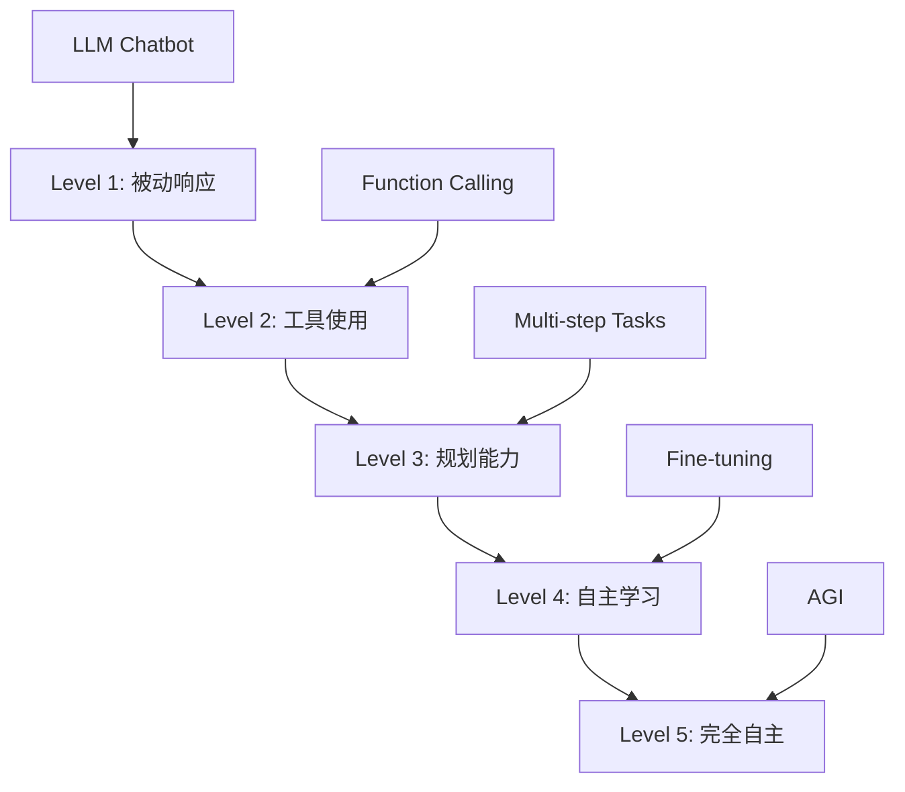
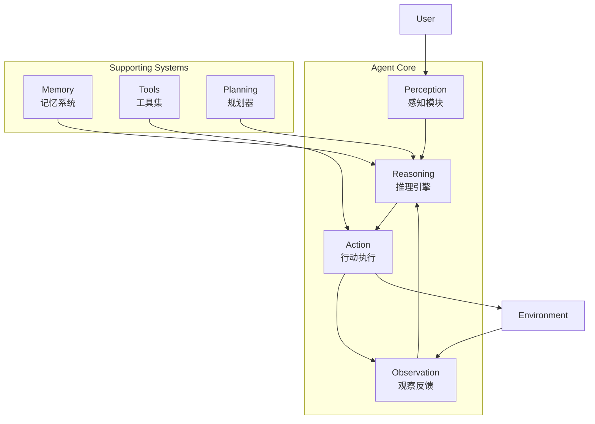

# 深入理解 AI Agent 架构

> 从理论到实践，全面解析 AI Agent 的核心架构和工作原理


## 📚 目录

- [什么是 AI Agent](#什么是-ai-agent)
- [Agent vs LLM：本质区别](#agent-vs-llm本质区别)
- [Agent 核心组件详解](#agent-核心组件详解)
- [经典架构模式](#经典架构模式)
- [ReAct 模式深度剖析](#react-模式深度剖析)
- [Plan-and-Execute 模式](#plan-and-execute-模式)
- [多 Agent 系统](#多-agent-系统)
- [实战：构建基础 Agent 框架](#实战构建基础-agent-框架)
- [最佳实践和设计原则](#最佳实践和设计原则)

---

## 什么是 AI Agent

### 定义

**AI Agent（智能体）** 是一个能够感知环境、做出决策并采取行动以实现目标的自主系统。

**关键特征：**
- 🎯 **目标导向**：有明确的目标或任务
- 🔄 **自主性**：能够独立决策和行动
- 👁️ **感知能力**：能接收和理解输入
- 🎬 **行动能力**：能执行操作影响环境
- 💭 **推理能力**：能思考和规划

### 类比理解

**LLM 像一个博学的顾问：**
```
你问："如何优化 React 性能？"
它答："可以使用 useMemo、React.memo..."
结束。
```

**Agent 像一个全能的助手：**
```
你说："帮我优化这个 React 应用"
它：
1. 分析你的代码
2. 识别性能瓶颈
3. 搜索最佳实践
4. 生成优化方案
5. 实施修改
6. 测试验证
7. 报告结果
完成！
```

### Agent 的能力层级



**当前技术水平：** Level 2-3
- GPT-4o + Function Calling：Level 2
- OpenAI Assistants API：Level 2-3（内置 Code Interpreter、Retrieval、Function Calling）
- Claude Computer Use：Level 3（可以操作计算机）
- AutoGPT、BabyAGI：Level 3
- Level 4-5：仍在研究中

---

## Agent vs LLM：本质区别

### 对比表

| 特性 | LLM | Agent |
|------|-----|-------|
| **交互方式** | 单次问答 | 持续互动 |
| **记忆** | 无状态 | 有状态 |
| **行动** | 仅生成文本 | 可调用工具/API |
| **目标** | 回答问题 | 完成任务 |
| **自主性** | 被动响应 | 主动执行 |
| **规划** | 无 | 有 |
| **学习** | 静态 | 可从反馈学习 |

### 工作流程对比

**LLM 工作流：**
```
Input → Process → Output
(一次性)
```

**Agent 工作流：**
```
Perceive → Think → Act → Observe → Think → Act → ... → Complete
(循环迭代)
```

### 代码对比

**LLM 调用：**
```typescript
// 简单的一次性调用
const response = await openai.chat.completions.create({
    model: "gpt-4",
    messages: [{ role: "user", content: "What's the weather?" }]
});

console.log(response.choices[0].message.content);
// "I don't have access to real-time weather data."
```

**Agent 执行：**
```typescript
// Agent 可以调用工具获取真实数据
const agent = new WeatherAgent();
const result = await agent.execute("What's the weather in Beijing?");

// Agent 内部流程：
// 1. 理解任务：需要查询天气
// 2. 选择工具：weather_api
// 3. 调用工具：getWeather("Beijing")
// 4. 处理结果：格式化回答
// 5. 返回："Beijing: Sunny, 25°C"
```

---

## Agent 核心组件详解

### 架构图



### 组件 1：Perception（感知模块）

**职责：** 接收和解析输入

**功能：**
- 解析用户指令
- 理解上下文
- 提取关键信息
- 识别意图

**实现示例：**

```typescript
class PerceptionModule {
    async perceive(input: UserInput): Promise<ParsedIntent> {
        // 1. 解析输入类型
        const type = this.detectInputType(input);
        
        // 2. 提取意图
        const intent = await this.extractIntent(input);
        
        // 3. 识别实体
        const entities = this.extractEntities(input);
        
        // 4. 理解上下文
        const context = this.getContext();
        
        return {
            type,
            intent,
            entities,
            context,
            rawInput: input
        };
    }
    
    private detectInputType(input: UserInput): InputType {
        if (input.text) return 'text';
        if (input.voice) return 'voice';
        if (input.image) return 'image';
        return 'unknown';
    }
    
    private async extractIntent(input: UserInput): Promise<string> {
        // 使用 LLM 理解意图
        const prompt = `
        分析以下用户输入的意图：
        "${input.text}"
        
        可能的意图：
        - query: 查询信息
        - action: 执行操作
        - creation: 创建内容
        - analysis: 分析数据
        
        返回最匹配的意图。
        `;
        
        return await llm.generate(prompt);
    }
}
```

### 组件 2：Reasoning（推理引擎）

**职责：** 思考、决策、规划

**功能：**
- 分析当前状态
- 制定行动计划
- 选择合适的工具
- 评估执行结果

**核心算法：**

**1. 决策循环**
```typescript
class ReasoningEngine {
    async reason(state: AgentState): Promise<Action> {
        // 1. 评估当前情况
        const assessment = await this.assessSituation(state);
        
        // 2. 确定下一步
        const nextStep = await this.determineNextStep(assessment);
        
        // 3. 选择工具或策略
        const action = await this.selectAction(nextStep);
        
        return action;
    }
    
    private async assessSituation(state: AgentState): Promise<Assessment> {
        const prompt = `
        当前状态：
        - 目标：${state.goal}
        - 已完成：${state.completedSteps}
        - 当前进度：${state.progress}
        - 可用工具：${state.availableTools}
        
        请评估：
        1. 距离目标还有多远？
        2. 下一步应该做什么？
        3. 需要什么资源或工具？
        `;
        
        return await llm.generate(prompt);
    }
}
```

**2. 工具选择**
```typescript
class ToolSelector {
    private tools: Tool[];
    
    async selectTool(task: string): Promise<Tool> {
        // 方法 1：基于描述匹配
        const matchedTool = this.tools.find(tool => 
            this.isRelevant(tool.description, task)
        );
        
        if (matchedTool) return matchedTool;
        
        // 方法 2：使用 LLM 选择
        const prompt = `
        任务：${task}
        
        可用工具：
        ${this.tools.map(t => `- ${t.name}: ${t.description}`).join('\n')}
        
        选择最合适的工具，只返回工具名称。
        `;
        
        const selectedName = await llm.generate(prompt);
        return this.tools.find(t => t.name === selectedName)!;
    }
}
```

### 组件 3：Action（行动执行）

**职责：** 执行具体操作

**功能：**
- 调用外部 API
- 执行代码
- 读写文件
- 发送消息

**工具接口定义：**

```typescript
interface Tool {
    name: string;
    description: string;
    parameters: ParameterSchema;
    execute: (args: any) => Promise<any>;
}

// 示例：搜索工具
const searchTool: Tool = {
    name: "web_search",
    description: "在互联网上搜索信息",
    parameters: {
        type: "object",
        properties: {
            query: {
                type: "string",
                description: "搜索关键词"
            },
            num_results: {
                type: "number",
                description: "返回结果数量",
                default: 5
            }
        },
        required: ["query"]
    },
    execute: async ({ query, num_results = 5 }) => {
        const response = await fetch(`https://api.search.com?q=${query}&limit=${num_results}`);
        return response.json();
    }
};

// 示例：计算器工具
const calculatorTool: Tool = {
    name: "calculator",
    description: "执行数学计算",
    parameters: {
        type: "object",
        properties: {
            expression: {
                type: "string",
                description: "数学表达式，如 '2 + 3 * 4'"
            }
        },
        required: ["expression"]
    },
    execute: async ({ expression }) => {
        // 安全地计算表达式
        return safeEvaluate(expression);
    }
};
```

**执行器：**

```typescript
class ActionExecutor {
    private tools: Map<string, Tool> = new Map();
    
    registerTool(tool: Tool): void {
        this.tools.set(tool.name, tool);
    }
    
    async execute(action: Action): Promise<ActionResult> {
        const tool = this.tools.get(action.toolName);
        
        if (!tool) {
            throw new Error(`Tool not found: ${action.toolName}`);
        }
        
        try {
            // 验证参数
            this.validateParameters(action.parameters, tool.parameters);
            
            // 执行工具
            const startTime = Date.now();
            const result = await tool.execute(action.parameters);
            const duration = Date.now() - startTime;
            
            return {
                success: true,
                result,
                duration,
                toolName: action.toolName
            };
        } catch (error) {
            return {
                success: false,
                error: error.message,
                toolName: action.toolName
            };
        }
    }
}
```

### 组件 4：Memory（记忆系统）

**职责：** 存储和检索信息

**记忆类型：**

**1. Short-term Memory（短期记忆）**
- 当前对话历史
- 临时变量
- 最近的操作结果

```typescript
class ShortTermMemory {
    private messages: Message[] = [];
    private maxSize: number = 20;
    
    add(message: Message): void {
        this.messages.push(message);
        
        // 保持大小限制
        if (this.messages.length > this.maxSize) {
            this.messages = this.messages.slice(-this.maxSize);
        }
    }
    
    getHistory(): Message[] {
        return this.messages;
    }
    
    clear(): void {
        this.messages = [];
    }
}
```

**2. Long-term Memory（长期记忆）**
- 持久化知识
- 用户偏好
- 历史经验

```typescript
class LongTermMemory {
    private vectorStore: VectorDatabase;
    
    // 保存重要信息
    async save(content: string, metadata: Record<string, any>): Promise<void> {
        const embedding = await createEmbedding(content);
        
        await this.vectorStore.insert({
            id: generateId(),
            content,
            embedding,
            metadata,
            timestamp: new Date()
        });
    }
    
    // 检索相关信息
    async retrieve(query: string, limit = 5): Promise<Memory[]> {
        const queryEmbedding = await createEmbedding(query);
        
        return await this.vectorStore.similaritySearch(
            queryEmbedding,
            limit
        );
    }
    
    // 更新记忆
    async update(id: string, content: string): Promise<void> {
        const embedding = await createEmbedding(content);
        await this.vectorStore.update(id, { content, embedding });
    }
    
    // 删除记忆
    async delete(id: string): Promise<void> {
        await this.vectorStore.delete(id);
    }
}
```

**3. Working Memory（工作记忆）**
- 当前任务的中间状态
- 临时计算结果
- 执行计划

```typescript
class WorkingMemory {
    private state: Record<string, any> = {};
    
    set(key: string, value: any): void {
        this.state[key] = value;
    }
    
    get(key: string): any {
        return this.state[key];
    }
    
    getAll(): Record<string, any> {
        return { ...this.state };
    }
    
    clear(): void {
        this.state = {};
    }
}
```

### 组件 5：Planning（规划器）

**职责：** 制定执行计划

**功能：**
- 任务分解
- 步骤排序
- 依赖管理
- 动态调整

**实现：**

```typescript
class Planner {
    async createPlan(goal: string): Promise<Plan> {
        // 使用 LLM 生成分解计划
        const prompt = `
        目标：${goal}
        
        请将这个目标分解为具体的执行步骤。
        
        要求：
        1. 每个步骤应该是原子性的
        2. 标明步骤之间的依赖关系
        3. 估计每个步骤的难度（1-5）
        4. 建议使用的工具
        
        返回 JSON 格式：
        {
            "steps": [
                {
                    "id": 1,
                    "description": "步骤描述",
                    "depends_on": [],
                    "difficulty": 2,
                    "suggested_tool": "tool_name"
                }
            ]
        }
        `;
        
        const plan = await llm.generate(prompt);
        return JSON.parse(plan);
    }
    
    async adjustPlan(plan: Plan, feedback: string): Promise<Plan> {
        // 根据执行反馈调整计划
        const prompt = `
        原计划：
        ${JSON.stringify(plan)}
        
        执行反馈：
        ${feedback}
        
        请调整计划以应对当前情况。
        `;
        
        const adjustedPlan = await llm.generate(prompt);
        return JSON.parse(adjustedPlan);
    }
}
```

---

## 经典架构模式

### 模式 1：ReAct（Reasoning + Acting）

**提出者：** Yao et al., 2022

**核心思想：** 交替进行推理和行动

**工作流程：**

```
Thought: 我需要先了解问题的背景
Action: Search[量子计算基本原理]
Observation: 找到相关文章...

Thought: 现在我需要总结关键点
Action: Summarize[article_ids]
Observation: 总结完成

Thought: 我已经有足够信息回答问题
Final Answer: 量子计算是...
```

**伪代码：**

```typescript
class ReActAgent {
    private memory: Memory;
    private tools: ToolRegistry;
    
    async execute(task: string): Promise<string> {
        let steps = 0;
        const maxSteps = 10;
        
        while (steps < maxSteps) {
            // Step 1: 思考
            const thought = await this.think(task, this.memory.getHistory());
            
            // Step 2: 解析思想和行动
            const { action, isFinal } = this.parseThought(thought);
            
            if (isFinal) {
                return action.answer;
            }
            
            // Step 3: 执行行动
            const observation = await this.executeAction(action);
            
            // Step 4: 记录到记忆
            this.memory.add({ thought, action, observation });
            
            steps++;
        }
        
        throw new Error('Maximum steps exceeded');
    }
    
    private async think(task: string, history: Message[]): Promise<string> {
        const prompt = this.buildReActPrompt(task, history);
        return await llm.generate(prompt);
    }
    
    private buildReActPrompt(task: string, history: Message[]): string {
        return `
        你是一个智能助手，可以调用工具来完成任务。

        你可以使用以下工具：
        ${this.tools.getDescription()}

        使用以下格式：

        Question: 必须回答的问题
        Thought: 我应该怎么做
        Action: 工具名称[工具输入]
        Observation: 工具执行结果
        ... (这个 Thought/Action/Observation 可以重复 N 次)
        Thought: 我现在知道最终答案
        Final Answer: 对原始问题的最终答案

        开始！

        Question: ${task}
        ${this.formatHistory(history)}
        Thought:
        `;
    }
}
```

**优势：**
- ✅ 结构清晰
- ✅ 可解释性强
- ✅ 易于调试
- ✅ 灵活适应不同任务

**劣势：**
- ❌ 可能需要多轮才能完成
- ❌ 每轮都需要 LLM 调用
- ❌ 对于复杂任务效率较低

### 模式 2：Plan-and-Execute

**核心思想：** 先制定完整计划，再逐步执行

**工作流程：**

```
Phase 1: Planning
- 分析任务
- 制定详细计划
- 确定所需资源

Phase 2: Execution
- 按计划执行每一步
- 监控进度
- 处理异常

Phase 3: Review
- 验证结果
- 必要时重新规划
```

**实现：**

```typescript
class PlanAndExecuteAgent {
    private planner: Planner;
    private executor: Executor;
    
    async execute(task: string): Promise<any> {
        // Phase 1: 制定计划
        console.log('📋 制定计划...');
        const plan = await this.planner.createPlan(task);
        console.log(`计划包含 ${plan.steps.length} 个步骤`);
        
        // Phase 2: 执行计划
        console.log('🚀 执行计划...');
        const results = await this.executor.executePlan(plan);
        
        // Phase 3: 审查结果
        console.log('✅ 审查结果...');
        const finalResult = await this.review(results, plan);
        
        return finalResult;
    }
}

class Executor {
    async executePlan(plan: Plan): Promise<ExecutionResult[]> {
        const results = [];
        const completedSteps = new Set<number>();
        
        // 拓扑排序执行
        while (completedSteps.size < plan.steps.length) {
            for (const step of plan.steps) {
                // 检查依赖是否满足
                if (this.dependenciesMet(step, completedSteps)) {
                    console.log(`执行步骤 ${step.id}: ${step.description}`);
                    
                    const result = await this.executeStep(step);
                    results.push(result);
                    completedSteps.add(step.id);
                    
                    console.log(`✓ 步骤 ${step.id} 完成`);
                }
            }
        }
        
        return results;
    }
    
    private dependenciesMet(step: Step, completed: Set<number>): boolean {
        return step.depends_on.every(depId => completed.has(depId));
    }
}
```

**优势：**
- ✅ 全局视角，更好的规划
- ✅ 可以并行执行独立步骤
- ✅ 易于监控进度

**劣势：**
- ❌ 初始规划可能不完善
- ❌ 缺乏灵活性
- ❌ 难以应对意外情况

### 模式 3：Reflexion

**核心思想：** 从失败中学习，自我反思和改进

**工作流程：**

```
尝试执行任务
    ↓
评估结果
    ↓
成功？→ 返回结果
    ↓ 失败
反思失败原因
    ↓
生成改进策略
    ↓
重新尝试（使用新策略）
```

**实现：**

```typescript
class ReflexionAgent {
    private maxAttempts: number = 3;
    
    async execute(task: string): Promise<any> {
        let lastError: string | null = null;
        let reflection: string | null = null;
        
        for (let attempt = 1; attempt <= this.maxAttempts; attempt++) {
            console.log(`Attempt ${attempt}/${this.maxAttempts}`);
            
            try {
                // 执行任务（考虑之前的反思）
                const result = await this.attemptTask(task, reflection);
                
                // 验证结果
                if (await this.validateResult(result)) {
                    console.log('✅ 成功！');
                    return result;
                }
                
                throw new Error('Result validation failed');
                
            } catch (error) {
                lastError = error.message;
                console.log(`❌ 失败: ${lastError}`);
                
                // 反思失败原因
                reflection = await this.reflect(task, lastError, attempt);
                console.log(`💭 反思: ${reflection}`);
            }
        }
        
        throw new Error(`Failed after ${this.maxAttempts} attempts`);
    }
    
    private async reflect(task: string, error: string, attempt: number): Promise<string> {
        const prompt = `
        任务：${task}
        
        第 ${attempt} 次尝试失败，错误：${error}
        
        请反思：
        1. 失败的根本原因是什么？
        2. 下次应该如何改进？
        3. 需要采取什么不同的策略？
        
        给出具体的改进建议。
        `;
        
        return await llm.generate(prompt);
    }
}
```

**优势：**
- ✅ 能够从错误中学习
- ✅ 提高成功率
- ✅ 自适应能力强

**劣势：**
- ❌ 可能需要多次尝试
- ❌ 增加延迟
- ❌ 成本更高

---

## ReAct 模式深度剖析

### 为什么 ReAct 有效？

**1. 结合推理和行动**
- 纯推理：可能脱离实际
- 纯行动：缺乏方向
- ReAct：两者结合，相互促进

**2. 增量式问题解决**
- 不是一次性解决整个问题
- 通过多轮迭代逐步推进
- 每轮都基于新的信息

**3. 可解释性**
- Thought 展示思考过程
- 便于调试和优化
- 用户可理解 agent 的决策

### 完整的 ReAct 实现

```typescript
interface ReActStep {
    thought: string;
    action?: {
        tool: string;
        input: any;
    };
    observation?: any;
    finalAnswer?: string;
}

class ReActAgent {
    private llm: LLM;
    private tools: ToolRegistry;
    private memory: ConversationMemory;
    private maxIterations: number = 10;
    
    constructor(config: AgentConfig) {
        this.llm = config.llm;
        this.tools = config.tools;
        this.memory = config.memory;
        this.maxIterations = config.maxIterations || 10;
    }
    
    async run(question: string): Promise<string> {
        console.log(`🤔 问题: ${question}\n`);
        
        const steps: ReActStep[] = [];
        
        for (let i = 0; i < this.maxIterations; i++) {
            // Step 1: 生成 Thought 和 Action
            const step = await this.generateStep(question, steps);
            steps.push(step);
            
            console.log(`Thought: ${step.thought}`);
            
            // Step 2: 检查是否是最终答案
            if (step.finalAnswer) {
                console.log(`\n✅ 最终答案: ${step.finalAnswer}`);
                return step.finalAnswer;
            }
            
            // Step 3: 执行 Action
            if (step.action) {
                console.log(`Action: ${step.action.tool}(${JSON.stringify(step.action.input)})`);
                
                const observation = await this.executeAction(step.action);
                step.observation = observation;
                
                console.log(`Observation: ${this.truncate(observation)}\n`);
            }
        }
        
        throw new Error('Reached maximum iterations without finding answer');
    }
    
    private async generateStep(question: string, previousSteps: ReActStep[]): Promise<ReActStep> {
        const prompt = this.buildPrompt(question, previousSteps);
        const response = await this.llm.generate(prompt);
        
        return this.parseResponse(response);
    }
    
    private buildPrompt(question: string, previousSteps: ReActStep[]): string {
        const toolsDescription = this.tools.getAll().map(tool => 
            `- ${tool.name}: ${tool.description}`
        ).join('\n');
        
        const history = previousSteps.map((step, i) => {
            let text = `Step ${i + 1}:\nThought: ${step.thought}\n`;
            
            if (step.action) {
                text += `Action: ${step.action.tool}[${JSON.stringify(step.action.input)}]\n`;
            }
            
            if (step.observation) {
                text += `Observation: ${step.observation}\n`;
            }
            
            if (step.finalAnswer) {
                text += `Final Answer: ${step.finalAnswer}\n`;
            }
            
            return text;
        }).join('\n');
        
        return `
你是一个智能助手，可以使用工具来回答问题。

可用工具：
${toolsDescription}

回答格式：
Thought: 你的思考过程
Action: 工具名[工具输入] 或 Final Answer: 最终答案

${history ? '历史步骤:\n' + history : ''}

问题: ${question}

Thought:
`.trim();
    }
    
    private parseResponse(response: string): ReActStep {
        // 解析 Thought
        const thoughtMatch = response.match(/Thought:\s*(.+?)(?=Action:|Final Answer:|$)/s);
        const thought = thoughtMatch ? thoughtMatch[1].trim() : '';
        
        // 解析 Final Answer
        const finalAnswerMatch = response.match(/Final Answer:\s*(.+)/s);
        if (finalAnswerMatch) {
            return {
                thought,
                finalAnswer: finalAnswerMatch[1].trim()
            };
        }
        
        // 解析 Action
        const actionMatch = response.match(/Action:\s*(\w+)\[(.+?)\]/s);
        if (actionMatch) {
            return {
                thought,
                action: {
                    tool: actionMatch[1],
                    input: this.parseInput(actionMatch[2])
                }
            };
        }
        
        throw new Error('Invalid response format');
    }
    
    private async executeAction(action: { tool: string; input: any }): Promise<any> {
        const tool = this.tools.get(action.tool);
        
        if (!tool) {
            throw new Error(`Unknown tool: ${action.tool}`);
        }
        
        return await tool.execute(action.input);
    }
    
    private truncate(text: string, maxLength = 200): string {
        if (text.length <= maxLength) return text;
        return text.substring(0, maxLength) + '...';
    }
}
```

### 使用示例

```typescript
// 创建 agent
const agent = new ReActAgent({
    llm: new OpenAILLM({ model: 'gpt-4' }),
    tools: new ToolRegistry([
        searchTool,
        calculatorTool,
        wikipediaTool
    ]),
    memory: new ConversationMemory(),
    maxIterations: 10
});

// 运行
const answer = await agent.run(
    "What is the population of China divided by the area of Beijing?"
);

// 执行过程：
// Thought: I need to find the population of China and the area of Beijing
// Action: search["population of China"]
// Observation: 1.4 billion
//
// Thought: Now I need to find the area of Beijing
// Action: search["area of Beijing in square kilometers"]
// Observation: 16,410 km²
//
// Thought: Now I can calculate the division
// Action: calculator["1400000000 / 16410"]
// Observation: 85313.22
//
// Thought: I now know the final answer
// Final Answer: The population of China divided by the area of Beijing is approximately 85,313 people per square kilometer.
```

---

## Plan-and-Execute 模式

### 适用场景

**适合使用 Plan-and-Execute 的情况：**
- ✅ 任务可以清晰分解
- ✅ 步骤之间有明确依赖
- ✅ 需要全局优化
- ✅ 可并行执行

**不适合的情况：**
- ❌ 任务不确定性高
- ❌ 需要频繁调整策略
- ❌ 探索性任务

### 完整实现

```typescript
interface Plan {
    goal: string;
    steps: Step[];
    metadata: {
        createdAt: Date;
        estimatedDuration: number;
    };
}

interface Step {
    id: number;
    description: string;
    tool: string;
    parameters: any;
    depends_on: number[];
    status: 'pending' | 'running' | 'completed' | 'failed';
    result?: any;
    error?: string;
}

class PlanAndExecuteAgent {
    private planner: LLMPlanner;
    private executor: StepExecutor;
    private monitor: ProgressMonitor;
    
    async execute(goal: string): Promise<any> {
        console.log(`🎯 目标: ${goal}\n`);
        
        // Phase 1: Planning
        const plan = await this.planner.createPlan(goal);
        console.log(`📋 计划已创建，共 ${plan.steps.length} 个步骤\n`);
        
        this.monitor.start(plan);
        
        // Phase 2: Execution
        try {
            await this.executor.executeAll(plan.steps);
        } catch (error) {
            console.error(`❌ 执行失败: ${error.message}`);
            
            // 尝试恢复
            const recoveryPlan = await this.planner.adjustPlan(plan, error.message);
            await this.executor.executeAll(recoveryPlan.steps);
        }
        
        // Phase 3: Review
        const finalResult = await this.review(plan);
        
        this.monitor.complete();
        
        return finalResult;
    }
}

class LLMPlanner {
    async createPlan(goal: string): Promise<Plan> {
        const prompt = `
        目标：${goal}
        
        请制定一个详细的执行计划。
        
        要求：
        1. 将目标分解为具体的、可执行的步骤
        2. 每个步骤指定所需的工具
        3. 标明步骤间的依赖关系
        4. 估计总耗时
        
        返回 JSON 格式。
        `;
        
        const planData = await llm.generate(prompt);
        const parsed = JSON.parse(planData);
        
        return {
            goal,
            steps: parsed.steps.map((step: any, index: number) => ({
                id: index + 1,
                ...step,
                status: 'pending'
            })),
            metadata: {
                createdAt: new Date(),
                estimatedDuration: parsed.estimated_duration || 0
            }
        };
    }
}

class StepExecutor {
    private tools: ToolRegistry;
    
    async executeAll(steps: Step[]): Promise<void> {
        const completed = new Set<number>();
        const running = new Set<number>();
        
        while (completed.size < steps.length) {
            // 找到可以执行的步骤
            const readySteps = steps.filter(step => 
                step.status === 'pending' &&
                this.areDependenciesMet(step, completed)
            );
            
            if (readySteps.length === 0 && completed.size < steps.length) {
                throw new Error('Deadlock detected: no steps can proceed');
            }
            
            // 并行执行就绪的步骤
            await Promise.all(
                readySteps.map(step => this.executeStep(step, completed))
            );
        }
    }
    
    private async executeStep(step: Step, completed: Set<number>): Promise<void> {
        step.status = 'running';
        console.log(`▶️  执行步骤 ${step.id}: ${step.description}`);
        
        try {
            const tool = this.tools.get(step.tool);
            const result = await tool.execute(step.parameters);
            
            step.result = result;
            step.status = 'completed';
            completed.add(step.id);
            
            console.log(`✓ 步骤 ${step.id} 完成\n`);
        } catch (error) {
            step.status = 'failed';
            step.error = error.message;
            
            console.log(`✗ 步骤 ${step.id} 失败: ${error.message}\n`);
            
            throw error;
        }
    }
    
    private areDependenciesMet(step: Step, completed: Set<number>): boolean {
        return step.depends_on.every(depId => completed.has(depId));
    }
}
```

---

## 多 Agent 系统

### 为什么需要多 Agent？

**单 Agent 的局限：**
- ❌ 能力有限
- ❌ 容易出错
- ❌ 难以处理复杂任务

**多 Agent 的优势：**
- ✅ 专业化分工
- ✅ 互相验证
- ✅ 协作解决复杂问题
- ✅ 更高的可靠性

### 架构模式

**1. Supervisor Pattern（主管模式）**

```
      ┌─────────────┐
      │  Supervisor  │
      └──────┬──────┘
             │
     ┌───────┼───────┐
     │       │       │
  Agent1  Agent2  Agent3
```

**实现：**

```typescript
class SupervisorAgent {
    private workers: Map<string, WorkerAgent>;
    
    async execute(task: string): Promise<any> {
        // 1. 分析任务，分配给合适的 worker
        const assignments = await this.assignTasks(task);
        
        // 2. 并行执行
        const results = await Promise.all(
            assignments.map(async ({ workerId, subtask }) => {
                const worker = this.workers.get(workerId);
                return worker.execute(subtask);
            })
        );
        
        // 3. 整合结果
        const finalResult = await this.synthesize(results);
        
        return finalResult;
    }
}
```

**2. Debate Pattern（辩论模式）**

```
Agent1 (观点A) ←→ Agent2 (观点B)
         ↓              ↓
      Judge Agent (裁决)
```

**用途：** 提高决策质量，减少偏见

**3. Pipeline Pattern（流水线模式）**

```
Agent1 → Agent2 → Agent3 → Output
(收集)   (分析)   (总结)
```

**用途：** 复杂的多阶段任务

### CrewAI 示例

**使用 CrewAI 框架构建多 Agent 系统：**

```python
from crewai import Agent, Task, Crew

# 创建专业化的 agents
researcher = Agent(
    role='研究员',
    goal='深入研究主题，收集全面信息',
    backstory='你是经验丰富的研究员，擅长查找和分析信息',
    verbose=True
)

writer = Agent(
    role='作家',
    goal='基于研究结果撰写高质量文章',
    backstory='你是专业作家，擅长将复杂信息转化为易懂的文章',
    verbose=True
)

editor = Agent(
    role='编辑',
    goal='审查和优化文章质量',
    backstory='你是资深编辑，注重细节和质量标准',
    verbose=True
)

# 定义任务
research_task = Task(
    description='研究 AI Agent 的最新发展',
    agent=researcher
)

write_task = Task(
    description='基于研究结果写一篇综述文章',
    agent=writer
)

edit_task = Task(
    description='审查和编辑文章',
    agent=editor
)

# 创建 crew
crew = Crew(
    agents=[researcher, writer, editor],
    tasks=[research_task, write_task, edit_task],
    verbose=2
)

# 执行
result = crew.kickoff()
```

---

## 实战：构建基础 Agent 框架

### 最小可行 Agent

```typescript
// 最简单的 Agent 实现
class SimpleAgent {
    private llm: LLM;
    private tools: Tool[];
    
    constructor(llm: LLM, tools: Tool[]) {
        this.llm = llm;
        this.tools = tools;
    }
    
    async execute(task: string): Promise<string> {
        // 1. 决定是否需要工具
        const decision = await this.decide(task);
        
        if (decision.useTool) {
            // 2. 选择并执行工具
            const tool = this.tools.find(t => t.name === decision.toolName)!;
            const result = await tool.execute(decision.toolInput);
            
            // 3. 基于结果生成回答
            return await this.generateAnswer(task, result);
        } else {
            // 直接回答
            return await this.llm.generate(task);
        }
    }
    
    private async decide(task: string): Promise<Decision> {
        const prompt = `
        任务：${task}
        
        可用工具：
        ${this.tools.map(t => `- ${t.name}: ${t.description}`).join('\n')}
        
        决定：
        1. 是否需要使用工具？(yes/no)
        2. 如果需要，使用哪个工具？
        3. 工具的输入是什么？
        
        返回 JSON。
        `;
        
        const response = await this.llm.generate(prompt);
        return JSON.parse(response);
    }
    
    private async generateAnswer(task: string, context: any): Promise<string> {
        const prompt = `
        原始问题：${task}
        
        额外信息：${JSON.stringify(context)}
        
        请基于以上信息回答问题。
        `;
        
        return await this.llm.generate(prompt);
    }
}

// 使用
const agent = new SimpleAgent(
    new OpenAILLM(),
    [searchTool, calculatorTool]
);

const answer = await agent.execute("What is 2^10?");
```

### 进阶 Agent 框架

添加更多功能：
- ✅ 记忆系统
- ✅ 规划能力
- ✅ 错误处理
- ✅ 日志记录
- ✅ 监控指标

---

## 最佳实践和设计原则

### 设计原则

**1. Single Responsibility（单一职责）**
- 每个 Agent 专注于特定领域
- 工具小而精，功能明确

**2. Modularity（模块化）**
- 组件可替换
- 易于扩展和测试

**3. Observability（可观测性）**
- 记录所有决策和行动
- 提供调试和监控接口

**4. Fault Tolerance（容错性）**
- 优雅处理失败
- 支持重试和降级

**5. Security（安全性）**
- 验证所有输入
- 限制工具权限
- 防止注入攻击

### 常见陷阱

**❌ 陷阱 1：过度复杂**
```
不要一开始就构建复杂的 multi-agent 系统
从简单的 single agent 开始，逐步演进
```

**❌ 陷阱 2：忽略错误处理**
```
始终假设工具调用可能失败
实现重试、降级和错误恢复机制
```

**❌ 陷阱 3：缺乏监控**
```
记录所有重要的决策和行动
建立指标和告警系统
```

**❌ 陷阱 4：硬编码逻辑**
```
使用配置和模板，避免硬编码
让行为可通过 prompt 调整
```

### 性能优化

**1. 缓存**
```typescript
class CachedTool implements Tool {
    private cache = new Map<string, any>();
    
    async execute(input: any): Promise<any> {
        const cacheKey = JSON.stringify(input);
        
        if (this.cache.has(cacheKey)) {
            return this.cache.get(cacheKey);
        }
        
        const result = await this.innerTool.execute(input);
        this.cache.set(cacheKey, result);
        
        return result;
    }
}
```

**2. 并行执行**
```typescript
// 独立的步骤并行执行
await Promise.all(independentSteps.map(execute));
```

**3. 流式响应**
```typescript
// 实时反馈给用户
for await (const chunk of streamResponse) {
    yield chunk;
}
```

---

## 总结与下一步

### 核心要点回顾

✅ **Agent 的本质**
- 感知 → 思考 → 行动 → 观察的循环
- 超越 LLM 的被动响应
- 具备自主性和目标导向

✅ **核心组件**
- Perception：理解输入
- Reasoning：决策规划
- Action：执行操作
- Memory：存储信息
- Planning：制定计划

✅ **经典架构**
- ReAct：推理和行动交替
- Plan-and-Execute：先规划后执行
- Reflexion：从失败中学习
- Multi-Agent：协作分工

✅ **最佳实践**
- 从简单开始，逐步演进
- 重视错误处理和监控
- 保持模块化和可扩展性
- 持续优化性能

### 下一步学习

**实践项目：**
1. 实现一个简单的 ReAct Agent
2. 创建自定义工具
3. 添加记忆系统
4. 构建多 Agent 协作系统

**深入学习：**
- 📖 LangChain Agents
- 📖 AutoGPT 源码
- 📖 BabyAGI 架构
- 📖 Microsoft Autogen

**下一篇：** 《构建你的第一个 AI Agent》

我们将手把手教你从零开始构建一个实用的 AI Agent。敬请期待！

---

## 参考资料

- [ReAct Paper](https://arxiv.org/abs/2210.03629)
- [LangChain Agents](https://python.langchain.com/docs/modules/agents/)
- [OpenAI Assistants API](https://platform.openai.com/docs/assistants/overview)
- [Claude Computer Use](https://docs.anthropic.com/claude/docs/computer-use)
- [AutoGPT](https://github.com/Significant-Gravitas/AutoGPT)
- [CrewAI](https://www.crewai.com/)
- [Microsoft Autogen](https://microsoft.github.io/autogen/)
