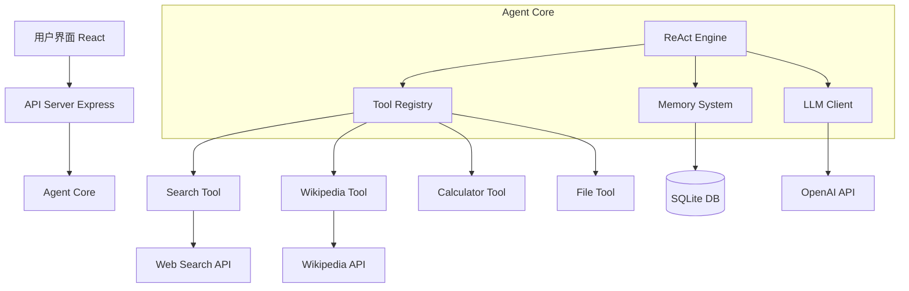

# 构建你的第一个 AI Agent - 从零到一的实战教程

> 手把手教你构建一个实用的 AI Agent，从设计到部署的完整流程


## 📚 目录

- [项目概述：我们要构建什么](#项目概述我们要构建什么)
- [技术栈选择和环境搭建](#技术栈选择和环境搭建)
- [第一步：设计 Agent 架构](#第一步设计-agent-架构)
- [第二步：实现核心框架](#第二步实现核心框架)
- [第三步：创建工具系统](#第三步创建工具系统)
- [第四步：实现 ReAct 循环](#第四步实现-react-循环)
- [第五步：添加记忆系统](#第五步添加记忆系统)
- [第六步：构建用户界面](#第六步构建用户界面)
- [第七步：测试和优化](#第七步测试和优化)
- [第八步：部署上线](#第八步部署上线)
- [扩展和改进方向](#扩展和改进方向)
- [常见问题和解决方案](#常见问题和解决方案)

---

## 项目概述：我们要构建什么

### 项目目标

我们将构建一个 **智能研究助手 Agent**，它能够：

✅ **理解研究任务**
- 解析用户的研究需求
- 自动分解为子任务

✅ **执行信息搜集**
- 搜索网络资源
- 查询维基百科
- 获取最新数据

✅ **分析和总结**
- 提取关键信息
- 生成结构化报告
- 提供引用来源

✅ **持续学习**
- 记住用户偏好
- 优化搜索策略
- 改进输出质量

### 功能演示

```
用户: "帮我研究量子计算的最新进展"

Agent:
🤔 思考: 我需要搜索量子计算的最新研究...
🔍 行动: 搜索 "quantum computing breakthroughs 2024"
📖 观察: 找到 5 篇相关文章

🤔 思考: 让我阅读这些文章的摘要...
🔍 行动: 提取文章关键信息
📖 观察: 提取完成

🤔 思考: 我需要整理成报告...
📝 行动: 生成研究报告
✅ 完成: 返回结构化报告
```

### 技术架构图



---

## 技术栈选择和环境搭建

### 技术栈

**后端：**
- Node.js + TypeScript
- Express.js（API 服务器）
- OpenAI SDK（LLM 调用）
- SQLite（数据存储）

**前端：**
- React + TypeScript
- Vite（构建工具）
- Tailwind CSS（样式）
- Axios（HTTP 客户端）

**开发工具：**
- pnpm（包管理器）
- Vitest（测试框架）
- ESLint + Prettier（代码规范）

### 项目初始化

**Step 1: 创建项目结构**

```bash
# 创建项目目录
mkdir research-agent && cd research-agent

# 初始化后端
mkdir server && cd server
pnpm init
pnpm add express openai better-sqlite3 cors dotenv
pnpm add -D typescript @types/node @types/express tsx vitest

# 初始化前端
cd ..
pnpm create vite@latest client --template react-ts
cd client
pnpm add axios tailwindcss postcss autoprefixer
pnpm exec tailwindcss init -p
```

**Step 2: 配置 TypeScript**

`server/tsconfig.json`:
```json
{
  "compilerOptions": {
    "target": "ES2020",
    "module": "commonjs",
    "lib": ["ES2020"],
    "outDir": "./dist",
    "rootDir": "./src",
    "strict": true,
    "esModuleInterop": true,
    "skipLibCheck": true,
    "forceConsistentCasingInFileNames": true,
    "resolveJsonModule": true
  },
  "include": ["src/**/*"],
  "exclude": ["node_modules", "dist"]
}
```

**Step 3: 环境变量配置**

`.env`:
```env
# OpenAI API
OPENAI_API_KEY=your_api_key_here

# Server
PORT=3000
NODE_ENV=development

# Database
DATABASE_PATH=./data/agent.db
```

**Step 4: 项目结构**

```
research-agent/
├── server/
│   ├── src/
│   │   ├── agent/
│   │   │   ├── index.ts          # Agent 主类
│   │   │   ├── react-engine.ts   # ReAct 引擎
│   │   │   ├── memory.ts         # 记忆系统
│   │   │   └── planner.ts        # 规划器
│   │   ├── tools/
│   │   │   ├── index.ts          # 工具注册
│   │   │   ├── search.ts         # 搜索工具
│   │   │   ├── wikipedia.ts      # 维基百科工具
│   │   │   ├── calculator.ts     # 计算器工具
│   │   │   └── file.ts           # 文件工具
│   │   ├── llm/
│   │   │   └── openai-client.ts  # LLM 客户端
│   │   ├── api/
│   │   │   └── routes.ts         # API 路由
│   │   ├── database/
│   │   │   └── sqlite.ts         # 数据库连接
│   │   └── index.ts              # 入口文件
│   ├── package.json
│   └── tsconfig.json
├── client/
│   ├── src/
│   │   ├── components/
│   │   │   ├── ChatInterface.tsx
│   │   │   ├── AgentStatus.tsx
│   │   │   └── ReportViewer.tsx
│   │   ├── hooks/
│   │   │   └── useAgent.ts
│   │   ├── App.tsx
│   │   └── main.tsx
│   └── package.json
└── README.md
```

---

## 第一步：设计 Agent 架构

### 核心接口定义

`server/src/agent/types.ts`:

```typescript
// Agent 消息类型
export interface Message {
    id: string;
    role: 'user' | 'assistant' | 'system';
    content: string;
    timestamp: Date;
    metadata?: Record<string, any>;
}

// ReAct 步骤
export interface ReActStep {
    thought: string;
    action?: {
        tool: string;
        input: any;
    };
    observation?: any;
    finalAnswer?: string;
}

// 工具接口
export interface Tool {
    name: string;
    description: string;
    parameters: ToolParameterSchema;
    execute: (input: any) => Promise<any>;
}

// 工具参数 schema
export interface ToolParameterSchema {
    type: 'object';
    properties: Record<string, {
        type: string;
        description?: string;
        required?: boolean;
    }>;
    required?: string[];
}

// Agent 配置
export interface AgentConfig {
    llm: LLMClient;
    tools: Tool[];
    memory: MemorySystem;
    maxIterations?: number;
    temperature?: number;
}

// LLM 客户端接口
export interface LLMClient {
    generate(prompt: string, options?: LLMOptions): Promise<string>;
    chat(messages: ChatMessage[], options?: LLMOptions): Promise<string>;
}

export interface LLMOptions {
    temperature?: number;
    maxTokens?: number;
    model?: string;
}

export interface ChatMessage {
    role: 'system' | 'user' | 'assistant';
    content: string;
}

// 记忆系统接口
export interface MemorySystem {
    addMessage(message: Message): Promise<void>;
    getHistory(limit?: number): Promise<Message[]>;
    saveKnowledge(key: string, value: any): Promise<void>;
    getKnowledge(key: string): Promise<any>;
    clear(): Promise<void>;
}
```

### Agent 主类设计

`server/src/agent/index.ts`:

```typescript
import { AgentConfig, Message, ReActStep } from './types';
import { ReActEngine } from './react-engine';

export class ResearchAgent {
    private config: AgentConfig;
    private engine: ReActEngine;
    private sessionId: string;
    
    constructor(config: AgentConfig, sessionId: string) {
        this.config = config;
        this.sessionId = sessionId;
        this.engine = new ReActEngine(config);
    }
    
    /**
     * 执行研究任务
     */
    async execute(task: string, onProgress?: (step: ReActStep) => void): Promise<string> {
        console.log(`🎯 开始任务: ${task}`);
        
        // 保存用户消息
        await this.config.memory.addMessage({
            id: this.generateId(),
            role: 'user',
            content: task,
            timestamp: new Date()
        });
        
        // 执行 ReAct 循环
        const result = await this.engine.run(task, (step) => {
            // 实时反馈进度
            if (onProgress) {
                onProgress(step);
            }
        });
        
        // 保存助手回复
        await this.config.memory.addMessage({
            id: this.generateId(),
            role: 'assistant',
            content: result,
            timestamp: new Date()
        });
        
        return result;
    }
    
    /**
     * 获取对话历史
     */
    async getHistory(limit = 20): Promise<Message[]> {
        return await this.config.memory.getHistory(limit);
    }
    
    /**
     * 清除会话
     */
    async clearSession(): Promise<void> {
        await this.config.memory.clear();
    }
    
    private generateId(): string {
        return `${Date.now()}-${Math.random().toString(36).substr(2, 9)}`;
    }
}
```

---

## 第二步：实现核心框架

### LLM 客户端实现

`server/src/llm/openai-client.ts`:

```typescript
import OpenAI from 'openai';
import { LLMClient, LLMOptions, ChatMessage } from '../agent/types';

export class OpenAIClient implements LLMClient {
    private client: OpenAI;
    private defaultModel: string;
    
    constructor(apiKey: string, model = 'gpt-4-turbo') {
        this.client = new OpenAI({ apiKey });
        this.defaultModel = model;
    }
    
    async generate(prompt: string, options?: LLMOptions): Promise<string> {
        const completion = await this.client.chat.completions.create({
            model: options?.model || this.defaultModel,
            messages: [
                { role: 'user', content: prompt }
            ],
            temperature: options?.temperature ?? 0.7,
            max_tokens: options?.maxTokens ?? 2000
        });
        
        return completion.choices[0].message.content || '';
    }
    
    async chat(messages: ChatMessage[], options?: LLMOptions): Promise<string> {
        const completion = await this.client.chat.completions.create({
            model: options?.model || this.defaultModel,
            messages: messages.map(m => ({
                role: m.role,
                content: m.content
            })),
            temperature: options?.temperature ?? 0.7,
            max_tokens: options?.maxTokens ?? 2000
        });
        
        return completion.choices[0].message.content || '';
    }
}
```

### 记忆系统实现

`server/src/agent/memory.ts`:

```typescript
import Database from 'better-sqlite3';
import { MemorySystem, Message } from './types';

export class SQLiteMemory implements MemorySystem {
    private db: Database.Database;
    private sessionId: string;
    
    constructor(dbPath: string, sessionId: string) {
        this.sessionId = sessionId;
        this.db = new Database(dbPath);
        this.initializeDatabase();
    }
    
    private initializeDatabase(): void {
        this.db.exec(`
            CREATE TABLE IF NOT EXISTS messages (
                id TEXT PRIMARY KEY,
                session_id TEXT NOT NULL,
                role TEXT NOT NULL,
                content TEXT NOT NULL,
                timestamp DATETIME DEFAULT CURRENT_TIMESTAMP,
                metadata TEXT
            );
            
            CREATE TABLE IF NOT EXISTS knowledge (
                key TEXT PRIMARY KEY,
                session_id TEXT NOT NULL,
                value TEXT NOT NULL,
                created_at DATETIME DEFAULT CURRENT_TIMESTAMP
            );
            
            CREATE INDEX IF NOT EXISTS idx_messages_session 
            ON messages(session_id, timestamp);
        `);
    }
    
    async addMessage(message: Message): Promise<void> {
        const stmt = this.db.prepare(`
            INSERT INTO messages (id, session_id, role, content, timestamp, metadata)
            VALUES (?, ?, ?, ?, ?, ?)
        `);
        
        stmt.run(
            message.id,
            this.sessionId,
            message.role,
            message.content,
            message.timestamp.toISOString(),
            message.metadata ? JSON.stringify(message.metadata) : null
        );
    }
    
    async getHistory(limit = 20): Promise<Message[]> {
        const stmt = this.db.prepare(`
            SELECT * FROM messages 
            WHERE session_id = ?
            ORDER BY timestamp DESC
            LIMIT ?
        `);
        
        const rows = stmt.all(this.sessionId, limit) as any[];
        
        return rows.reverse().map(row => ({
            id: row.id,
            role: row.role,
            content: row.content,
            timestamp: new Date(row.timestamp),
            metadata: row.metadata ? JSON.parse(row.metadata) : undefined
        }));
    }
    
    async saveKnowledge(key: string, value: any): Promise<void> {
        const stmt = this.db.prepare(`
            INSERT OR REPLACE INTO knowledge (key, session_id, value)
            VALUES (?, ?, ?)
        `);
        
        stmt.run(key, this.sessionId, JSON.stringify(value));
    }
    
    async getKnowledge(key: string): Promise<any> {
        const stmt = this.db.prepare(`
            SELECT value FROM knowledge 
            WHERE key = ? AND session_id = ?
        `);
        
        const row = stmt.get(key, this.sessionId) as any;
        
        return row ? JSON.parse(row.value) : null;
    }
    
    async clear(): Promise<void> {
        this.db.exec(`DELETE FROM messages WHERE session_id = ?`, this.sessionId);
        this.db.exec(`DELETE FROM knowledge WHERE session_id = ?`, this.sessionId);
    }
    
    close(): void {
        this.db.close();
    }
}
```

---

## 第三步：创建工具系统

### 工具注册表

`server/src/tools/index.ts`:

```typescript
import { Tool } from '../agent/types';
import { SearchTool } from './search';
import { WikipediaTool } from './wikipedia';
import { CalculatorTool } from './calculator';
import { FileTool } from './file';

export class ToolRegistry {
    private tools: Map<string, Tool> = new Map();
    
    constructor() {
        // 注册默认工具
        this.register(new SearchTool());
        this.register(new WikipediaTool());
        this.register(new CalculatorTool());
        this.register(new FileTool());
    }
    
    register(tool: Tool): void {
        this.tools.set(tool.name, tool);
    }
    
    get(name: string): Tool | undefined {
        return this.tools.get(name);
    }
    
    getAll(): Tool[] {
        return Array.from(this.tools.values());
    }
    
    getDescription(): string {
        return this.getAll().map(tool => 
            `- ${tool.name}: ${tool.description}`
        ).join('\n');
    }
    
    toOpenAIFormat() {
        return this.getAll().map(tool => ({
            type: 'function' as const,
            function: {
                name: tool.name,
                description: tool.description,
                parameters: tool.parameters
            }
        }));
    }
}
```

### 搜索工具

`server/src/tools/search.ts`:

```typescript
import { Tool } from '../agent/types';

export class SearchTool implements Tool {
    name = 'web_search';
    description = '在互联网上搜索信息，获取最新的新闻、文章和数据';
    
    parameters = {
        type: 'object' as const,
        properties: {
            query: {
                type: 'string',
                description: '搜索关键词或问题'
            },
            num_results: {
                type: 'number',
                description: '返回结果数量（1-10）',
                default: 5
            }
        },
        required: ['query']
    };
    
    async execute(input: { query: string; num_results?: number }): Promise<any> {
        const { query, num_results = 5 } = input;
        
        console.log(`🔍 搜索: ${query}`);
        
        try {
            // 使用 Serper API（或其他搜索 API）
            const response = await fetch('https://google.serper.dev/search', {
                method: 'POST',
                headers: {
                    'X-API-KEY': process.env.SERPER_API_KEY!,
                    'Content-Type': 'application/json'
                },
                body: JSON.stringify({
                    q: query,
                    num: num_results
                })
            });
            
            if (!response.ok) {
                throw new Error(`Search API error: ${response.statusText}`);
            }
            
            const data = await response.json();
            
            // 提取关键信息
            const results = data.organic?.slice(0, num_results).map((result: any) => ({
                title: result.title,
                snippet: result.snippet,
                link: result.link
            })) || [];
            
            return {
                success: true,
                query,
                results,
                count: results.length
            };
            
        } catch (error) {
            console.error('搜索失败:', error);
            return {
                success: false,
                error: error.message,
                query
            };
        }
    }
}
```

### 维基百科工具

`server/src/tools/wikipedia.ts`:

```typescript
import { Tool } from '../agent/types';

export class WikipediaTool implements Tool {
    name = 'wikipedia';
    description = '查询维基百科获取详细的百科知识和背景信息';
    
    parameters = {
        type: 'object' as const,
        properties: {
            query: {
                type: 'string',
                description: '要查询的主题或词条'
            },
            language: {
                type: 'string',
                description: '语言代码（en, zh, ja 等）',
                default: 'zh'
            }
        },
        required: ['query']
    };
    
    async execute(input: { query: string; language?: string }): Promise<any> {
        const { query, language = 'zh' } = input;
        
        console.log(`📖 查询维基百科: ${query}`);
        
        try {
            // 搜索页面
            const searchResponse = await fetch(
                `https://${language}.wikipedia.org/w/api.php?action=query&list=search&srsearch=${encodeURIComponent(query)}&format=json&origin=*`
            );
            
            const searchData = await searchResponse.json();
            
            if (!searchData.query?.search?.length) {
                return {
                    success: false,
                    error: '未找到相关条目',
                    query
                };
            }
            
            // 获取第一个结果的详细内容
            const pageTitle = searchData.query.search[0].title;
            const contentResponse = await fetch(
                `https://${language}.wikipedia.org/w/api.php?action=query&titles=${encodeURIComponent(pageTitle)}&prop=extracts&exintro=true&explaintext=true&format=json&origin=*`
            );
            
            const contentData = await contentResponse.json();
            const pages = contentData.query.pages;
            const page = Object.values(pages)[0] as any;
            
            return {
                success: true,
                title: pageTitle,
                summary: page.extract?.substring(0, 1000), // 限制长度
                url: `https://${language}.wikipedia.org/wiki/${encodeURIComponent(pageTitle)}`
            };
            
        } catch (error) {
            console.error('维基百科查询失败:', error);
            return {
                success: false,
                error: error.message,
                query
            };
        }
    }
}
```

### 计算器工具

`server/src/tools/calculator.ts`:

```typescript
import { Tool } from '../agent/types';

export class CalculatorTool implements Tool {
    name = 'calculator';
    description = '执行数学计算，支持加减乘除、幂运算等';
    
    parameters = {
        type: 'object' as const,
        properties: {
            expression: {
                type: 'string',
                description: '数学表达式，如 "2 + 3 * 4" 或 "2^10"'
            }
        },
        required: ['expression']
    };
    
    async execute(input: { expression: string }): Promise<any> {
        const { expression } = input;
        
        console.log(`🧮 计算: ${expression}`);
        
        try {
            // 安全地计算表达式
            const result = this.safeEvaluate(expression);
            
            return {
                success: true,
                expression,
                result
            };
            
        } catch (error) {
            return {
                success: false,
                error: '无效的数学表达式',
                expression
            };
        }
    }
    
    private safeEvaluate(expression: string): number {
        // 只允许数字和运算符
        if (!/^[\d\s+\-*/().^]+$/.test(expression)) {
            throw new Error('Invalid characters in expression');
        }
        
        // 替换 ^ 为 **
        const sanitized = expression.replace(/\^/g, '**');
        
        // 使用 Function 构造器安全计算
        return new Function(`return ${sanitized}`)();
    }
}
```

### 文件工具

`server/src/tools/file.ts`:

```typescript
import { Tool } from '../agent/types';
import fs from 'fs/promises';
import path from 'path';

export class FileTool implements Tool {
    name = 'file_operations';
    description = '读取和写入文件，用于保存研究结果和笔记';
    
    parameters = {
        type: 'object' as const,
        properties: {
            operation: {
                type: 'string',
                description: '操作类型: read 或 write',
                enum: ['read', 'write']
            },
            filepath: {
                type: 'string',
                description: '文件路径'
            },
            content: {
                type: 'string',
                description: '写入的内容（仅 write 操作需要）'
            }
        },
        required: ['operation', 'filepath']
    };
    
    async execute(input: { 
        operation: 'read' | 'write'; 
        filepath: string; 
        content?: string 
    }): Promise<any> {
        const { operation, filepath, content } = input;
        
        // 安全检查：限制在指定目录
        const safePath = this.sanitizePath(filepath);
        
        try {
            if (operation === 'read') {
                const data = await fs.readFile(safePath, 'utf-8');
                return {
                    success: true,
                    content: data
                };
            } else if (operation === 'write') {
                if (!content) {
                    throw new Error('Content is required for write operation');
                }
                
                // 确保目录存在
                await fs.mkdir(path.dirname(safePath), { recursive: true });
                
                await fs.writeFile(safePath, content, 'utf-8');
                
                return {
                    success: true,
                    message: 'File written successfully',
                    filepath: safePath
                };
            }
            
        } catch (error) {
            return {
                success: false,
                error: error.message
            };
        }
    }
    
    private sanitizePath(filepath: string): string {
        // 限制在 ./data 目录下
        const baseDir = path.resolve('./data');
        const resolved = path.resolve(baseDir, filepath);
        
        if (!resolved.startsWith(baseDir)) {
            throw new Error('Access denied: Path outside allowed directory');
        }
        
        return resolved;
    }
}
```

---

## 第四步：实现 ReAct 循环

### ReAct 引擎

`server/src/agent/react-engine.ts`:

```typescript
import { AgentConfig, ReActStep, Message } from './types';
import { ToolRegistry } from '../tools';

export class ReActEngine {
    private config: AgentConfig;
    private tools: ToolRegistry;
    private maxIterations: number;
    
    constructor(config: AgentConfig) {
        this.config = config;
        this.tools = new ToolRegistry();
        this.maxIterations = config.maxIterations || 10;
    }
    
    /**
     * 运行 ReAct 循环
     */
    async run(task: string, onProgress?: (step: ReActStep) => void): Promise<string> {
        const steps: ReActStep[] = [];
        
        for (let i = 0; i < this.maxIterations; i++) {
            console.log(`\n--- 迭代 ${i + 1}/${this.maxIterations} ---`);
            
            // Step 1: 生成 Thought 和 Action
            const step = await this.generateStep(task, steps);
            steps.push(step);
            
            console.log(`💭 思考: ${step.thought}`);
            
            // 通知进度
            if (onProgress) {
                onProgress(step);
            }
            
            // Step 2: 检查是否是最终答案
            if (step.finalAnswer) {
                console.log(`✅ 最终答案: ${step.finalAnswer}`);
                return step.finalAnswer;
            }
            
            // Step 3: 执行 Action
            if (step.action) {
                console.log(`🔧 行动: ${step.action.tool}(${JSON.stringify(step.action.input)})`);
                
                const observation = await this.executeAction(step.action);
                step.observation = observation;
                
                console.log(`👁️ 观察: ${this.truncate(JSON.stringify(observation), 200)}`);
                
                // 通知进度
                if (onProgress) {
                    onProgress(step);
                }
            }
        }
        
        throw new Error(`达到最大迭代次数 (${this.maxIterations}) 仍未找到答案`);
    }
    
    /**
     * 生成下一步的 Thought 和 Action
     */
    private async generateStep(task: string, previousSteps: ReActStep[]): Promise<ReActStep> {
        const prompt = this.buildPrompt(task, previousSteps);
        const response = await this.config.llm.generate(prompt, {
            temperature: 0.7
        });
        
        return this.parseResponse(response);
    }
    
    /**
     * 构建 ReAct Prompt
     */
    private buildPrompt(task: string, previousSteps: ReActStep[]): string {
        const toolsDescription = this.tools.getDescription();
        
        const history = previousSteps.map((step, i) => {
            let text = `Step ${i + 1}:\nThought: ${step.thought}\n`;
            
            if (step.action) {
                text += `Action: ${step.action.tool}[${JSON.stringify(step.action.input)}]\n`;
            }
            
            if (step.observation) {
                text += `Observation: ${JSON.stringify(step.observation)}\n`;
            }
            
            if (step.finalAnswer) {
                text += `Final Answer: ${step.finalAnswer}\n`;
            }
            
            return text;
        }).join('\n');
        
        return `
你是一个智能研究助手，可以使用工具来完成研究任务。

可用工具：
${toolsDescription}

回答格式：
Thought: 你的思考过程，分析当前情况和下一步计划
Action: 工具名[JSON格式的工具输入] 或 Final Answer: 最终答案

${history ? '历史步骤:\n' + history : ''}

研究任务: ${task}

Thought:
`.trim();
    }
    
    /**
     * 解析 LLM 响应
     */
    private parseResponse(response: string): ReActStep {
        // 提取 Thought
        const thoughtMatch = response.match(/Thought:\s*(.+?)(?=Action:|Final Answer:|$)/s);
        const thought = thoughtMatch ? thoughtMatch[1].trim() : '';
        
        // 检查是否有 Final Answer
        const finalAnswerMatch = response.match(/Final Answer:\s*(.+)/s);
        if (finalAnswerMatch) {
            return {
                thought,
                finalAnswer: finalAnswerMatch[1].trim()
            };
        }
        
        // 提取 Action
        const actionMatch = response.match(/Action:\s*(\w+)\[([\s\S]+?)\]/s);
        if (actionMatch) {
            try {
                const toolName = actionMatch[1];
                const toolInput = JSON.parse(actionMatch[2]);
                
                return {
                    thought,
                    action: {
                        tool: toolName,
                        input: toolInput
                    }
                };
            } catch (error) {
                throw new Error(`Failed to parse action: ${error.message}`);
            }
        }
        
        throw new Error('Invalid response format: missing Action or Final Answer');
    }
    
    /**
     * 执行工具行动
     */
    private async executeAction(action: { tool: string; input: any }): Promise<any> {
        const tool = this.tools.get(action.tool);
        
        if (!tool) {
            throw new Error(`Unknown tool: ${action.tool}`);
        }
        
        try {
            const result = await tool.execute(action.input);
            return result;
        } catch (error) {
            return {
                success: false,
                error: error.message
            };
        }
    }
    
    /**
     * 截断长文本
     */
    private truncate(text: string, maxLength: number): string {
        if (text.length <= maxLength) return text;
        return text.substring(0, maxLength) + '...';
    }
}
```

---

## 第五步：添加记忆系统

（已在第二步中实现 SQLiteMemory，这里展示如何使用）

### 在 Agent 中使用记忆

```typescript
// 创建 Agent 时传入记忆系统
const memory = new SQLiteMemory('./data/agent.db', sessionId);

const agent = new ResearchAgent({
    llm: new OpenAIClient(process.env.OPENAI_API_KEY!),
    tools: [],
    memory: memory,
    maxIterations: 10
}, sessionId);

// Agent 会自动保存和加载对话历史
```

### 保存研究知识

```typescript
// 在工具执行后保存重要信息
await memory.saveKnowledge('last_search_query', query);
await memory.saveKnowledge('research_topic', topic);

// 后续可以检索
const lastQuery = await memory.getKnowledge('last_search_query');
```

---

## 第六步：构建用户界面

### API 服务器

`server/src/api/routes.ts`:

```typescript
import express from 'express';
import { ResearchAgent } from '../agent';
import { OpenAIClient } from '../llm/openai-client';
import { SQLiteMemory } from '../agent/memory';

const router = express.Router();

// 存储活跃的 Agent 实例
const agents = new Map<string, ResearchAgent>();

// 创建新会话
router.post('/sessions', async (req, res) => {
    const sessionId = Date.now().toString();
    
    const memory = new SQLiteMemory(process.env.DATABASE_PATH!, sessionId);
    const llm = new OpenAIClient(process.env.OPENAI_API_KEY!);
    
    const agent = new ResearchAgent({
        llm,
        tools: [],
        memory,
        maxIterations: 10
    }, sessionId);
    
    agents.set(sessionId, agent);
    
    res.json({ sessionId });
});

// 执行任务
router.post('/sessions/:sessionId/execute', async (req, res) => {
    const { sessionId } = req.params;
    const { task } = req.body;
    
    const agent = agents.get(sessionId);
    
    if (!agent) {
        return res.status(404).json({ error: 'Session not found' });
    }
    
    try {
        // 设置 SSE 用于实时推送进度
        res.setHeader('Content-Type', 'text/event-stream');
        res.setHeader('Cache-Control', 'no-cache');
        res.setHeader('Connection', 'keep-alive');
        
        const result = await agent.execute(task, (step) => {
            res.write(`data: ${JSON.stringify(step)}\n\n`);
        });
        
        res.write(`data: ${JSON.stringify({ complete: true, result })}\n\n`);
        res.end();
        
    } catch (error) {
        res.status(500).json({ error: error.message });
    }
});

// 获取对话历史
router.get('/sessions/:sessionId/history', async (req, res) => {
    const { sessionId } = req.params;
    const agent = agents.get(sessionId);
    
    if (!agent) {
        return res.status(404).json({ error: 'Session not found' });
    }
    
    const history = await agent.getHistory();
    res.json(history);
});

export default router;
```

### React 前端组件

`client/src/components/ChatInterface.tsx`:

```typescript
import React, { useState, useEffect } from 'react';
import axios from 'axios';
import { useAgent } from '../hooks/useAgent';

interface Message {
    id: string;
    role: 'user' | 'assistant';
    content: string;
    timestamp: string;
}

export const ChatInterface: React.FC = () => {
    const [messages, setMessages] = useState<Message[]>([]);
    const [input, setInput] = useState('');
    const [isLoading, setIsLoading] = useState(false);
    const { sessionId, createSession } = useAgent();
    
    useEffect(() => {
        createSession();
    }, []);
    
    const handleSubmit = async (e: React.FormEvent) => {
        e.preventDefault();
        
        if (!input.trim() || !sessionId) return;
        
        const userMessage: Message = {
            id: Date.now().toString(),
            role: 'user',
            content: input,
            timestamp: new Date().toISOString()
        };
        
        setMessages(prev => [...prev, userMessage]);
        setInput('');
        setIsLoading(true);
        
        try {
            const response = await fetch(
                `http://localhost:3000/api/sessions/${sessionId}/execute`,
                {
                    method: 'POST',
                    headers: { 'Content-Type': 'application/json' },
                    body: JSON.stringify({ task: input })
                }
            );
            
            const reader = response.body?.getReader();
            const decoder = new TextDecoder();
            
            let assistantContent = '';
            
            while (true) {
                const { done, value } = await reader!.read();
                if (done) break;
                
                const chunk = decoder.decode(value);
                const lines = chunk.split('\n');
                
                for (const line of lines) {
                    if (line.startsWith('data: ')) {
                        const data = JSON.parse(line.slice(6));
                        
                        if (data.complete) {
                            assistantContent = data.result;
                        } else {
                            // 显示进度
                            console.log('Agent step:', data);
                        }
                    }
                }
            }
            
            const assistantMessage: Message = {
                id: (Date.now() + 1).toString(),
                role: 'assistant',
                content: assistantContent,
                timestamp: new Date().toISOString()
            };
            
            setMessages(prev => [...prev, assistantMessage]);
            
        } catch (error) {
            console.error('Error:', error);
        } finally {
            setIsLoading(false);
        }
    };
    
    return (
        <div className="flex flex-col h-screen">
            {/* 消息列表 */}
            <div className="flex-1 overflow-y-auto p-4 space-y-4">
                {messages.map(msg => (
                    <div
                        key={msg.id}
                        className={`flex ${msg.role === 'user' ? 'justify-end' : 'justify-start'}`}
                    >
                        <div
                            className={`max-w-[70%] rounded-lg p-4 ${
                                msg.role === 'user'
                                    ? 'bg-blue-500 text-white'
                                    : 'bg-gray-100 text-gray-900'
                            }`}
                        >
                            <p className="whitespace-pre-wrap">{msg.content}</p>
                            <span className="text-xs opacity-70 mt-2 block">
                                {new Date(msg.timestamp).toLocaleTimeString()}
                            </span>
                        </div>
                    </div>
                ))}
                
                {isLoading && (
                    <div className="flex justify-start">
                        <div className="bg-gray-100 rounded-lg p-4">
                            <div className="animate-pulse">Agent 正在思考...</div>
                        </div>
                    </div>
                )}
            </div>
            
            {/* 输入框 */}
            <form onSubmit={handleSubmit} className="border-t p-4">
                <div className="flex gap-2">
                    <input
                        type="text"
                        value={input}
                        onChange={(e) => setInput(e.target.value)}
                        placeholder="输入研究任务..."
                        className="flex-1 px-4 py-2 border rounded-lg focus:outline-none focus:ring-2 focus:ring-blue-500"
                        disabled={isLoading}
                    />
                    <button
                        type="submit"
                        disabled={isLoading || !input.trim()}
                        className="px-6 py-2 bg-blue-500 text-white rounded-lg hover:bg-blue-600 disabled:opacity-50 disabled:cursor-not-allowed"
                    >
                        发送
                    </button>
                </div>
            </form>
        </div>
    );
};
```

---

## 第七步：测试和优化

### 单元测试

`server/src/agent/__tests__/react-engine.test.ts`:

```typescript
import { describe, it, expect } from 'vitest';
import { ReActEngine } from '../react-engine';
import { OpenAIClient } from '../../llm/openai-client';
import { SQLiteMemory } from '../memory';

describe('ReActEngine', () => {
    it('should execute simple task', async () => {
        const llm = new OpenAIClient(process.env.OPENAI_API_KEY!);
        const memory = new SQLiteMemory(':memory:', 'test');
        
        const engine = new ReActEngine({
            llm,
            tools: [],
            memory,
            maxIterations: 5
        });
        
        const result = await engine.run('计算 2 + 2');
        
        expect(result).toContain('4');
    });
    
    it('should handle tool execution', async () => {
        // 测试工具调用
        // ...
    });
});
```

### 性能优化

**1. 缓存工具结果**

```typescript
class CachedSearchTool extends SearchTool {
    private cache = new Map<string, any>();
    
    async execute(input: any): Promise<any> {
        const cacheKey = JSON.stringify(input);
        
        if (this.cache.has(cacheKey)) {
            console.log('使用缓存结果');
            return this.cache.get(cacheKey);
        }
        
        const result = await super.execute(input);
        this.cache.set(cacheKey, result);
        
        return result;
    }
}
```

**2. 并行执行独立步骤**

```typescript
// 如果多个步骤不依赖彼此，可以并行
if (stepsAreIndependent) {
    const results = await Promise.all(
        steps.map(step => executeStep(step))
    );
}
```

**3. 流式响应**

（已在 API 中实现 SSE）

---

## 第八步：部署上线

### Docker 部署

`Dockerfile`:

```dockerfile
# 后端
FROM node:20-alpine AS server-builder
WORKDIR /app/server
COPY server/package*.json ./
RUN npm install
COPY server/ .
RUN npm run build

FROM node:20-alpine
WORKDIR /app
COPY --from=server-builder /app/server/dist ./server
COPY --from=server-builder /app/server/node_modules ./node_modules
COPY server/package*.json ./
EXPOSE 3000
CMD ["node", "server/index.js"]
```

`docker-compose.yml`:

```yaml
version: '3.8'

services:
  server:
    build: .
    ports:
      - "3000:3000"
    environment:
      - OPENAI_API_KEY=${OPENAI_API_KEY}
      - DATABASE_PATH=/data/agent.db
    volumes:
      - ./data:/data

  client:
    build: ./client
    ports:
      - "80:80"
    depends_on:
      - server
```

### 部署到云平台

**Vercel（前端）:**
```bash
cd client
vercel deploy
```

**Railway/Render（后端）:**
```bash
# 连接 GitHub 仓库
# 设置环境变量
# 自动部署
```

---

## 扩展和改进方向

### 功能扩展

1. **更多工具**
   - PDF 阅读器
   - 代码执行沙箱
   - 图像识别
   - 数据库查询

2. **高级功能**
   - 多 Agent 协作
   - 自动规划器
   - 自我反思机制
   - 长期记忆向量数据库

3. **UI 改进**
   - 实时进度可视化
   - 研究报告导出（PDF/Markdown）
   - 历史记录管理
   - 主题切换

### 性能优化

1. **降低延迟**
   - 使用更快的 LLM（GPT-3.5 for simple tasks）
   - 预加载常用工具
   - CDN 加速

2. **降低成本**
   - 响应缓存
   - Token 优化
   - 模型路由

3. **提高可靠性**
   - 重试机制
   - 降级策略
   - 监控告警

---

## 常见问题和解决方案

### Q1: Agent 陷入无限循环怎么办？

**A:** 设置最大迭代次数，并添加强制终止条件：

```typescript
if (iterations > maxIterations) {
    return '抱歉，我无法在合理的步骤内完成这个任务。';
}
```

### Q2: 工具执行失败如何处理？

**A:** 优雅的错误处理和重试：

```typescript
try {
    result = await tool.execute(input);
} catch (error) {
    // 记录错误
    // 尝试 alternative tool
    // 或返回友好提示
}
```

### Q3: 如何调试 Agent 的决策过程？

**A:** 详细日志记录：

```typescript
console.log('Thought:', step.thought);
console.log('Action:', step.action);
console.log('Observation:', step.observation);
```

使用 LangSmith 等工具进行可视化追踪。

### Q4: 响应太慢怎么办？

**A:** 
- 使用流式响应
- 缓存常见查询结果
- 优化 prompt 长度
- 考虑使用更快的模型

---

## 总结

恭喜你！你已经成功构建了一个完整的 AI Agent 应用。

### 学到的技能

✅ **Agent 架构设计**
- ReAct 模式实现
- 工具系统集成
- 记忆管理

✅ **全栈开发**
- TypeScript 后端
- React 前端
- RESTful API
- 数据库集成

✅ **工程实践**
- 错误处理
- 性能优化
- 测试编写
- Docker 部署

### 下一步

1. **继续学习**
   - 阅读系列下一篇文章
   - 探索 LangChain、AutoGPT 等框架
   - 研究多 Agent 系统

2. **改进项目**
   - 添加更多工具
   - 优化用户体验
   - 实现高级功能

3. **分享成果**
   - 写博客记录经验
   - 开源代码
   - 参与社区讨论

**完整代码**: [GitHub Repository](https://github.com/yourusername/research-agent)

---

## 参考资料

- [ReAct Paper](https://arxiv.org/abs/2210.03629)
- [LangChain Documentation](https://python.langchain.com/docs/)
- [OpenAI API Docs](https://platform.openai.com/docs)
- [Express.js Guide](https://expressjs.com/)
- [React Documentation](https://react.dev/)

**下一篇预告**: 《Tools 系统设计与实现》

我们将深入探讨如何设计和实现强大的工具系统，让 Agent 能够与外部世界交互。敬请期待！
