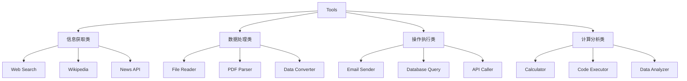
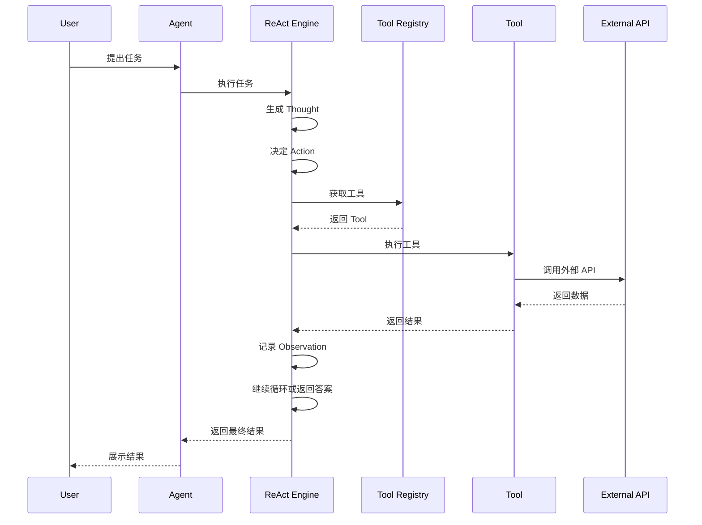

# Tools 系统设计与实现 - 让 Agent 拥有超能力

> 深入解析如何设计和实现强大的工具系统，扩展 Agent 的能力边界


## 📚 目录

- [为什么需要工具系统](#为什么需要工具系统)
- [工具系统的核心概念](#工具系统的核心概念)
- [工具接口设计](#工具接口设计)
- [工具注册与管理](#工具注册与管理)
- [内置工具详解](#内置工具详解)
- [自定义工具开发](#自定义工具开发)
- [工具调用流程](#工具调用流程)
- [安全与权限控制](#安全与权限控制)
- [性能优化策略](#性能优化策略)
- [测试与调试](#测试与调试)
- [最佳实践](#最佳实践)
- [实战案例](#实战案例)

---

## 为什么需要工具系统

### LLM 的局限性

**LLM 本身无法：**
- ❌ 访问实时信息（新闻、天气、股票）
- ❌ 执行实际操作（发送邮件、创建文件）
- ❌ 调用外部 API（数据库、第三方服务）
- ❌ 进行精确计算（复杂数学运算）
- ❌ 持久化存储数据

**类比理解：**

```
LLM 像一个博学但被困在房间里的人：
- 知识渊博（训练数据）
- 善于思考（推理能力）
- 但无法：
  - 上网查最新信息
  - 操作电脑文件
  - 打电话或发邮件
  - 使用计算器

工具系统就像给这个人开了窗户和门：
- 可以上网搜索（Search Tool）
- 可以操作文件（File Tool）
- 可以调用 API（API Tool）
- 可以使用计算器（Calculator Tool）
```

### 工具系统的价值

✅ **扩展能力边界**
- 从纯文本生成 → 真实世界交互
- 从静态知识 → 动态信息获取
- 从被动回答 → 主动执行任务

✅ **提高准确性**
- 实时数据 vs 训练数据
- 精确计算 vs 估算
- 权威来源 vs 模型生成

✅ **增强实用性**
- 自动化工作流
- 集成现有系统
- 解决实际问题

---

## 工具系统的核心概念

### 什么是 Tool？

**定义：** Tool 是 Agent 可以调用的外部功能模块，用于执行特定任务。

**核心要素：**

```typescript
interface Tool {
    // 1. 身份标识
    name: string;           // 工具名称
    
    // 2. 描述信息
    description: string;    // 功能描述
    
    // 3. 参数定义
    parameters: Schema;     // 输入参数结构
    
    // 4. 执行逻辑
    execute: Function;      // 执行函数
}
```

### 工具分类

**按功能分类：**



**按调用方式分类：**

| 类型 | 特点 | 示例 |
|------|------|------|
| 同步工具 | 立即返回结果 | Calculator, String Utils |
| 异步工具 | 需要等待 I/O | Web Search, API Call |
| 流式工具 | 持续输出 | Video Generator, Stream Processor |

---

## 工具接口设计

### 基础接口定义

`server/src/agent/types.ts`:

```typescript
/**
 * 工具参数 Schema
 * 使用 JSON Schema 格式定义参数结构
 */
export interface ToolParameterSchema {
    type: 'object';
    properties: Record<string, ParameterProperty>;
    required?: string[];
}

export interface ParameterProperty {
    type: 'string' | 'number' | 'boolean' | 'array' | 'object';
    description?: string;
    enum?: any[];
    default?: any;
    items?: ParameterProperty;  // 数组元素类型
    properties?: Record<string, ParameterProperty>;  // 对象属性
}

/**
 * 工具执行结果
 */
export interface ToolResult {
    success: boolean;
    data?: any;
    error?: string;
    metadata?: {
        duration?: number;      // 执行耗时（毫秒）
        source?: string;        // 数据来源
        timestamp?: Date;       // 时间戳
    };
}

/**
 * 工具接口
 */
export interface Tool {
    /**
     * 工具名称（唯一标识）
     * 命名规范：小写字母 + 下划线
     * 示例：web_search, file_read, send_email
     */
    readonly name: string;
    
    /**
     * 工具描述
     * 清晰说明工具的功能和使用场景
     * LLM 会根据描述决定是否使用此工具
     */
    readonly description: string;
    
    /**
     * 参数定义
     * 使用 JSON Schema 格式
     */
    readonly parameters: ToolParameterSchema;
    
    /**
     * 执行函数
     * @param input - 工具输入参数
     * @returns 执行结果
     */
    execute(input: any): Promise<ToolResult>;
    
    /**
     * 验证参数（可选）
     * 在执行前验证参数的有效性
     */
    validate?(input: any): ValidationResult;
}

export interface ValidationResult {
    valid: boolean;
    errors?: string[];
}
```

### 设计原则

**1. 单一职责（Single Responsibility）**

❌ **坏例子：** 一个工具做太多事情
```typescript
const badTool = {
    name: 'data_processor',
    description: '处理各种数据',  // 太模糊
    execute: (input) => {
        // 既能搜索，又能计算，还能发邮件...
    }
};
```

✅ **好例子：** 每个工具专注一件事
```typescript
const searchTool = {
    name: 'web_search',
    description: '在互联网上搜索信息',
    // 只做搜索
};

const calculatorTool = {
    name: 'calculator',
    description: '执行数学计算',
    // 只做计算
};
```

**2. 清晰的参数定义**

```typescript
// ✅ 清晰的参数定义
parameters: {
    type: 'object',
    properties: {
        query: {
            type: 'string',
            description: '搜索关键词，最多 100 个字符'
        },
        num_results: {
            type: 'number',
            description: '返回结果数量',
            default: 5,
            minimum: 1,
            maximum: 10
        }
    },
    required: ['query']
}
```

**3. 标准化的返回格式**

```typescript
// ✅ 统一的返回格式
{
    success: true,
    data: { /* 结果数据 */ },
    metadata: {
        duration: 234,
        source: 'google',
        timestamp: new Date()
    }
}

// ❌ 不规范的返回
"Here are the results..."  // 字符串
[{ title: "...", link: "..." }]  // 直接返回数组
```

**4. 错误处理**

```typescript
async execute(input: any): Promise<ToolResult> {
    try {
        // 执行逻辑
        const result = await doSomething(input);
        
        return {
            success: true,
            data: result
        };
    } catch (error) {
        // 捕获并格式化错误
        return {
            success: false,
            error: error.message,
            metadata: {
                timestamp: new Date()
            }
        };
    }
}
```

---

## 工具注册与管理

### 工具注册表实现

`server/src/tools/registry.ts`:

```typescript
import { Tool } from '../agent/types';

export class ToolRegistry {
    private tools: Map<string, Tool> = new Map();
    private categories: Map<string, string[]> = new Map();
    
    /**
     * 注册工具
     */
    register(tool: Tool, category = 'general'): void {
        // 验证工具名称唯一性
        if (this.tools.has(tool.name)) {
            throw new Error(`Tool "${tool.name}" already registered`);
        }
        
        // 验证工具完整性
        this.validateTool(tool);
        
        // 注册工具
        this.tools.set(tool.name, tool);
        
        // 添加到分类
        if (!this.categories.has(category)) {
            this.categories.set(category, []);
        }
        this.categories.get(category)!.push(tool.name);
        
        console.log(`✓ Tool registered: ${tool.name} (${category})`);
    }
    
    /**
     * 获取工具
     */
    get(name: string): Tool | undefined {
        return this.tools.get(name);
    }
    
    /**
     * 获取所有工具
     */
    getAll(): Tool[] {
        return Array.from(this.tools.values());
    }
    
    /**
     * 按分类获取工具
     */
    getByCategory(category: string): Tool[] {
        const names = this.categories.get(category) || [];
        return names.map(name => this.tools.get(name)!).filter(Boolean);
    }
    
    /**
     * 获取工具描述（用于 Prompt）
     */
    getDescription(): string {
        return this.getAll().map(tool => {
            const params = Object.keys(tool.parameters.properties).join(', ');
            return `- ${tool.name}(${params}): ${tool.description}`;
        }).join('\n');
    }
    
    /**
     * 转换为 OpenAI Function Calling 格式
     */
    toOpenAIFormat(): any[] {
        return this.getAll().map(tool => ({
            type: 'function' as const,
            function: {
                name: tool.name,
                description: tool.description,
                parameters: tool.parameters
            }
        }));
    }
    
    /**
     * 批量注册工具
     */
    registerMany(tools: Tool[], category = 'general'): void {
        tools.forEach(tool => this.register(tool, category));
    }
    
    /**
     * 注销工具
     */
    unregister(name: string): boolean {
        const deleted = this.tools.delete(name);
        
        if (deleted) {
            // 从分类中移除
            for (const [, names] of this.categories) {
                const index = names.indexOf(name);
                if (index > -1) {
                    names.splice(index, 1);
                }
            }
            
            console.log(`✓ Tool unregistered: ${name}`);
        }
        
        return deleted;
    }
    
    /**
     * 检查工具是否存在
     */
    has(name: string): boolean {
        return this.tools.has(name);
    }
    
    /**
     * 获取工具数量
     */
    count(): number {
        return this.tools.size;
    }
    
    /**
     * 验证工具完整性
     */
    private validateTool(tool: Tool): void {
        if (!tool.name) {
            throw new Error('Tool must have a name');
        }
        
        if (!tool.description) {
            throw new Error(`Tool "${tool.name}" must have a description`);
        }
        
        if (!tool.parameters) {
            throw new Error(`Tool "${tool.name}" must have parameters schema`);
        }
        
        if (typeof tool.execute !== 'function') {
            throw new Error(`Tool "${tool.name}" must have an execute function`);
        }
        
        // 验证名称格式
        if (!/^[a-z][a-z0-9_]*$/.test(tool.name)) {
            throw new Error(
                `Tool name "${tool.name}" must be lowercase with underscores`
            );
        }
    }
    
    /**
     * 导出工具配置（用于持久化）
     */
    exportConfig(): any {
        return {
            tools: this.getAll().map(tool => ({
                name: tool.name,
                description: tool.description,
                parameters: tool.parameters
            }))
        };
    }
    
    /**
     * 从配置导入工具（需要配合工厂函数）
     */
    importConfig(config: any, toolFactory: (name: string) => Tool): void {
        config.tools.forEach((toolConfig: any) => {
            const tool = toolFactory(toolConfig.name);
            if (tool) {
                this.register(tool);
            }
        });
    }
}
```

### 使用示例

```typescript
// 创建注册表
const registry = new ToolRegistry();

// 注册单个工具
registry.register(new SearchTool(), 'search');
registry.register(new CalculatorTool(), 'math');

// 批量注册
registry.registerMany([
    new WikipediaTool(),
    new WeatherTool(),
    new NewsTool()
], 'information');

// 获取工具
const searchTool = registry.get('web_search');

// 获取所有搜索类工具
const searchTools = registry.getByCategory('search');

// 获取描述（用于 Prompt）
console.log(registry.getDescription());
// 输出：
// - web_search(query, num_results): 在互联网上搜索信息
// - calculator(expression): 执行数学计算
// - wikipedia(query, language): 查询维基百科

// 转换为 OpenAI 格式
const openAITools = registry.toOpenAIFormat();
```

---

## 内置工具详解

### 1. Web Search Tool

**功能：** 在互联网上搜索最新信息

**实现：**

```typescript
import { Tool, ToolResult } from '../agent/types';

export class SearchTool implements Tool {
    readonly name = 'web_search';
    readonly description = '在互联网上搜索信息，获取最新的新闻、文章和数据。适用于需要了解时事、查找资料、验证信息等场景。';
    
    readonly parameters = {
        type: 'object' as const,
        properties: {
            query: {
                type: 'string',
                description: '搜索关键词或问题。应该具体明确，例如 "量子计算最新突破 2024" 而不是 "量子计算"'
            },
            num_results: {
                type: 'number',
                description: '返回结果数量，范围 1-10',
                default: 5,
                minimum: 1,
                maximum: 10
            },
            language: {
                type: 'string',
                description: '搜索结果语言',
                enum: ['zh', 'en', 'ja', 'ko'],
                default: 'zh'
            }
        },
        required: ['query']
    };
    
    async execute(input: { 
        query: string; 
        num_results?: number;
        language?: string;
    }): Promise<ToolResult> {
        const startTime = Date.now();
        const { query, num_results = 5, language = 'zh' } = input;
        
        try {
            // 使用 Serper API
            const response = await fetch('https://google.serper.dev/search', {
                method: 'POST',
                headers: {
                    'X-API-KEY': process.env.SERPER_API_KEY!,
                    'Content-Type': 'application/json'
                },
                body: JSON.stringify({
                    q: query,
                    num: num_results,
                    hl: language
                })
            });
            
            if (!response.ok) {
                throw new Error(`Search API error: ${response.statusText}`);
            }
            
            const data = await response.json();
            
            // 提取和组织结果
            const results = data.organic?.slice(0, num_results).map((result: any) => ({
                title: result.title,
                snippet: result.snippet,
                link: result.link,
                position: result.position
            })) || [];
            
            return {
                success: true,
                data: {
                    query,
                    results,
                    total_results: data.searchParameters?.totalResults || 0,
                    search_time: data.searchParameters?.timeTakenDisplay
                },
                metadata: {
                    duration: Date.now() - startTime,
                    source: 'Google Search via Serper',
                    timestamp: new Date()
                }
            };
            
        } catch (error) {
            return {
                success: false,
                error: `Search failed: ${error.message}`,
                metadata: {
                    duration: Date.now() - startTime,
                    timestamp: new Date()
                }
            };
        }
    }
}
```

**使用示例：**

```typescript
const result = await searchTool.execute({
    query: 'AI Agent 最新进展 2024',
    num_results: 3
});

// 返回：
{
    success: true,
    data: {
        query: "AI Agent 最新进展 2024",
        results: [
            {
                title: "2024年AI智能体发展综述",
                snippet: "本文回顾了2024年AI Agent领域的重大突破...",
                link: "https://example.com/article1",
                position: 1
            },
            // ...
        ],
        total_results: 1250000,
        search_time: "0.45秒"
    }
}
```

### 2. Wikipedia Tool

**功能：** 查询维基百科获取权威百科知识

```typescript
export class WikipediaTool implements Tool {
    readonly name = 'wikipedia';
    readonly description = '查询维基百科获取详细的百科知识和背景信息。适合了解概念、历史、人物、地点等事实性信息。';
    
    readonly parameters = {
        type: 'object' as const,
        properties: {
            query: {
                type: 'string',
                description: '要查询的主题或词条'
            },
            language: {
                type: 'string',
                description: '语言代码',
                enum: ['zh', 'en', 'ja', 'de', 'fr'],
                default: 'zh'
            },
            sections: {
                type: 'boolean',
                description: '是否返回章节列表',
                default: false
            }
        },
        required: ['query']
    };
    
    async execute(input: { 
        query: string; 
        language?: string;
        sections?: boolean;
    }): Promise<ToolResult> {
        const { query, language = 'zh', sections = false } = input;
        
        try {
            // 1. 搜索页面
            const searchResponse = await fetch(
                `https://${language}.wikipedia.org/w/api.php?action=query&list=search&srsearch=${encodeURIComponent(query)}&format=json&origin=*`
            );
            
            const searchData = await searchResponse.json();
            
            if (!searchData.query?.search?.length) {
                return {
                    success: false,
                    error: `未找到相关条目: ${query}`
                };
            }
            
            // 2. 获取页面详情
            const pageTitle = searchData.query.search[0].title;
            const contentResponse = await fetch(
                `https://${language}.wikipedia.org/w/api.php?action=query&titles=${encodeURIComponent(pageTitle)}&prop=extracts|info&exintro=true&explaintext=true&inurl=true&format=json&origin=*`
            );
            
            const contentData = await contentResponse.json();
            const pages = contentData.query.pages;
            const page = Object.values(pages)[0] as any;
            
            if (page.missing) {
                return {
                    success: false,
                    error: `页面不存在: ${pageTitle}`
                };
            }
            
            const result: any = {
                title: pageTitle,
                summary: page.extract?.substring(0, 2000),
                url: `https://${language}.wikipedia.org/wiki/${encodeURIComponent(pageTitle)}`,
                pageid: page.pageid
            };
            
            // 如果需要章节信息
            if (sections) {
                const sectionsResponse = await fetch(
                    `https://${language}.wikipedia.org/w/api.php?action=parse&page=${encodeURIComponent(pageTitle)}&prop=sections&format=json&origin=*`
                );
                
                const sectionsData = await sectionsResponse.json();
                result.sections = sectionsData.parse?.sections || [];
            }
            
            return {
                success: true,
                data: result,
                metadata: {
                    source: 'Wikipedia',
                    language,
                    timestamp: new Date()
                }
            };
            
        } catch (error) {
            return {
                success: false,
                error: `Wikipedia query failed: ${error.message}`
            };
        }
    }
}
```

### 3. Calculator Tool

**功能：** 执行精确的数学计算

```typescript
export class CalculatorTool implements Tool {
    readonly name = 'calculator';
    readonly description = '执行数学计算，支持加减乘除、幂运算、括号等。适用于需要精确计算的场景，如数据分析、财务计算等。';
    
    readonly parameters = {
        type: 'object' as const,
        properties: {
            expression: {
                type: 'string',
                description: '数学表达式，支持 +, -, *, /, ^, (), 例如: "(2 + 3) * 4^2"'
            },
            precision: {
                type: 'number',
                description: '小数精度（保留几位小数）',
                default: 2,
                minimum: 0,
                maximum: 10
            }
        },
        required: ['expression']
    };
    
    async execute(input: { expression: string; precision?: number }): Promise<ToolResult> {
        const { expression, precision = 2 } = input;
        
        try {
            // 安全检查：只允许数字和运算符
            if (!/^[\d\s+\-*/().^]+$/.test(expression)) {
                return {
                    success: false,
                    error: '表达式包含非法字符，只允许数字和运算符 (+, -, *, /, ^, ())'
                };
            }
            
            // 替换 ^ 为 **
            const sanitized = expression.replace(/\^/g, '**');
            
            // 安全计算
            const result = new Function(`return ${sanitized}`)();
            
            // 验证结果
            if (!isFinite(result)) {
                return {
                    success: false,
                    error: '计算结果无效（可能是除以零或溢出）'
                };
            }
            
            // 格式化结果
            const formattedResult = Number(result.toFixed(precision));
            
            return {
                success: true,
                data: {
                    expression,
                    result: formattedResult,
                    steps: this.generateSteps(expression, result)  // 可选：显示计算步骤
                }
            };
            
        } catch (error) {
            return {
                success: false,
                error: `计算失败: ${error.message}`
            };
        }
    }
    
    private generateSteps(expression: string, result: number): string[] {
        // 简化的步骤生成
        return [
            `表达式: ${expression}`,
            `结果: ${result}`
        ];
    }
}
```

### 4. File Operations Tool

**功能：** 读写文件，保存研究结果

```typescript
import fs from 'fs/promises';
import path from 'path';

export class FileTool implements Tool {
    readonly name = 'file_operations';
    readonly description = '读取和写入文件，用于保存研究结果、笔记和数据。支持 txt, md, json 格式。';
    
    readonly parameters = {
        type: 'object' as const,
        properties: {
            operation: {
                type: 'string',
                description: '操作类型',
                enum: ['read', 'write', 'append', 'list']
            },
            filepath: {
                type: 'string',
                description: '文件路径（相对于 ./data 目录）'
            },
            content: {
                type: 'string',
                description: '写入的内容（write 和 append 操作需要）'
            },
            format: {
                type: 'string',
                description: '文件格式',
                enum: ['txt', 'md', 'json'],
                default: 'txt'
            }
        },
        required: ['operation', 'filepath']
    };
    
    private readonly baseDir = path.resolve('./data');
    
    async execute(input: any): Promise<ToolResult> {
        const { operation, filepath, content, format = 'txt' } = input;
        
        try {
            // 安全检查
            const safePath = this.sanitizePath(filepath);
            
            switch (operation) {
                case 'read':
                    return await this.readFile(safePath);
                    
                case 'write':
                    if (!content) {
                        throw new Error('Content is required for write operation');
                    }
                    return await this.writeFile(safePath, content, format);
                    
                case 'append':
                    if (!content) {
                        throw new Error('Content is required for append operation');
                    }
                    return await this.appendFile(safePath, content);
                    
                case 'list':
                    return await this.listDirectory(safePath);
                    
                default:
                    throw new Error(`Unknown operation: ${operation}`);
            }
            
        } catch (error) {
            return {
                success: false,
                error: error.message
            };
        }
    }
    
    private async readFile(filepath: string): Promise<ToolResult> {
        const exists = await fs.access(filepath).then(() => true).catch(() => false);
        
        if (!exists) {
            return {
                success: false,
                error: `File not found: ${filepath}`
            };
        }
        
        const content = await fs.readFile(filepath, 'utf-8');
        
        return {
            success: true,
            data: {
                filepath,
                content,
                size: content.length
            }
        };
    }
    
    private async writeFile(filepath: string, content: string, format: string): Promise<ToolResult> {
        // 确保目录存在
        await fs.mkdir(path.dirname(filepath), { recursive: true });
        
        // 如果是 JSON 格式，验证并格式化
        let finalContent = content;
        if (format === 'json') {
            try {
                const parsed = JSON.parse(content);
                finalContent = JSON.stringify(parsed, null, 2);
            } catch {
                return {
                    success: false,
                    error: 'Invalid JSON format'
                };
            }
        }
        
        await fs.writeFile(filepath, finalContent, 'utf-8');
        
        return {
            success: true,
            data: {
                filepath,
                size: finalContent.length,
                message: 'File written successfully'
            }
        };
    }
    
    private async appendFile(filepath: string, content: string): Promise<ToolResult> {
        await fs.mkdir(path.dirname(filepath), { recursive: true });
        await fs.appendFile(filepath, '\n' + content, 'utf-8');
        
        return {
            success: true,
            data: {
                filepath,
                message: 'Content appended successfully'
            }
        };
    }
    
    private async listDirectory(dirpath: string): Promise<ToolResult> {
        const files = await fs.readdir(dirpath, { withFileTypes: true });
        
        const fileList = files.map(file => ({
            name: file.name,
            type: file.isDirectory() ? 'directory' : 'file',
            path: path.join(dirpath, file.name)
        }));
        
        return {
            success: true,
            data: {
                directory: dirpath,
                files: fileList,
                count: fileList.length
            }
        };
    }
    
    private sanitizePath(filepath: string): string {
        const resolved = path.resolve(this.baseDir, filepath);
        
        if (!resolved.startsWith(this.baseDir)) {
            throw new Error('Access denied: Path outside allowed directory');
        }
        
        return resolved;
    }
}
```

---

## 自定义工具开发

### 开发流程

**Step 1: 确定需求**

明确工具要解决的问题：
- 功能是什么？
- 输入什么？
- 输出什么？
- 有什么限制？

**Step 2: 设计接口**

```typescript
// 示例：天气查询工具
interface WeatherInput {
    city: string;        // 城市名称
    units?: 'c' | 'f';  // 温度单位
}

interface WeatherOutput {
    city: string;
    temperature: number;
    condition: string;
    humidity: number;
}
```

**Step 3: 实现工具**

```typescript
export class WeatherTool implements Tool {
    readonly name = 'get_weather';
    readonly description = '查询指定城市的当前天气信息，包括温度、湿度、天气状况等';
    
    readonly parameters = {
        type: 'object' as const,
        properties: {
            city: {
                type: 'string',
                description: '城市名称，如 "北京", "Shanghai"'
            },
            units: {
                type: 'string',
                description: '温度单位',
                enum: ['celsius', 'fahrenheit'],
                default: 'celsius'
            }
        },
        required: ['city']
    };
    
    async execute(input: { city: string; units?: string }): Promise<ToolResult> {
        // 实现逻辑
    }
}
```

**Step 4: 测试工具**

```typescript
describe('WeatherTool', () => {
    it('should return weather data', async () => {
        const tool = new WeatherTool();
        const result = await tool.execute({ city: 'Beijing' });
        
        expect(result.success).toBe(true);
        expect(result.data.temperature).toBeDefined();
    });
    
    it('should handle invalid city', async () => {
        const tool = new WeatherTool();
        const result = await tool.execute({ city: '' });
        
        expect(result.success).toBe(false);
    });
});
```

**Step 5: 注册工具**

```typescript
const registry = new ToolRegistry();
registry.register(new WeatherTool(), 'weather');
```

### 完整示例：GitHub API Tool

```typescript
export class GitHubTool implements Tool {
    readonly name = 'github_api';
    readonly description = '查询 GitHub 仓库信息，包括 stars、forks、issues 等统计数据';
    
    readonly parameters = {
        type: 'object' as const,
        properties: {
            owner: {
                type: 'string',
                description: '仓库所有者（用户名或组织名）'
            },
            repo: {
                type: 'string',
                description: '仓库名称'
            },
            action: {
                type: 'string',
                description: '操作类型',
                enum: ['info', 'issues', 'contributors'],
                default: 'info'
            }
        },
        required: ['owner', 'repo']
    };
    
    async execute(input: { 
        owner: string; 
        repo: string; 
        action?: string;
    }): Promise<ToolResult> {
        const { owner, repo, action = 'info' } = input;
        
        try {
            const headers = {
                'Accept': 'application/vnd.github.v3+json',
                ...(process.env.GITHUB_TOKEN && {
                    'Authorization': `token ${process.env.GITHUB_TOKEN}`
                })
            };
            
            let url: string;
            switch (action) {
                case 'info':
                    url = `https://api.github.com/repos/${owner}/${repo}`;
                    break;
                case 'issues':
                    url = `https://api.github.com/repos/${owner}/${repo}/issues?state=open`;
                    break;
                case 'contributors':
                    url = `https://api.github.com/repos/${owner}/${repo}/contributors`;
                    break;
                default:
                    throw new Error(`Unknown action: ${action}`);
            }
            
            const response = await fetch(url, { headers });
            
            if (!response.ok) {
                if (response.status === 404) {
                    return {
                        success: false,
                        error: `Repository not found: ${owner}/${repo}`
                    };
                }
                throw new Error(`GitHub API error: ${response.statusText}`);
            }
            
            const data = await response.json();
            
            return {
                success: true,
                data: {
                    owner,
                    repo,
                    action,
                    result: data
                },
                metadata: {
                    source: 'GitHub API',
                    timestamp: new Date()
                }
            };
            
        } catch (error) {
            return {
                success: false,
                error: `GitHub API call failed: ${error.message}`
            };
        }
    }
}
```

---

## 工具调用流程

### 完整调用链路



### 代码实现

```typescript
class ReActEngine {
    async run(task: string): Promise<string> {
        for (let i = 0; i < maxIterations; i++) {
            // 1. 生成 Thought 和 Action
            const step = await this.generateStep(task, history);
            
            // 2. 检查是否是最终答案
            if (step.finalAnswer) {
                return step.finalAnswer;
            }
            
            // 3. 执行工具
            if (step.action) {
                const tool = this.registry.get(step.action.tool);
                
                if (!tool) {
                    throw new Error(`Tool not found: ${step.action.tool}`);
                }
                
                // 4. 验证参数
                if (tool.validate) {
                    const validation = tool.validate(step.action.input);
                    if (!validation.valid) {
                        throw new Error(`Invalid parameters: ${validation.errors?.join(', ')}`);
                    }
                }
                
                // 5. 执行工具
                const result = await tool.execute(step.action.input);
                
                // 6. 记录观察结果
                step.observation = result;
                
                // 7. 如果失败，记录错误
                if (!result.success) {
                    console.error(`Tool execution failed: ${result.error}`);
                }
            }
        }
    }
}
```

---

## 安全与权限控制

### 安全风险

**1. 注入攻击**
```typescript
// ❌ 危险：直接拼接用户输入
const query = `SELECT * FROM users WHERE name = '${input}'`;

// ✅ 安全：使用参数化查询
const query = 'SELECT * FROM users WHERE name = ?';
db.execute(query, [input]);
```

**2. 路径遍历**
```typescript
// ❌ 危险：未验证路径
const filepath = './data/' + userInput;

// ✅ 安全：限制在指定目录
const safePath = path.resolve(baseDir, userInput);
if (!safePath.startsWith(baseDir)) {
    throw new Error('Access denied');
}
```

**3. 资源滥用**
```typescript
// ❌ 危险：无限制调用
await tool.execute(input);  // 可能被频繁调用

// ✅ 安全：添加速率限制
const rateLimiter = new RateLimiter({ maxRequests: 10, perMinutes: 1 });
await rateLimiter.consume();
await tool.execute(input);
```

### 安全措施实现

**1. 输入验证**

```typescript
class InputValidator {
    static validateString(input: string, maxLength = 1000): void {
        if (typeof input !== 'string') {
            throw new Error('Input must be a string');
        }
        
        if (input.length > maxLength) {
            throw new Error(`Input too long (max ${maxLength} characters)`);
        }
        
        // 检查危险字符
        if (/[\x00-\x08\x0B\x0C\x0E-\x1F]/.test(input)) {
            throw new Error('Input contains invalid characters');
        }
    }
    
    static validateNumber(input: number, min?: number, max?: number): void {
        if (typeof input !== 'number' || !isFinite(input)) {
            throw new Error('Input must be a valid number');
        }
        
        if (min !== undefined && input < min) {
            throw new Error(`Input must be >= ${min}`);
        }
        
        if (max !== undefined && input > max) {
            throw new Error(`Input must be <= ${max}`);
        }
    }
}
```

**2. 权限控制**

```typescript
interface ToolPermission {
    toolName: string;
    allowed: boolean;
    requiresAuth?: boolean;
    rateLimit?: {
        maxRequests: number;
        perSeconds: number;
    };
}

class PermissionManager {
    private permissions: Map<string, ToolPermission> = new Map();
    
    checkPermission(userId: string, toolName: string): boolean {
        const permission = this.permissions.get(toolName);
        
        if (!permission) {
            return false;
        }
        
        if (!permission.allowed) {
            return false;
        }
        
        if (permission.requiresAuth && !this.isAuthenticated(userId)) {
            return false;
        }
        
        return true;
    }
    
    setPermission(toolName: string, permission: ToolPermission): void {
        this.permissions.set(toolName, permission);
    }
}
```

**3. 沙箱执行**

对于代码执行等高风险操作，使用沙箱：

```typescript
import { VM } from 'vm2';

class SafeCodeExecutor {
    async execute(code: string): Promise<any> {
        const vm = new VM({
            timeout: 5000,  // 5秒超时
            sandbox: {
                // 只提供安全的 API
                console,
                Math
            }
        });
        
        try {
            return vm.run(code);
        } catch (error) {
            throw new Error(`Code execution failed: ${error.message}`);
        }
    }
}
```

---

## 性能优化策略

### 1. 缓存机制

```typescript
class CachedTool implements Tool {
    private cache = new Map<string, { data: any; timestamp: number }>();
    private ttl: number;  // 缓存有效期（毫秒）
    
    constructor(private innerTool: Tool, ttl = 300000) {  // 默认 5 分钟
        this.ttl = ttl;
    }
    
    async execute(input: any): Promise<ToolResult> {
        const cacheKey = JSON.stringify(input);
        
        // 检查缓存
        const cached = this.cache.get(cacheKey);
        if (cached && Date.now() - cached.timestamp < this.ttl) {
            console.log('Cache hit');
            return {
                ...cached.data,
                metadata: {
                    ...cached.data.metadata,
                    fromCache: true
                }
            };
        }
        
        // 执行并缓存
        const result = await this.innerTool.execute(input);
        
        if (result.success) {
            this.cache.set(cacheKey, {
                data: result,
                timestamp: Date.now()
            });
        }
        
        return result;
    }
}

// 使用
const cachedSearch = new CachedTool(new SearchTool(), 60000);  // 1分钟缓存
```

### 2. 并行执行

```typescript
// 如果多个工具调用互不依赖，可以并行
const results = await Promise.all([
    searchTool.execute({ query: 'AI trends' }),
    weatherTool.execute({ city: 'Beijing' }),
    newsTool.execute({ topic: 'technology' })
]);
```

### 3. 懒加载

```typescript
class LazyToolLoader {
    private toolCache = new Map<string, Tool>();
    
    getTool(name: string): Tool {
        if (!this.toolCache.has(name)) {
            // 按需加载
            const tool = this.loadTool(name);
            this.toolCache.set(name, tool);
        }
        
        return this.toolCache.get(name)!;
    }
    
    private loadTool(name: string): Tool {
        switch (name) {
            case 'web_search':
                return new SearchTool();
            case 'wikipedia':
                return new WikipediaTool();
            // ...
            default:
                throw new Error(`Unknown tool: ${name}`);
        }
    }
}
```

### 4. 批量处理

```typescript
class BatchProcessor {
    private queue: Array<{ input: any; resolve: Function; reject: Function }> = [];
    private processing = false;
    
    async add(input: any): Promise<any> {
        return new Promise((resolve, reject) => {
            this.queue.push({ input, resolve, reject });
            
            if (!this.processing) {
                this.process();
            }
        });
    }
    
    private async process(): Promise<void> {
        this.processing = true;
        
        while (this.queue.length > 0) {
            const batch = this.queue.splice(0, 5);  // 每批 5 个
            
            const results = await Promise.all(
                batch.map(item => 
                    this.innerTool.execute(item.input)
                        .then(item.resolve)
                        .catch(item.reject)
                )
            );
        }
        
        this.processing = false;
    }
}
```

---

## 测试与调试

### 单元测试

```typescript
import { describe, it, expect, beforeEach } from 'vitest';
import { SearchTool } from '../tools/search';

describe('SearchTool', () => {
    let tool: SearchTool;
    
    beforeEach(() => {
        tool = new SearchTool();
    });
    
    it('should have correct metadata', () => {
        expect(tool.name).toBe('web_search');
        expect(tool.description).toBeDefined();
        expect(tool.parameters).toBeDefined();
    });
    
    it('should validate parameters', () => {
        expect(() => {
            tool.execute({});  // 缺少必需参数
        }).rejects.toThrow();
    });
    
    it('should return search results', async () => {
        const result = await tool.execute({
            query: 'test query',
            num_results: 3
        });
        
        expect(result.success).toBe(true);
        expect(result.data.results).toBeDefined();
        expect(result.data.results.length).toBeLessThanOrEqual(3);
    });
    
    it('should handle API errors gracefully', async () => {
        // Mock failed API call
        const result = await tool.execute({
            query: 'invalid query that causes error'
        });
        
        expect(result.success).toBe(false);
        expect(result.error).toBeDefined();
    });
});
```

### 集成测试

```typescript
describe('Tool Integration', () => {
    it('should work with ReAct engine', async () => {
        const registry = new ToolRegistry();
        registry.register(new CalculatorTool());
        
        const engine = new ReActEngine({
            llm: mockLLM,
            tools: registry,
            memory: mockMemory
        });
        
        const result = await engine.run('计算 2 + 2');
        
        expect(result).toContain('4');
    });
});
```

### 调试技巧

**1. 详细日志**

```typescript
class DebuggableTool implements Tool {
    async execute(input: any): Promise<ToolResult> {
        console.log(`[Tool:${this.name}] Input:`, input);
        
        const startTime = Date.now();
        const result = await this.innerExecute(input);
        const duration = Date.now() - startTime;
        
        console.log(`[Tool:${this.name}] Output:`, result);
        console.log(`[Tool:${this.name}] Duration: ${duration}ms`);
        
        return result;
    }
}
```

**2. 监控指标**

```typescript
class MonitoredTool implements Tool {
    private metrics = {
        calls: 0,
        successes: 0,
        failures: 0,
        totalDuration: 0
    };
    
    async execute(input: any): Promise<ToolResult> {
        const startTime = Date.now();
        this.metrics.calls++;
        
        try {
            const result = await this.innerTool.execute(input);
            
            if (result.success) {
                this.metrics.successes++;
            } else {
                this.metrics.failures++;
            }
            
            return result;
        } finally {
            this.metrics.totalDuration += Date.now() - startTime;
        }
    }
    
    getMetrics() {
        return {
            ...this.metrics,
            averageDuration: this.metrics.totalDuration / this.metrics.calls
        };
    }
}
```

---

## 最佳实践

### 设计原则

✅ **DO:**
- 每个工具只做一件事
- 提供清晰的描述和参数文档
- 处理所有可能的错误情况
- 返回标准化的结果格式
- 添加适当的日志和监控
- 实现缓存和性能优化
- 编写全面的测试

❌ **DON'T:**
- 不要在一个工具中混合多个功能
- 不要忽略错误处理
- 不要返回非结构化数据
- 不要暴露敏感信息
- 不要假设输入总是有效的
- 不要忘记安全性检查

### 命名规范

```typescript
// ✅ 好的命名
web_search
file_read
send_email
get_weather
calculate_sum

// ❌ 坏的命名
search
tool1
doStuff
handler
```

### 文档规范

```typescript
/**
 * 工具名称：web_search
 * 
 * 功能描述：
 * 在互联网上搜索最新信息，返回相关的网页链接和摘要。
 * 
 * 使用场景：
 * - 需要了解时事新闻
 * - 查找特定主题的资料
 * - 验证实时信息
 * 
 * 参数说明：
 * - query (必填): 搜索关键词，应该具体明确
 * - num_results (可选): 返回结果数量，默认 5，范围 1-10
 * - language (可选): 搜索结果语言，默认中文
 * 
 * 返回格式：
 * {
 *   success: boolean,
 *   data: {
 *     query: string,
 *     results: Array<{title, snippet, link}>,
 *     total_results: number
 *   }
 * }
 * 
 * 注意事项：
 * - 每次调用消耗 API quota
 * - 结果可能有延迟
 * - 某些关键词可能被过滤
 */
```

---

## 实战案例

### 案例 1：研究助手工具集

```typescript
// 为研究助手创建专用工具集
class ResearchToolKit {
    static create(): ToolRegistry {
        const registry = new ToolRegistry();
        
        // 信息获取
        registry.registerMany([
            new SearchTool(),
            new WikipediaTool(),
            new ScholarTool(),      // 学术论文搜索
            new NewsTool()          // 新闻聚合
        ], 'research');
        
        // 数据处理
        registry.registerMany([
            new PDFReaderTool(),
            new CSVParserTool(),
            new DataAnalyzerTool()
        ], 'analysis');
        
        // 结果输出
        registry.registerMany([
            new FileTool(),
            new MarkdownGeneratorTool(),
            new CitationTool()      // 生成引用
        ], 'output');
        
        return registry;
    }
}
```

### 案例 2：电商客服工具集

```typescript
class CustomerServiceToolKit {
    static create(): ToolRegistry {
        const registry = new ToolRegistry();
        
        registry.registerMany([
            new OrderLookupTool(),      // 查询订单
            new ProductSearchTool(),    // 搜索商品
            new ReturnProcessorTool(),  // 处理退货
            new EmailSenderTool(),      // 发送邮件
            new TicketCreatorTool()     // 创建工单
        ], 'customer_service');
        
        return registry;
    }
}
```

---

## 总结

### 核心要点回顾

✅ **工具系统的重要性**
- 扩展 Agent 能力边界
- 连接虚拟与现实世界
- 提高准确性和实用性

✅ **设计原则**
- 单一职责
- 清晰接口
- 标准化格式
- 完善错误处理

✅ **关键组件**
- Tool 接口定义
- ToolRegistry 管理
- 内置工具实现
- 自定义工具开发

✅ **安全与性能**
- 输入验证
- 权限控制
- 缓存优化
- 监控调试

### 下一步

**学习路径：**
1. ✅ 理解工具系统概念
2. ✅ 掌握工具开发方法
3. 📖 阅读下一篇：Memory and Planning
4. 🔧 实践：开发自己的工具

**实践项目：**
- 为你的 Agent 添加 3 个新工具
- 实现工具缓存机制
- 编写完整的测试套件
- 创建工具文档

**进阶主题：**
- 动态工具加载
- 工具组合与编排
- 自动工具发现
- 工具市场生态

---

## 参考资料

- [OpenAI Function Calling](https://platform.openai.com/docs/guides/function-calling)
- [LangChain Tools](https://python.langchain.com/docs/modules/agents/tools/)
- [JSON Schema](https://json-schema.org/)
- [Tool Use in AI Agents](https://arxiv.org/abs/2302.04761)

**下一篇预告**: 《Memory 与 Planning：让 Agent 更智能》

我们将深入探讨如何让 Agent 拥有记忆能力和规划能力，使其更加智能和自主。敬请期待！
