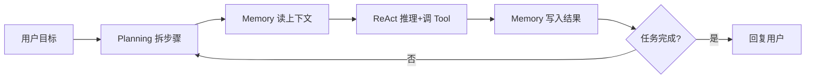
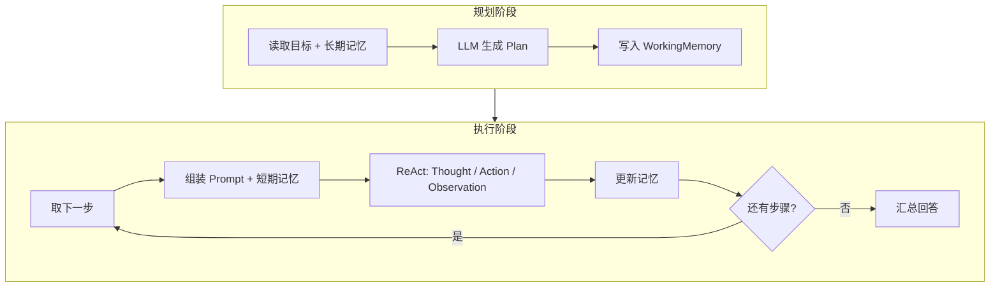

# Memory 与 Planning：让 Agent 更智能

> 在 [Tools 系统](./09-tools-system-design.md) 之上，补齐记忆与规划，让 Agent 能「记住」并「分步执行」

## 📚 目录

- [为什么 Tools 还不够](#为什么-tools-还不够)
- [记忆系统怎么分层](#记忆系统怎么分层)
- [规划器怎么工作](#规划器怎么工作)
- [与 ReAct、Tools 如何配合](#与-reacttools-如何配合)
- [实战：统一 Memory 模块](#实战统一-memory-模块)
- [实战：Planner + 动态重规划](#实战planner--动态重规划)
- [常见坑与选型建议](#常见坑与选型建议)
- [系列导航](#系列导航)

---

## 为什么 Tools 还不够

[上一篇](./09-tools-system-design.md) 解决的是：**Agent 能调用外部能力**（搜索、计算、读写文件等）。

但真实任务往往还需要两件事：

1. **记忆**：多轮对话里记住用户偏好、上一轮工具结果、长期知识。
2. **规划**：复杂目标要先拆步骤，执行中根据结果调整计划。

没有记忆，Agent 每轮都像「第一次见面」；没有规划，容易在复杂任务里乱试工具或漏步骤。



架构层面的组件关系在 [《深入理解 AI Agent 架构》](./07-ai-agent-architecture.md) 已有介绍；[《构建你的第一个 AI Agent》](./08-build-first-agent.md) 里用 SQLite 做过对话历史。本文聚焦：**如何把记忆和规划接到你已有的 Tool Registry 上**。

---

## 记忆系统怎么分层

### 三类记忆

| 类型 | 存什么 | 典型实现 | 生命周期 |
|------|--------|----------|----------|
| 短期记忆 | 当前会话消息、最近 Tool 输出 | 内存数组 / SQLite 消息表 | 单次会话 |
| 长期记忆 | 用户偏好、领域知识、历史结论 | 向量库 + 元数据 | 跨会话 |
| 工作记忆 | 当前任务计划、中间变量 | JSON 状态对象 | 单次任务 |

### 短期记忆：对话与 Tool 轨迹

在 [08-build-first-agent](./08-build-first-agent.md) 的 `SQLiteMemory` 基础上，建议把 **Tool 调用也写入历史**，方便 LLM 理解「上一步搜到了什么」：

```typescript
interface MemoryMessage {
    role: 'user' | 'assistant' | 'system' | 'tool';
    content: string;
    toolName?: string;
    timestamp: number;
}

class ShortTermMemory {
    private messages: MemoryMessage[] = [];
    private maxMessages: number;

    constructor(maxMessages = 30) {
        this.maxMessages = maxMessages;
    }

    add(message: MemoryMessage): void {
        this.messages.push(message);
        if (this.messages.length > this.maxMessages) {
            this.messages = this.messages.slice(-this.maxMessages);
        }
    }

    getMessages(): MemoryMessage[] {
        return [...this.messages];
    }

    toPromptContext(): string {
        return this.messages
            .map((m) => {
                if (m.role === 'tool') {
                    return `[Tool:${m.toolName}] ${m.content}`;
                }
                return `${m.role}: ${m.content}`;
            })
            .join('\n');
    }
}
```

### 长期记忆：语义检索

需要「上个月用户说过喜欢 TypeScript」这类信息时，用 Embedding + 向量检索（与博客 [RAG 检索](./rag-blog-knowledge-search.md) 同一套思路，但索引的是 **Agent 记忆条目** 而非全文博客）：

```typescript
interface MemoryRecord {
    id: string;
    content: string;
    metadata: {
        userId?: string;
        topic?: string;
        source?: 'user' | 'agent' | 'tool';
    };
    createdAt: number;
}

class LongTermMemory {
    constructor(
        private embed: (text: string) => Promise<number[]>,
        private vectorStore: {
            upsert(id: string, vector: number[], payload: MemoryRecord): Promise<void>;
            query(vector: number[], topK: number): Promise<MemoryRecord[]>;
        }
    ) {}

    async remember(content: string, metadata: MemoryRecord['metadata']): Promise<void> {
        const id = crypto.randomUUID();
        const vector = await this.embed(content);
        await this.vectorStore.upsert(id, vector, {
            id,
            content,
            metadata,
            createdAt: Date.now(),
        });
    }

    async recall(query: string, topK = 5): Promise<MemoryRecord[]> {
        const vector = await this.embed(query);
        return this.vectorStore.query(vector, topK);
    }
}
```

**写入时机**：用户明确偏好、Agent 总结的结论、Tool 返回的关键事实（需过滤噪声，避免把整页 HTML 都塞进长期记忆）。

### 工作记忆：当前任务状态

规划与执行共享一块「白板」：

```typescript
interface WorkingState {
    goal: string;
    plan?: Plan;
    currentStepId?: number;
    variables: Record<string, unknown>;
    toolResults: Record<string, unknown>;
}

class WorkingMemory {
    private state: WorkingState;

    constructor(goal: string) {
        this.state = { goal, variables: {}, toolResults: {} };
    }

    setPlan(plan: Plan): void {
        this.state.plan = plan;
    }

    setStepResult(stepId: number, result: unknown): void {
        this.state.toolResults[String(stepId)] = result;
    }

    snapshot(): WorkingState {
        return JSON.parse(JSON.stringify(this.state));
    }
}
```

---

## 规划器怎么工作

### Plan-and-Execute 与 ReAct 的分工

| 模式 | 适合 | 与 Memory 的关系 |
|------|------|------------------|
| ReAct | 探索型、路径不确定 | 每步读写短期记忆 |
| Plan-and-Execute | 步骤清晰、可并行 | 计划存工作记忆，按步执行 |

复杂任务可 **先 Plan 再 ReAct**：Planner 输出步骤列表，Executor 对每一步跑 ReAct 循环（选用 [09](./09-tools-system-design.md) 里的 Tool）。



### Plan 的数据结构

```typescript
interface PlanStep {
    id: number;
    description: string;
    dependsOn: number[];
    suggestedTool?: string;
    status: 'pending' | 'running' | 'done' | 'failed';
}

interface Plan {
    goal: string;
    steps: PlanStep[];
}
```

### 生成计划的 Prompt 要点

- 输入：用户目标 + `LongTermMemory.recall` 的相关条目 + 可用 Tool 列表（来自 Tool Registry）。
- 输出：严格 JSON，步骤数建议 3～8，避免过大计划难以执行。
- 约束：每步对应一个可验证结果（「搜索 X」「写入文件 Y」），不要写「做好整个项目」。

---

## 与 ReAct、Tools 如何配合

推荐执行顺序（单轮用户请求内）：

1. `longTerm.recall(userMessage)` → 拼进 system prompt。
2. `planner.createPlan(goal, tools)` → `working.setPlan(plan)`。
3. 对每个 `pending` 且依赖已满足的 step：
   - `shortTerm.add({ role: 'system', content: '当前步骤: ...' })`
   - 跑 ReAct（内部调用 [ToolRegistry](./09-tools-system-design.md)）
   - `shortTerm.add({ role: 'tool', ... })`，`working.setStepResult(id, result)`
   - 若失败 → `planner.adjustPlan(plan, error)` 重规划
4. 全部完成后，用短期记忆摘要生成最终回复；可选 `longTerm.remember(summary)`。

```typescript
async function runAgentTurn(
    userMessage: string,
    deps: {
        shortTerm: ShortTermMemory;
        longTerm: LongTermMemory;
        working: WorkingMemory;
        planner: Planner;
        reactEngine: ReactEngine;
        tools: ToolRegistry;
    }
): Promise<string> {
    deps.shortTerm.add({ role: 'user', content: userMessage });

    const recalled = await deps.longTerm.recall(userMessage, 3);
    const plan = await deps.planner.createPlan(userMessage, {
        memories: recalled.map((m) => m.content),
        tools: deps.tools.list(),
    });
    deps.working.setPlan(plan);

    for (const step of plan.steps) {
        if (!deps.planner.canRun(step, plan)) continue;
        step.status = 'running';

        const stepResult = await deps.reactEngine.run({
            goal: step.description,
            tools: deps.tools,
            context: deps.shortTerm.toPromptContext(),
        });

        step.status = stepResult.ok ? 'done' : 'failed';
        deps.working.setStepResult(step.id, stepResult.output);
        deps.shortTerm.add({
            role: 'tool',
            content: String(stepResult.output),
            toolName: step.suggestedTool,
            timestamp: Date.now(),
        });

        if (step.status === 'failed') {
            const adjusted = await deps.planner.adjustPlan(plan, stepResult.error);
            deps.working.setPlan(adjusted);
        }
    }

    return deps.reactEngine.summarize(deps.shortTerm.getMessages());
}
```

---

## 实战：统一 Memory 模块

把三类记忆收到一个门面类，Agent 主流程只依赖 `AgentMemory`：

```typescript
class AgentMemory {
    constructor(
        public short: ShortTermMemory,
        public long: LongTermMemory,
        public working: WorkingMemory
    ) {}

    async buildSystemPrefix(userQuery: string): Promise<string> {
        const recalled = await this.long.recall(userQuery, 5);
        const memoryBlock =
            recalled.length === 0
                ? ''
                : `相关历史记忆：\n${recalled.map((r) => `- ${r.content}`).join('\n')}\n\n`;

        return memoryBlock + this.short.toPromptContext();
    }

    onTurnEnd(summary: string, userId?: string): Promise<void> {
        return this.long.remember(summary, { userId, source: 'agent' });
    }
}
```

与 [08](./08-build-first-agent.md) 的 `ResearchAgent` 集成时，在构造函数里注入 `AgentMemory`，替换原先单一的 SQLite 对话表即可。

---

## 实战：Planner + 动态重规划

当某步 Tool 失败或 Observation 与预期不符时，不要死磕原 Plan：

```typescript
class Planner {
    async adjustPlan(plan: Plan, feedback: string): Promise<Plan> {
        const prompt = `
你是任务规划器。根据反馈修订计划，保留已完成步骤，只修改未完成或失败部分。

原计划：${JSON.stringify(plan)}
反馈：${feedback}

返回完整 JSON Plan，steps 含 id、description、dependsOn、suggestedTool、status。
`;
        const raw = await this.llm.generate(prompt);
        return JSON.parse(raw) as Plan;
    }

    canRun(step: PlanStep, plan: Plan): boolean {
        if (step.status !== 'pending') return false;
        return step.dependsOn.every((depId) => {
            const dep = plan.steps.find((s) => s.id === depId);
            return dep?.status === 'done';
        });
    }
}
```

**重规划触发条件建议：**

- Tool 返回 `success: false`
- 连续 2 次相同 Action（可能陷入循环）
- 单步超过 N 次 ReAct 迭代仍未 `Final Answer`

---

## 常见坑与选型建议

### 记忆

- **上下文爆炸**：短期记忆务必设上限；超长会话用「滚动摘要」把旧消息压成一段 summary 再保留最近 K 条。
- **什么都进长期记忆**：只存可复用事实，Tool 原始 HTML 应先摘要再 `remember`。
- **多用户混用**：`metadata.userId` / `sessionId` 必须隔离。

### 规划

- **计划过大**：一步一个 Tool 调用为宜。
- **从不重规划**：环境变化时原 Plan 会失效，要有 `adjustPlan`。
- **与 ReAct 重复造轮子**：规划负责「做什么」，ReAct 负责「怎么做、调哪个 Tool」。

### 存储选型（简表）

| 场景 | 短期 | 长期 |
|------|------|------|
| 本地原型 | 内存 / SQLite | Chroma 本地 |
| 个人博客级 Agent | SQLite | Upstash Vector（见 [RAG 文](./rag-blog-knowledge-search.md)） |
| 生产多租户 | Redis + DB | 托管向量库 + 行级隔离 |

---

## 系列导航

**总索引：** [AI Agent 系列首页](./README.md)

**Agent 系列（建议阅读顺序）：**

1. [深入理解 AI Agent 架构](./07-ai-agent-architecture.md)
2. [构建你的第一个 AI Agent](./08-build-first-agent.md)
3. [Tools 系统设计与实现](./09-tools-system-design.md)
4. **本文：Memory 与 Planning**
5. [给个人博客加上 RAG 知识库检索](./rag-blog-knowledge-search.md)（向量检索实战）
6. [RAG 进阶](./11-advanced-rag-patterns.md) · [多智能体](./12-multi-agent-systems.md) · [Memory 进阶](./13-advanced-memory.md) · [WebAI](./14-webai-and-edge-inference.md)
7. [LangChain.js 生态](./15-langchain-js-guide.md) · [专系列](./langchain/README.md) · [LangGraph 专系列](./langgraph/README.md)
8. [17～26 产品化与扩展](./17-build-production-chatbot-ui.md) · [**系列总索引**](./README.md)

**主线 Phase 1 完结；Phase 2 见 20～24。**

---

## 参考资料

- [Generative Agents (Memory 设计)](https://arxiv.org/abs/2304.03442)
- [Plan-and-Solve Prompting](https://arxiv.org/abs/2304.05128)
- [LangChain Memory](https://python.langchain.com/docs/modules/memory/)
- [OpenAI Assistants API Threads](https://platform.openai.com/docs/assistants/overview)
