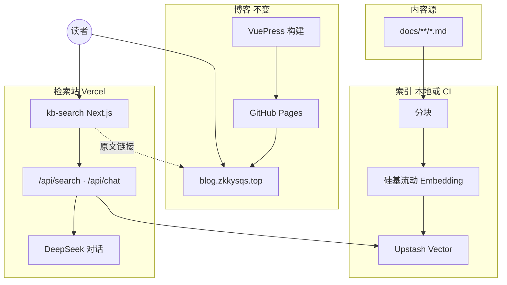

# 给个人博客加上 RAG 知识库检索：从索引到 Vercel 部署的完整记录

博客写了几年，`docs/` 下积累了两三百篇 Markdown。VuePress 自带搜索和 Algolia 都能做关键词匹配，但经常遇到这种情况：只记得写过「事件循环和 Fiber 的关系」，想不起标题和目录位置，搜关键词也未必命中。在开始系统学 AI 系列之后，这个问题更明显。

这篇文章记录我如何在**不改动现有 GitHub Pages 部署**的前提下，用 RAG 给博客加了一套语义检索，以及部署后的访问方式。

**在线检索入口**：[https://keekuun-blog-search.vercel.app/](https://keekuun-blog-search.vercel.app/)  
**博客正文站点**：[https://blog.zkkysqs.top/](https://blog.zkkysqs.top/)（顶栏已增加「AI 检索」导航）


[]([https://keekuun-blog-search.vercel.app/)

---

## 目录

- [要解决什么问题](#要解决什么问题)
- [整体架构](#整体架构)
- [技术选型与分工](#技术选型与分工)
- [仓库里的实现结构](#仓库里的实现结构)
- [索引流水线：从 Markdown 到向量](#索引流水线从-markdown-到向量)
- [检索站点：Next.js + API](#检索站点nextjs--api)
- [部署与运维](#部署与运维)
- [实际踩过的坑](#实际踩过的坑)
- [成本与维护节奏](#成本与维护节奏)
- [还可以怎么改](#还可以怎么改)
- [相关链接与仓库路径](#相关链接与仓库路径)

---

## 要解决什么问题

需求可以拆成三点：

1. **语义检索**：用自然语言提问，返回博客里最相关的段落，并带上原文链接。
2. **与博客发布解耦**：VuePress 继续走 GitHub Actions → `gh-pages`，不为了 RAG 迁移整站。
3. **随时可查**：检索服务单独部署，手机浏览器也能打开。

没有做成「站内嵌一个大模型对话框」，而是独立子站 + 博客导航入口。这样职责清晰：博客负责阅读，检索站负责「找段落」和可选的「AI 归纳」。

---

## 整体架构



数据流分两条线：

- **发布线**：改文章 → push `master` → 构建 VuePress → 更新 GitHub Pages。
- **索引线**：改 `docs/` 下 Markdown → 跑索引脚本（或 CI 自动跑）→ 更新 Upstash 向量库。检索站只读向量库，一般**不用**因为改文章而重新部署 Vercel。

---

## 技术选型与分工

| 环节 | 选用 | 原因 |
|------|------|------|
| 向量库 | [Upstash Vector](https://upstash.com/docs/vector) | Serverless，和 Vercel 搭配简单，无需自建 Milvus |
| 向量化 | 硅基流动 `BAAI/bge-m3`（1024 维） | DeepSeek 暂无官方 Embedding API；中文技术文效果够用 |
| 对话归纳 | [DeepSeek](https://platform.deepseek.com) API | OpenAI 兼容，检索站「AI 总结」模式使用 |
| 检索前端 | Next.js 14（`apps/kb-search`） | App Router + API Route，部署到 Vercel 省事 |
| 索引脚本 | Node ESM（`tools/rag`） | 与博客共用仓库，本地和 CI 都能跑 |
| 博客 | VuePress 1.x + GitHub Pages | 现有方案，未动 |

Embedding 和对话拆成两个厂商，是能力边界决定的，不是刻意堆栈。索引阶段只依赖硅基流动；只有用户点击「AI 总结」时才请求 DeepSeek。

---

## 仓库里的实现结构

在 `keekuun.github.io` 仓库里增加了两块，与 VuePress 的 `docs/` 并列：

```text
keekuun.github.io/
├── docs/                    # 原有 VuePress 内容（被索引）
├── tools/rag/               # 索引：扫描、分块、Embedding、写入 Upstash
│   ├── index.mjs
│   ├── lib/chunk.mjs
│   ├── lib/embed.mjs
│   └── lib/load-env.mjs
├── apps/kb-search/          # 检索站：Next.js
│   ├── app/page.tsx
│   ├── app/api/search/route.ts
│   ├── app/api/chat/route.ts
│   └── lib/vector.ts
└── .github/workflows/rag-index.yml   # docs 变更时自动重建索引
```

根目录 `package.json` 里加了快捷命令：

```bash
pnpm rag:index      # 全量索引
pnpm rag:index:dry  # 只统计分块数量
pnpm kb:dev         # 本地启动检索站
```

更细的运维说明见仓库内 `tools/rag/README.md` 与 `apps/kb-search/README.md`。

---

## 索引流水线：从 Markdown 到向量

### 扫描范围

当前只索引 `docs/**/*.md`，排除 `.vuepress` 构建目录。根目录的 `faq/`、`study/` 未纳入——它们不在 VuePress 站点路由里，进了索引也链不回线上文章。

一次全量扫描约 **346 篇** 文章，按标题与段落切分后约 **5200+** 个 chunk（块大小约 1200 字，带少量重叠）。

### 分块策略

实现见 `tools/rag/lib/chunk.mjs`：

- 优先按 Markdown 二、三级标题切段；
- 单段超过上限再按字符切，并保留约 100 字重叠，避免句子正好被截断在块边界；
- 过滤过短片段（少于约 80 字），减少噪声向量。

每块写入 Upstash 时附带元数据：`path`、`title`、`heading`、`url`（对应 `https://blog.zkkysqs.top/...html`）、`category`、`preview`（前 400 字，供列表展示）。

### 向量化与写入

- 模型：`BAAI/bge-m3`，向量维度 **1024**。Upstash 建 Index 时 `Dimensions` 必须一致；我最初按 OpenAI `text-embedding-3-small` 的 1536 建库，全量索引跑完后写入报错，才改为新建 1024 维 Index 重跑。
- 请求方式：硅基流动对**数组批量** Embedding 限制较严（单条约 512 token、每批最多 32 条），长文容易 400。最终改为**单条请求 + 有限并发**，并对 base64 图片、超长代码块做清洗。
- 全量重建：环境变量 `RAG_RESET_INDEX=1` 时先 `reset` 再 upsert，避免旧文章删除后留下脏向量。

本地执行：

```bash
cd tools/rag
cp .env.example .env
# 配置 UPSTASH_*、SILICONFLOW_API_KEY
pnpm install
pnpm check-env   # 建议先跑，验证 Key 和向量维度
pnpm index
```

环境变量也可写在 `apps/kb-search/.env.local`，索引脚本会合并读取，不必维护两份 Key。

### CI 自动索引

`.github/workflows/rag-index.yml` 在 `master` 分支 `docs/**/*.md` 变更时触发，Secrets 需配置：

- `UPSTASH_VECTOR_REST_URL` / `UPSTASH_VECTOR_REST_TOKEN`
- `SILICONFLOW_API_KEY`

博客部署 workflow 与索引 workflow 分开，互不影响。

---

## 检索站点：Next.js + API

部署地址：**[https://keekuun-blog-search.vercel.app/](https://keekuun-blog-search.vercel.app/)**

### 两种查询模式

1. **相关片段**：仅向量检索 Top-K，返回段落预览与博客链接，不调用大模型，延迟低、无对话费用。
2. **AI 总结**：先检索，再把片段拼进 prompt，由 DeepSeek 生成中文回答，并要求标注引用序号。

对应接口：

- `GET /api/search?q=...`
- `POST /api/chat`，body `{ "query": "..." }`

### 前端

`apps/kb-search` 使用 App Router。结果列表和 AI 回答的正文来自 Markdown chunk，用 `react-markdown` + `remark-gfm` 渲染，避免满屏未解析的 `` ` `` 和表格源码。

可选环境变量 `KB_SEARCH_PASSWORD`：设置后需在请求头带 `x-kb-password`，页面提供密码输入框，避免检索站被公开滥用。

### 与博客的衔接

`docs/.vuepress/config/navConfig.js` 增加导航项，指向检索站：

```javascript
{
  text: '知识库',
  icon: 'reco-search',
  link: 'https://keekuun-blog-search.vercel.app/',
},
```

线上路径与索引元数据中的 URL 规则一致：`docs/frontEnd/JS/8.es6-promise.md` → `/frontEnd/JS/8.es6-promise.html`。

---

## 部署与运维

### Vercel（检索站）

1. 导入 GitHub 仓库，**Root Directory** 填 `apps/kb-search`。
2. 配置环境变量（与本地 `.env.local` 一致）：

| 变量 | 说明 |
|------|------|
| `UPSTASH_VECTOR_REST_URL` | 与索引相同 |
| `UPSTASH_VECTOR_REST_TOKEN` | 与索引相同 |
| `SILICONFLOW_API_KEY` | 查询时生成问题向量 |
| `DEEPSEEK_API_KEY` | AI 总结 |
| `DEEPSEEK_CHAT_MODEL` | 如 `deepseek-chat` |
| `EMBEDDING_MODEL` | `BAAI/bge-m3` |
| `NEXT_PUBLIC_BLOG_BASE_URL` | `https://blog.zkkysqs.top` |
| `KB_SEARCH_PASSWORD` | 可选 |

3. 部署完成后访问上述 Vercel 域名；需要时可绑定自定义域名（例如 `ask.zkkysqs.top`）。

### GitHub Pages（博客）

保持原有 `deploy.yml`，无需为 RAG 修改构建命令。新文章发布后：Pages 自动更新；若改了 `docs/` 下正文，索引 workflow 会重建向量（或本地手动 `pnpm rag:index`）。

---

## 实际踩过的坑

记录几条真实排错过程，省得以后重复踩。

**1. 环境变量未加载**  
`index.mjs` 早期未读 `.env`，本地报 `UPSTASH_VECTOR_REST_URL` 缺失。后来用 `dotenv` 并按顺序合并 `tools/rag/.env` 与 `apps/kb-search/.env.local`。

**2. Embedding 401**  
把 `OPENAI_BASE_URL` 指到 DeepSeek，却用硅基流动的 Key，请求发错宿主。Embedding 客户端应固定 `https://api.siliconflow.cn/v1`，且不要用 DeepSeek Key 顶替。

**3. Embedding 400**  
批量数组一次塞 64 条、每块上千字，触发硅基流动批量接口限制。改为单条请求后恢复稳定。

**4. Upstash 维度不一致**  
`Invalid vector dimension: 1024, expected: 1536` —— Index 按 1536 创建，而 `bge-m3` 输出 1024。只能新建 1024 维 Index，无法在原 Index 上改维度。

**5. 生产环境 favicon**  
Next 开发态默认图标不会自动带到 Vercel。在 `app/icon.svg` 与 `public/icon.svg` 提交仓库后，标签页图标才正常。

---

## 成本与维护节奏

个人博客规模下（约五千向量）：

- **Upstash Vector**：免费档一般够用。
- **硅基流动 Embedding**：全量重建跑一轮约几毛钱量级；之后仅增量/定期重建。
- **DeepSeek**：仅「AI 总结」产生对话 token 费用；日常查片段可不走该接口。
- **Vercel**：Hobby 计划通常足够。

维护习惯可以很简单：平时写完文章 push；偶尔在检索站试一条 query，确认链接和片段合理；大改目录结构后本地跑一次全量 `pnpm rag:index`。

---

## 还可以怎么改

当前方案是「能稳定用起来」的版本，不是终点。后续可能做的方向：

- 检索结果高亮匹配句（需额外存储 offset 或二次分词）。
- 按 `categories` / 标签过滤（元数据里已有 `category` 字段，可在 Upstash 查询时加 filter）。
- 增量索引：只 upsert 变更文件，缩短 CI 时间。
- 将 `faq/` 纳入索引前，先确认是否要同步到 VuePress 路由。
- 自定义域名 + 博客内嵌 iframe（我倾向继续独立子站，维护成本更低）。

---

## 相关链接与仓库路径

| 资源 | 地址 |
|------|------|
| 知识库检索（已部署） | [https://keekuun-blog-search.vercel.app/](https://keekuun-blog-search.vercel.app/) |
| 博客首页 | [https://blog.zkkysqs.top/](https://blog.zkkysqs.top/) |
| 索引脚本 | 仓库 `tools/rag/` |
| 检索应用 | 仓库 `apps/kb-search/` |
| 索引 CI | 仓库 `.github/workflows/rag-index.yml` |

若你也在维护 VuePress / Hexo 类静态博客，希望加语义检索，可以直接 fork 上述目录按需改环境变量。有问题欢迎在博客评论区交流具体报错信息（注意不要贴 API Key）。

---

*本文基于 2026 年 5 月仓库实际实现整理；厂商 API 限制与价格以官方文档为准。*
