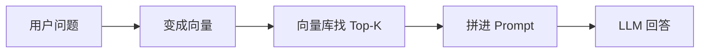
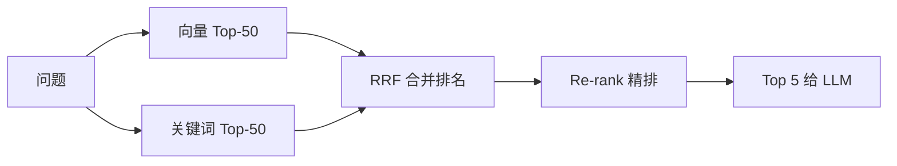

# RAG 进阶指南：从原理到生产级优化

> 跑通「Embedding + 向量库 + LLM」之后，很多人以为 RAG 就结束了。实际上那只是 **Naive RAG**（最朴素的检索问答）。这篇从前端能感知的现象入手，讲清楚每一层在干什么、怎么写代码、以及上线后怎么调。

## 📚 目录

- [你很可能已经跑过 Naive RAG](#你很可能已经跑过-naive-rag)
- [第一层：索引——文档怎么切](#第一层索引文档怎么切)
- [第二层：检索——为什么搜不准](#第二层检索为什么搜不准)
- [第三层：查询——用户问法很绕怎么办](#第三层查询用户问法很绕怎么办)
- [第四层：生成——搜到了却答错](#第四层生成搜到了却答错)
- [进阶形态：Agent 来搜、图来串](#进阶形态agent-来搜图来串)
- [怎么知道改好了没有](#怎么知道改好了没有)
- [推荐升级顺序](#推荐升级顺序)
- [系列导航](#系列导航)

---

## 你很可能已经跑过 Naive RAG

不管是公司 Wiki 问答，还是 [博客语义检索](./rag-blog-knowledge-search.md)，最基础的流程都一样：



用前端熟悉的比喻：**像在一个超大 `Array` 里用「相似度」做 `filter + slice(0, K)`，再把结果塞进 prompt 里调 `fetch('/api/chat')`**。

POC（概念验证 demo）阶段这样够用。上线后常见问题：

| 用户感受 | 技术上说 | 多半出在哪一层 |
|----------|----------|----------------|
| 「明明文档里有，搜不出来」 | 召回失败 | 索引 / 检索 / 查询 |
| 「搜出来的段落不对」 | 噪声多 | 检索 |
| 「AI 没按资料说，自己编」 | 幻觉 | 生成 |

**进阶不是换一家向量库**，而是在每一层加可测的小改动。下面按层讲。

---

## 第一层：索引——文档怎么切

### 问题从哪来

一篇长文被切成固定 500 字时，答案可能刚好落在两个 chunk 的边界上——检索只命中一半，LLM 只能看到残缺上下文。

### 原理（一句话）

**Chunk（分块）** 是检索的最小单位。块太大 → 向量语义模糊；块太小 → 上下文不够。

### 前端能落地的分块策略

| 内容 | 怎么切 | 原因 |
|------|--------|------|
| Markdown 博客 | 按 `##` 标题切 | 和目录结构一致 |
| API 文档 | 按每个接口一节 | 一块里是自洽的 |
| 普通长文 | 256～512 token + 10% overlap | overlap 减少「断在半句话」 |

```typescript
// 按二级标题切 Markdown（索引脚本里常见写法）
function chunkByHeading(markdown: string, maxTokens = 400): Chunk[] {
    const sections = markdown.split(/^## /m);
    const chunks: Chunk[] = [];

    for (const section of sections) {
        const [headingLine, ...bodyParts] = section.split('\n');
        const body = bodyParts.join('\n').trim();
        if (!body) continue;

        // 一节太长再按段落二次切
        const parts = splitByTokenLimit(body, maxTokens);
        for (const text of parts) {
            chunks.push({
                text,
                metadata: { heading: headingLine?.trim(), source: '...' },
            });
        }
    }
    return chunks;
}
```

### 父子索引：小块找、大块读

**做法：** 用 **小 chunk** 做向量检索（命中率高），命中后把所属的 **大段落（父块）** 送给 LLM。

```typescript
// 检索命中子块后，用 metadata 里的 parentText 组装上下文
async function retrieve(query: string, topK = 5) {
    const hits = await vectorStore.query(await embed(query), topK * 2);
    const parentTexts = new Map<string, string>();

    for (const hit of hits) {
        const pid = hit.metadata.parentId;
        if (!parentTexts.has(pid)) {
            parentTexts.set(pid, hit.metadata.parentText);
        }
    }
    return [...parentTexts.values()].slice(0, topK);
}
```

### 元数据过滤

「只搜 AI 分类」「只搜今年的文档」——靠 **metadata + filter**，不是纯向量能解决的。

```typescript
await vectorStore.query({
    vector: queryVec,
    topK: 20,
    filter: { category: 'Frontend', year: 2024 },
});
```

Upstash、Pinecone、pgvector 都支持。顺序上 **先 filter 再 vector**，比全库搜完再筛省很多算力。

---

## 第二层：检索——为什么搜不准

### 纯向量检索擅长什么、不行什么

向量检索 ≈ 「意思接近」：「改密码」和「重置凭证」能对上。

但对这些很弱：

- 函数名 `useMemo`、错误码 `ECONNREFUSED`
- 用户复制粘贴的一段原文
- 产品型号、法律条文编号

这类需要 **关键词匹配**。前端如果做过站内搜索，**BM25** 可以理解为升级版的关键词相关度算法（Elasticsearch、MiniSearch 都在用类似思路）。

### 混合检索：两路召回再合并



**RRF（Reciprocal Rank Fusion）**：把两路「排名」融合，不用纠结分数尺度不一致。实现很短：

```typescript
function rrf(lists: string[][], k = 60): Map<string, number> {
    const scores = new Map<string, number>();
    for (const list of lists) {
        list.forEach((id, rank) => {
            scores.set(id, (scores.get(id) ?? 0) + 1 / (k + rank + 1));
        });
    }
    return scores;
}
```

Node 里关键词路可以用 MiniSearch；已有 Elasticsearch 的团队直接走 `kNN + BM25`。

### Re-rank：性价比最高的一步

粗召回 50 条后，用 **Cross-Encoder**（把「问题 + 段落」一起打分）精排，取 Top 5。

和 Embedding 的区别，用前端类比：

- **Embedding（Bi-Encoder）**：分别算 query 和 doc 的向量，再比距离 → 快，适合几万条里粗筛
- **Cross-Encoder**：把 query 和 doc **拼在一起**算分 → 慢，只适合几十条里精选

```typescript
async function searchWithRerank(query: string) {
    const candidates = await hybridRecall(query, 50); // 向量 + BM25
    const reranked = await rerankClient.rerank({
        query,
        documents: candidates.map((c) => c.text),
        topN: 5,
    });
    return reranked;
}
```

经验上：**Top-3 经常不对时，先加 Re-rank，再考虑换 Embedding 模型**。

---

## 第三层：查询——用户问法很绕怎么办

用户很少按文档原话问。「事件循环和 Fiber 啥关系」和文章里的「Concurrent Mode 调度」向量空间可能离得很远。

### Multi-Query：一个问题变多个搜索词

让 LLM 生成 3 个不同表述，分别检索，再合并去重：

```typescript
async function multiQuerySearch(userQuery: string) {
    const variants = await llm.json(
        `为这个问题生成 3 个检索查询，JSON 数组：${userQuery}`
    );
    const all: Chunk[] = [];
    for (const q of [userQuery, ...variants]) {
        all.push(...await vectorSearch(q, 10));
    }
    return dedupeById(all).slice(0, 20);
}
```

成本：多几次 Embedding API。适合复杂问题路由开启，简单 FAQ 不必开。

### HyDE：先「编」一段假答案再搜

让模型先写一段假设性回答，用 **假答案的向量** 去搜真文档——因为「答案和答案」往往比「问题和答案」更像。

注意：假答案可能带偏，建议和原问题 **双路检索再 RRF**。

---

## 第四层：生成——搜到了却答错

### Prompt 要约束紧

```typescript
function buildPrompt(question: string, chunks: Chunk[]) {
    const refs = chunks
        .map((c, i) => `[${i + 1}] ${c.source}\n${c.text}`)
        .join('\n---\n');

    return `
只能根据【资料】回答。资料不够就说「未找到」，不要编造。
引用用 [1][2]。

【资料】
${refs}

【问题】
${question}`;
}
```

### Lost in the Middle

模型对 Prompt **中间** 的内容利用率低（有论文验证）。把 Re-rank 最高的段落放在 **靠近问题** 的位置。

### CRAG：检索质量不行就别硬答

在生成前加一层判断：检索结果和问题相关吗？

- 相关 → 正常生成
- 不太相关 → 改写问题再搜一次
- 完全不相关 → 直接说不知道

比无限加长 System Prompt 更管用，也减少幻觉。

---

## 进阶形态：Agent 来搜、图来串

### Agentic RAG

问题需要 **搜好几次**（「哪些文档同时讲了 A 和 B」）时，把检索做成 [Tool](./09-tools-system-design.md)：

```typescript
const searchTool: Tool = {
    name: 'search_docs',
    description: '在知识库语义检索，可换关键词多次调用',
    parameters: {
        type: 'object',
        properties: { query: { type: 'string' }, category: { type: 'string' } },
        required: ['query'],
    },
    execute: async ({ query, category }) => hybridSearch(query, { category }),
};
```

Agent 用 [ReAct](./08-build-first-agent.md) 自己决定何时搜、搜什么——和固定「每问必搜一次」的管道不同。

### GraphRAG

适合「整个知识库的主题地图、演进综述」——要建知识图谱，索引阶段 LLM 调用多，**不适合** 毫秒级在线问答。日常 FAQ 优先 Hybrid + Re-rank；离线分析报告可以另做 GraphRAG 任务。

---

## 怎么知道改好了没有

别靠感觉。准备 20～50 条 **黄金测试**：真实问题 + 期望落在哪篇文档。

```typescript
interface EvalCase {
    question: string;
    expectedDocIds: string[];
}

type FailureMode =
    | 'retrieval_miss'    // 相关文档没进 Top-K
    | 'retrieval_noise'   // Top-K 里垃圾多
    | 'generation_hallucinate'; // 答了资料里没有的
```

常用指标（RAGAS 框架里的名字）：

| 指标 | 白话 |
|------|------|
| Context Precision | 搜回来的有多少真相关 |
| Faithfulness | 回答有没有瞎编 |
| Answer Relevance | 回答有没有解决问题 |

改分块 / Re-rank 策略前后，在同一套 case 上跑对比。

---

## 推荐升级顺序

```text
1. 黄金测试集 + 记录空结果
2. 按标题分块 + metadata（source、heading）
3. Hybrid Search + Re-rank   ← 多数团队最大收益在这里
4. 复杂问题才开 Multi-Query
5. Prompt 约束 + CRAG 防幻觉
6. 需要多步检索时再 Agentic RAG
```

---

## 系列导航

1. [给个人博客加上 RAG](./rag-blog-knowledge-search.md) — 基础流水线实战
2. **本文**
3. [多智能体协作](./12-multi-agent-systems.md)
4. [Memory 进阶](./13-advanced-memory.md)
5. [WebAI 与边缘推理](./14-webai-and-edge-inference.md)

**总索引：** [README](./README.md) · **延伸阅读：** [RAGAS 文档](https://docs.ragas.io/) · [Corrective RAG 论文](https://arxiv.org/abs/2401.15884) · [Lost in the Middle](https://arxiv.org/abs/2307.03172)
