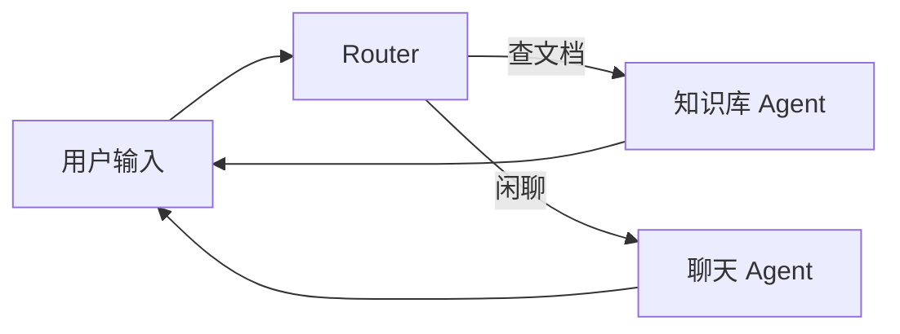
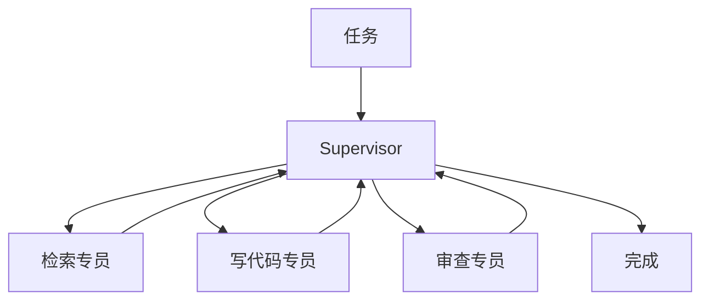

# 多智能体协作：从单兵作战到团队分工

> [08 的第一个 Agent](/ai/08-build-first-agent.html) 里，一个 ReAct 循环 + 几个 Tool 就能完成调研任务。[09 Tools](/ai/09-tools-system-design.html) 把能力拆清楚了。什么时候还要再拆成 **多个 Agent**？这篇从前端能实现的编排方式讲起，由浅入深。

## 📚 目录

- [先别急着 Multi-Agent](#先别急着-multi-agent)
- [单层路由：一个门卫分发请求](#单层路由一个门卫分发请求)
- [固定流水线：调研 → 写作 → 审查](#固定流水线调研--写作--审查)
- [Supervisor：动态派活](#supervisor动态派活)
- [Agent 之间怎么传数据](#agent-之间怎么传数据)
- [和前端 UI 怎么接](#和前端-ui-怎么接)
- [常见坑](#常见坑)
- [系列导航](#系列导航)

---

## 先别急着 Multi-Agent

**Multi-Agent** = 多个带不同 Prompt / Tool 的 Agent 协作。听起来酷，但 Token 费用和延迟往往是单 Agent 的 **2～5 倍**（每个 Agent 都要跑自己的 LLM 循环）。

先用这张表判断：

| 情况 | 更合适的做法 |
|------|--------------|
| 步骤固定，3～5 步 | 单 Agent + [Planner](/ai/10-memory-planning-agent.html) |
| 只是工具多 | 单 Agent + Tool Registry |
| 要写代码 **且** 要独立审查 | Coder Agent + Reviewer Agent |
| 子任务可并行 | Map-Reduce（`Promise.all` + 限流） |
| 闲聊 vs 查知识库，Prompt 完全两码事 | Router + 两个 Specialist |

**类比：** 不是每个项目都要微服务。单 Agent 能搞定就别拆。

---

## 单层路由：一个门卫分发请求

最常见、也最容易落地的形态。

用户发一句话 → **Router** 判断意图 → 转给对的 Handler。



### 前端视角

Router 可以是一个 **API Route**，内部一次便宜的分类调用（或小模型），再 `fetch` 不同下游：

```typescript
// app/api/chat/route.ts 简化示意
export async function POST(req: Request) {
    const { message } = await req.json();

    const intent = await classifyIntent(message); // 'search' | 'chat'

    if (intent === 'search') {
        const chunks = await hybridSearch(message);
        return streamRagAnswer(message, chunks);
    }
    return streamChat(message);
}
```

### 要点

Router 输出最好是 **结构化 JSON**，不要只吐自然语言让下游猜：

```typescript
interface RouteResult {
    target: 'search' | 'chat' | 'code';
    handoffMessage: string; // 传给下游的精简上下文
}
```

OpenAI Agents SDK、LangGraph 的 `Command` 都是类似思路。

---

## 固定流水线：调研 → 写作 → 审查

步骤 **顺序固定、有依赖** 时，用 **状态图** 比手写 `while` 清晰——尤其要支持「审查不通过打回重写」。

### 用 LangGraph 表达（TypeScript）

[LangGraph](https://langchain-ai.github.io/langgraphjs/) 把流程画成图：**节点** 做一件事，**边** 决定下一步去哪。

```typescript
import { Annotation, StateGraph, START, END } from '@langchain/langgraph';

// 共享「白板」——类似 React 里抬升的 state
const State = Annotation.Root({
    messages: Annotation<BaseMessage[]>({
        reducer: (prev, next) => prev.concat(next),
        default: () => [],
    }),
    notes: Annotation<string>({ reducer: (_, n) => n, default: () => '' }),
    draft: Annotation<string>({ reducer: (_, n) => n, default: () => '' }),
    retry: Annotation<number>({ reducer: (_, n) => n, default: () => 0 }),
});

async function research(state: typeof State.State) {
    const q = state.messages.at(-1)?.content as string;
    const notes = await searchWeb(q); // 调 Tool
    return { notes };
}

async function write(state: typeof State.State) {
    const draft = await llm.generate(`根据笔记写报告：\n${state.notes}`);
    return { draft };
}

async function review(state: typeof State.State) {
    const result = await llm.generate(
        `报告是否遗漏笔记要点？只答 PASS 或 FAIL：\n${state.draft}`
    );
    return { retry: state.retry + (result.startsWith('PASS') ? 0 : 1) };
}

function afterReview(state: typeof State.State): 'write' | typeof END {
    if (state.retry >= 2) return END; // 最多改两轮，防死循环
    const last = state.messages.at(-1)?.content as string;
    return last?.includes('PASS') ? END : 'write';
}

const graph = new StateGraph(State)
    .addNode('research', research)
    .addNode('write', write)
    .addNode('review', review)
    .addEdge(START, 'research')
    .addEdge('research', 'write')
    .addEdge('write', 'review')
    .addConditionalEdges('review', afterReview);

const app = graph.compile();
```

这和 [08 里 ReAct 的 while 循环](/ai/08-build-first-agent.html) 是一类问题，但 **分支多了以后**，图编排更好维护、更好画给同事看。

### Checkpoint：暂停等人审批

审批流里需要「生成草稿 → 等人点确认 → 再继续」：

```typescript
import { MemorySaver } from '@langchain/langgraph';

const app = graph.compile({ checkpointer: new MemorySaver() });
const config = { configurable: { thread_id: sessionId } };

await app.invoke({ messages: [...] }, config);
// 用户在前端点「通过」后
await app.invoke(null, config);
```

`thread_id` 和前端 session 对齐即可。

---

## Supervisor：动态派活

Router 只分一次；**Supervisor** 是中央 LLM **反复决定**「下一步派谁」，干完回到中央，直到 `FINISH`。



适合步骤 **事先列不全** 的任务。代价：每委派一次都是一次 LLM 调用。

**注意：** Worker 别超过 5 个，Tool 集尽量别重叠，否则 Supervisor 老派错人。

---

## Agent 之间怎么传数据

### 别用大段自然语言甩锅

Agent A 输出 2000 字，Agent B「自己理解」——容易漏、容易重复。

**用 JSON 契约**，和定义 API Response 一样：

```typescript
interface ResearchOutput {
    query: string;
    findings: Array<{ claim: string; source: string }>;
    gaps: string[]; // 没查到的
}

interface CodeOutput {
    filesChanged: string[];
    summary: string;
}
```

Zod 校验；解析失败就 **重跑该节点**，别把脏数据传下去。

### 传什么进共享 State

| 方式 | 像前端里的… | 问题 |
|------|-------------|------|
| 整段 messages 往下传 | 把整个 Redux store 传给每个组件 | 上下文爆炸 |
| State 只存结论字段 | 只传 `draft`、`notes` | 推荐 |
| Tool 原始日志放私有轨迹 | 内部 log 不进 UI state | 最干净 |

---

## 和前端 UI 怎么接

Multi-Agent 和 [08 的 SSE 流式 UI](/ai/08-build-first-agent.html) 可以同一套：

```typescript
// 每个图节点开始时推一条事件
function emitStep(step: string, detail: string) {
    sse.send({ type: 'step', step, detail });
}

async function researchNode(state: State) {
    emitStep('research', '正在检索…');
    const notes = await searchWeb(state.query);
    emitStep('research', '检索完成');
    return { notes };
}
```

前端用折叠面板展示 `research → write → review`，体验和单 Agent 的 Thought/Action/Observation 类似，只是步骤名换成 **图节点名**。

日志建议带 `traceId`、`node`、`token 用量`——Multi-Agent 出问题时，得能定位 **哪一步** 坏了。

---

## 常见坑

**1. 为了酷而拆**  
两个 Agent 各跑五轮 ReAct，账单肉眼可见。先优化单 Agent 的 Tools 和 Planner。

**2. 没有 `maxRounds`**  
Coder 和 Reviewer 无限互怼，Token 烧光。审查循环 **最多 2～3 轮**。

**3. Map 阶段 `Promise.all` 不限流**  
50 个文件并行摘要，Embedding API 直接 429。用 `p-limit`，并发 3～5。

**4. 每次改 Prompt 都跑全链路 E2E**  
用 fixture mock Worker，只测 Router 有没有派对人；全链路测试留少量冒烟。

**5. 和 Memory 搅在一起**  
多 Agent 的 State 是 **任务黑板**；用户长期偏好走 [Memory 进阶](/ai/13-advanced-memory.html)，别混。

---

## 系列导航

1. [构建第一个 Agent](/ai/08-build-first-agent.html)
2. [Tools 系统](/ai/09-tools-system-design.html)
3. [Memory 与 Planning](/ai/10-memory-planning-agent.html)
4. [RAG 进阶](/ai/11-advanced-rag-patterns.html)
5. **本文**
6. [Memory 进阶](/ai/13-advanced-memory.html)

**参考：** [LangGraph.js 文档](https://langchain-ai.github.io/langgraphjs/) · [Anthropic: Building effective agents](https://www.anthropic.com/research/building-effective-agents)
