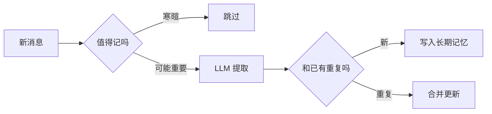

# Memory 进阶：构建 Agent 的长期认知系统

> [第十篇](./10-memory-planning-agent.md) 用 SQLite 存了对话历史，用向量库做了长期记忆。再往下做时，很容易踩坑：**把 RAG 知识库和用户对话记忆塞进同一个向量 index**。这篇在 10 的基础上，讲记忆和 RAG 怎么分、怎么写、怎么读。

## 📚 目录

- [Memory 和 RAG 不是一回事](#memory-和-rag-不是一回事)
- [记忆分几层（复习 + 延伸）](#记忆分几层复习--延伸)
- [写入：别把所有对话都塞进向量库](#写入别把所有对话都塞进向量库)
- [读取：不只看相似度](#读取不只看相似度)
- [反思：从流水账到「用户最近在忙啥」](#反思从流水账到用户最近在忙啥)
- [遗忘与改偏好](#遗忘与改偏好)
- [和前端、多 Agent 怎么配合](#和前端多-agent-怎么配合)
- [系列导航](#系列导航)

---

## Memory 和 RAG 不是一回事

| | RAG 知识库 | Agent 记忆 |
|--|------------|------------|
| 存什么 | 产品文档、Wiki、博客 | 用户说过的话、Agent 总结的结论 |
| 谁写入 | 索引脚本 / CI | 对话过程中异步提取 |
| 典型问题 | 「退货流程怎么写」 | 「用户偏好深色模式」 |
| 权限 | 往往全公司共用一份 | **必须按 userId 隔离** |

混在一个向量库里的后果：搜知识库时捞出昨天的闲聊；或者用户隐私进了全员共享的库。

**做法：** 两个 collection / namespace，Prompt 里分段写清楚：

```text
[知识库资料]
...

[关于该用户的记忆]
...
```

[RAG 检索](./rag-blog-knowledge-search.md) 索引的是静态 `docs/`；记忆索引的是 **提取后的条目**，别混。

---

## 记忆分几层（复习 + 延伸）

[10 篇](./10-memory-planning-agent.md) 的三层，用前端状态来类比：

| 记忆 | 像前端里的… | 实现 |
|------|-------------|------|
| 短期 | 当前页面的 `messages` 数组 | 内存 / SQLite 会话表 |
| 工作 | 一次复杂表单的 `formState` | `WorkingState` 对象 |
| 长期 | 用户设置里持久化的偏好 | 向量库 + metadata |

再往下拆（了解即可）：

- **情景记忆**：「上周改过支付页」——带时间戳
- **语义记忆**：「偏好 TypeScript」——抽象偏好
- **程序记忆**：稳定流程写进 Skill / 文档，别每次从对话里重新推理

---

## 写入：别把所有对话都塞进向量库

每条 user/assistant 原文 `upsert` 进去 → 检索噪声大、Embedding 费用高。

### 推荐管道



### 提取代码示意

```typescript
const EXTRACT_PROMPT = `
从对话中提取值得长期记住的信息。输出 JSON 数组：
{ "content": "...", "type": "preference|fact|task", "importance": 1-10 }
不要记寒暄和一次性临时数字。
`;

async function onSessionIdle(messages: Message[]) {
    const candidates = await llm.json(EXTRACT_PROMPT + format(messages));
    for (const c of candidates) {
        if (c.importance < 5) continue;
        await longTermMemory.upsertWithDedup(userId, c);
    }
}
```

**异步写：** 在 `onAssistantDone` 里丢进队列，别阻塞用户看到的回复——和「先返回 UI，后台再 sync」一样。

### 在 10 篇 LongTermMemory 上扩展

```typescript
// 10 篇已有 remember / recall，加上去重
async function upsertWithDedup(userId: string, candidate: MemoryCandidate) {
    const similar = await longTermMemory.recall(candidate.content, 3);
    const dup = similar.find((s) => s.similarity > 0.92);

    if (dup && candidate.importance >= dup.importance) {
        await vectorStore.update(dup.id, candidate);
        return;
    }
    if (!dup) {
        await longTermMemory.remember(candidate.content, {
            userId,
            type: candidate.type,
            importance: candidate.importance,
        });
    }
}
```

---

## 读取：不只看相似度

纯向量 Top-5 有个问题：**很久以前但很重要的偏好**（比如饮食禁忌）会被最近一堆闲聊挤掉。

[Generative Agents](https://arxiv.org/abs/2304.03442) 论文里的做法：综合 **新近度 + 重要性 + 相关度** 打分。

```typescript
function score(memory: MemoryRecord, querySim: number, now: number) {
    const hours = (now - memory.createdAt) / 3600000;
    const recency = Math.pow(0.99, hours);       // 越久越衰减
    const importance = memory.importance / 10;   // 写入时打的 1-10 分
    const relevance = querySim;
    return 0.3 * recency + 0.4 * importance + 0.3 * relevance;
}

async function recallRanked(query: string, topK = 5) {
    const candidates = await vectorStore.query(await embed(query), 30);
    return candidates
        .map((m) => ({ m, s: score(m, m.similarity, Date.now()) }))
        .sort((a, b) => b.s - a.s)
        .slice(0, topK)
        .map((x) => x.m);
}
```

用户说「记住这个」时，把 `importance` 设为 10。

---

## 反思：从流水账到「用户最近在忙啥」

每 10～20 轮对话（或会话结束），让 LLM **归纳** 几条洞察，写进长期记忆：

```typescript
async function reflect(recent: string[]): Promise<string[]> {
    return await llm.json(`
根据近期对话，归纳 1-3 条洞察（目标、习惯）。JSON 字符串数组。不要复述原文。
${recent.join('\n')}
`);
}
```

例如多次问 React 性能 → 洞察「当前关注 Frontend 性能，检索时可优先该分类」。

洞察可以喂给 [Planner](./10-memory-planning-agent.md)：

```typescript
const plan = await planner.createPlan(goal, {
    userInsights: await memory.getReflections(userId),
    ragChunks: await ragSearch(goal),
});
```

别每轮都反思——多一次 LLM 调用。

---

## 遗忘与改偏好

| 场景 | 怎么做 |
|------|--------|
| 用户说「别记得这个」 | 按 topic 语义搜相关记忆后 delete |
| 记忆太多 | 每用户上限 N 条，挤掉低分 |
| 偏好变了 | 新 preference 覆盖旧的，或合并成时间线 |

合规场景（GDPR）需要 **导出 + 删除** API；记忆含手机号等 PII 要加密存。

---

## 和前端、多 Agent 怎么配合

**前端：** 可做「Agent 对你的了解」面板，展示语义记忆，允许用户删改——和 Cookie 设置页类似。

**多 Agent：** 见 [12 篇](./12-multi-agent-systems.md)。Researcher 抓回来的原始 HTML **不要**进用户可见记忆，只存摘要；内部 Agent 轨迹标 `visibility: internal`。

```typescript
interface MemoryScope {
    userId: string;
    sessionId?: string;
    visibility: 'user' | 'internal';
}
```

---

## 系列导航

1. [Memory 与 Planning](./10-memory-planning-agent.md) — 基础代码从这里接
2. [RAG 进阶](./11-advanced-rag-patterns.md)
3. [多智能体](./12-multi-agent-systems.md)
4. **本文**
5. [WebAI](./14-webai-and-edge-inference.md)

**总索引：** [README](./README.md) · **参考：** [Generative Agents 论文](https://arxiv.org/abs/2304.03442) · [Mem0](https://mem0.ai/)
