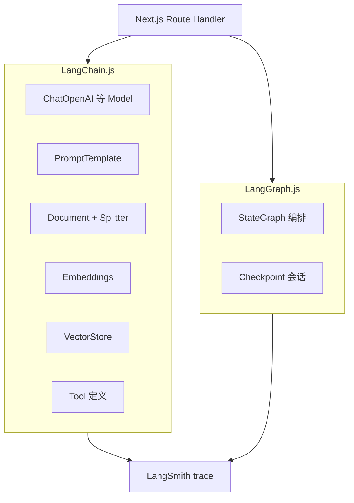

# LangChain.js 生态指南：RAG 管道与框架选型

> [08 的第一个 Agent](./08-build-first-agent.md) 和 [RAG 博客实战](./rag-blog-knowledge-search.md) 都是手写胶水代码：自己拼 Prompt、自己调 OpenAI、自己管 Tool 列表。跑通之后自然会问：**LangChain.js 到底管哪一段？值不值得引入？** 这篇按前端能落地的边界，把包怎么装、RAG 怎么对照实验、和自研怎么选讲清楚。

## 📚 目录

- [LangChain 不是「又一个 Agent 框架」](#langchain-不是又一个-agent-框架)
- [装什么包：一张分工表](#装什么包一张分工表)
- [RAG 对照实验：自研 vs LangChain](#rag-对照实验自研-vs-langchain)
- [Tool 与 Agent：和 09 自研怎么对齐](#tool-与-agent和-09-自研怎么对齐)
- [LangSmith：最小可观测接入](#langsmith最小可观测接入)
- [什么时候仍用自研](#什么时候仍用自研)
- [常见坑](#常见坑)
- [系列导航](#系列导航)

---

## LangChain 不是「又一个 Agent 框架」

很多人把 LangChain 和 LangGraph 混成一个东西。拆开看更清楚：

| 层 | 负责什么 | 类比前端 |
|----|----------|----------|
| **LangChain.js** | Model、Prompt 模板、Document 加载、分块、Embedding、VectorStore、Tool 定义 | UI 组件库 + 数据 fetch 封装 |
| **LangGraph.js** | 多步流程、分支、checkpoint、多 Agent 图编排 | 工作流引擎 / XState |
| **LangSmith** | Trace、数据集、回归评测 | Sentry + 测试平台 |

**LangChain 解决的是「和 LLM 打交道的重复劳动」**；复杂控制流交给 [下一篇 LangGraph](./16-langgraphjs-practice.md)。



---

## 装什么包：一张分工表

```bash
pnpm add @langchain/core langchain @langchain/openai @langchain/community @langchain/langgraph
```

| 包 | 典型用途 | 是否必装 |
|----|----------|----------|
| `@langchain/core` | `BaseMessage`、`tool()`、Runnable 接口 | 必装（底座） |
| `langchain` | 高层链、部分预置 Agent（版本演进中） | 常用 |
| `@langchain/openai` | `ChatOpenAI`、`OpenAIEmbeddings` | 用 OpenAI 兼容 API 时 |
| `@langchain/community` | 第三方 VectorStore、Loader 集成 | 按需 |
| `@langchain/langgraph` | 图编排（下一篇详讲） | 做 Agent 流程时 |
| `langsmith` | Trace SDK | 上线前强烈建议 |

**版本对齐：** `@langchain/core`、`langchain`、`@langchain/langgraph` 尽量同一发布周期安装。混用旧版 `@langchain/core` 和新版 `langgraph` 时，最容易出现类型报错或运行时 `messages reducer` 异常。

**跑在哪：** LangChain.js 代码放在 **Node Route Handler / 独立 AI 服务**里，不要整包打进浏览器 bundle——Embedding 和 VectorStore 客户端体积和密钥都不适合前端直引。

---

## RAG 对照实验：自研 vs LangChain

以 [博客语义检索](./rag-blog-knowledge-search.md) 的同一条业务线做平行对照，最容易判断「胶水值不值」。

### 1. 文档加载与分块

**自研（按 `##` 切 Markdown）：**

```typescript
function chunkByHeading(markdown: string): Chunk[] {
    const sections = markdown.split(/^## /m);
    // ...
}
```

**LangChain：**

```typescript
import { RecursiveCharacterTextSplitter } from "@langchain/textsplitters";
import { Document } from "@langchain/core/documents";

const splitter = new RecursiveCharacterTextSplitter({
    chunkSize: 512,
    chunkOverlap: 64,
});

const docs = await splitter.createDocuments(
    [markdown],
    [{ source: "docs/ai/08-build-first-agent.md" }],
);
```

| 维度 | 自研按标题 | `RecursiveCharacterTextSplitter` |
|------|------------|----------------------------------|
| 结构化 Markdown | 天然对齐目录 | 需调 `separators: ["\n## ", "\n"]` |
| 普通长文 / PDF 导出 | 要手写规则 | 开箱即用 |
| 可控性 | 完全可控 | 参数化，逻辑在库里 |

**结论：** 博客 / API 文档类内容继续自研按标题切往往更准；杂糅长文、PDF 转文本用 LangChain Splitter 省时间。

### 2. Embedding + 向量库

**自研：** 直接 `fetch` Embedding API，手写 upsert / query。

**LangChain：**

```typescript
import { OpenAIEmbeddings } from "@langchain/openai";
import { UpstashVectorStore } from "@langchain/community/vectorstores/upstash";

const embeddings = new OpenAIEmbeddings({
    model: "text-embedding-3-small",
});

const vectorStore = await UpstashVectorStore.fromExistingIndex(embeddings, {
    url: process.env.UPSTASH_VECTOR_REST_URL!,
    token: process.env.UPSTASH_VECTOR_REST_TOKEN!,
});

// 索引
await vectorStore.addDocuments(docs);

// 检索
const hits = await vectorStore.similaritySearch("ReAct 循环怎么写", 5);
```

价值在于：**换向量库时改集成类，业务 Route 里的 `similaritySearch` 调用可以不动**。和 [11 RAG 进阶](./11-advanced-rag-patterns.md) 里的混合检索、重排可以叠在一起——LangChain 管「连库」，自研管「策略」。

### 3. 检索结果拼进 Prompt

```typescript
import { ChatPromptTemplate } from "@langchain/core/prompts";
import { ChatOpenAI } from "@langchain/openai";
import { StringOutputParser } from "@langchain/core/output_parsers";

const prompt = ChatPromptTemplate.fromMessages([
    ["system", "只根据以下资料回答，资料不足就说不知道。\n\n{context}"],
    ["human", "{question}"],
]);

const model = new ChatOpenAI({ model: "gpt-4o-mini", temperature: 0 });

const chain = prompt.pipe(model).pipe(new StringOutputParser());

const context = hits.map((d) => d.pageContent).join("\n---\n");
const answer = await chain.invoke({ context, question: userQuery });
```

`pipe` 就是「前一个 Runnable 的输出喂给下一个」——和 RxJS `pipe` 或中间件链同一套心智模型。

---

## Tool 与 Agent：和 09 自研怎么对齐

[09 Tools](./09-tools-system-design.md) 里自研的 `ToolRegistry` 核心是：**名字、描述、JSON Schema、execute 函数**。

LangChain 用 `tool()` 包一层，并自动挂到 Model 的 function calling：

```typescript
import { tool } from "@langchain/core/tools";
import { z } from "zod";

const searchWiki = tool(
    async ({ query }) => {
        const res = await fetch(`https://en.wikipedia.org/api/rest_v1/page/summary/${encodeURIComponent(query)}`);
        const data = await res.json();
        return data.extract ?? "未找到";
    },
    {
        name: "search_wikipedia",
        description: "查询维基百科摘要，用于调研背景知识",
        schema: z.object({
            query: z.string().describe("要搜索的主题，英文关键词更准"),
        }),
    },
);
```

和自研对照：

| 能力 | 自研 ToolRegistry | LangChain `tool()` |
|------|-------------------|---------------------|
| Schema 校验 | 自己写 | Zod schema 内置 |
| 给 LLM 看的工具列表 | `getDescription()` 手写 | `bindTools` 自动 |
| 权限 / 限流 | 在 `execute` 里控 | 同样在 tool 函数里控 |
| 动态注册 | Map 管理 | 数组传给 Agent |

**预置 ReAct Agent：** LangGraph 提供 `createReactAgent`，内部就是「Model 节点 + Tool 节点 + 条件边」——和 [08 的 `for` 循环](./08-build-first-agent.md#第四步实现-react-循环) 同逻辑，只是换成图。下一篇会用手写 `StateGraph` 拆开讲。

```typescript
import { createReactAgent } from "@langchain/langgraph/prebuilt";
import { ChatOpenAI } from "@langchain/openai";

const agent = createReactAgent({
    llm: new ChatOpenAI({ model: "gpt-4o-mini" }),
    tools: [searchWiki],
});

const result = await agent.invoke({
    messages: [{ role: "user", content: "量子计算最近有什么突破？" }],
});
```

> API 演进提示：`createReactAgent` 在部分新版本里向 `langchain` 包迁移。装包后以官方文档的 import 路径为准，概念不变。

---

## LangSmith：最小可观测接入

没有 trace，Agent 出问题只能猜「是检索烂了还是 Tool 烂了」。

**三步接入：**

```bash
pnpm add langsmith
```

```typescript
// 环境变量
// LANGCHAIN_TRACING_V2=true
// LANGCHAIN_API_KEY=...
// LANGCHAIN_PROJECT=blog-agent-dev

import { Client } from "langsmith";

// 多数 LangChain Runnable 在设置了环境变量后会自动上报
// 手动包一层也行：
const client = new Client();
```

在 LangSmith 控制台能看到：

- 每次 `chain.invoke` / `agent.invoke` 的嵌套调用树
- 每个节点的输入输出、Token 用量、延迟
- 对比两次 Prompt 改动的差异

和自研 SSE 日志的关系：**SSE 给用户看进度，LangSmith 给开发查链路**——不重复，叠用。

上线前至少 trace 三条路径：纯聊天、RAG 问答、带 Tool 的 Agent。后续 Agent eval 专题可复用 LangSmith Datasets。

---

## 什么时候仍用自研

| 场景 | 建议 |
|------|------|
| 学 Agent 原理、面试、教学 demo | **先自研**（07～10 + 08） |
| RAG 索引脚本在 CI 跑、逻辑极简 | 自研 `fetch` 往往更轻 |
| 团队禁止引入大依赖树 | 只抽 `@langchain/core` 的 Message 类型 |
| 多 Agent、审批、checkpoint | **LangGraph**（见下一篇） |
| RAG 胶水多、要换多家向量库 | **LangChain** VectorStore 层 |
| 要 trace + 回归数据集 | **LangSmith** |

**本系列推荐路径：** 08 手写搞懂循环 → 15 LangChain 减胶水 → 16 LangGraph 管编排 → 需要 UI 再接 Chatbot 篇。

**深挖 API：** [LangChain.js 专系列（01～16）](./langchain/README.md) · [LangGraph.js 专系列（01～13）](./langgraph/README.md)（参数、场景、底层原理分项展开）。

---

## 常见坑

**1. 在前端组件里 `import @langchain/openai`**  
密钥泄露 + bundle 爆炸。Route Handler 或独立服务里跑。

**2. `@langchain/*` 版本混搭**  
`pnpm why @langchain/core` 查是否被拉了两个版本。用 overrides 锁齐。

**3. 以为 LangChain = 不用写 Prompt**  
RAG 召回差、Tool 描述糊，换框架救不了。先对照 [11](./11-advanced-rag-patterns.md) 调检索。

**4. `createReactAgent` 一把梭所有业务**  
固定三步流水线、人工审批、多 Agent 分工——该上图（LangGraph），不是加长 chain。

**5. 没设 `maxIterations`**  
预置 Agent 默认有上限，自定义链要记得在图或循环里封顶，和 08 的 `maxIterations` 同理。

---

## 版本基准

专系列 API 深挖见 [langchain/README](./langchain/README.md)。**校对日期 2026-06-11**；撰写基准 **LangChain.js v1**（`langchain@1.4.6`）。本仓库 [blog-assistant](../apps/blog-assistant/) 仍为 **0.3.x**，import 可能不同 — 详见专系列 README「版本基准与维护」。

---

## 系列导航

**生态三角（建议一起读）：**

1. **本文** — LangChain 积木 + 自选组装
2. [20 Vercel AI SDK](./20-vercel-ai-sdk-guide.md) — Chat UI 体验层
3. [27 Mastra 速览](./27-mastra-typescript-agent-framework.md) — TS 一体化 Agent 平台

**主线续读：**

1. [构建第一个 Agent](./08-build-first-agent.md)
2. [Tools 系统](./09-tools-system-design.md)
3. [RAG 进阶](./11-advanced-rag-patterns.md)
4. [LangGraph.js 实战](./16-langgraphjs-practice.md)

**总索引：** [README](./README.md) · **专系列：** [LangChain](./langchain/README.md) · [LangGraph](./langgraph/README.md) · [Mastra](./mastra/README.md) · **参考：** [LangChain.js 文档](https://js.langchain.com/) · [LangSmith](https://smith.langchain.com/) · [LangGraph.js](https://langchain-ai.github.io/langgraphjs/)
