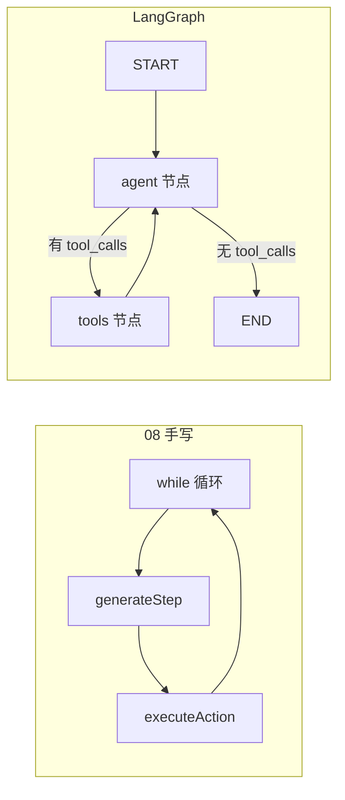
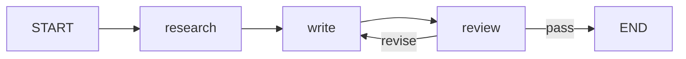

# LangGraph.js 实战：从手写 ReAct 到图编排

> [08](./08-build-first-agent.md) 里用 `for` 循环跑 ReAct，十几行核心逻辑就能调研。步骤变多之后——要审查打回、要分支路由、要断点续跑——`while` 里塞满 `if` 会很难维护。[12 多智能体](./12-multi-agent-systems.md) 讲了「该拆成图」的时机，这篇用 **LangGraph.js** 把同一条业务线重写一遍：先手写图，再用预置 Agent，最后接 checkpoint 和 Next.js API。

## 📚 目录

- [手写循环什么时候不够用](#手写循环什么时候不够用)
- [核心概念：State、Node、Edge](#核心概念statenodeedge)
- [第一步：用 StateGraph 重写 ReAct](#第一步用-stategraph-重写-react)
- [第二步：createReactAgent 快捷路径](#第二步createreactagent-快捷路径)
- [第三步：加审查节点（接 12 流水线）](#第三步加审查节点接-12-流水线)
- [第四步：Checkpoint 与 thread_id](#第四步checkpoint-与-thread_id)
- [接到 Next.js Route Handler](#接到-nextjs-route-handler)
- [和 LangChain 怎么配合](#和-langchain-怎么配合)
- [常见坑](#常见坑)
- [系列导航](#系列导航)

---

## 手写循环什么时候不够用

[08 的 ReAct 引擎](./08-build-first-agent.md#第四步实现-react-循环) 结构很清晰：

```typescript
for (let i = 0; i < maxIterations; i++) {
    const step = await generateStep(task, steps);
    if (step.finalAnswer) return step.finalAnswer;
    if (step.action) {
        step.observation = await executeAction(step.action);
    }
}
```

下面这些情况会让循环变「毛球」：

| 需求 | 手写循环的痛苦 |
|------|----------------|
| Tool 执行完要 **审查**，不合格打回重写 | 嵌套 `while` + 状态变量 |
| **Router** 分流到不同子流程 | 循环里一长串 `switch` |
| 用户 **中途改需求**，从某步继续 | 要自己序列化 `steps` |
| **人工审批** 某步才能继续 | 循环里挂 `await` 等外部事件 |
| Multi-Agent 各跑各的轮次 | 多个循环互相回调 |

LangGraph 的做法：**把每一步变成图上的节点，用边表达跳转**。状态和 reducer 由框架管，和 Redux / XState 类似，但节点里是 LLM 和 Tool。



---

## 核心概念：State、Node、Edge

### State（黑板）

图里所有节点读写的共享对象。每个字段可以配 **reducer**：多节点返回同字段时怎么合并。

最常见的是 `messages`：**追加**而不是覆盖。

```typescript
import { Annotation } from "@langchain/langgraph";
import type { BaseMessage } from "@langchain/core/messages";

const AgentState = Annotation.Root({
    messages: Annotation<BaseMessage[]>({
        reducer: (left, right) => left.concat(right),
        default: () => [],
    }),
    // 对齐 10 的工作记忆：任务级元数据
    iteration: Annotation<number>({
        reducer: (_, update) => update,
        default: () => 0,
    }),
});
```

### Node（干活的函数）

接收当前 State，返回 **Partial State**（只改需要的字段）。

### Edge（谁下一步）

- 固定边：`agent → tools`
- 条件边：`agent` 之后看有没有 `tool_calls`，有则 `tools`，没有则结束

编译前必须 `compile()`；可挂 `checkpointer` 做持久化。

---

## 第一步：用 StateGraph 重写 ReAct

和 [15 LangChain](./15-langchain-js-guide.md) 里定义的 `searchWiki` tool 接上，手写一版最小 ReAct 图——逻辑与 08 一致，形状不同。

```typescript
import { StateGraph, START, END } from "@langchain/langgraph";
import { ToolNode } from "@langchain/langgraph/prebuilt";
import { ChatOpenAI } from "@langchain/openai";
import { AIMessage, HumanMessage, isAIMessage } from "@langchain/core/messages";
import { tool } from "@langchain/core/tools";
import { z } from "zod";

const searchWiki = tool(
    async ({ query }) => {
        const url = `https://en.wikipedia.org/api/rest_v1/page/summary/${encodeURIComponent(query)}`;
        const res = await fetch(url);
        if (!res.ok) return "未找到";
        const data = await res.json();
        return data.extract ?? "无摘要";
    },
    {
        name: "search_wikipedia",
        description: "维基百科摘要",
        schema: z.object({ query: z.string() }),
    },
);

const model = new ChatOpenAI({ model: "gpt-4o-mini", temperature: 0 }).bindTools([searchWiki]);
const toolNode = new ToolNode([searchWiki]);

// agent 节点：调 LLM，消息追加到 state.messages
async function agentNode(state: typeof AgentState.State) {
    const response = await model.invoke(state.messages);
    return {
        messages: [response],
        iteration: state.iteration + 1,
    };
}

// 条件边：最后一则 AI 消息里有没有 tool_calls
function shouldContinue(state: typeof AgentState.State) {
    const last = state.messages.at(-1);
    if (!last || !isAIMessage(last)) return END;
    if (state.iteration >= 8) return END; // 对齐 08 maxIterations
    return last.tool_calls?.length ? "tools" : END;
}

const graph = new StateGraph(AgentState)
    .addNode("agent", agentNode)
    .addNode("tools", toolNode)
    .addEdge(START, "agent")
    .addConditionalEdges("agent", shouldContinue, ["tools", END])
    .addEdge("tools", "agent")
    .compile();

// 调用
const result = await graph.invoke({
    messages: [new HumanMessage("简要介绍 LangGraph.js 是什么")],
});
console.log(result.messages.at(-1)?.content);
```

对比 08：

| | 08 手写 | LangGraph |
|--|---------|-----------|
| 历史步骤 | `ReActStep[]` 自己拼 Prompt | `messages` 数组 + reducer |
| Tool 执行 | `executeAction` | `ToolNode` |
| 终止条件 | `finalAnswer` / 超迭代 | 条件边 + `maxIterations` |
| 可视化 | 自己打日志 | LangSmith 自动出图 |

---

## 第二步：createReactAgent 快捷路径

上面十几行图，官方预置可以缩成：

```typescript
import { createReactAgent } from "@langchain/langgraph/prebuilt";
import { ChatOpenAI } from "@langchain/openai";

const agent = createReactAgent({
    llm: new ChatOpenAI({ model: "gpt-4o-mini" }),
    tools: [searchWiki],
});

const result = await agent.invoke({
    messages: [{ role: "user", content: "量子计算是什么？" }],
});
```

**何时手写图、何时预置：**

| 场景 | 选择 |
|------|------|
| 标准 Tool Calling 循环 | `createReactAgent` |
| 加审查 / Router / 人工审批 | 手写 `StateGraph` |
| 自定义 State 字段（报表草稿、引用列表） | 手写 + 扩展 `Annotation` |
| 学习原理 | 先手写一遍再换预置 |

---

## 第三步：加审查节点（接 12 流水线）

[12 的固定流水线](./12-multi-agent-systems.md#固定流水线调研--写作--审查)：`research → write → review`，审查不过打回 `write`。

LangGraph 里就是一个额外节点 + 条件边：



```typescript
const PipelineState = Annotation.Root({
    messages: Annotation<BaseMessage[]>({
        reducer: (l, r) => l.concat(r),
        default: () => [],
    }),
    draft: Annotation<string>({ reducer: (_, u) => u, default: () => "" }),
    reviewRound: Annotation<number>({ reducer: (_, u) => u, default: () => 0 }),
    status: Annotation<"pass" | "revise">({ reducer: (_, u) => u, default: () => "revise" }),
});

async function reviewNode(state: typeof PipelineState.State) {
    const prompt = `审查以下草稿，只回复 PASS 或 REVISE 加简短理由。\n\n${state.draft}`;
    const res = await model.invoke([new HumanMessage(prompt)]);
    const text = String(res.content);
    const pass = text.toUpperCase().includes("PASS");
    const round = state.reviewRound + 1;

    if (pass || round >= 3) {
        return { status: "pass", reviewRound: round };
    }
    return {
        status: "revise",
        reviewRound: round,
        messages: [new HumanMessage(`审查意见：${text}。请修改草稿。`)],
    };
}

function afterReview(state: typeof PipelineState.State) {
    return state.status === "pass" ? END : "write";
}

// research / write 节点省略，与 12 篇逻辑相同
// .addConditionalEdges("review", afterReview, ["write", END])
```

要点和 12 一致：**审查最多 2～3 轮**，条件边里硬封顶，别让两个节点无限互怼烧 Token。

---

## 第四步：Checkpoint 与 thread_id

[10 Memory](./10-memory-planning-agent.md) 区分 **会话历史** 和 **任务工作记忆**。LangGraph 的 checkpoint 管的是：**图跑到哪一步、State 长什么样**——适合「刷新页面接着跑」「人工审批后 `invoke` 继续」。

```typescript
import { MemorySaver } from "@langchain/langgraph";

const checkpointer = new MemorySaver();
const graphWithMemory = graph.compile({ checkpointer });

const config = { configurable: { thread_id: "user-42-session-abc" } };

await graphWithMemory.invoke(
    { messages: [new HumanMessage("继续上次的研究")] },
    config,
);

// 同 thread_id 再次 invoke 会带上 checkpoint 里的 messages
```

| 概念 | 存什么 | 典型用途 |
|------|--------|----------|
| `messages` reducer | 对话消息列表 | 多轮聊天 |
| Checkpoint | 整图 State + 当前节点 | 断点续跑、审批暂停 |
| [13 Memory 进阶](./13-advanced-memory.md) 向量记忆 | 长期用户偏好 | 跨会话个性化 |

`thread_id` 一般由前端会话 ID 或 `userId + sessionId` 组成，和 Chatbot UI 的 `conversationId` 同一字段（Chatbot UI 篇规划中详讲）。

生产环境 `MemorySaver` 只适合开发；上线换 **Postgres / Redis checkpointer**（`@langchain/langgraph-checkpoint-postgres` 等）。

---

## 接到 Next.js Route Handler

### 非流式（先跑通）

```typescript
// app/api/agent/route.ts
import { NextRequest, NextResponse } from "next/server";

export async function POST(req: NextRequest) {
    const { message, threadId } = await req.json();

    const result = await graphWithMemory.invoke(
        { messages: [{ role: "user", content: message }] },
        { configurable: { thread_id: threadId ?? crypto.randomUUID() } },
    );

    const last = result.messages.at(-1);
    return NextResponse.json({
        threadId,
        content: last?.content ?? "",
    });
}
```

### 流式（对齐 08 SSE 体验）

LangGraph 提供 `streamEvents` / `stream`，可把 `on_chat_model_stream` 事件转成 SSE——和 [08 第六步 UI](./08-build-first-agent.md) 同一套前端 `EventSource` 或 `fetch` reader，只是事件名从自定义 `step` 换成框架事件。

```typescript
const stream = await graphWithMemory.streamEvents(
    { messages: [new HumanMessage(message)] },
    { version: "v2", configurable: { thread_id: threadId } },
);

const encoder = new TextEncoder();
const body = new ReadableStream({
    async start(controller) {
        for await (const event of stream) {
            if (event.event === "on_chat_model_stream") {
                const chunk = event.data?.chunk?.content;
                if (chunk) {
                    controller.enqueue(encoder.encode(`data: ${JSON.stringify({ type: "token", chunk })}\n\n`));
                }
            }
            if (event.event === "on_tool_start") {
                controller.enqueue(encoder.encode(`data: ${JSON.stringify({ type: "tool", name: event.name })}\n\n`));
            }
        }
        controller.close();
    },
});

return new Response(body, {
    headers: { "Content-Type": "text/event-stream" },
});
```

前端仍可按 `type` 分：`token` 打字机、`tool` 展示 Action 行——和 08 ReAct UI 组件复用度高。

---

## 和 LangChain 怎么配合

- **Model、Tool、Prompt**：LangChain 层（[15 篇](./15-langchain-js-guide.md)）
- **流程、分支、持久化**：LangGraph 层（本篇）
- **观测**：LangSmith 同时 trace 链和图

不要重复造 VectorStore 再手写一套图编排；也不要全用 LangChain Chain 硬凑 Multi-Agent——该上图就上 LangGraph。

---

## 常见坑

**1. Vercel Serverless 默认超时**  
多轮 Tool + 审查很容易超过 10s。换 Edge 不够时：长任务改 Background Job + 轮询，或升配 / 换 Node 服务。

**2. `messages` reducer 写错**  
用覆盖而不是 `concat`，第二轮对话历史丢光，表现为「Agent 失忆」。

**3. 审查节点无上限**  
`write ↔ review` 死循环。条件边里 `reviewRound >= 3` 强制 `END`。

**4. checkpoint 和向量记忆混用**  
Checkpoint 不是 RAG 索引；长期知识仍走向量库或 [13](./13-advanced-memory.md)。

**5. 在客户端 `compile()` 图**  
和 LangChain 一样，图编译和 `invoke` 放服务端；前端只拿 `threadId` 和流式结果。

**6. import 路径随版本变**  
`createReactAgent`、`MessagesAnnotation` 等预置 API 在 minor 版本间可能搬家。锁定版本号，升级时跑一条 golden 用例。

---

## 版本基准

图 API 深挖见 [langgraph/README](./langgraph/README.md)。**校对日期 2026-06-11**；撰写基准 **LangGraph.js 1.x**（`@langchain/langgraph@1.4.4`）。本仓库 [blog-assistant](../apps/blog-assistant/) 锁定 **^0.4.9** — 详见专系列 README「版本基准与维护」。

---

## 系列导航

1. [LangChain.js 生态](./15-langchain-js-guide.md)
2. **本文**
3. [多智能体概念](./12-multi-agent-systems.md)
4. [08 手写 ReAct 对照](./08-build-first-agent.md)

进阶链：08 → 15 → 16 → **17 UI** → **18 上线** → **19 收官**

**深挖 API：** [LangGraph 专系列（01～13）](./langgraph/README.md) · [LangChain 专系列（01～16）](./langchain/README.md)

**总索引：** [README](./README.md) · **参考：** [LangGraph.js 文档](https://langchain-ai.github.io/langgraphjs/) · [Graph API](https://docs.langchain.com/oss/javascript/langgraph/graph-api) · [Anthropic: Building effective agents](https://www.anthropic.com/research/building-effective-agents)
