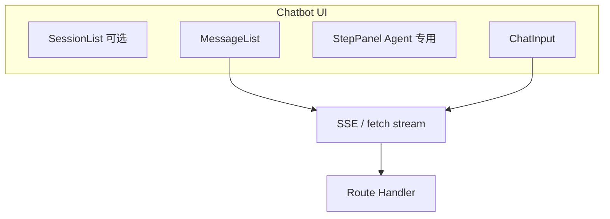

# 构建生产级 AI Chatbot UI

> [08](./08-build-first-agent.md) 跑通了 SSE + ReAct 折叠面板；[LangGraph 12](./langgraph/12-full-route-example.md) 给了 Route 骨架。这篇专注 **前端产品层**：会话模型、流式渲染、Agent 步骤展示、停止/重试、错误与空状态——把 demo 打磨成能上线的 Chatbot。

## 📚 目录

- [生产级 Chatbot 比 demo 多什么](#生产级-chatbot-比-demo-多什么)
- [会话模型：threadId 与消息结构](#会话模型threadid-与消息结构)
- [流式渲染：token 与 Markdown](#流式渲染token-与-markdown)
- [Agent 步骤 UI：Thought / Tool / Observation](#agent-步骤-uithought--tool--observation)
- [交互细节：停止、重试、滚动](#交互细节停止重试滚动)
- [加载、错误与空状态](#加载错误与空状态)
- [组件拆分建议](#组件拆分建议)
- [常见坑](#常见坑)
- [系列导航](#系列导航)

---

## 生产级 Chatbot 比 demo 多什么

| demo 常见 | 生产需要 |
|-----------|----------|
| 单页 `useState` 字符串 | 消息列表 + 角色 + 元数据 |
| 流式拼字符串 | 分块更新、Markdown 安全渲染 |
| 无 session | `threadId` 持久化、刷新续聊 |
| 不能停 | AbortController |
| Tool 过程不可见 | 可折叠步骤条 |
| 报错 `alert` | 可恢复错误 + 重试 |



---

## 会话模型：threadId 与消息结构

前端消息建议 **与展示对齐**，不必完全等于 LangChain `BaseMessage`：

```typescript
type MessageRole = "user" | "assistant" | "system";

interface ChatMessage {
    id: string;
    role: MessageRole;
    content: string;
    createdAt: number;
    /** Agent 专有：本轮推理步骤 */
    steps?: AgentStep[];
    status?: "streaming" | "done" | "error";
}

interface AgentStep {
    id: string;
    type: "tool_start" | "tool_end" | "thought";
    name?: string;
    detail?: string;
    timestamp: number;
}
```

### threadId 生命周期

```typescript
const THREAD_KEY = "blog-agent-thread";

function getOrCreateThreadId(): string {
    let id = localStorage.getItem(THREAD_KEY);
    if (!id) {
        id = crypto.randomUUID();
        localStorage.setItem(THREAD_KEY, id);
    }
    return id;
}

function newConversation() {
    localStorage.removeItem(THREAD_KEY);
    setMessages([]);
}
```

| 策略 | 说明 |
|------|------|
| 单 thread 续聊 | 博客助手、客服 |
| 多会话列表 | 需后端 `chat_sessions` 表（[LG 13](./langgraph/13-redis-neon-deployment.md)） |
| 与 checkpoint 对齐 | 请求体 `threadId` = LangGraph `thread_id` |

---

## 流式渲染：token 与 Markdown

### 累积 streaming 消息

```typescript
function appendToken(messages: ChatMessage[], token: string): ChatMessage[] {
    const last = messages.at(-1);
    if (!last || last.role !== "assistant" || last.status !== "streaming") {
        return [
            ...messages,
            {
                id: crypto.randomUUID(),
                role: "assistant",
                content: token,
                createdAt: Date.now(),
                status: "streaming",
                steps: [],
            },
        ];
    }
    return [
        ...messages.slice(0, -1),
        { ...last, content: last.content + token },
    ];
}

function finalizeAssistant(messages: ChatMessage[]): ChatMessage[] {
    const last = messages.at(-1);
    if (!last || last.role !== "assistant") return messages;
    return [...messages.slice(0, -1), { ...last, status: "done" }];
}
```

### Markdown 渲染

用 `react-markdown` + `remark-gfm`，流式时 **只渲染当前累积串**：

```tsx
import ReactMarkdown from "react-markdown";

<ReactMarkdown className="prose prose-sm dark:prose-invert">
    {message.content}
</ReactMarkdown>
```

| 注意 | 做法 |
|------|------|
| XSS | 不用 `dangerouslySetInnerHTML`；禁 raw HTML 或加 `rehype-sanitize` |
| 代码块 | `rehype-highlight` 或 Shiki |
| 流式半截代码块 | 可接受；结束后完整高亮 |

打字机光标：仅在 `status === "streaming"` 时显示 `▍`。

---

## Agent 步骤 UI：Thought / Tool / Observation

对齐 [08 ReAct UI](./08-build-first-agent.md#第六步构建用户界面) 与 [LG 06 streamEvents](./langgraph/06-streaming.md)：

```typescript
function handleStreamEvent(messages: ChatMessage[], evt: StreamEvent): ChatMessage[] {
    const last = messages.at(-1);
    if (!last || last.role !== "assistant") return messages;

    const steps = [...(last.steps ?? [])];

    if (evt.type === "tool_start") {
        steps.push({
            id: crypto.randomUUID(),
            type: "tool_start",
            name: evt.name,
            timestamp: Date.now(),
        });
    }
    if (evt.type === "tool_end") {
        steps.push({
            id: crypto.randomUUID(),
            type: "tool_end",
            name: evt.name,
            detail: truncate(evt.output, 200),
            timestamp: Date.now(),
        });
    }

    return [...messages.slice(0, -1), { ...last, steps }];
}
```

### 展示组件

```tsx
function AgentSteps({ steps }: { steps: AgentStep[] }) {
    if (!steps.length) return null;
    return (
        <details className="mt-2 text-sm text-muted-foreground">
            <summary>推理过程（{steps.length} 步）</summary>
            <ul className="mt-1 space-y-1">
                {steps.map((s) => (
                    <li key={s.id}>
                        {s.type === "tool_start" && `🔧 调用 ${s.name}`}
                        {s.type === "tool_end" && `📖 ${s.name}: ${s.detail}`}
                    </li>
                ))}
            </ul>
        </details>
    );
}
```

**产品选择：**

- 面向开发者/内部工具：默认展开步骤
- 面向普通用户：折叠或「显示思考过程」开关

---

## 交互细节：停止、重试、滚动

### 停止生成

```typescript
const abortRef = useRef<AbortController | null>(null);

async function send(text: string) {
    abortRef.current?.abort();
    abortRef.current = new AbortController();

    try {
        await fetchStream("/api/agent/chat", {
            body: JSON.stringify({ message: text, threadId }),
            signal: abortRef.current.signal,
        });
    } catch (e) {
        if ((e as Error).name === "AbortError") {
            finalizeAssistant(messages); // 保留已生成部分
        }
    }
}

function stop() {
    abortRef.current?.abort();
}
```

### 智能滚动

| 行为 | 实现 |
|------|------|
| 用户上滑阅读 | 不自动滚到底 |
| 用户在底部 | 新 token 滚到底 |

```typescript
const atBottomRef = useRef(true);

function onScroll(e: React.UIEvent<HTMLDivElement>) {
    const el = e.currentTarget;
    atBottomRef.current = el.scrollHeight - el.scrollTop - el.clientHeight < 80;
}

useEffect(() => {
    if (atBottomRef.current) listRef.current?.scrollTo({ top: listRef.current.scrollHeight });
}, [messages]);
```

### 重试

删除最后一条失败的 assistant，用 **上一条 user** 内容重新 `send`（新 assistant 消息，不重复 user）。

---

## 加载、错误与空状态

| 状态 | UI |
|------|-----|
| 首 token 未到 | 输入框旁 spinner +「思考中」 |
| Tool 执行中 | 步骤区「正在搜索…」 |
| 网络错误 | 气泡内错误文案 +「重试」 |
| 限流 429 | 「稍后再试」+ 倒计时（若 API 返回） |
| 空会话 | 欢迎语 + 示例问题 chips |

```tsx
const SUGGESTIONS = ["Runnable 是什么？", "如何给博客加 RAG？"];
```

示例 chips 点按直接 `send(suggestion)`。

---

## 组件拆分建议

```
components/agent-chat/
  AgentChat.tsx          # 容器：state、send、stop
  MessageList.tsx
  MessageBubble.tsx      # user / assistant 样式
  AgentSteps.tsx
  ChatInput.tsx          # textarea、Enter 发送、Shift+Enter 换行
  hooks/
    useAgentStream.ts    # SSE 解析、事件归一化
    useThreadId.ts
```

`useAgentStream` 把 [LG 12 Route](./langgraph/12-full-route-example.md) 的 `data:` 行解析收口，页面只消费 `onToken` / `onTool` / `onDone`。

---

## 常见坑

**1. 每条 token 新建一条 message**  
应累积到同一 assistant 气泡。

**2. threadId 每次 random**  
刷新像失忆。localStorage 或会话列表。

**3. 流式 Markdown 开完整语法检查**  
性能差。节流渲染（如 50ms 合并 token）。

**4. Observation 全文展示**  
撑爆布局。截断 +「展开」。

**5. 移动端软键盘顶起布局**  
`100dvh`、输入框 `sticky bottom`。

**6. 同时 EventSource 与 fetch stream**  
POST + SSE 用 `fetch` + `ReadableStream`（LG 12），`EventSource` 不支持 POST body。

---

## 系列导航

1. [08 第一个 Agent + SSE UI](./08-build-first-agent.md)
2. [16 LangGraph 实战](./16-langgraphjs-practice.md)
3. [LangGraph 12 Route 骨架](./langgraph/12-full-route-example.md)
4. **本文**
5. [18 上线 Checklist](./18-agent-production-checklist.md) · [19 收官](./19-blog-ai-assistant-capstone.md) · [22 Eval](./22-agent-eval-regression.md)

**总索引：** [README](./README.md) · **专系列：** [LangGraph 06 流式](./langgraph/06-streaming.md) · [LC 13 会话历史](./langchain/13-message-history.md)
