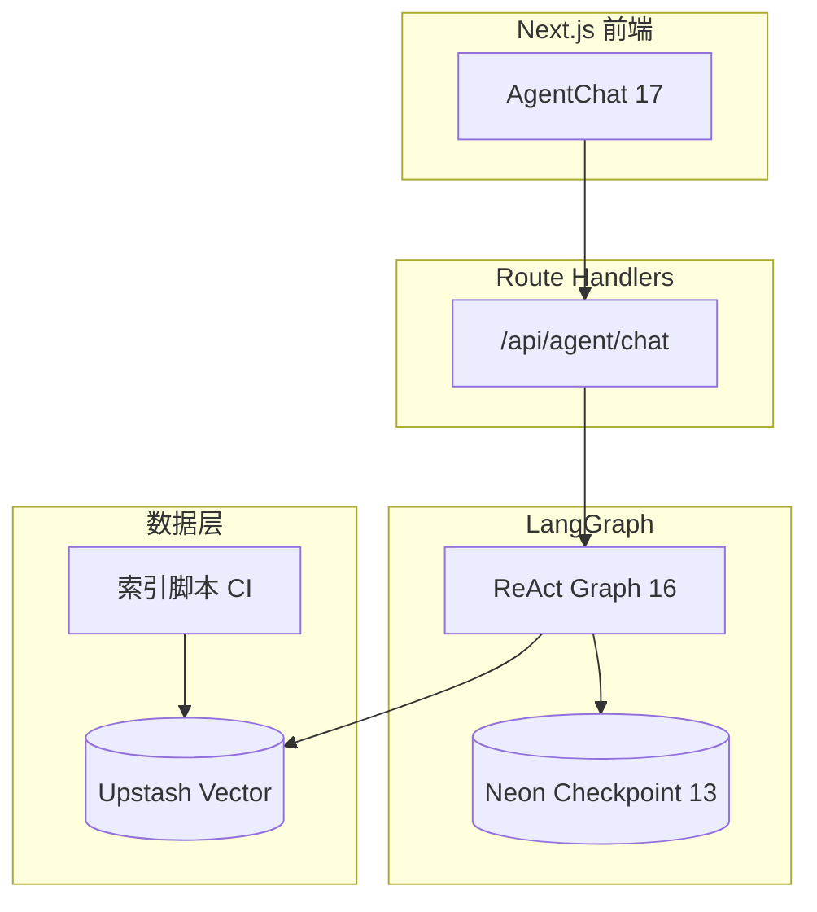

# 收官实战：博客 AI 助手全栈串联

> 把 [08 Agent](./08-build-first-agent.md)、[RAG 实战](./rag-blog-knowledge-search.md)、[16 LangGraph](./16-langgraphjs-practice.md)、[17 Chatbot UI](./17-build-production-chatbot-ui.md)、[18 上线清单](./18-agent-production-checklist.md) 收成 **一个可部署的「博客 AI 助手」**——读者问技术文章，Agent 检索 + Tool + 流式回答。

## 📚 目录

- [项目目标与边界](#项目目标与边界)
- [系统架构](#系统架构)
- [模块对照表：系列里学过什么](#模块对照表系列里学过什么)
- [数据流：一条用户问题](#数据流一条用户问题)
- [目录结构建议](#目录结构建议)
- [分阶段实现路线](#分阶段实现路线)
- [与 hello-agent 仓库的关系](#与-hello-agent-仓库的关系)
- [验收标准](#验收标准)
- [系列导航](#系列导航)

---

## 项目目标与边界

### 做什么

| 能力 | 说明 |
|------|------|
| 语义问答 | 基于 `docs/` 博客内容的 RAG |
| Agent 调研 | 维基 / 网页 Tool 补充站外概念 |
| 多轮对话 | `thread_id` + checkpoint |
| 流式 UI | SSE、步骤折叠、Markdown |
| 上线能力 | 限流、Trace、Eval（[18](./18-agent-production-checklist.md)） |

### 不做什么（第一版）

- 不写博客、不改数据库
- 不替代全站搜索（可与 [AI 检索](/categories/AI/) 并存）
- 不做开放域「任意代码执行」Tool

---

## 系统架构



| 层 | 技术选型 |
|----|----------|
| UI | React + [17 组件拆分](./17-build-production-chatbot-ui.md) |
| Agent | LangGraph [04 ReAct](./langgraph/04-react-toolnode.md) |
| RAG | [RAG 实战](./rag-blog-knowledge-search.md) + [LC 09](./langchain/09-vector-stores.md) |
| 索引 | `scripts/index-blog.ts` 读 `docs/ai/*.md` |
| 部署 | [LG 13](./langgraph/13-redis-neon-deployment.md) |

---

## 模块对照表：系列里学过什么

| 功能 | 系列文章 | 专系列 API |
|------|----------|------------|
| ReAct 循环 | 08、16 | LG 04 ToolNode |
| Tool 定义 | 09 | LC 05 `tool()` |
| 向量检索 | rag-blog、11 | LC 09、12 Retriever |
| 多轮状态 | 10 | LG 05 checkpoint、LC 13 |
| 流式 SSE | 08、17 | LG 06、12 Route |
| Router 闲聊 vs 搜文档 | 12 | LC 16 Branch 或 LG 03 条件边 |
| 上线 | 18 | LC 15 Eval |
| 框架胶水 | 15 | LC 01～16 |

---

## 数据流：一条用户问题

```
用户：「LangChain Runnable 和 LangGraph State 什么关系？」

1. UI send(message, threadId)
2. Route 鉴权 + rateLimit(userId)
3. graph.streamEvents → SSE
4. agent 节点：模型决定调 search_blog Tool
5. tools 节点：Retriever similaritySearch → Top-5 chunks
6. agent 节点：基于 ToolMessage 流式生成回答
7. UI：token 打字机 + tool_start/end 步骤
8. checkpointer 写入 Neon
9. LangSmith trace 完整链路
```

**闲聊路径：** 模型无 tool_calls → 直接文本回复，不调向量库。

---

## 目录结构建议

```
apps/blog-assistant/          # 已创建，见 apps/blog-assistant/README.md
  app/
    api/agent/chat/route.ts   # LG 12
    api/rag/chat/route.ts     # 阶段 1 固定 RAG
    agent/page.tsx            # 全页 Chatbot
  components/agent-chat/      # 17
  lib/
    agent/graph.ts
    agent/tools.ts            # search_blog, search_wikipedia
    agent/checkpointer.ts     # LG 13
    rag/retriever.ts
  scripts/
    index-blog.mjs            # 调用 tools/rag 索引
```

### 核心 Tool：`search_blog`

```typescript
import { tool } from "@langchain/core/tools";
import { z } from "zod";
import { blogRetriever } from "@/lib/rag/retriever";

export const searchBlog = tool(
    async ({ query }) => {
        const docs = await blogRetriever.invoke(query);
        return docs.map((d, i) =>
            `[${i + 1}] ${d.metadata.source}\n${d.pageContent.slice(0, 800)}`,
        ).join("\n---\n");
    },
    {
        name: "search_blog",
        description: "搜索本站技术博客（AI、前端、WebGL 等）。问本站文章、系列教程、API 用法时用。",
        schema: z.object({ query: z.string().describe("检索关键词，中文或英文") }),
    },
);
```

与 [11 Agentic RAG](./11-advanced-rag-patterns.md) 一致：检索由 Agent 触发，不是每条消息硬 RAG。

---

## 分阶段实现路线

### 阶段 1：只读 RAG Chat（约 2 天）

- [x] `index-blog.mjs` → 调用 `tools/rag` 索引
- [x] 固定 RAG 链 + 流式 UI（`/api/rag/chat`）
- [ ] 验证：能答「11 篇 RAG 进阶讲什么」

### 阶段 2：LangGraph Agent（约 3 天）

- [x] `search_blog` + `search_wikipedia`
- [x] MemorySaver 多轮（`threadId`）
- [x] ReAct 步骤 UI（tool_start / tool_end）

### 阶段 3：生产化（约 3 天）

- [x] Neon checkpointer + session 鉴权（`DATABASE_URL` + Cookie `ba_uid`）
- [x] 限流 + LangSmith 元数据 + [LC 15](./langchain/15-langsmith-eval.md) golden 10 条（`pnpm blog-assistant:eval`）
- [x] 部署 Vercel 配置（[LG 13](./langgraph/13-redis-neon-deployment.md) · `vercel.json`）

### 阶段 4：增强（可选）

- [x] 多会话列表 UI（侧栏 + Neon / localStorage）
- [x] 引用跳转：`citations` SSE → 博客 URL 卡片
- [x] 站内悬浮助手 widget（`/widget` + `public/embed.js`）

---

## 与 hello-agent 仓库的关系

| | hello-agent（08 配套） | blog-assistant（本篇） |
|--|------------------------|------------------------|
| 后端 | Express + 自研 ReAct | Next.js + LangGraph |
| 前端 | React SSE | 17 生产 UI |
| 知识库 | 通用调研 | **本站 docs 向量库** |
| 学习目标 | 懂原理 | **系列串联上线** |

建议：08 自研跑通原理 → 16/专系列用框架重写 → 本篇做产品化。

---

## 验收标准

| # | 场景 | 期望 |
|---|------|------|
| 1 | 问本站系列编号 | 引用正确文章，不胡编 |
| 2 | 问站外概念 | 可调 wiki Tool 或直答 |
| 3 | 多轮「上一句我说的啥」 | checkpoint 生效 |
| 4 | 刷新页面同 thread | 续聊（或明确新会话） |
| 5 | 流式中途停止 | 保留已输出，不报错 |
| 6 | 未登录 / 超限 | 清晰错误，不泄露堆栈 |
| 7 | LangSmith | 单次请求可看 Tool 输入输出 |
| 8 | Eval 集 | 10 条 golden 通过率 ≥ 约定阈值 |

---

## 系列导航

**Agent 主线（建议完整路径）：**

1. [07 架构](./07-ai-agent-architecture.md) → [08 第一个 Agent](./08-build-first-agent.md)
2. [09 Tools](./09-tools-system-design.md) → [10 Memory](./10-memory-planning-agent.md)
3. [RAG 实战](./rag-blog-knowledge-search.md) → [11～14 进阶]
4. [15 LC 生态](./15-langchain-js-guide.md) → [16 LG 实战](./16-langgraphjs-practice.md)
5. [17 Chatbot UI](./17-build-production-chatbot-ui.md) → [18 Checklist](./18-agent-production-checklist.md)
6. **本文收官**

**Phase 2（扩展）：**

7. [20 Vercel AI SDK](./20-vercel-ai-sdk-guide.md) · [21 多模态](./21-multimodal-interaction.md)
8. [22 Eval](./22-agent-eval-regression.md) · [23 Skills](./23-skills-agent-bridge.md) · [24 传统 Web](./24-traditional-web-ai-integration.md) · [25 Langfuse](./25-langfuse-practice.md) · [26 CopilotKit](./26-copilotkit-guide.md)

**深挖：** [LangChain 专系列](./langchain/README.md) · [LangGraph 专系列](./langgraph/README.md)

**总索引：** [README](./README.md) · **路线图：** [ai-agent-learning-roadmap](./ai-agent-learning-roadmap.md)
