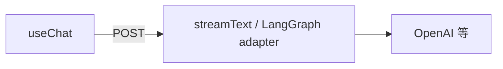

# Vercel AI SDK 完全指南：useChat 与 Tool 调用

> [17 Chatbot UI](./17-build-production-chatbot-ui.md) 用手写 `fetch` + SSE 解析；[LangGraph 06/12](./langgraph/12-full-route-example.md) 用 `streamEvents`。**Vercel AI SDK** 把「流式聊天、Tool 调用、消息状态」封装成 React Hooks——适合 Next.js 项目快速落地。

## 📚 目录

- [SDK 解决什么问题](#sdk-解决什么问题)
- [安装与核心包](#安装与核心包)
- [useChat：最小聊天](#usechat最小聊天)
- [Route Handler：streamText](#route-handlerstreamtext)
- [Tool 调用与前端展示](#tool-调用与前端展示)
- [与 LangGraph / 自研 SSE 怎么选](#与-langgraph--自研-sse-怎么选)
- [常见坑](#常见坑)
- [系列导航](#系列导航)

---

## SDK 解决什么问题

| 手写（08/17） | Vercel AI SDK |
|---------------|---------------|
| 自己拼 SSE 协议 | `toDataStreamResponse()` 标准流 |
| `useState` 管 messages | `useChat` 内置 |
| 自己处理 loading/error | Hook 状态字段 |
| Tool 结果展示 | `toolInvocations` 等（视版本） |



**定位：** 前端 Chat **体验层**；复杂 Agent 图仍可在 Route 里跑 LangGraph，再适配 SDK 流格式。

---

## 安装与核心包

```bash
pnpm add ai @ai-sdk/openai @ai-sdk/react
```

| 包 | 作用 |
|----|------|
| `ai` | `streamText`、`generateText`、Core 类型 |
| `@ai-sdk/openai` | OpenAI 提供商 |
| `@ai-sdk/react` | `useChat`、`useCompletion` |

环境变量：`OPENAI_API_KEY`（仅服务端）。

---

## useChat：最小聊天

### Route Handler

```typescript
// app/api/chat/route.ts
import { openai } from "@ai-sdk/openai";
import { streamText } from "ai";

export async function POST(req: Request) {
    const { messages } = await req.json();

    const result = streamText({
        model: openai("gpt-4o-mini"),
        messages,
        system: "你是本站技术博客助手，回答简洁。",
    });

    return result.toDataStreamResponse();
}
```

### 客户端

```tsx
"use client";
import { useChat } from "@ai-sdk/react";

export function Chat() {
    const { messages, input, setInput, handleSubmit, isLoading, stop } = useChat({
        api: "/api/chat",
    });

    return (
        <div>
            {messages.map((m) => (
                <div key={m.id}>
                    <b>{m.role}:</b> {m.content}
                </div>
            ))}
            <form onSubmit={handleSubmit}>
                <input value={input} onChange={(e) => setInput(e.target.value)} />
                <button type="submit" disabled={isLoading}>发送</button>
                <button type="button" onClick={stop}>停止</button>
            </form>
        </div>
    );
}
```

| `useChat` 字段 | 说明 |
|----------------|------|
| `messages` | 含 `role`、`content`、`id` |
| `input` / `setInput` | 输入框绑定 |
| `handleSubmit` | 提交并流式更新 |
| `isLoading` | 请求进行中 |
| `stop` | 中止生成 |
| `error` | 错误对象 |

对比 [17](./17-build-production-chatbot-ui.md)：`useChat` 省掉大量 state 与 SSE 解析。

---

## 多轮与 body 扩展

```tsx
const { messages, append } = useChat({
    api: "/api/agent/chat",
    body: { threadId },
    id: threadId, // 会话 id，换会话时重置
});
```

Route 里读 `threadId` 传给 LangGraph `configurable.thread_id`（[LG 05](./langgraph/05-checkpointer.md)）。

---

## Tool 调用与前端展示

### Route

```typescript
import { z } from "zod";
import { tool } from "ai";

const searchBlog = tool({
    description: "搜索本站博客",
    parameters: z.object({ query: z.string() }),
    execute: async ({ query }) => {
        const docs = await blogRetriever.invoke(query);
        return docs.map((d) => d.pageContent).join("\n");
    },
});

const result = streamText({
    model: openai("gpt-4o-mini"),
    messages,
    tools: { searchBlog },
    maxSteps: 5, // 多步 Tool 循环上限
});

return result.toDataStreamResponse();
```

### 前端

SDK 流里会带 tool call 事件；`messages` 中可能出现 `toolInvocations` 或 parts（**以当前 `ai` 包文档为准**）。展示思路同 [17 AgentSteps](./17-build-production-chatbot-ui.md)：

- Tool 执行中：loading 文案
- 完成后：折叠 Observation 摘要

---

## 接 LangGraph 图

LangGraph `streamEvents` 不直接等于 AI SDK 数据流，常见两种做法：

| 做法 | 说明 |
|------|------|
| **A. 图内只用 Model，Route 用 `streamText`** | 简单 Agent 够用 |
| **B. 自定义 `ReadableStream` 转 AI SDK 格式** | 保留完整图 trace |
| **C. 不用 SDK，继续 17 手写 SSE** | 图复杂时最可控 |

博客助手（[19](./19-blog-ai-assistant-capstone.md)）若已用 LangGraph + `streamEvents`，**不必强行换 SDK**；新页面或纯聊天子功能可用 `useChat` 减代码。

---

## 与 LangGraph / 自研 SSE 怎么选

| 场景 | 推荐 |
|------|------|
| Next.js 纯聊天、少量 Tool | **Vercel AI SDK** |
| 多节点图、interrupt、checkpoint | **LangGraph** + 17 SSE 或适配层 |
| 已有 Express SSE（08） | 可渐进迁移 Route 到 SDK |
| 要 LangSmith 图节点级 trace | LangGraph 更直观 |

| 流式方案 | 前端 | 后端 |
|----------|------|------|
| 自研 SSE | `fetch` reader | 任意 |
| AI SDK | `useChat` | `streamText` |
| LangGraph | 17 / LG 06 | `streamEvents` |

---

## 常见坑

**1. `useChat` 在 Server Component 里用**  
必须 `"use client"`。

**2. `maxSteps` 不设**  
Tool 循环失控。对齐 Agent `maxIterations`。

**3. Tool `execute` 里无鉴权**  
从 `headers` / session 取 userId。

**4. 混用 AI SDK 消息格式与 LangChain Message**  
Route 边界做转换，或统一一侧。

**5. 版本升级流格式变化**  
锁 `ai` 版本，读 [官方 Migration](https://sdk.vercel.ai/docs)。

---

## 系列导航

**生态三角（建议一起读）：**

1. [15 LangChain.js 生态](./15-langchain-js-guide.md) — 积木 + 自选组装
2. **本文** — Chat UI 体验层
3. [27 Mastra 速览](./27-mastra-typescript-agent-framework.md) — TS 一体化 Agent 平台

**主线续读：**

1. [17 Chatbot UI](./17-build-production-chatbot-ui.md)
2. [21 多模态](./21-multimodal-interaction.md)
3. [19 收官](./19-blog-ai-assistant-capstone.md)

**总索引：** [README](./README.md) · **专系列：** [Mastra](./mastra/README.md) · [LG 06 流式](./langgraph/06-streaming.md) · [LC 02 Model](./langchain/02-chat-models.md)
