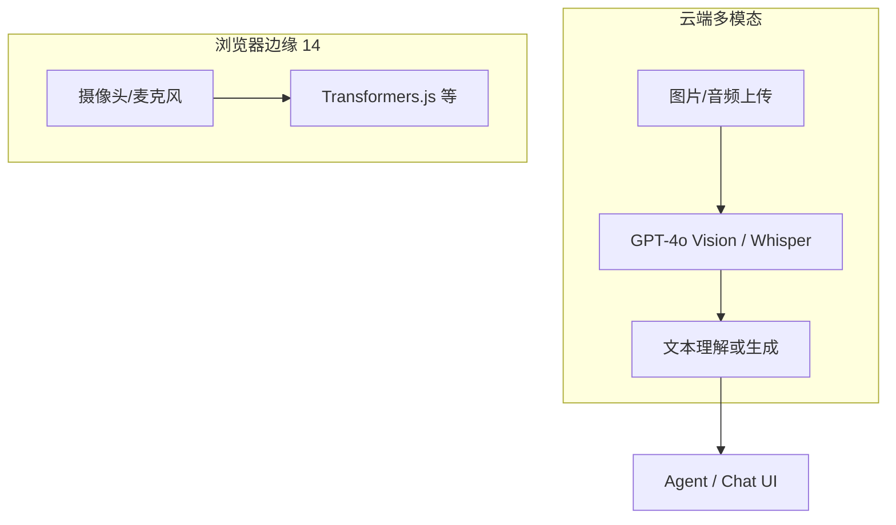

# 多模态交互：图像理解与浏览器语音

> 前面系列以 **文本 Chat** 为主。产品里还会遇到：上传截图问 bug、语音问问题、读图再 RAG。这篇从前端能落地的 **Vision API + 浏览器录音** 讲起，和 [14 WebAI](./14-webai-and-edge-inference.md) 边缘推理怎么分工。

## 📚 目录

- [多模态在 Web 里的两类路径](#多模态在-web-里的两类路径)
- [图像：Vision API 基础](#图像vision-api-基础)
- [图像 + Agent / RAG](#图像--agent--rag)
- [浏览器录音与语音输入](#浏览器录音与语音输入)
- [语音输出 TTS](#语音输出-tts)
- [与 WebAI 边缘分工](#与-webai-边缘分工)
- [常见坑](#常见坑)
- [系列导航](#系列导航)

---

## 多模态在 Web 里的两类路径



| 路径 | 适合 |
|------|------|
| 云端 Vision / Whisper | 质量高、模型大、要 API |
| 浏览器边缘 | 隐私、离线、轻量分类 |

---

## 图像：Vision API 基础

### OpenAI 兼容消息结构

对齐 [LC 03 Messages](./langchain/03-messages.md) 多模态 `content`：

```typescript
import { HumanMessage } from "@langchain/core/messages";
import { ChatOpenAI } from "@langchain/openai";

const model = new ChatOpenAI({ model: "gpt-4o-mini" });

const message = new HumanMessage({
    content: [
        { type: "text", text: "这张 UI 截图里按钮布局有什么问题？" },
        {
            type: "image_url",
            image_url: { url: "https://example.com/screenshot.png" },
            // 或 base64: data:image/png;base64,...
        },
    ],
});

const res = await model.invoke([message]);
```

### 前端上传转 base64

```typescript
async function fileToDataUrl(file: File): Promise<string> {
    const buf = await file.arrayBuffer();
    const base64 = btoa(String.fromCharCode(...new Uint8Array(buf)));
    return `data:${file.type};base64,${base64}`;
}
```

| 注意 | 说明 |
|------|------|
| 体积 | 大图先压缩；API 有大小限制 |
| 格式 | png/jpeg/webp |
| 隐私 | 敏感截图走服务端，勿打公网日志 |

### useChat + 图片（AI SDK）

```tsx
// 视 ai 包版本，可用 experimental_attachments 或 parts
await append({
    role: "user",
    content: "解释这张图",
    experimental_attachments: [{ url: dataUrl, contentType: "image/png" }],
});
```

查阅当前 [Vercel AI SDK 多模态文档](./20-vercel-ai-sdk-guide.md) 对应字段名。

---

## 图像 + Agent / RAG

**场景：** 用户上传架构图，问「和博客里哪篇 Agent 架构一致？」

```typescript
const analyzeImage = tool(
    async ({ question }, config) => {
        const imageUrl = config?.configurable?.imageUrl as string;
        const vision = new ChatOpenAI({ model: "gpt-4o" });
        const desc = await vision.invoke([
            new HumanMessage({
                content: [
                    { type: "text", text: "详细描述图中组件与数据流，中文。" },
                    { type: "image_url", image_url: { url: imageUrl } },
                ],
            }),
        ]);
        const docs = await blogRetriever.invoke(String(desc.content));
        return formatDocs(docs);
    },
    {
        name: "analyze_image_and_search",
        description: "用户提供了图片时，先理解图再搜博客",
        schema: z.object({ question: z.string() }),
    },
);
```

流程：**Vision 转文本描述 → 检索**（比直接向量化图片简单，质量依赖描述）。

---

## 浏览器录音与语音输入

### MediaRecorder 采集

```typescript
let mediaRecorder: MediaRecorder;
const chunks: BlobPart[] = [];

async function startRecording() {
    const stream = await navigator.mediaDevices.getUserMedia({ audio: true });
    mediaRecorder = new MediaRecorder(stream);
    mediaRecorder.ondataavailable = (e) => chunks.push(e.data);
    mediaRecorder.start();
}

async function stopAndTranscribe() {
    mediaRecorder.stop();
    const blob = new Blob(chunks, { type: "audio/webm" });
    const form = new FormData();
    form.append("file", blob, "audio.webm");

    const res = await fetch("/api/transcribe", { method: "POST", body: form });
    const { text } = await res.json();
    return text; // 填入 ChatInput，走正常文本 Chat
}
```

### Route：Whisper

```typescript
// app/api/transcribe/route.ts
import OpenAI from "openai";

const openai = new OpenAI();

export async function POST(req: Request) {
    const form = await req.formData();
    const file = form.get("file") as File;
    const transcription = await openai.audio.transcriptions.create({
        file,
        model: "whisper-1",
    });
    return Response.json({ text: transcription.text });
}
```

**UX：** 按住说话、松开发送；录音时显示波形；失败可回退键盘输入。

---

## 语音输出 TTS

```typescript
const mp3 = await openai.audio.speech.create({
    model: "tts-1",
    voice: "alloy",
    input: assistantText,
});
const buffer = Buffer.from(await mp3.arrayBuffer());
// 返回 audio/mpeg 或前端 Audio 播放
```

适合「读答案」模式；注意流量与自动播放策略（浏览器可能拦截）。

---

## 与 WebAI 边缘分工

| 任务 | 云端 | 浏览器 [14](./14-webai-and-edge-inference.md) |
|------|------|-----------------------------------------------------|
| 截图复杂理解 | GPT-4o Vision | 弱 |
| 语音转写 | Whisper API | 小模型 WASM 可选 |
| 意图「要不要搜文档」 | mini 模型 | 本地分类 |
| 敏感图不出设备 | — | 仅边缘描述特征 |

---

## 常见坑

**1. base64 巨型 payload**  
先压缩；或上传对象存储得 URL 再送 Vision。

**2. iOS 录音格式**  
测 `audio/mp4` vs `webm` 兼容性。

**3. Vision 幻觉读图**  
关键信息要求引用博客 RAG，不只靠图。

**4. 麦克风权限拒绝**  
降级纯文本，明确提示。

**5. TTS 自动播放被拦**  
用户点击「播放」再 `audio.play()`。

---

## 系列导航

1. [20 Vercel AI SDK](./20-vercel-ai-sdk-guide.md)
2. **本文**
3. [22 Agent Eval](./22-agent-eval-regression.md)
4. [14 WebAI](./14-webai-and-edge-inference.md)

**总索引：** [README](./README.md)
