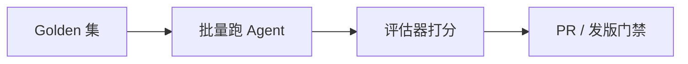

# Agent 评估与回归测试

> LLM 输出不像单元测试那样 `===` 断言。[18 上线清单](./18-agent-production-checklist.md) 提到 Eval；[LC 15](./langchain/15-langsmith-eval.md) 讲了 LangSmith API。这篇从 **博客 Agent 产品视角**：建什么 golden、测什么维度、PR 里怎么跑、前端如何参与。

## 📚 目录

- [为什么 Agent 要特别测](#为什么-agent-要特别测)
- [测什么：四层指标](#测什么四层指标)
- [黄金数据集怎么建](#黄金数据集怎么建)
- [评估器：规则、LLM Judge、人工](#评估器规则llm-judge人工)
- [CI 与发版门禁](#ci-与发版门禁)
- [前端/产品参与 Eval](#前端产品参与-eval)
- [常见坑](#常见坑)
- [系列导航](#系列导航)

---

## 为什么 Agent 要特别测

| 传统 API | Agent |
|----------|-------|
| 固定输入 → 固定输出 | 多步、Tool、随机性 |
| 改代码 break test | 改 Prompt 也 break |
| 单测毫秒级 | 一条 case 数秒 + Token |

**没有 Eval：** 改 RAG 分块或 Router Prompt，「感觉还行」上线，用户发现检索全挂。



---

## 测什么：四层指标

对齐 [11 RAG 进阶](./11-advanced-rag-patterns.md#怎么知道改好了没有)：

| 层 | 测什么 | 示例断言 |
|----|--------|----------|
| **检索** | 对不对文档进 context | 期望 `source` 含 `11-advanced-rag` |
| **Tool** | 该不该调、参数对不对 | 问本站应 `search_blog` |
| **生成** | 答案是否含要点、无幻觉 | 含「Runnable」且不提未收录 API |
| **端到端** | 用户问题 → 最终回复 | LLM Judge 或关键词 |

Agent 项目 **至少** 维护端到端 golden；检索/Tool 可拆子集加速调试。

---

## 黄金数据集怎么建

### 来源

1. **手工写** — 覆盖核心教程路径（08→19 各一篇问法）
2. **生产 trace 沉淀** — LangSmith 坏 case 一键进 Dataset（[LC 11/15](./langchain/15-langsmith-eval.md)）
3. **用户反馈** — 「答错了」工单转 case

### 博客助手示例（10～20 条起步）

```json
{
  "inputs": { "message": "LangGraph checkpoint 和 Memory 有什么区别？" },
  "reference_outputs": {
    "must_include": ["checkpoint", "State", "向量", "长期"],
    "should_call_tool": "search_blog"
  },
  "metadata": { "tag": "memory", "difficulty": "medium" }
}
```

| 字段 | 用途 |
|------|------|
| `must_include` | 规则评估器 |
| `should_call_tool` | Tool 路由评估 |
| `tag` | 报告分组 |

---

## 评估器：规则、LLM Judge、人工

### 规则（便宜、稳定）

```typescript
function keywordEvaluator({ outputs, referenceOutputs }) {
    const text = String(outputs?.answer ?? "");
    const keys = referenceOutputs.must_include as string[];
    const hit = keys.filter((k) => text.includes(k)).length / keys.length;
    return { key: "keyword_recall", score: hit };
}
```

### Tool 调用评估

从 LangSmith trace 或 Agent 返回结构读：

```typescript
function toolEvaluator({ outputs, referenceOutputs }) {
    const expected = referenceOutputs.should_call_tool;
    const called = outputs?.toolCalls?.includes(expected);
    return { key: "tool_correct", score: called ? 1 : 0 };
}
```

需在 `target` 函数里返回 `toolCalls` 列表，或查 trace。

### LLM-as-Judge

语义打分，见 [LC 15](./langchain/15-langsmith-eval.md)。适合开放答案；**贵 + 有波动**，作补充。

### 人工

发版前抽 5 条人工点「能上线吗」——小团队高性价比。

---

## CI 与发版门禁

```typescript
// scripts/run-agent-eval.ts
import { evaluate } from "langsmith/evaluation";

const result = await evaluate(agentTarget, {
    data: "blog-agent-golden-v1",
    evaluators: [keywordEvaluator, toolEvaluator],
    experimentPrefix: `ci-${process.env.GITHUB_SHA?.slice(0, 7)}`,
});

const avg = result.results?.aggregate?.keyword_recall;
if (avg < 0.85) process.exit(1);
```

| 策略 | 说明 |
|------|------|
| PR | 跑子集 10 条，<2 分钟 |
| main 合并 | 全量 30 条 |
| 定时 nightly | 含生产抽样 case |

环境：Staging 向量库 + 独立 API Key 预算上限。

---

## 前端/产品参与 Eval

| 角色 | 做什么 |
|------|--------|
| 产品 | 定义「必须能答对」的问题清单 |
| 前端 | Eval 结果页（可选）：实验对比 UI |
| 开发 | 评估器 + CI |

**Eval 结果页（内部工具）思路：**

- 拉 LangSmith Experiments API
- 展示 pass/fail、diff 高亮
- 不面向普通读者，放 `/admin/eval`

读者侧质量靠持续扩充 golden + [18](./18-agent-production-checklist.md) 监控。

---

## 常见坑

**1. golden 太少**  
3 条看不出回归。至少 10+，按 tag 覆盖。

**2. 只测最终字符串**  
检索挂了仍 pass。拆检索评估。

**3. Eval 连生产**  
用 staging 索引。

**4. temperature > 0 跑 Eval**  
分数抖动。Eval 用 `temperature: 0`。

**5. Judge 模型与产品模型同**  
可能偏袒。Judge 可换更强或不同厂商。

---

## 系列导航

1. [18 上线 Checklist](./18-agent-production-checklist.md)
2. **本文**
3. [LC 15 LangSmith Eval API](./langchain/15-langsmith-eval.md)
4. [23 Skills 与程序记忆](./23-skills-agent-bridge.md) · [25 Langfuse](./25-langfuse-practice.md)

**总索引：** [README](./README.md)
