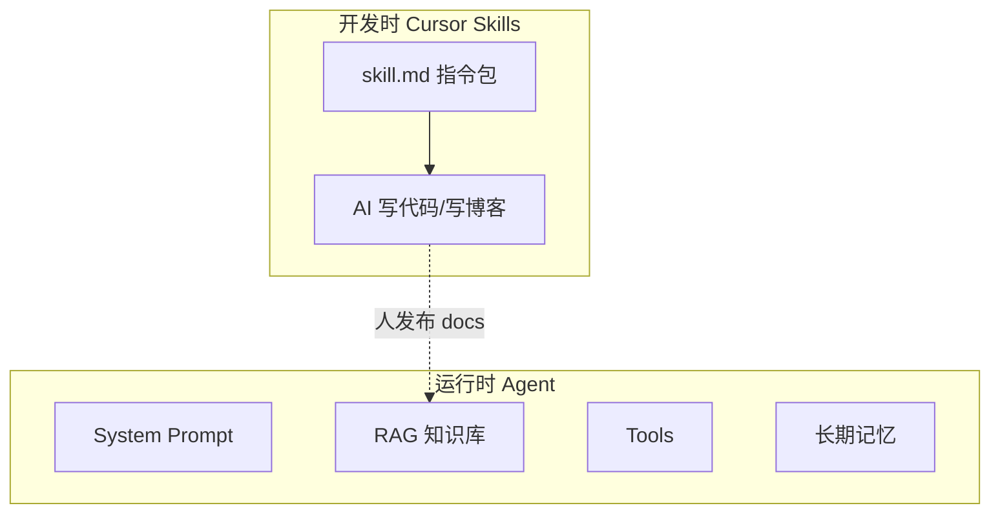

# Skills 与 Agent 程序记忆：从 IDE 到运行时

> [Skills 入门指南](./skills-guide.md) 讲的是 **Cursor/Claude Code 开发时** 加载的技能包。[13 Memory 进阶](./13-advanced-memory.md) 讲的是 **长期记忆与程序记忆**。这篇把两条线接上：**Skills 本质是什么、和 Agent Tool/RAG 怎么对应、能否在博客助手里用**。

## 📚 目录

- [Skills 在生态里的位置](#skills-在生态里的位置)
- [程序记忆：三件套对照](#程序记忆三件套对照)
- [Skills vs Tool vs RAG vs Prompt](#skills-vs-tool-vs-rag-vs-prompt)
- [开发时 Skills：你已经在用](#开发时-skills你已经在用)
- [运行时「技能」怎么实现](#运行时技能怎么实现)
- [博客场景示例](#博客场景示例)
- [常见坑](#常见坑)
- [系列导航](#系列导航)

---

## Skills 在生态里的位置



| 阶段 | 载体 | 消费者 |
|------|------|--------|
| 开发 | `~/.cursor/skills`、项目 Skills | 编辑器里的 AI |
| 运行 | Route + LangGraph | 站点上的博客助手 |

**Skills 不是运行时自动加载的魔法**——除非你把 skill 内容 **编进索引或 System**。

---

## 程序记忆：三件套对照

[13 进阶](./13-advanced-memory.md) 中的 **程序记忆（Procedural Memory）** = Agent「怎么做某类事」的流程，不是事实。

| 概念 | 存什么 | Skills 关系 |
|------|--------|-------------|
| 事实记忆 | 用户偏好、知识点 | RAG / 向量库 |
|  episodic | 某次任务过程 | checkpoint messages |
| **程序记忆** | 步骤、检查清单、模板 | **≈ Skill 里的 workflow** |

示例程序记忆：「写系列博文：先目录、再原理、再代码、再坑、再导航」——可写成 Skill 文件，也可写成 Agent System 或 **专用 Tool 返回 checklist**。

---

## Skills vs Tool vs RAG vs Prompt

| 机制 | 何时更新 | 适合 |
|------|----------|------|
| **System Prompt** | 发版改代码 | 稳定人设、硬规则 |
| **RAG** | 重建索引 | 大量文档、事实问答 |
| **Tool** | 改函数实现 | 查 API、执行动作 |
| **Skill（开发）** | `npx skills add` | 教 IDE 按规范写 |
| **运行时「技能包」** | 发 skill 文档进向量库 | 教 **线上 Agent** 按流程答 |

**不要** 把整个 Skill 仓库塞进 System（爆 Token）。大技能库 → **RAG 检索相关 skill 片段** 或 **Router 选技能名再加载文件**。

---

## 开发时 Skills：你已经在用

写本系列时可能的 Skills：

- `api-design-principles` — API 设计
- `vercel-react-best-practices` — React 性能
- 自定义 `blog-ai-series` — 博文结构、导航、文风

见 [skills-guide 推荐列表](./skills-guide.md#推荐-skills)。

**对读者的价值：** 你用 Skills 把「怎么写 LangChain 深挖文」固化，产出一致的 `docs/ai/langchain/*`——这是 **人的程序记忆外置**。

---

## 运行时「技能」怎么实现

### 方案 A：RAG 索引 Skill 文档

把 `skills-guide.md`、系列写作规范、FAQ 放进向量库：

```typescript
const loadWritingGuide = tool(
    async ({ topic }) => {
        const docs = await guideRetriever.invoke(`如何写 ${topic} 教程`);
        return formatDocs(docs);
    },
    { name: "load_writing_guide", ... },
);
```

用户问「这篇该怎么结构」时 Agent 调 Tool——**不是 Cursor Skill，效果类似**。

### 方案 B：技能 Router

```typescript
const skills = {
    rag_troubleshoot: "检索失败时：查索引、查 embedding 模型、k、filter…",
    agent_debug: "Agent 胡说：查 trace、查 Tool description、查 messages…",
};

async function skillRouterNode(state) {
    const intent = await classify(state.messages.at(-1)?.content);
    const guide = skills[intent] ?? "";
    return { messages: [new SystemMessage(guide)] };
}
```

轻量流程写进图节点（[LG 07 子图](./langgraph/07-subgraphs.md)）。

### 方案 C：仅开发侧 Skills

线上助手 **不实现** Skills，只索引 **已发布的博客正文**——对读者最实用（[19 收官](./19-blog-ai-assistant-capstone.md)）。

---

## 博客场景示例

| 用户问题 | 合适机制 |
|----------|----------|
| 「Runnable 是什么」 | RAG `search_blog` |
| 「我该怎么学 Agent 系列」 | RAG 路线图 + 程序记忆短文 |
| 「帮我按系列规范写一篇大纲」 | 开发用 Cursor Skill；线上可用 `load_writing_guide` Tool |
| 「记住我喜欢简短回答」 | 长期记忆表 / 用户 profile（13 进阶） |

---

## 常见坑

**1. 以为装了 Skills 线上 Agent 会自动会**  
线上要显式 RAG/Tool/System。

**2. Skill 与 Tool 重复维护**  
选一侧为主：流程类进 Skill 文档再索引；动作类进 Tool。

**3. 把密钥写进 Skill 文件**  
Skill 可能进 git、进索引。只放公开规范。

**4. 程序记忆无限增长**  
按场景拆技能，Router 只加载一条。

**5. 忽视 skills-guide 与 Agent 系列重复**  
skills-guide = IDE 工具；本篇 = 运行时概念对齐。

---

## 系列导航

1. [Skills 入门指南](./skills-guide.md)
2. [13 Memory 进阶](./13-advanced-memory.md)
3. **本文**
4. [24 传统 Web 接入 AI](./24-traditional-web-ai-integration.md)
5. [19 收官](./19-blog-ai-assistant-capstone.md)

**总索引：** [README](./README.md)
