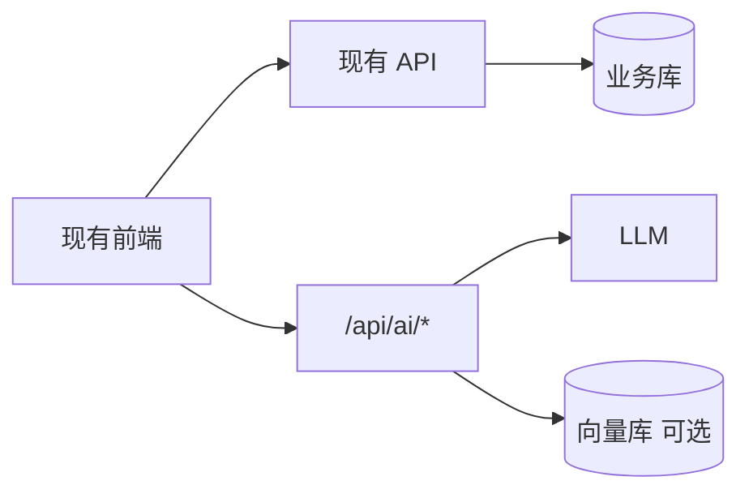

# 传统 Web 项目接入 AI：旁路增强实战路径

> 系列默认 Next.js + LangGraph。公司很多项目是 **Vue/React 老站 + Java/Node 单体**。这篇给 **不改核心交易链路** 的接入路径，对照本系列已写文章，按 90 天节奏落地。

## 📚 目录

- [约束与原则](#约束与原则)
- [架构：旁路 AI 层](#架构旁路-ai-层)
- [八个切入点（按优先级）](#八个切入点按优先级)
- [三种落地架构](#三种落地架构)
- [与系列文章对照](#与系列文章对照)
- [90 天节奏](#90-天节奏)
- [反模式](#反模式)
- [系列导航](#系列导航)

---

## 约束与原则

| 典型现状 | 接入原则 |
|----------|----------|
| 单体 Spring / Express | 加 `/api/ai/*`，不拆核心包 |
| Vue2 / jQuery 混用 | 前端只多调几个 HTTP |
| 无向量库 | 先一个 RAG POC |
| 不能重写下单支付 | **LLM 不直接写库** |

**AI = 增强层**，不是替换 ERP/商城核心。



---

## 架构：旁路 AI 层

### 最小 POC（2 周）

1. 选 **只读** 文档库（帮助中心 / 内部 Wiki）
2. 索引脚本 + `POST /api/ai/chat`（RAG 固定链，无 Agent）
3. 现有页加「智能问答」抽屉

对应阅读：[RAG 实战](./rag-blog-knowledge-search.md) · [LC 06～09](./langchain/README.md)

### 标准助手（1～2 月）

1. LangGraph ReAct + `search` Tool 包现有 REST（只读）
2. checkpoint + [17 Chatbot UI](./17-build-production-chatbot-ui.md)
3. [18 上线清单](./18-agent-production-checklist.md) + [LG 13](./langgraph/13-redis-neon-deployment.md)

### 企业内网

- 模型走 **私有网关**（[LC 02 baseURL](./langchain/02-chat-models.md)）
- 数据不出域；Eval 内网 LangSmith 或日志

---

## 八个切入点（按优先级）

| # | 场景 | 风险 | 系列参考 |
|---|------|------|----------|
| 1 | 文档语义搜索 / 问答 | 低 | RAG 实战、11、LC 12 |
| 2 | 侧边栏 Copilot（只读 Tool） | 低 | [26 CopilotKit](./26-copilotkit-guide.md)、16、LG 04、[17 UI](./17-build-production-chatbot-ui.md) |
| 3 | 表单旁「润色/总结」按钮 | 低 | LC 02 单次 invoke |
| 4 | 工单分类打标 | 中 | LC 10 Parser、22 Eval |
| 5 | 自然语言查报表 API | 中 | 09 Tools、LC 05 |
| 6 | 审批流 + interrupt | 中 | LG 08、09 |
| 7 | Multi-Agent 报表 | 高 | 12、LG 07 |
| 8 | 对外客服 Bot | 高 | 18、22 |

**先做 1～3**，跑稳再 5～6。

---

## 三种落地架构

| 模式 | 做法 | 适合 |
|------|------|------|
| **BFF 旁路** | 现有 Node/Java 加 `ai` 模块 | 不想新服务 |
| **独立 ai-service** | 主站 HTTP 调 AI 服务 | 多产品共用 |
| **Serverless** | 云函数处理对话 | 流量小、快试 |

前端无关框架：`fetch` + SSE 与 [17](./17-build-production-chatbot-ui.md) 相同；Vue 可复用 `useAgentStream` 逻辑。

### Java 单体旁路示例（概念）

```
现有 Spring Boot
  ├── controller/OrderController   # 不动
  └── controller/AiChatController  # 新增，内调 LangGraph4j 或 HTTP 转 Node ai-service
```

Node 栈可直接 [LG 12 Route](./langgraph/12-full-route-example.md) 嵌进 Express。

---

## 与系列文章对照

| 你想在公司做 | 先读 |
|--------------|------|
| 要不要 LangChain | [15 生态](./15-langchain-js-guide.md) |
| 图编排 | [16](./16-langgraphjs-practice.md)、LG 专系列 |
| Chat 组件 | [17](./17-build-production-chatbot-ui.md) 或 [20 Vercel AI SDK](./20-vercel-ai-sdk-guide.md)（Next 项目） |
| 上线 | [18](./18-agent-production-checklist.md) |
| 用 Cursor 加速开发 | [Skills 指南](./skills-guide.md)、[23](./23-skills-agent-bridge.md) |
| 质量 | [22 Eval](./22-agent-eval-regression.md) |

---

## 90 天节奏

| 阶段 | 交付 |
|------|------|
| **月 1** | 只读 RAG 问答内网；数据权限规则 |
| **月 2** | 2～3 个表单 AI 按钮；3 个只读 API Tool |
| **月 3** | Copilot UI + 限流 + Trace；10 条 Eval golden |

之后按需 Multi-Agent、对外 Bot（[12](./12-multi-agent-systems.md)）。

---

## 反模式

- 一上来「一个 Agent 管全站」
- LLM 直接改订单、库存、支付
- 无审计把内部数据喂公网模型
- 为 AI 整站重构成 Next（除非本来就要重构）
- 跳过 POC 买企业 Agent 平台却不接现有 API

---

## 系列导航

**Agent 主线：** [07](./07-ai-agent-architecture.md) → [08](./08-build-first-agent.md) → … → [19 收官](./19-blog-ai-assistant-capstone.md)

**Phase 2：** [20 SDK](./20-vercel-ai-sdk-guide.md) · [21 多模态](./21-multimodal-interaction.md) · [22 Eval](./22-agent-eval-regression.md) · [23 Skills](./23-skills-agent-bridge.md) · **本文**

**总索引：** [README](./README.md) · **路线图：** [ai-agent-learning-roadmap](./ai-agent-learning-roadmap.md)
