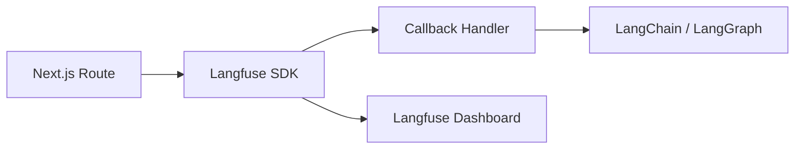

# Langfuse 可观测实战：Agent 链路的开源替代

> [18 上线清单](./18-agent-production-checklist.md) 对比了 LangSmith 与 Langfuse；[LC 11](./langchain/11-callbacks-langsmith.md) 讲了 Callback 机制。这篇 **专讲 Langfuse**：自托管、接 LangChain/LangGraph、前端能查什么。

## 📚 目录

- [Langfuse 解决什么问题](#langfuse-解决什么问题)
- [与 LangSmith 怎么选](#与-langsmith-怎么选)
- [安装与最小接入](#安装与最小接入)
- [接 LangChain.js Callback](#接-langchainjs-callback)
- [接 LangGraph 图](#接-langgraph-图)
- [控制台里看什么](#控制台里看什么)
- [Eval 与 Dataset](#eval-与-dataset)
- [常见坑](#常见坑)
- [系列导航](#系列导航)

---

## Langfuse 解决什么问题

Agent 一次请求 = 多层嵌套调用（Router → Agent → Tool → LLM）。没有 trace：

- 用户说「答错了」→ 不知道是检索烂还是 Tool 参数错
- 改 Prompt 后 → 不知道哪步变慢

**Langfuse** = 开源 LLM 工程平台：**Trace + 会话 + Prompt 版本 + Eval**（可自托管）。



---

## 与 LangSmith 怎么选

| | LangSmith | Langfuse |
|--|-----------|----------|
| 开源 | 云服务为主 | **可自托管** |
| LangChain 集成 | 原生 env 变量 | Callback Handler |
| 数据驻留 | 厂商云 | 自建 Postgres |
| 适合 | LC 全家桶、快上手 | **合规/私有化**、多框架 |

**实践：** 开发可用 LangSmith（[LC 11](./langchain/11-callbacks-langsmith.md)）；客户要求数据不出域 → Langfuse Docker。

两者 **不互斥**：Staging 一个、生产一个。

---

## 安装与最小接入

### 云版（最快）

1. [langfuse.com](https://langfuse.com) 注册项目
2. 拿 `LANGFUSE_PUBLIC_KEY`、`LANGFUSE_SECRET_KEY`、`LANGFUSE_HOST`

```bash
pnpm add langfuse langfuse-langchain
```

```typescript
// lib/langfuse.ts
import { Langfuse } from "langfuse";

export const langfuse = new Langfuse({
    publicKey: process.env.LANGFUSE_PUBLIC_KEY!,
    secretKey: process.env.LANGFUSE_SECRET_KEY!,
    baseUrl: process.env.LANGFUSE_HOST, // 云或自建 URL
});
```

---

## 接 LangChain.js Callback

```typescript
import { CallbackHandler } from "langfuse-langchain";
import { ChatOpenAI } from "@langchain/openai";

const langfuseHandler = new CallbackHandler({
    publicKey: process.env.LANGFUSE_PUBLIC_KEY!,
    secretKey: process.env.LANGFUSE_SECRET_KEY!,
    baseUrl: process.env.LANGFUSE_HOST,
    sessionId: threadId,       // 对齐 Chatbot conversationId
    userId: session.userId,
});

const model = new ChatOpenAI({ model: "gpt-4o-mini" });

await chain.invoke(
    { question: "Runnable 是什么" },
    { callbacks: [langfuseHandler] },
);

// 请求结束 flush（serverless 重要）
await langfuseHandler.flushAsync();
```

| 参数 | 说明 |
|------|------|
| `sessionId` | 多轮会话分组 |
| `userId` | 按用户过滤 |
| `flushAsync` | Serverless 结束前上报，防丢 trace |

与 [LC 11 RunnableConfig](./langchain/11-callbacks-langsmith.md) 的 `metadata` 同类信息。

---

## 接 LangGraph 图

```typescript
await graph.invoke(
    { messages: [{ role: "user", content: message }] },
    {
        configurable: { thread_id: threadId },
        callbacks: [langfuseHandler],
        runName: "blog-agent-graph",
    },
);

await langfuseHandler.flushAsync();
```

Dashboard 里看到 **节点级** span（agent、tools），对齐 [LG 11 调试](./langgraph/11-debugging-time-travel.md)。

**streamEvents：** 同一 `callbacks` 传入 `streamEvents` 第二参 `config`（与 `invoke` 一致）。

---

## 控制台里看什么

| 视图 | 用途 |
|------|------|
| **Traces** | 单次请求完整树 |
| **Sessions** | 按 `sessionId` 看多轮 |
| **Users** | 按 `userId` 聚合 |
| **Generations** | 每次 LLM 输入输出、Token、延迟 |
| **Scores** | Eval 分数挂载 |

排障路径（对齐 [22 Eval](./22-agent-eval-regression.md)）：

1. 打开坏 trace → 看 `search_blog` Tool 输入输出
2. 看 Generation prompt 是否缺 context
3. 对比昨天同 Prompt 版本的 trace

---

## Eval 与 Dataset

Langfuse 支持 Dataset + 实验对比（概念同 [LC 15](./langchain/15-langsmith-eval.md)）：

```typescript
// 从 trace 创建 dataset item（UI 或 API）
// 跑 experiment 对比 prompt v1 vs v2
```

**与 LC 15 关系：** API 不同，**流程相同**——golden 集、批量跑、看分数回归。团队可 Eval 主流程放 Langfuse，与 LangSmith 二选一。

---

## 自托管要点

- Docker Compose 部署（官方文档）
- 自有 Postgres + S3（可选）
- `LANGFUSE_HOST` 指向内网
- 与 [LG 13 Neon](./langgraph/13-redis-neon-deployment.md) 的 **业务库** 分离——Langfuse 用独立 DB

---

## 常见坑

**1. Serverless 忘 `flushAsync`**  
Trace 丢一半。

**2. sessionId 每次 random**  
Sessions 视图无法续聊分析。

**3. 生产 trace 含 PII**  
配置采样或字段脱敏。

**4. 与 LangSmith 双开 trace**  
成本翻倍；环境分工具。

**5. Handler 未传进 stream**  
流式请求无记录。

---

## 系列导航

1. [18 上线 Checklist](./18-agent-production-checklist.md)
2. [LC 11 LangSmith](./langchain/11-callbacks-langsmith.md)
3. **本文**
4. [26 CopilotKit](./26-copilotkit-guide.md)
5. [总索引](./README.md)
