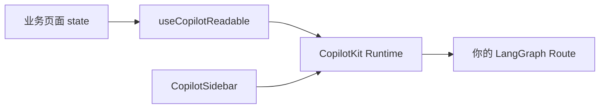

# CopilotKit 嵌入指南：在现有 React 里挂 Agent UI

> [17 Chatbot UI](./17-build-production-chatbot-ui.md) 从零搭消息列表；[20 Vercel AI SDK](./20-vercel-ai-sdk-guide.md) 用 `useChat`。**CopilotKit** 提供 **可嵌入的 Copilot 组件**（侧边栏、浮动按钮、上下文注入）——适合在 **已有后台页面** 快速挂助手，而不重写整页 Chat。

## 📚 目录

- [CopilotKit 解决什么问题](#copilotkit-解决什么问题)
- [与 17 / 20 怎么选](#与-17--20-怎么选)
- [安装与 Provider](#安装与-provider)
- [CopilotSidebar 最小示例](#copilotsidebar-最小示例)
- [把页面上下文喂给 Agent](#把页面上下文喂给-agent)
- [接 LangGraph 后端](#接-langgraph-后端)
- [常见坑](#常见坑)
- [系列导航](#系列导航)

---

## CopilotKit 解决什么问题

传统后台：列表、表单、详情页。用户想问「这行数据什么意思」「帮我填这段说明」，但要切到另一个 Chat 页。

**CopilotKit** = React 层 **Copilot 壳**：

- 侧边栏 / 弹层 Chat
- `useCopilotReadable` 把当前页 state 注入 Agent
- 可选 `@copilotkit/runtime` 统一后端适配



对齐 [24 传统 Web](./24-traditional-web-ai-integration.md) 的 **侧边 Copilot** 切入点。

---

## 与 17 / 20 怎么选

| | 自研 UI（17） | Vercel AI SDK（20） | CopilotKit |
|--|---------------|---------------------|------------|
| 定制度 | 最高 | 高 | 中（主题配置） |
| 嵌入现有页 | 要自己布局 | 要自己布局 | **侧边栏开箱** |
| 页面上下文 | 手写 | 手写 | `useCopilotReadable` |
| 依赖 | 无 | `ai` 包 | `@copilotkit/*` |

| 场景 | 推荐 |
|------|------|
| 独立 Chat 产品页 | 17 或 20 |
| CRM/后台「问当前页」 | **CopilotKit** |
| 全控 SSE 协议 | 17 + LG 12 |

---

## 安装与 Provider

```bash
pnpm add @copilotkit/react-core @copilotkit/react-ui
```

```tsx
// app/layout.tsx 或页面根
import { CopilotKit } from "@copilotkit/react-core";
import "@copilotkit/react-ui/styles.css";

export default function RootLayout({ children }) {
    return (
        <CopilotKit runtimeUrl="/api/copilotkit">
            {children}
        </CopilotKit>
    );
}
```

| 属性 | 说明 |
|------|------|
| `runtimeUrl` | CopilotKit Runtime 端点（见下） |
| `publicApiKey` | 云托管 CopilotKit 时用 |

---

## CopilotSidebar 最小示例

```tsx
"use client";
import { CopilotSidebar } from "@copilotkit/react-ui";
import { useCopilotChatSuggestions } from "@copilotkit/react-ui";

export function AppWithCopilot({ children }: { children: React.ReactNode }) {
    return (
        <>
            {children}
            <CopilotSidebar
                labels={{
                    title: "博客助手",
                    initial: "问我关于本站技术文章的问题",
                }}
                defaultOpen={false}
            />
        </>
    );
}
```

用户点浮动按钮打开侧栏——无需单独 `/chat` 路由。

---

## 把页面上下文喂给 Agent

```tsx
import { useCopilotReadable } from "@copilotkit/react-core";

function OrderDetail({ order }: { order: Order }) {
    useCopilotReadable({
        description: "当前正在查看的订单",
        value: {
            id: order.id,
            status: order.status,
            amount: order.amount,
        },
    });

    return <div>...</div>;
}
```

**底层：** 上下文进 CopilotKit Runtime 的 `messages` 或 system 附加块，Agent 回答「这个订单」时不再瞎猜。

对比 [10 工作记忆](./10-memory-planning-agent.md)：这是 **UI 可见上下文**，不是 checkpoint 全 State。

---

## 接 LangGraph 后端

### 方案 A：CopilotKit Runtime 适配 OpenAI 兼容

Runtime 默认可代理到 OpenAI；复杂 Agent 需自定义 adapter。

### 方案 B：Runtime 转你的 Route（推荐）

```typescript
// app/api/copilotkit/route.ts
import {
    CopilotRuntime,
    ExperimentalEmptyAdapter,
    copilotRuntimeNextJSAppRouterEndpoint,
} from "@copilotkit/runtime";

const runtime = new CopilotRuntime({
    // 自定义 actions / 远程 endpoint 指向 LangGraph
});

export const POST = async (req: Request) => {
    const { handleRequest } = copilotRuntimeNextJSAppRouterEndpoint({
        runtime,
        serviceAdapter: new ExperimentalEmptyAdapter(),
        endpoint: "/api/copilotkit",
    });
    return handleRequest(req);
};
```

LangGraph 图仍在 [LG 12](./langgraph/12-full-route-example.md) 的 `lib/agent/graph.ts`；CopilotKit 作 **前端壳 + 上下文聚合**。

**流式：** 以 CopilotKit 当前版本 runtime 文档为准，保证与 `streamEvents` 或 `streamText` 一致。

---

## 与博客助手结合（[19 收官](./19-blog-ai-assistant-capstone.md)）

| 形态 | 做法 |
|------|------|
| 全页助手 | `/agent` + 17 自研 UI |
| 阅读页悬浮 | CopilotKit Sidebar + `useCopilotReadable({ value: { currentArticle: slug } })` |
| 后台编辑 | 注入当前 Markdown 草稿摘要 |

同一 LangGraph 图，多种 UI 壳。

---

## 常见坑

**1. 忘了包 CopilotKit Provider**  
子组件 hook 报错。

**2. readable 塞超大对象**  
爆 context。只传摘要字段。

**3. Runtime 与 LangGraph 两套会话 ID**  
统一 `threadId` 字段映射。

**4. 样式与 Tailwind 冲突**  
单独引入 `@copilotkit/react-ui/styles.css` 并调 CSS 变量。

**5. 敏感数据进 readable**  
用户 Copilot 会把上下文送模型；脱敏。

---

## 系列导航

1. [17 Chatbot UI](./17-build-production-chatbot-ui.md)
2. [20 Vercel AI SDK](./20-vercel-ai-sdk-guide.md)
3. **本文**
4. [25 Langfuse](./25-langfuse-practice.md)
5. [24 传统 Web 嵌入](./24-traditional-web-ai-integration.md)
6. [总索引](./README.md)
