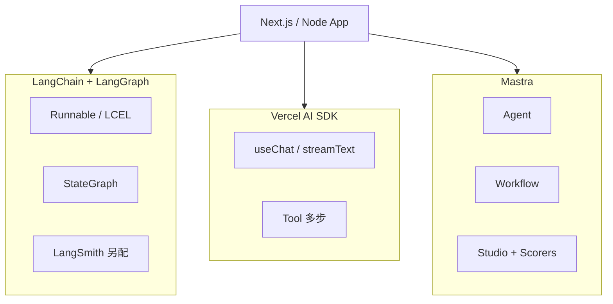
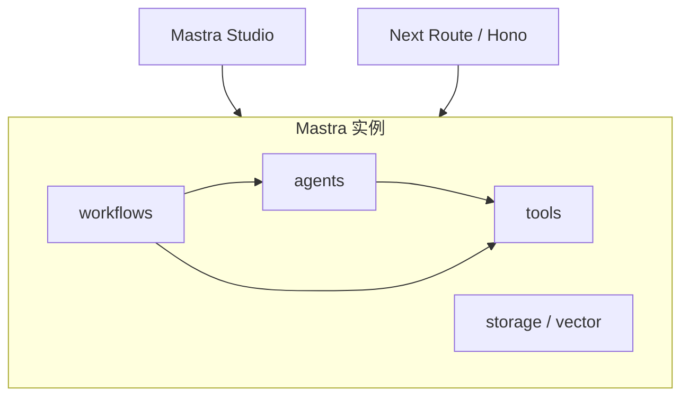

# Mastra：TypeScript 一体化 Agent 框架速览

> [15 LangChain 生态](./15-langchain-js-guide.md) 讲「积木 + 自选组装」；[20 Vercel AI SDK](./20-vercel-ai-sdk-guide.md) 讲「Chat UI 流式体验」；**Mastra** 走第三条路：**TS 原生一体化**——Agent、Workflow、RAG、Memory、Scorers、Studio 等收进同一框架。下文对照表为**选型摘要**；具体 API 以 [Mastra Docs](https://mastra.ai/docs) 为准，专系列 [mastra/](./mastra/README.md) 逐条对齐官方参考。

## 📚 目录

- [三角对照：LangChain / AI SDK / Mastra](#三角对照langchain--ai-sdk--mastra)
- [Mastra 解决什么问题](#mastra-解决什么问题)
- [核心概念一张图](#核心概念一张图)
- [30 秒上手](#30-秒上手)
- [Agent vs Workflow：官方分界](#agent-vs-workflow官方分界)
- [和本系列已学内容怎么对齐](#和本系列已学内容怎么对齐)
- [什么时候选 Mastra、什么时候不选](#什么时候选-mastra什么时候不选)
- [常见坑](#常见坑)
- [系列导航](#系列导航)

---

## 三角对照：LangChain / AI SDK / Mastra



| 维度 | LangChain.js + LangGraph | Vercel AI SDK | Mastra |
|------|--------------------------|---------------|--------|
| **定位** | LLM 积木 + 图编排 | 前端 Chat **体验层** | **全栈 Agent 平台** |
| **设计来源** | Python 生态移植 | Vercel / Next 生态 | **TS 从零设计** |
| **Agent 循环** | LangGraph `ToolNode` + 条件边 | `streamText` + `maxSteps` | `Agent` + `.generate` / `.stream` |
| **固定流水线** | LCEL `pipe` / `RunnableSequence` | 多在 Route 里手写 | `createWorkflow` + `createStep` |
| **多轮 / 持久化** | LangGraph Checkpointer | 自己管 messages / DB | `memory: { thread, resource }` + Storage |
| **RAG** | LC 06～09 + Retriever | Route 里自拼 | `MDocument` + `PgVector` 等（[RAG overview](https://mastra.ai/docs/rag/overview)） |
| **可观测** | LangSmith（另账号） | 较弱，靠外部 | Observability + **Studio** |
| **回归评测** | LangSmith Eval | 无内置 | **Scorers**（`@mastra/evals`） |
| **UI** | 手写（[17](./17-build-production-chatbot-ui.md)） | **`useChat` 很强** | `@mastra/ai-sdk` + `useChat`（[Next.js 指南](https://mastra.ai/guides/getting-started/next-js)） |
| **学习成本** | Runnable + Graph 两层 | 低（纯聊天场景） | 中（框架约定多） |
| **灵活度** | **最高** | 中 | 中（opinionated） |

**一句话分工：**

- **LangChain/LangGraph**：你要完全掌控图、checkpoint、和 Python 生态对齐 → 选 LC/LG + [专系列](./langchain/README.md)
- **AI SDK**：Next 项目主要是 **Chat UI + 轻量 Tool** → 选 [20](./20-vercel-ai-sdk-guide.md)
- **Mastra**：TS 团队要 **Agent + Workflow + RAG + Trace + Scorers 一套齐** → 选 Mastra + [专系列](./mastra/README.md)

三者可 **组合**：官方 Next 指南用 `handleChatStream` + `useChat`，后端 Mastra、前端 AI SDK——见 [mastra/08](./mastra/08-nextjs-integration.md)。

---

## Mastra 解决什么问题

[08 手写 Agent](./08-build-first-agent.md) 之后，生产常会补：

| 能力 | 手写成本 | Mastra |
|------|----------|--------|
| ReAct + Tool | 自己写循环 | `Agent` 内置 |
| 固定审批流 | 自己写状态机 | `Workflow` + suspend |
| 向量检索 | 接 Upstash + Embedding | RAG 模块 |
| Trace | 接 LangSmith / Langfuse | Studio / Observability |
| 回归评测 | 自建 golden + 脚本 | **Scorers**（`@mastra/evals`）+ Studio Evaluate |
| 本地调试 | `console.log` | **Mastra Studio** |

Mastra **不是** LCEL 的替代品（[LC 01 Runnable](./langchain/01-runnable-lcel.md)）；它用 **`Mastra` 根实例** 注册 Agent/Workflow，API 风格更接近「小型框架」而非「管道表达式」。

---

## 核心概念一张图



| 概念 | 作用 | 系列对照 |
|------|------|----------|
| **`Mastra`** | 应用容器，注册资源 | 类似 `lib/agent/graph.ts` 模块级单例 |
| **`Agent`** | 开放域：模型决定调哪些 Tool | [08 ReAct](./08-build-first-agent.md)、LG 04 |
| **`Workflow`** | 确定多步：`createStep` 链 | LG StateGraph 无环版 |
| **`Tool`** | `createTool()` + Schema | [09 Tools](./09-tools-system-design.md)、LC 05 |
| **Memory** | 跨轮偏好 / 摘要 | [10 Memory](./10-memory-planning-agent.md) |
| **Studio** | 本地调试 UI | LangSmith Playground + 工作流图 |

---

## 30 秒上手

```bash
pnpm create mastra@latest
# 已有 Next.js：npx mastra@latest init（见官方 Next.js 指南）
```

```typescript
// src/mastra/agents/blog-agent.ts
import { Agent } from "@mastra/core/agent";

export const blogAgent = new Agent({
    id: "blog-agent",
    name: "Blog Agent",
    instructions: "你是本站技术博客助手，优先检索站内文章再回答。",
    model: "openai/gpt-4o-mini", // Mastra Model Router
    // tools: { searchBlog }  — 见专系列 03
});
```

```typescript
// src/mastra/index.ts
import { Mastra } from "@mastra/core";
import { blogAgent } from "./agents/blog-agent";

export const mastra = new Mastra({
    agents: { blogAgent },
});
```

```typescript
// Route 内（示意）
const agent = mastra.getAgentById("blog-agent");
const stream = await agent.stream("LangGraph checkpoint 怎么用？");
for await (const chunk of stream.textStream) {
    process.stdout.write(chunk);
}
```

本地 **`mastra dev`** 打开 Studio（默认 `http://localhost:4111`，见 [CLI 参考](https://mastra.ai/reference/cli/mastra)）：测 Agent、Workflow 图、Observability。

---

## Agent vs Workflow：官方分界

| | **Agent** | **Workflow** |
|---|-----------|--------------|
| 步骤是否事先确定 | 否，模型规划 | 是，你画步骤 |
| 典型输入 | 自然语言目标 | 结构化 `inputSchema` |
| 循环 | 内部 ReAct | 显式 `.then()` 链，可 suspend |
| 类比 | [08](./08-build-first-agent.md) 的 `while` | CI/CD / 审批流水线 |

**组合：** Workflow 某一步 `execute` 里调 `agent.generate()`——固定壳 + 开放核，类似 LangGraph 节点内调 Model。

---

## 和本系列已学内容怎么对齐

| 你已读过 | 看 Mastra 时重点 |
|----------|------------------|
| [LC 01 LCEL](./langchain/01-runnable-lcel.md) | Mastra **无** `pipe`；用 Agent/Workflow 组合 |
| [15 LC 生态](./15-langchain-js-guide.md) | Mastra 减的是「装包 + 接 Trace」胶水 |
| [16 LG 实战](./16-langgraphjs-practice.md) | 对比 `StateGraph` vs `createWorkflow` |
| [17 UI](./17-build-production-chatbot-ui.md) | `@mastra/ai-sdk` 或自写 `textStream` SSE |
| [19 收官](./19-blog-ai-assistant-capstone.md) | blog-assistant 为 LG 版；Mastra 为平行选型 |
| [20 AI SDK](./20-vercel-ai-sdk-guide.md) | 官方推荐 `handleChatStream` + `useChat` |
| [22 Eval](./22-agent-eval-regression.md) | Mastra **Scorers** + 可叠加自建 golden |

---

## 什么时候选 Mastra、什么时候不选

**适合：**

- 全栈 TypeScript，希望 **少拼多个库** 就具备 Trace + Scorers
- 产品里 **Agent + 固定 Workflow 混用**（客服 + 审批流）
- 团队没有 LangChain 历史包袱，愿意接受 **框架约定**
- 需要 **Studio** 给产品/运营调试 Agent

**不太适合：**

- 教学目的先搞懂 ReAct 原理 → 继续 [08](./08-build-first-agent.md)
- 已深度投入 **LangGraph + LangSmith**，迁移成本高
- 主要需求是 **Chat UI** → [20 AI SDK](./20-vercel-ai-sdk-guide.md) 更轻
- 要 **极细粒度** 自定义 checkpoint 格式、图语义 → [LG 专系列](./langgraph/README.md)

**和 blog-assistant 的关系：** 当前仓库 `apps/blog-assistant` 用 LangGraph；若用 Mastra 重写，架构仍是 Route + 流式 UI，换的是 **编排与可观测层**，不是产品形态。

---

## 版本基准

| 项 | 说明 |
|----|------|
| **校对日期** | 2026-06-11 |
| **API 世代** | Mastra 1.x（`@mastra/core@1.43.0` 为校对日 npm latest） |
| **详表与维护** | [mastra/README — 版本基准与维护](./mastra/README.md#版本基准与维护) |

---

## 常见坑

**1. 把 Mastra 当成「LangChain 换皮」**  
API 与 LCEL 不通用；按 Agent/Workflow 思维重写，不要机械 `pipe`。

**2. 该用 Workflow 却全塞一个 Agent**  
固定「检索 → 分类 → 通知」应用 Workflow；开放问答才用 Agent。

**3. 直接 `import` Agent 而不用 `mastra.getAgentById()`**  
后者才能挂上实例级 Storage、Logger、Registry（官方推荐）。

**4. 前端在 Studio 调通就上线**  
生产仍要走 [18 Checklist](./18-agent-production-checklist.md)：密钥、限流、Scorers 门禁。

**5. 与 AI SDK 消息格式混用**  
Next 项目优先 `@mastra/ai-sdk` 的 `handleChatStream` / `toAISdkStream`；自写 SSE 需自行对齐事件格式。

**6. Memory 参数写错**  
`generate` / `stream` 用 `memory: { thread, resource }`，不是顶层 `threadId`（见 [Memory overview](https://mastra.ai/docs/memory/overview)）。

**7. 忽略 Model Router 字符串格式**  
`model: 'openai/gpt-4o-mini'` 依赖 Mastra 路由配置；私有化网关要对照文档设 `baseURL`。

---

## 系列导航

**生态三角（建议一起读）：**

1. [15 LangChain.js 生态](./15-langchain-js-guide.md)
2. [20 Vercel AI SDK](./20-vercel-ai-sdk-guide.md)
3. **本文**

**Mastra 专系列（API 深挖）：** [mastra/README](./mastra/README.md)

| 篇 | 主题 |
|----|------|
| [MS 01](./mastra/01-mastra-instance-and-studio.md) | Mastra 实例与 Studio |
| [MS 02](./mastra/02-agents-api.md) | Agent：`generate` / `stream` |
| [MS 03](./mastra/03-tools.md) | Tools |
| [MS 04](./mastra/04-workflows.md) | Workflows |
| [MS 05](./mastra/05-memory.md) | Memory |
| [MS 06](./mastra/06-rag-vector.md) | RAG 与 Vector |
| [MS 07](./mastra/07-observability-evals.md) | Observability 与 Scorers |
| [MS 08](./mastra/08-nextjs-integration.md) | Next.js 集成与部署 |

**相关：** [github-ai Mastra 条目](./github-ai.md) · [24 传统 Web 接入](./24-traditional-web-ai-integration.md)

**总索引：** [README](./README.md) · **LC/LG 专系列：** [langchain](./langchain/README.md) · [langgraph](./langgraph/README.md)
