# AI Agent 前端学习系列 · 总索引

> 本仓库 `docs/ai/` 下所有 AI 相关博文的 **导航枢纽**。按学习阶段组织；深挖 API 见两条专系列。

**快速入口：** [学习路线图](./ai-agent-learning-roadmap.md) · [RAG 博客实战](./rag-blog-knowledge-search.md) · [Skills 指南](./skills-guide.md)

---

## 这套系列学什么

面向 **前端开发者** 的 AI Agent 全栈路径：从 LLM 基础 → Prompt → 手写 Agent → RAG → LangChain/LangGraph → 产品化上线 → 扩展专题。

不重复造「机器学习数学课」；用 TypeScript、Next.js、可运行思路讲 **能上线的产品**。

---

## 学习路线总览

```mermaid
flowchart TB
    subgraph phase0 [基础 01-03]
        A1[前端 AI 入门]
        A2[Transformer]
        A3[模型选型]
    end
    subgraph phase1 [Prompt 04-06]
        P1[Prompt 指南]
        P2[高级技巧]
        P3[调试优化]
    end
    subgraph phase2 [Agent 核心 07-10]
        G1[架构]
        G2[第一个 Agent]
        G3[Tools]
        G4[Memory]
    end
    subgraph phase3 [RAG 与进阶 11-14]
        R1[RAG 进阶]
        R2[Multi-Agent]
        R3[Memory 进阶]
        R4[WebAI]
    end
    subgraph phase4 [框架 15-16-27]
        F1[LC 生态]
        F2[LG 实战]
        F3[Mastra 三角对照]
    end
    subgraph phase5 [产品化 17-19]
        U1[Chatbot UI]
        U2[上线 Checklist]
        U3[收官实战]
    end
    subgraph phase6 [扩展 20-24]
        E1[AI SDK]
        E2[多模态]
        E3[Eval]
        E4[Skills]
        E5[传统 Web]
    end
    subgraph deep [深潜 25+]
        D1[Langfuse 等]
    end
    phase0 --> phase1 --> phase2 --> phase3
    phase3 --> phase4 --> phase5 --> phase6 --> deep
```

---

## 一、基础入门（01～03）

| 篇 | 文章 | 一句话 |
|----|------|--------|
| 01 | [前端开发者的 AI 入门](./01-frontend-ai-introduction.md) | 生态、概念、前端机会 |
| 02 | [Transformer 用前端思维理解](./02-transformer-explained.md) | Attention、Token、上下文 |
| 03 | [主流大模型对比与选型](./03-llm-comparison-guide.md) | GPT/Claude/开源怎么选 |

**读完能：** 跟同事聊 LLM、选 API、不被名词吓住。

---

## 二、Prompt Engineering（04～06）

| 篇 | 文章 |
|----|------|
| 04 | [Prompt Engineering 完全指南](./04-prompt-engineering-guide.md) |
| 05 | [高级 Prompt：CoT 与 Few-shot](./05-advanced-prompt-techniques.md) |
| 06 | [Prompt 调试与优化实战](./06-prompt-debugging-optimization.md) |

**读完能：** 写出稳定 Prompt，知道怎么测、怎么改。

---

## 三、Agent 核心（07～10）

| 篇 | 文章 | 关键点 |
|----|------|--------|
| 07 | [深入理解 AI Agent 架构](./07-ai-agent-architecture.md) | ReAct、规划、记忆概念 |
| 08 | [构建第一个 AI Agent](./08-build-first-agent.md) | **手写 ReAct + SSE UI** |
| 09 | [Tools 系统设计与实现](./09-tools-system-design.md) | Tool 注册、安全、测试 |
| 10 | [Memory 与 Planning](./10-memory-planning-agent.md) | 工作记忆、Planner |

**读完能：** 不依赖框架跑通一个调研型 Agent（hello-agent 配套）。

---

## 四、RAG 与进阶（11～14 + 实战）

| 篇 | 文章 |
|----|------|
| — | [给博客加 RAG 检索](./rag-blog-knowledge-search.md) **实战** |
| 11 | [RAG 进阶：生产级优化](./11-advanced-rag-patterns.md) |
| 12 | [多智能体协作](./12-multi-agent-systems.md) |
| 13 | [Memory 进阶](./13-advanced-memory.md) |
| 14 | [WebAI 与边缘推理](./14-webai-and-edge-inference.md) |

**读完能：** 博客语义搜索、混合检索、何时 Multi-Agent、浏览器 Worker。

---

## 五、框架生态对比（15～16、27）

| 篇 | 文章 | 与专系列关系 |
|----|------|--------------|
| 15 | [LangChain.js 生态与选型](./15-langchain-js-guide.md) | 积木 + 自选组装 → [LC 专系列 01～16](./langchain/README.md) |
| 16 | [LangGraph.js 实战](./16-langgraphjs-practice.md) | 图编排入门 → [LG 专系列 01～13](./langgraph/README.md) |
| 27 | [Mastra：TS 一体化 Agent 框架速览](./27-mastra-typescript-agent-framework.md) | **与 15/20 三角对照** → [Mastra 专系列 01～08](./mastra/README.md) |

**读完能：** LangChain / LangGraph / AI SDK / Mastra 怎么分工选型；细节进各专系列逐 API 啃。

---

## 六、产品化（17～19）

| 篇 | 文章 |
|----|------|
| 17 | [生产级 Chatbot UI](./17-build-production-chatbot-ui.md) |
| 18 | [上线 Checklist：安全、成本、可观测](./18-agent-production-checklist.md) |
| 19 | [收官：博客 AI 助手全栈串联](./19-blog-ai-assistant-capstone.md) |

**读完能：** 流式 UI、限流 Trace、整站助手架构（博文规划，demo 可选）。

---

## 七、扩展专题（20～24）

| 篇 | 文章 |
|----|------|
| 20 | [Vercel AI SDK](./20-vercel-ai-sdk-guide.md) |
| 21 | [多模态：图像与语音](./21-multimodal-interaction.md) |
| 22 | [Agent Eval 与回归](./22-agent-eval-regression.md) |
| 23 | [Skills 与程序记忆](./23-skills-agent-bridge.md) |
| 24 | [传统 Web 项目接入 AI](./24-traditional-web-ai-integration.md) |

---

## 八、深潜专题（25～26）

| 篇 | 文章 | 状态 |
|----|------|------|
| 25 | [Langfuse 可观测实战](./25-langfuse-practice.md) | 已发布 |
| 26 | [CopilotKit 嵌入指南](./26-copilotkit-guide.md) | 已发布 |

> **27** 归入第五节「生态对比」（与 15 LC、20 AI SDK 三角对照），不单列深潜编号。

---

## 专系列：API 深挖

| 专系列 | 篇数 | 入口 | 版本基准（校对日） | 适合 |
|--------|------|------|-------------------|------|
| [LangChain.js](./langchain/README.md) | 16 | Runnable → Model → RAG → Eval | **v1** · 2026-06-11 · `langchain@1.4.6` | 减胶水、读 trace |
| [LangGraph.js](./langgraph/README.md) | 13 | State → 图 → 流式 → 部署 | **1.x** · 2026-06-11 · `@langchain/langgraph@1.4.4` | 编排、checkpoint |
| [Mastra.js](./mastra/README.md) | 8 | 实例 → Agent → Workflow → 部署 | **1.x** · 2026-06-11 · `@mastra/core@1.43.0` | TS 一体化、Studio |

各专系列 README 内有 **「版本基准与维护」** 表（npm 版本、与 `blog-assistant` 差异、维护清单）。框架大版本发布后请优先更新该表。

主线 **15/16/27** = 生态综述与三角选型；专系列 = **参数、原理、坑** 词典。

---

## 旁支与工具

| 文档 | 说明 |
|------|------|
| [AI Agent 学习路线图](./ai-agent-learning-roadmap.md) | 长文路线图、时间规划 |
| [Skills 入门指南](./skills-guide.md) | Cursor Skills CLI |
| [GitHub AI 库](./github-ai.md) | 开源工具合集 |

---

## 推荐阅读路径

### 路径 A：零基础到能上线（约 8～12 周）

`01 → 04 → 07 → 08 → 09 → 10 → RAG实战 → 15 → 16 → 27 → 17 → 18 → 19`

### 路径 B：已有 OpenAI 经验，直接 Agent

`07 → 08 → 09 → 11 → 16 → 17 → 18`

### 路径 C：公司传统 Web 加 AI

`24 → 15 → LG04 → 17 → 18 → LC09`

### 路径 D：框架 API 词典（边做边查）

`LC01 Runnable` + `LG01 State` 起，对照主线 08/16 代码

### 路径 E：三角选型（LC / AI SDK / Mastra）

`15 → 20 → 27` → 按选型进 `langchain/`、`langgraph/` 或 `mastra/` 专系列

---

## 与示例代码

| 资源 | 说明 |
|------|------|
| hello-agent（08 配套） | 自研 ReAct + Express SSE |
| [LG 12 Route 示例](./langgraph/12-full-route-example.md) | Next.js + LangGraph 骨架 |
| [**blog-assistant**](./19-blog-ai-assistant-capstone.md) | 收官应用 `apps/blog-assistant`（**LangGraph 0.4.x / LC 0.3.x**，与专系列 v1 基准见各 README） |

---

## 系列维护说明

- 主线编号 **01～24** 为 Agent/RAG/产品主题；**25～26** 为深潜单篇；**27** 为生态对比（与 15/20 三角）
- `langchain/`、`langgraph/`、`mastra/` 为框架 API 专系列，独立编号；**每系列 README 含「版本基准与维护」**（校对日期 + npm 版本 + 维护 checklist）
- 文风：前端视角、TypeScript、架构图、常见坑；避免空泛 AI 腔
- 框架 **major 升级** 后：更新专系列 README 版本表 → 核对带 `import` 的篇章 → 必要时改 [blog-assistant](../../apps/blog-assistant/package.json) 或文内说明

**上一阶段：** 框架专系列 LC16 + LG13 + Mastra MS01～08  
**当前：** 收官应用 `apps/blog-assistant` 阶段 1～4 代码就绪；Mastra 专系列与 27 三角对照已发布
