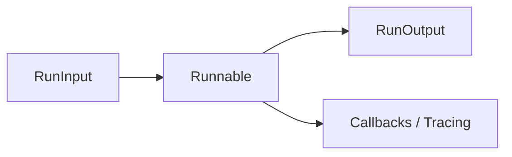
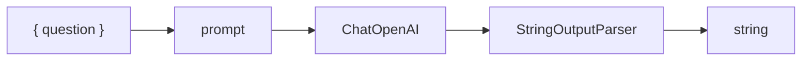
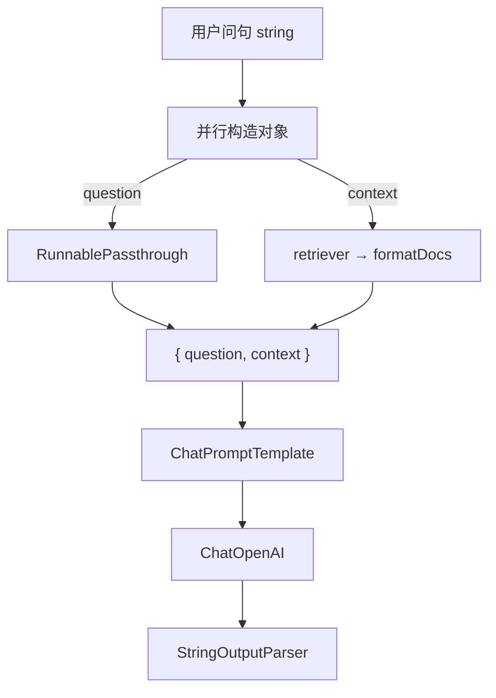

# LangChain.js 01 · Runnable 与 LCEL

> LangChain 里几乎所有对象——Model、Prompt、Parser、整条 Chain——都实现同一套 **Runnable** 接口。API 以 [Runnable 运行时文档](https://docs.langchain.com/oss/javascript/langchain/runtime) 为准。

**系列导航：** [LangChain 专系列首页](./README.md) · 下一篇：[02 Chat Models](./02-chat-models.md)

---

## 这篇解决什么问题

| 问题 | 答案在 |
|------|--------|
| LCEL 是什么、和 Runnable 啥关系？ | [LCEL 是什么](#lcel-是什么) |
| 为什么到处都能 `.pipe()`？ | LCEL 组合规则 |
| `invoke` 和直接 `await model()` 有何不同？ | Runnable 协议 |
| 流式怎么从链中间透传？ | `stream` / `streamEvents` |
| LangSmith 为什么能嵌套展示？ | Callback 与 Runnable 树 |

---

## LCEL 是什么

**LCEL** = **LangChain Expression Language**（LangChain 表达式语言）。

它不是一门新编程语言，而是一套 **用表达式组合 Runnable 的约定**：把 Prompt、Model、Parser、Retriever 等步骤用 `.pipe()` 或 `RunnableSequence.from([...])` 串起来，形成一条 **声明式流水线**。

```mermaid
flowchart TB
    subgraph lcel [LCEL 链 = 一串 Runnable]
        R1[PromptTemplate]
        R2[ChatModel]
        R3[OutputParser]
    end
    R1 -->|Message[]| R2
    R2 -->|AIMessage| R3
    R3 -->|string| OUT[最终输出]
```

### 为什么需要 LCEL

手写 `async function` 也能拼流水线，LCEL 解决的是 **重复工程问题**：

| 手写胶水 | LCEL |
|----------|------|
| 每段自己写 `await`，流式要另写一套 | 同一链自动支持 `invoke` / `batch` / `stream` |
| LangSmith 只能看到零散 log | Runnable 树自动嵌套 trace |
| 换 Model 要改多处调用 | 换链中一个节点即可 |
| 并行要手写 `Promise.all` | `RunnableParallel` 统一并发与 config |

类比前端：

- **LCEL** ≈ JSX 描述 UI 结构，底层仍是 React 组件（Runnable）
- **`.pipe()`** ≈ 函数组合 `f(g(x))` 或 RxJS `pipe`
- **整条 chain** ≈ 一个可测试、可观测的「数据流组件」

### LCEL 的三条设计承诺（官方核心）

1. **流式对等（Stream parity）**  
   链上任意节点若支持 `stream`，整条链的 `stream` 会把增量 chunk **透传**到末端，不必为 UI 单独写一套流式逻辑。Chatbot 打字机因此可以 `chain.stream()` 而不是只在 Model 层流式。

2. **异步一等（Async first）**  
   所有步骤默认 `async`；`batch` 内置并发控制，适合 Embedding 批处理。

3. **可观测内置（Observable）**  
   每个 Runnable 节点在 LangSmith 里是一层 **Run**；`RunnableConfig` 的 `tags` / `metadata` 沿链合并，方便按用户、会话过滤 trace。

### LCEL 能表达什么、不能表达什么

| 适合 LCEL | 不适合 LCEL（用 LangGraph） |
|-----------|------------------------------|
| 线性：`A → B → C` | 循环：ReAct 多轮 Tool |
| 并行：多路检索再合并 | 条件边依赖复杂 State |
| 轻量分支：`RunnableBranch` | checkpoint、interrupt、多 Agent 图 |
| 固定 RAG：retrieve → prompt → model | 长期会话状态机 |

Agent 多步推理见 [LangGraph 02 StateGraph](../langgraph/02-stategraph-api.md)；LCEL 负责 **链内** 组合，LangGraph 负责 **图级** 编排。

---

## 底层原理：Runnable 是什么

LangChain 把「可调用的 AI 步骤」抽象成 **Runnable&lt;RunInput, RunOutput&gt;**：



类比前端：

- 每个 Runnable ≈ 一个 **纯函数组件**，接收 props，返回结果
- `.pipe()` ≈ **组合组件** 或 RxJS `pipe`
- `invoke` ≈ 服务端跑一次完整渲染
- `stream` ≈ 流式 SSR 分块输出

**核心约定：**

1. 输入输出类型在编译期尽量可推断（TypeScript）
2. 同一对象支持 `invoke`、`batch`、`stream`（部分 Runnable 不支持 stream）
3. 配置（`config`）沿链向下 **合并**，用于 trace、`runId`、标签

---

## 四种调用方式

### `invoke` — 单次同步（逻辑上）

```typescript
import { RunnableLambda } from "@langchain/core/runnables";

const double = RunnableLambda.from((x: number) => x * 2);

const result = await double.invoke(3);
// 6
```

| 参数 | 类型 | 说明 |
|------|------|------|
| `input` | `RunInput` | 该 Runnable 的输入 |
| `options` | `RunnableConfig` | 可选，见下文 config 表 |

**使用场景：** Route Handler 里一次性拿完整结果；批处理前的单条调试。

---

### `batch` — 批量

```typescript
const results = await double.batch([1, 2, 3]);
// [2, 4, 6]
```

| 参数 | 说明 |
|------|------|
| `inputs` | 输入数组 |
| `options` | 可为每个输入单独传 config，或共用一个 |
| `batchOptions.maxConcurrency` | 并发上限，避免打爆 API 限流 |

**使用场景：** 批量 Embedding、批量标题生成。默认并发要谨慎，Embedding API 常 429。

---

### `stream` — 流式输出

```typescript
import { ChatOpenAI } from "@langchain/openai";

const model = new ChatOpenAI({ model: "gpt-4o-mini" });
const stream = await model.stream("讲一个笑话");

for await (const chunk of stream) {
    process.stdout.write(chunk.content as string);
}
```

**底层：** Model 的 `stream` 把 HTTP SSE / chunked 响应拆成 **增量 chunk**；下游 Parser 可逐块处理。

**使用场景：** Chatbot 打字机效果；长文生成边出边渲染。

---

### `streamEvents` — 带事件名的流（调试 / 复杂 UI）

在整条链上透出 **中间步骤事件**（`on_chat_model_start`、`on_tool_end` 等），LangGraph 的 SSE 对接常用这层。

**使用场景：** 展示「正在调 Tool」；LangSmith 本地调试；Agent UI 多阶段进度。

---

## LCEL 语法一：`pipe` 串行组合

```typescript
import { ChatPromptTemplate } from "@langchain/core/prompts";
import { ChatOpenAI } from "@langchain/openai";
import { StringOutputParser } from "@langchain/core/output_parsers";

const prompt = ChatPromptTemplate.fromMessages([
    ["system", "你是简洁的技术助手"],
    ["human", "{question}"],
]);

const model = new ChatOpenAI({ model: "gpt-4o-mini", temperature: 0 });
const parser = new StringOutputParser();

// LCEL：LangChain Expression Language
const chain = prompt.pipe(model).pipe(parser);

const answer = await chain.invoke({ question: "什么是 Runnable？" });
```

等价数据流：



| 写法 | 含义 |
|------|------|
| `a.pipe(b)` | 先 `a.invoke`，结果喂给 `b` |
| `a.pipe(b).pipe(c)` | 顺序执行三段 |
| `RunnableSequence.from([a, b, c])` | 与多次 `pipe` 等价，长链更清晰 |

`RunnableSequence` 示例：

```typescript
import { RunnableSequence } from "@langchain/core/runnables";

const chain = RunnableSequence.from([prompt, model, parser]);
// 等价于 prompt.pipe(model).pipe(parser)
```

**类型传递：** 上一步输出类型必须匹配下一步输入类型。例如 `ChatPromptTemplate` 输出 `PromptValue` / `Message[]`，`ChatOpenAI` 吃 `BaseMessage[]`；类型不对会在运行时报错，TS 推断在简单链上通常够用。

**使用场景：** RAG 固定流水线 `retrieve → prompt → model → parser`；任何「上一步输出是下一步输入」的链。

---

## LCEL 语法二：字典流 `RunnablePassthrough`（RAG 标配）

很多链的输入是 **对象**（例如 `{ question, context }`），但检索器只吃 `question`、Prompt 要同时拿 `question` 和 `context`。这时用 **Passthrough**：原样传递字段，并 **assign** 新字段。

```typescript
import {
    RunnablePassthrough,
    RunnableSequence,
} from "@langchain/core/runnables";
import { ChatPromptTemplate } from "@langchain/core/prompts";
import { StringOutputParser } from "@langchain/core/output_parsers";

const prompt = ChatPromptTemplate.fromMessages([
    ["system", "根据上下文回答。上下文：\n{context}"],
    ["human", "{question}"],
]);

// retriever 是 Runnable<string, Document[]>
const formatDocs = (docs: Document[]) =>
    docs.map((d) => d.pageContent).join("\n\n");

const ragChain = RunnableSequence.from([
    {
        // question 原样往下传；context 由检索结果填入
        context: retriever.pipe(formatDocs),
        question: new RunnablePassthrough(),
    },
    prompt,
    model,
    new StringOutputParser(),
]);

const answer = await ragChain.invoke("LangGraph checkpoint 是什么？");
```

数据流：



| API | 作用 |
|-----|------|
| `new RunnablePassthrough()` | 输入是什么，原样输出（常用于保留 `question`） |
| `RunnablePassthrough.assign({ k: runnable })` | 在传入对象上 **追加** 字段 `k` |
| `runnable.pick(["question"])` | 从对象输出中 **抽取** 指定键（`Runnable.pick`，见 [RunnablePick](https://reference.langchain.com/javascript/langchain-core/runnables/RunnablePick)） |

**使用场景：** [RAG 博客实战](../rag-blog-knowledge-search.md) 的「检索 + 生成」；与 [12 Retrievers](./12-retrievers.md) 的 `asRetriever()` 组合。

---

## LCEL 语法三：并行 `RunnableParallel`

```typescript
import { RunnableParallel } from "@langchain/core/runnables";

const parallel = RunnableParallel.from({
    title: RunnableLambda.from(async (topic: string) => `标题：${topic}`),
    summary: RunnableLambda.from(async (topic: string) => `摘要：${topic}`),
});

const out = await parallel.invoke("LangChain");
// { title: "标题：LangChain", summary: "摘要：LangChain" }
```

**底层：** 内部 `Promise.all`（受 `maxConcurrency` 约束）。

**使用场景：** 同一用户问题同时跑「关键词提取 + 意图分类」；Map 阶段多路检索后合并（Hybrid RAG）。

---

## LCEL 语法四：轻量分支 `RunnableBranch`

不必上图也能做「意图路由」：

```typescript
import { RunnableBranch } from "@langchain/core/runnables";

const branch = RunnableBranch.from([
    [(input: { intent: string }) => input.intent === "search", searchChain],
    [(input: { intent: string }) => input.intent === "chat", chatChain],
    generalChain, // 默认分支
]);

await branch.invoke({ intent: "search", question: "..." });
```

**与 LangGraph 条件边对比：** 分支少、无循环、不需 checkpoint 时用 LCEL 更轻；复杂 Agent 见 [16 Runnable 分支](./16-runnable-branch.md) 与 [LangGraph 03 条件边](../langgraph/03-conditional-edges.md)。

---

## LCEL 与流式：`stream` 如何穿过整条链

对 `chain = prompt.pipe(model).pipe(parser)` 调用 `chain.stream(input)` 时：

1. **Prompt** 通常一次性产出完整 `Message[]`（非流式）
2. **Model** 产出 `AIMessageChunk` 增量
3. **Parser** 若支持流式（如 `StringOutputParser`），会把 chunk **拼接或转换** 后继续往下

因此 Chatbot 可在 **链尾** 统一 `for await (const chunk of chain.stream())`，而不必在 Model 层单独处理——这就是「流式对等」。

需要 **中间步骤事件**（如 `on_retriever_end`）时用 `streamEvents`，LangGraph SSE 与 [17 Chatbot UI](../17-build-production-chatbot-ui.md) 的步骤展示常对接这一层。

---

## RunnableConfig 常用字段

传给任意 `invoke` / `stream` 的第二个参数：

| 字段 | 类型 | 作用 |
|------|------|------|
| `callbacks` | `BaseCallbackHandler[]` | 自定义日志、埋点 |
| `tags` | `string[]` | LangSmith 过滤标签 |
| `metadata` | `Record<string, unknown>` | 附加上下文（userId、sessionId） |
| `runName` | `string` | Trace 里显示的运行名 |
| `configurable` | `Record<string, unknown>` | 运行时动态参数（LangGraph `thread_id` 常用） |
| `maxConcurrency` | `number` | `batch` 并发 |

```typescript
await chain.invoke(
    { question: "你好" },
    {
        tags: ["prod", "rag"],
        metadata: { userId: "u-1" },
        runName: "blog-rag-answer",
    },
);
```

**使用场景：** 所有生产调用都应带 `metadata.userId`，方便 LangSmith 按用户查问题请求。

---

## RunnableLambda：把任意函数变成 Runnable

```typescript
import { RunnableLambda } from "@langchain/core/runnables";

const truncate = RunnableLambda.from((text: string) => text.slice(0, 200));

const chain = prompt.pipe(model).pipe(parser).pipe(truncate);
```

**使用场景：** 链尾截断、JSON 安全解析、业务鉴权（在 Tool 外再包一层）。

---

## 手写 vs LCEL：同一条 RAG 链

**手写：**

```typescript
async function ragAnswer(question: string) {
    const docs = await retriever.invoke(question);
    const context = formatDocs(docs);
    const messages = await prompt.invoke({ question, context });
    const ai = await model.invoke(messages);
    return parser.invoke(ai);
}
// 要自己再写 ragAnswerStream、batch、trace...
```

**LCEL：**

```typescript
const ragChain = RunnableSequence.from([...]);
await ragChain.invoke(question);
await ragChain.stream(question);   // 同一对象
await ragChain.batch(questions);   // 同一对象
// LangSmith 自动嵌套 trace
```

---

## 与 LangGraph、Mastra 的关系

| 层 | 角色 | 典型 API |
|----|------|----------|
| **LCEL / Runnable** | 单步或 **无环** 链 | `.pipe()`、`RunnableParallel` |
| **LangGraph** | 有环图、checkpoint、interrupt | `StateGraph`、`ToolNode` |
| **Mastra** | TS 一体化框架（内置 Agent + Workflow） | `Agent`、`createWorkflow` |

LangGraph 的每个 **节点** 内部 often 仍调用 LangChain 的 Model / Tool（Runnable）。Mastra 则走自己的组合方式，**不实现 LCEL**，但解决的问题空间与「LangChain 链 + LangGraph 图」重叠。详见 [LangGraph 02 StateGraph](../langgraph/02-stategraph-api.md)。

---

## 常见坑

**1. 在链外混用裸 `fetch` 和 `pipe`**  
Trace 断链，LangSmith 看不到完整路径。中间步骤尽量包成 `RunnableLambda`。

**2. `stream` 后忘记消费完 iterator**  
连接池或 HTTP 连接可能挂住；`for await` 或 `break` 前考虑 `return` 时关闭流。

**3. `batch` 默认并发过高**  
Embedding / Chat 同时打满，触发 429。显式设 `maxConcurrency: 3`。

**4. 以为 `pipe` 会并行**  
`pipe` 永远是 **串行**；并行用 `RunnableParallel`。

**5. 浏览器里 `invoke` Model**  
密钥泄露 + bundle 体积。Runnable 链放服务端。

**6. Passthrough 对象形状搞错**  
`RunnablePassthrough()` 在 `RunnableSequence.from([{ context: retriever, question: new RunnablePassthrough() }, ...])` 里，`question` 收到的是 **整条输入**（若输入是 string 则 question 为 string）。检索器分支只吃 string 时，应保证 `retriever` 那一路输入类型匹配。

**7. 把 Agent 循环硬写进 LCEL**  
`while (tool_calls)` 在链外手写或用 LangGraph；LCEL 不适合替代 ReAct 循环。

---

## 小结

| 概念 | 一句话 |
|------|--------|
| **LCEL** | 用 `pipe` / `Sequence` 声明式组合 Runnable 的表达式语言 |
| Runnable | 实现 LCEL 的「可运行单元」，统一 `invoke` / `stream` / `batch` |
| `pipe` | 串行：上一步输出 → 下一步输入 |
| `RunnablePassthrough` | RAG 字典流：保留字段 + assign 检索结果 |
| `RunnableParallel` | 并行多路，输出合并为对象 |
| `RunnableBranch` | 链内轻量条件分支 |
| RunnableConfig | trace、元数据、并发控制 |

**下一篇：** [02 Chat Models](./02-chat-models.md)