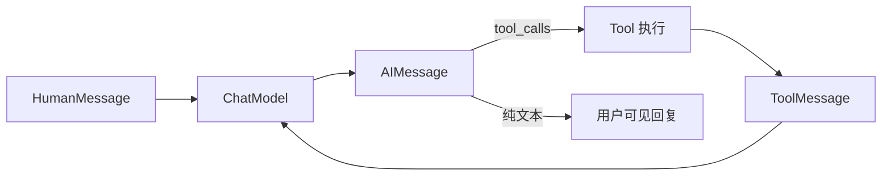

# LangChain.js 03 · Messages 消息体系

> ChatModel 的输入输出都是 **Message**。搞清 `HumanMessage`、`AIMessage`、`ToolMessage` 以及 `tool_calls` 字段，才能读懂 Agent 循环和 LangGraph 的 `messages` reducer。

**系列导航：** [02 Chat Models](./02-chat-models.md) · [专系列首页](./README.md) · 下一篇：[04 Prompt Templates](./04-prompt-templates.md)

---

## Message 在整条链路中的位置



类比前端：**消息数组 ≈ 聊天室 state 里的 `messages` 列表**；每条带 `role` 和扩展字段（Tool 结果、多模态块）。

---

## 核心类型一览

| 类 | `type` / role | 谁产生 | 典型 content |
|----|---------------|--------|--------------|
| `SystemMessage` | system | 开发者 | 系统指令、人设 |
| `HumanMessage` | human / user | 用户 | 用户输入 |
| `AIMessage` | ai / assistant | 模型 | 回复文本或 `tool_calls` |
| `ToolMessage` | tool | Tool 执行后 | Tool 返回的字符串/JSON |
| `FunctionMessage` | function | 旧 API | 逐步被 ToolMessage 替代 |

```typescript
import {
    SystemMessage,
    HumanMessage,
    AIMessage,
    ToolMessage,
} from "@langchain/core/messages";
```

---

## 构造与字段

### HumanMessage / SystemMessage

```typescript
const system = new SystemMessage("你是博客技术助手，回答简洁。");
const human = new HumanMessage("什么是 Runnable？");

// 多模态（Vision）
const humanWithImage = new HumanMessage({
    content: [
        { type: "text", text: "这张图里有什么？" },
        { type: "image_url", image_url: { url: "https://..." } },
    ],
});
```

| 字段 | 说明 |
|------|------|
| `content` | `string` 或 **多模态块数组** |
| `name` | 可选，多用户场景标识说话人 |
| `additional_kwargs` | 透传提供商扩展字段 |

---

### AIMessage

```typescript
const ai = new AIMessage("你好，有什么可以帮你？");

// 带 Tool 调用请求（模型返回）
const aiWithTools = new AIMessage({
    content: "",
    tool_calls: [
        {
            id: "call_abc",
            name: "search_wikipedia",
            args: { query: "LangChain" },
        },
    ],
});
```

| 字段 | 说明 | 使用场景 |
|------|------|----------|
| `content` | 文本回复 | 普通对话 |
| `tool_calls` | 模型想调的 Tool 列表 | Agent / ReAct |
| `invalid_tool_calls` | 解析失败的调用 | 调试 Schema 问题 |
| `usage_metadata` | Token 统计 | 成本核算 |
| `response_metadata` | `finish_reason` 等 | 判断是否因 length 截断 |

**底层：** OpenAI Chat API 把 `tool_calls` 放在 assistant 消息里；LangChain 统一成 `AIMessage` 结构，换 Anthropic 等提供商时字段映射在 Model 层完成。

---

### ToolMessage

Tool 执行完后 **必须** 回一条 `ToolMessage`，且 `tool_call_id` 与 `AIMessage.tool_calls[].id` 对应：

```typescript
const toolResult = new ToolMessage({
    content: "LangChain 是一个 LLM 应用框架…",
    tool_call_id: "call_abc",
    name: "search_wikipedia",
});
```

| 字段 | 必填 | 说明 |
|------|------|------|
| `content` | 是 | Tool 输出（字符串或可序列化结果） |
| `tool_call_id` | 是 | 关联哪次 `tool_calls` |
| `name` | 建议 | Tool 名，部分提供商需要 |

**使用场景：** 把 Tool 结果喂回模型，让下一轮 `invoke` 基于 Observation 继续推理。

**常见错误：** 漏 `tool_call_id` 或 id 不匹配 → API 400。

---

## 消息数组：多轮对话

```typescript
const history = [
    new SystemMessage("只根据资料回答"),
    new HumanMessage("第一篇讲了什么？"),
    new AIMessage("第一篇讲 Runnable…"),
    new HumanMessage("第二篇呢？"),
];

const reply = await model.invoke(history);
```

ChatModel 把整段 history 发给 API——**没有自动截断**。历史过长要自己做：

- 滑动窗口（只保留最近 N 条）
- 摘要压缩（用 LLM 把旧消息压成一条 `SystemMessage`）
- [13 Memory 进阶](../13-advanced-memory.md) 里的分层策略

---

## 与 OpenAI 格式的互转

```typescript
import { mapChatMessagesToStoredMessages, mapStoredMessagesToChatMessages } from "@langchain/core/messages";

// 存数据库：序列化
const stored = mapChatMessagesToStoredMessages(history);

// 读数据库：还原
const restored = mapStoredMessagesToChatMessages(stored);
```

**使用场景：** 会话持久化到 Postgres；与只用 `{ role, content }` 的简易 API 对接。

简化写法（部分 Model 支持）：

```typescript
await model.invoke([
    { role: "user", content: "你好" },
]);
// 内部转成 HumanMessage
```

---

## tool_calls 完整一轮

```typescript
import { tool } from "@langchain/core/tools";
import { z } from "zod";

const getWeather = tool(
    async ({ city }) => `${city}：晴`,
    { name: "get_weather", description: "天气", schema: z.object({ city: z.string() }) },
);

const modelWithTools = model.bindTools([getWeather]);
let messages: BaseMessage[] = [new HumanMessage("北京天气？")];

const ai1 = await modelWithTools.invoke(messages);
messages = [...messages, ai1];

if (ai1.tool_calls?.length) {
    for (const call of ai1.tool_calls) {
        const result = await getWeather.invoke(call.args);
        messages.push(
            new ToolMessage({
                content: String(result),
                tool_call_id: call.id!,
                name: call.name,
            }),
        );
    }
    const ai2 = await modelWithTools.invoke(messages);
    console.log(ai2.content);
}
```

这就是 [08 ReAct](../08-build-first-agent.md) 手写循环的 Message 版；LangGraph `ToolNode` 自动完成 Tool 执行 + `ToolMessage` 追加（[LangGraph 04](../langgraph/04-react-toolnode.md)）。

---

## RemoveMessage 与历史裁剪

LangGraph / 高级 Memory 会用到 **删消息**：

```typescript
import { RemoveMessage } from "@langchain/core/messages";

// 删除 id 为 xxx 的消息（需消息带 id）
new RemoveMessage({ id: "msg-123" });
```

`messagesStateReducer` 识别 `RemoveMessage` 并从数组移除——用于摘要后清旧历史，而不是整表替换。

---

## 常见坑

**1. ToolMessage 顺序错乱**  
必须先 `AIMessage(tool_calls)` 再对应 `ToolMessage`，不能交错。

**2. 把 Tool 输出对象直接塞 content**  
应 `JSON.stringify` 或人类可读字符串；超大结果要截断。

**3. System 消息堆太多条**  
多数 API 只建议一条 System；多条可能被合并或忽略。

**4. 存库只存 content 字符串**  
丢 `tool_calls` 后无法恢复 Agent 状态。用 `mapChatMessagesToStoredMessages`。

**5. 多模态 content 格式各厂商不同**  
换 Model 要测 image 块结构。

---

## 小结

| 类型 | 何时用 |
|------|--------|
| `SystemMessage` | 人设、RAG 规则 |
| `HumanMessage` | 用户输入 |
| `AIMessage` | 模型输出 / tool_calls |
| `ToolMessage` | Tool 执行结果回喂 |

**下一篇：** [04 Prompt Templates](./04-prompt-templates.md)
