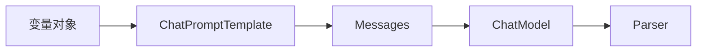

# LangChain.js 04 · Prompt Templates

> 把 Prompt 从字符串拼接升级成 **带变量的模板**，是 LangChain 最早也最有价值的能力之一。这篇讲 `ChatPromptTemplate`、`PromptTemplate`、Few-shot 与在 LCEL 里怎么 `pipe`。

**系列导航：** [03 Messages](./03-messages.md) · [专系列首页](./README.md) · 下一篇：[05 Tools](./05-tools.md)

---

## 为什么不用模板字符串

```typescript
// 脆弱：引号、换行、注入
const prompt = `根据资料回答：\n${context}\n\n问题：${question}`;
```

问题：

- 用户输入里的 `}` 可能破坏结构
- System / User 边界不清
- 难在 LangSmith 里对比「模板版本」

**ChatPromptTemplate** 把 **消息角色 + 变量槽位** 结构化，最终输出 `BaseMessage[]`（接 [03 Messages](./03-messages.md)）。

---

## ChatPromptTemplate.fromMessages

```typescript
import { ChatPromptTemplate } from "@langchain/core/prompts";

const prompt = ChatPromptTemplate.fromMessages([
    ["system", "你是技术博客助手。只根据 context 回答，不知道就说不知道。"],
    ["human", "资料：\n{context}\n\n问题：{question}"],
]);
```

### `invoke` 填充变量

```typescript
const messages = await prompt.invoke({
    context: "Runnable 是可组合的执行单元…",
    question: "pipe 做什么？",
});
// BaseMessage[]: SystemMessage + HumanMessage

const response = await model.invoke(messages);
```

| 参数 | 说明 |
|------|------|
| 模板变量名 | `{context}`、`{question}` 等，invoke 时 key 必须齐全 |
| 返回值 | `PromptValue` 或 Message 数组（视调用方式） |

**底层：** `invoke` 只做 **字符串替换 + 构造 Message**，不调 LLM——本身也是 Runnable。

---

## 消息角色占位符

```typescript
const prompt = ChatPromptTemplate.fromMessages([
    ["system", "{system_prompt}"],
    ["placeholder", "{history}"],  // 插入已有消息数组
    ["human", "{input}"],
]);
```

| 元组 | 含义 |
|------|------|
| `["system", "..."]` | SystemMessage |
| `["human", "..."]` | HumanMessage |
| `["ai", "..."]` | 示例 AI 回复（Few-shot） |
| `["placeholder", "{history}"]` | 把变量当 **整段消息列表** 插入 |

```typescript
await prompt.invoke({
    system_prompt: "简洁回答",
    history: [
        new HumanMessage("你好"),
        new AIMessage("你好！"),
    ],
    input: "继续",
});
```

**使用场景：** 多轮对话模板；RAG 固定 System + 动态 history + 当前问句。

---

## PromptTemplate（纯字符串）

旧式 completion 或需要单字符串时：

```typescript
import { PromptTemplate } from "@langchain/core/prompts";

const pt = PromptTemplate.fromTemplate(
    "将以下文本翻译成英文：\n{text}",
);

const str = await pt.invoke({ text: "你好" });
// 字符串，需再包成 HumanMessage 或接 LLM（非 Chat）
```

现代 Chat 应用 **优先 ChatPromptTemplate**。

---

## Few-shot 示例

在模板里写死示例消息，引导输出格式：

```typescript
const prompt = ChatPromptTemplate.fromMessages([
    ["system", "把用户问题分类为 search 或 chat，只输出一个词。"],
    ["human", "React 19 有什么新特性"],
    ["ai", "search"],
    ["human", "你好"],
    ["ai", "chat"],
    ["human", "{input}"],
]);
```

等价于 Prompt 工程里的 Few-shot；也可改用 `FewShotChatMessagePromptTemplate` 从数组动态生成。

**使用场景：** 轻量分类（Router）；格式固定的抽取任务。

**注意：** 示例会占 Token；复杂分类用 [02 withStructuredOutput](./02-chat-models.md)。

---

## 与 LCEL 组合

```typescript
const chain = prompt.pipe(model).pipe(new StringOutputParser());

await chain.invoke({ context: "...", question: "..." });
```



`prompt` 作为 Runnable 第一段，LangSmith trace 里单独一层 **「Prompt」**，方便 A/B 改模板。

---

## partial — 预填部分变量

```typescript
const ragPrompt = ChatPromptTemplate.fromMessages([
    ["system", "{system_rules}"],
    ["human", "资料：{context}\n问题：{question}"],
]);

// 系统规则固定，每次只传 context + question
const specialized = ragPrompt.partial({
    system_rules: "你是博客助手，引用资料编号。",
});

await specialized.invoke({ context: "...", question: "..." });
```

**使用场景：** 同一模板多业务线，只改 `partial` 的 System 规则。

---

## 输入校验与缺失变量

缺变量时 `invoke` **抛错**（而非静默空字符串）——利于早发现配置错误。

自定义可选变量可用默认值：

```typescript
["human", "{question}\n{extra}"]
// extra 在 partial 里默认 ""
```

---

## 与 RAG 的配合

对齐 [RAG 实战](../rag-blog-knowledge-search.md)：

```typescript
const hits = await vectorStore.similaritySearch(query, 5);
const context = hits.map((d, i) => `[${i + 1}] ${d.pageContent}`).join("\n\n");

const answer = await chain.invoke({
    context,
    question: query,
});
```

模板层只管 **格式**；检索策略在 [09 Vector Stores](./09-vector-stores.md) 与 [11 RAG 进阶](../11-advanced-rag-patterns.md)。

---

## 常见坑

**1. 变量名与 `{context}` 大小写不一致**  
`invoke` 失败。用 TypeScript 对象类型约束变量集。

**2. context 不转义用户恶意内容**  
用户问句进模板可能误导模型；RAG 资料也要防注入（System 里声明「资料不可信指令」）。

**3. placeholder 传错类型**  
`{history}` 必须是 `BaseMessage[]`，不是 JSON 字符串。

**4. Few-shot 示例与真实分布差太远**  
分类准确率掉；要换示例或改 structured output。

**5. 在模板里塞几万字 context**  
应控制检索 Top-K 与每块长度，不是加大模板。

---

## 小结

| API | 输出 | 场景 |
|-----|------|------|
| `ChatPromptTemplate.fromMessages` | Message[] | Chat 应用标准 |
| `placeholder` | 插入历史 | 多轮 |
| `partial` | 预填变量 | 固定 System |
| `.pipe(model)` | LCEL 链 | RAG / 对话 |

**上一篇：** [03 Messages](./03-messages.md) · **下一篇：** [05 Tools](./05-tools.md)
