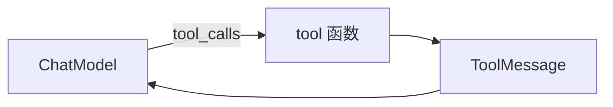

# LangChain.js 05 · Tools 与 tool()

> Tool 是 Agent 的「手和脚」。LangChain 用 `tool()` 和 `DynamicStructuredTool` 把 **JSON Schema + 执行函数** 绑在一起，供 `bindTools` 和 LangGraph `ToolNode` 消费。

**系列导航：** [04 Prompt](./04-prompt-templates.md) · [专系列首页](./README.md) · 下一篇：[06 Documents](./06-documents.md)

**对照：** [09 自研 ToolRegistry](../09-tools-system-design.md) · [LangGraph 04 ToolNode](../langgraph/04-react-toolnode.md)

---

## Tool 的三件套

| 部分 | 作用 | 谁读 |
|------|------|------|
| `name` | 唯一标识 | 模型选 Tool、ToolMessage |
| `description` | 自然语言说明 | **模型**决定何时调用 |
| `schema` | 参数 JSON Schema（常用 Zod） | 模型填参 + 运行时校验 |



**底层：** `bindTools` 把 schema 发给 API；模型返回 `args`；LangChain 用 Zod **parse** 后再调你的函数。

---

## tool() 快捷定义

```typescript
import { tool } from "@langchain/core/tools";
import { z } from "zod";

const searchWiki = tool(
    async ({ query }) => {
        const url = `https://en.wikipedia.org/api/rest_v1/page/summary/${encodeURIComponent(query)}`;
        const res = await fetch(url);
        if (!res.ok) return "未找到";
        const data = await res.json();
        return data.extract ?? "无摘要";
    },
    {
        name: "search_wikipedia",
        description: "查询维基百科条目摘要。用于调研背景知识，query 建议英文。",
        schema: z.object({
            query: z.string().describe("搜索主题关键词"),
        }),
    },
);
```

### 第二参数字段

| 字段 | 必填 | 说明 |
|------|------|------|
| `name` | 是 | 稳定、snake_case，勿随意改（影响已存 trace） |
| `description` | 是 | 写清 **何时用、不用**；模型主要靠它选型 |
| `schema` | 是 | `z.object(...)`，字段加 `.describe()` |
| `returnDirect` | 否 | `true` 时 Tool 结果直接返回用户（少用） |

### 执行函数

```typescript
await searchWiki.invoke({ query: "LangChain" });
// 也可 searchWiki.call({ query: "..." })
```

Tool 本身也是 **Runnable**——可单独测，不经过 LLM。

---

## DynamicStructuredTool

需要动态 name 或更复杂控制时用类形式：

```typescript
import { DynamicStructuredTool } from "@langchain/core/tools";

const calc = new DynamicStructuredTool({
    name: "calculator",
    description: "数学计算，支持 + - * /",
    schema: z.object({
        expression: z.string().describe("算式，如 (1+2)*3"),
    }),
    func: async ({ expression }) => {
        // 生产环境勿 eval；示例仅说明结构
        return String(/* 安全计算库结果 */);
    },
});
```

与 `tool()` **能力等价**，选型看团队习惯。

---

## 与 bindTools 配合

```typescript
const modelWithTools = model.bindTools([searchWiki, calc], {
    tool_choice: "auto", // "none" | "required" | 指定 name
});

const ai = await modelWithTools.invoke([new HumanMessage("1+2*3 等于几？")]);
```

| `tool_choice` | 行为 |
|---------------|------|
| `auto` | 模型决定是否调 Tool |
| `none` | 禁止 Tool |
| `required` | 必须调某个 Tool |
| `"calculator"` | 强制指定 Tool |

见 [02 Chat Models](./02-chat-models.md)。

---

## 多 Tool 选型：description 怎么写

模型 **不看** 你的 TypeScript 实现，只看 description + schema：

```typescript
// 差：模型不知道何时用哪个
description: "搜索工具"

// 好：边界清晰
description: "仅用于查询维基百科百科条目摘要。不用于实时新闻。参数 query 用英文主题词。"
```

对齐 [09 最佳实践](../09-tools-system-design.md)：

- 一个 Tool 一件事
- 参数越少越好
- 失败返回 **可读错误字符串**（模型会据此重试或换策略）

---

## 错误处理与返回值

```typescript
const fetchUrl = tool(
    async ({ url }) => {
        try {
            const res = await fetch(url, { signal: AbortSignal.timeout(5000) });
            if (!res.ok) return `HTTP ${res.status}：请求失败`;
            return (await res.text()).slice(0, 4000);
        } catch (e) {
            return `抓取超时或网络错误：${(e as Error).message}`;
        }
    },
    { name: "fetch_url", description: "...", schema: z.object({ url: z.string().url() }) },
);
```

**原则：** 尽量 **return 错误信息** 而不是 `throw`——让模型看见 Observation 自行调整。只有鉴权失败等才 `throw` 中断图。

---

## 权限与鉴权（生产）

Tool 函数内拿 **当前用户上下文**，不要信任模型传的 userId：

```typescript
const queryOrder = tool(
    async ({ orderId }, config) => {
        const userId = config?.configurable?.userId as string;
        if (!userId) throw new Error("未登录");
        return await orderService.getForUser(userId, orderId);
    },
    { name: "query_order", description: "查询当前用户订单", schema: z.object({ orderId: z.string() }) },
);

// invoke 时传入
await agent.invoke(input, { configurable: { userId: "u-1" } });
```

LangGraph 节点里 `config` 从 `invoke` 透传到 Tool。

---

## Tool 列表给模型看的格式

`bindTools` 内部转成 OpenAI tools 格式：

```json
{
  "type": "function",
  "function": {
    "name": "search_wikipedia",
    "description": "...",
    "parameters": { "type": "object", "properties": { ... } }
  }
}
```

调试时可在 LangSmith 看 **实际发出的 tools 数组**，检查 description 是否过长（占 Token）。

---

## 与自研 ToolRegistry 对照

| | 自研（08/09） | LangChain `tool()` |
|--|---------------|-------------------|
| Schema | 手写 JSON Schema | Zod → 自动转 |
| 注册 | `Map<name, Tool>` | 数组传给 `bindTools` |
| 执行 | `registry.run(name, input)` | `tool.invoke` / ToolNode |
| 测试 | 单测 `execute` | 单测 `tool.invoke` |

可 **渐进迁移**：先 LangChain 定义 Tool，执行层仍调现有 service。

---

## 常见坑

**1. schema 太复杂**  
嵌套过深模型填参失败。拆多个 Tool 或减参数。

**2. description 与实现不一致**  
模型乱调。改 description 比改 Prompt 更有效。

**3. 返回超大 JSON**  
撑爆 context。截断 + 摘要 Tool。

**4. 同名 Tool**  
`bindTools` 数组里 name 重复，行为未定义。

**5. 在前端定义可执行 Tool**  
密钥与 SSRF 风险。Tool 函数只在服务端。

---

## 小结

| API | 用途 |
|-----|------|
| `tool(fn, { name, description, schema })` | 标准定义 |
| `DynamicStructuredTool` | 动态/类风格 |
| `tool.invoke(args, config)` | 单测与直接调用 |
| `bindTools([...])` | 挂到 ChatModel |

**下一篇：** [06 Documents](./06-documents.md)
