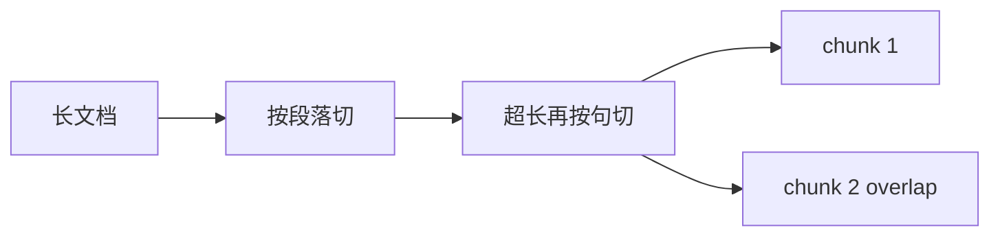

# LangChain.js 07 · Text Splitters

> 检索的最小单位是 **chunk**。Splitter 把长 `Document` 切成多个短 `Document`，并继承/扩展 `metadata`。

**系列导航：** [06 Documents](./06-documents.md) · [专系列首页](./README.md) · 下一篇：[08 Embeddings](./08-embeddings.md)

**对照：** [11 RAG 索引层](../11-advanced-rag-patterns.md#第一层索引文档怎么切)

---

## RecursiveCharacterTextSplitter

最常用的通用分块器：

```typescript
import { RecursiveCharacterTextSplitter } from "@langchain/textsplitters";

const splitter = new RecursiveCharacterTextSplitter({
    chunkSize: 512,
    chunkOverlap: 64,
    separators: ["\n\n", "\n", "。", " ", ""],
});
```

### 构造参数

| 参数 | 类型 | 默认 | 说明 |
|------|------|------|------|
| `chunkSize` | `number` | `1000` | 单块目标长度（**字符**，非 token） |
| `chunkOverlap` | `number` | `200` | 相邻块重叠字符数 |
| `separators` | `string[]` | 多级 | 优先按序切分 |
| `lengthFunction` | `(s) => number` | 字符长度 | 可改为 token 计数 |

**底层算法：**

1. 按 `separators[0]` 切
2. 块仍超长则换下一级 separator
3. 合并过小片段直到接近 `chunkSize`
4. 相邻块复制 `overlap` 字符减少「断在半句」



---

## splitDocuments vs createDocuments

```typescript
const chunks = await splitter.splitDocuments(docs);
// 每个 chunk 是新 Document，metadata 从父 doc 复制

const chunks2 = await splitter.createDocuments(
    ["纯文本1", "纯文本2"],
    [{ source: "a" }, { source: "b" }],
);
```

| 方法 | 输入 |
|------|------|
| `splitDocuments` | `Document[]` |
| `createDocuments` | `string[]` + 可选 metadata 数组 |

---

## 按 Markdown 标题切（结构化内容）

LangChain 提供 `MarkdownTextSplitter` 或自定义：

```typescript
function splitByH2(markdown: string, source: string): Document[] {
    const parts = markdown.split(/^## /m);
    return parts
        .filter((p) => p.trim())
        .map((part, i) => new Document({
            pageContent: part.startsWith("#") ? part : `## ${part}`,
            metadata: { source, sectionIndex: i },
        }));
}
```

| 策略 | 适合 |
|------|------|
| 按 `##` | 博客、技术文档 |
| Recursive + overlap | 长文、PDF 纯文本 |
| 按 API  endpoint | OpenAPI 文档 |

与 [11 按标题切](../11-advanced-rag-patterns.md) 自研逻辑一致；LangChain 版少写胶水。

---

## chunkSize 怎么选

| chunkSize | 效果 |
|-----------|------|
| 128～256 | 精准定位，易缺上下文 |
| 512～1024 | 常见默认 |
| 2000+ | 语义糊，噪声多 |

**overlap：** 通常 `chunkSize` 的 10%～20%。

**token vs 字符：** 中文 512 字符 ≈ 300～400 token；若模型 context 紧，用 `lengthFunction` 接 tiktoken。

---

## metadata 传递

切分后自动带：

```typescript
{
    source: "doc.md",
    loc: { lines: { from: 10, to: 45 } }, // 部分 splitter 提供
}
```

UI 引用可展示「来源 § 某节」。

---

## 常见坑

**1. chunkSize 按 token 填却用默认字符长度**  
实际块过大撑爆 Embedding 输入。

**2. overlap = 0**  
边界问题频发（[11 篇](../11-advanced-rag-patterns.md)）。

**3. 代码块被从中间切断**  
Markdown 用标题切或 separator 含 `\n\n` 保护段落。

**4. 切完不更新 metadata.chunkId**  
增量更新难。加 `chunkIndex`、`docId`。

**5. 每次查询重新 split**  
索引阶段 split 一次写入向量库；查询侧不 split 全库。

---

## 小结

| API | 用途 |
|-----|------|
| `RecursiveCharacterTextSplitter` | 通用分块 |
| `splitDocuments` | Document[] → 更小 Document[] |
| `chunkSize` / `chunkOverlap` | 核心调参 |

**下一篇：** [08 Embeddings](./08-embeddings.md)
