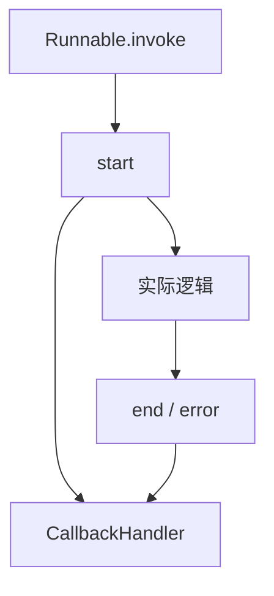

# LangChain.js 11 · Callbacks 与 LangSmith

> 链越长，越难肉眼 debug。**Callbacks** 在每次 Runnable 执行前后挂钩子；**LangSmith** 把整棵树可视化、可对比、可回归。

**系列导航：** [10 Output Parsers](./10-output-parsers.md) · [专系列首页](./README.md) · 下一篇：[12 Retrievers](./12-retrievers.md)

**对照：** [15 生态篇 LangSmith 一节](../15-langchain-js-guide.md#langsmith最小可观测接入) · [18 上线 Checklist](../18-agent-production-checklist.md)

---

## Callback 执行模型



每个 Runnable 调用可能触发：

| 事件 | 时机 |
|------|------|
| `handleChainStart` / `End` | 链、子链 |
| `handleLLMStart` / `End` | Model（含 ChatModel） |
| `handleChatModelStart` | Chat 专用 |
| `handleToolStart` / `End` | Tool 执行 |
| `handleRetrieverStart` | 检索 |

**config 透传：** `invoke(input, { callbacks: [handler] })` 向下合并到子 Runnable。

---

## 自定义 Console Handler

```typescript
import { BaseCallbackHandler } from "@langchain/core/callbacks/base";

class TokenLogger extends BaseCallbackHandler {
    name = "token_logger";

    async handleLLMEnd(output: any) {
        const usage = output.llmOutput?.tokenUsage;
        if (usage) {
            console.log("[tokens]", usage);
        }
    }

    async handleToolStart(tool, input) {
        console.log("[tool start]", tool.name, input);
    }
}

await chain.invoke(
    { question: "你好" },
    { callbacks: [new TokenLogger()] },
);
```

**使用场景：** 本地开发快速看 Token；生产写结构化日志到 ELK。

---

## LangSmith 最小接入

### 环境变量

```bash
LANGCHAIN_TRACING_V2=true
LANGCHAIN_API_KEY=lsv2_pt_...
LANGCHAIN_PROJECT=blog-agent-dev
# 可选
LANGCHAIN_ENDPOINT=https://api.smith.langchain.com
```

设置后，多数 LangChain / LangGraph 调用 **自动上报**，无需改代码。

### 显式 Client

```typescript
import { Client } from "langsmith";

const client = new Client();
// 管理 datasets、批量 eval 时用
```

---

## RunnableConfig 与 Trace 元数据

```typescript
await agent.invoke(
    { messages: [{ role: "user", content: "查订单" }] },
    {
        runName: "support-agent",
        tags: ["prod", "v2"],
        metadata: {
            userId: "u-42",
            threadId: "sess-abc",
        },
    },
);
```

| 字段 | LangSmith 用途 |
|------|----------------|
| `runName` | 运行列表标题 |
| `tags` | 过滤 prod/staging |
| `metadata` | 按 userId 查单用户问题 |

**与 LangGraph：** `configurable.thread_id` 也会进 metadata，便于关联多轮。

---

## Trace 树读法

一次 `agent.invoke` 典型结构：

```
LangGraph (graph)
├── agent (node)
│   └── ChatOpenAI
├── tools (node)
│   └── search_wikipedia (tool)
└── agent
    └── ChatOpenAI
```

| 看什么 | 定位什么问题 |
|--------|--------------|
| 每层 **输入输出** | Prompt 是否缺 context |
| **Token / 延迟** | 哪步最贵 |
| **Tool 参数** | Schema 是否误导模型 |
| **错误节点** | 哪步抛错 |

---

## Datasets 与回归（Eval 入门）

```typescript
// 概念流程
// 1. LangSmith UI 创建 Dataset，录 golden 输入
// 2. 脚本批量 invoke 同一 chain
// 3. 对比输出或跑 LLM-as-judge

import { evaluate } from "langsmith/evaluation";
// 详见 LangSmith 文档，与 Agent eval 专题衔接
```

**使用场景：** 改 Prompt 前跑 20 条 golden，防回归（规划中的 Agent eval 篇会展开）。

---

## LangSmith vs 自建日志

| | LangSmith | 自建 SSE + 日志 |
|--|-----------|-----------------|
| 嵌套调用树 | 自动 | 要自己拼 parentId |
| Prompt 版本对比 | 内置 | 要自己存 |
| 成本 |  SaaS 计费 |  infra 成本 |
| 与 LangChain 集成 | 零代码 trace | 全手写 |

**建议：** 开发/Staging 开 LangSmith；生产可同时打 **结构化日志**（userId、latency）做告警，不必二选一。

---

## Langfuse 等替代

[16 上线篇](../16-langgraphjs-practice.md) 会对比 **LangSmith vs Langfuse**。Callbacks 同样可接 Langfuse Handler——原理都是 `BaseCallbackHandler`。

---

## 常见坑

**1. 生产泄露 Prompt 含 PII**  
LangSmith 存全文。敏感字段脱敏或采样 trace。

**2. 只开 tracing 不设 PROJECT**  
多项目 trace 混在一起。

**3. callbacks 数组每次 new**  
无妨；注意 Handler 内不要闭包泄漏大对象。

**4. 非 LangChain 的 fetch 不进 trace**  
包一层 `RunnableLambda` 或手动 `traceable`（LangSmith SDK）。

**5. 本地 `LANGCHAIN_TRACING_V2` 忘记关**  
CI 误上报或失败。CI 显式 `false`。

---

## 小结

| 机制 | 作用 |
|------|------|
| `BaseCallbackHandler` | 钩子 Token、Tool、错误 |
| 环境变量 tracing | 自动 LangSmith |
| `metadata` / `tags` | 过滤与排障 |
| Datasets | 回归测试基础 |

**LangChain 专系列 01～14。** 编排与生产 checkpoint 见 [LangGraph 专系列](../langgraph/README.md)。
