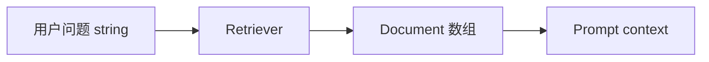

# LangChain.js 12 · Retrievers 检索器

> [09 Vector Stores](./09-vector-stores.md) 的 `similaritySearch` 是「查库」；**Retriever** 把检索封装成 **Runnable**：输入问句，输出 `Document[]`，可直接 `pipe` 进 LCEL 或挂成 Agent Tool。

**系列导航：** [11 Callbacks](./11-callbacks-langsmith.md) · [专系列首页](./README.md) · 下一篇：[13 会话历史](./13-message-history.md)

---

## Retriever 是什么

```typescript
interface RetrieverInterface {
    invoke(query: string): Promise<Document[]>;
    // 亦是 Runnable<string, Document[]>
}
```



类比：Retriever = 专门做「问句 → 相关片段」的 **数据访问层**，隐藏向量库 / 混合检索细节。

---

## 从 VectorStore 创建

```typescript
const retriever = vectorStore.asRetriever({
    k: 5,
    searchType: "similarity", // 或 "mmr"
    filter: { tenantId: "team-a" },
});

const docs = await retriever.invoke("ReAct 循环怎么写？");
```

### asRetriever 参数

| 参数 | 说明 |
|------|------|
| `k` | 返回条数 |
| `searchType` | `similarity` 默认；`mmr` 减冗余 |
| `filter` | metadata 过滤 |
| `searchKwargs` | 透传向量库额外参数（JS API 为 camelCase，见 [VectorStoreRetrieverInput](https://reference.langchain.com/javascript/langchain-core/vectorstores/VectorStoreRetrieverInput)） |

**底层：** 内部 `embedQuery` + `similaritySearch`，与 09 直调等价。

---

## 接入 LCEL RAG 链

```typescript
import { RunnablePassthrough } from "@langchain/core/runnables";

function formatDocs(docs: Document[]) {
    return docs.map((d, i) => `[${i + 1}] ${d.pageContent}`).join("\n\n");
}

const ragChain = RunnableSequence.from([
    {
        context: retriever.pipe(formatDocs),
        question: new RunnablePassthrough(),
    },
    prompt,
    model,
    new StringOutputParser(),
]);

await ragChain.invoke("LangGraph 和 LangChain 区别？");
```

| 段 | 作用 |
|----|------|
| `retriever.pipe(formatDocs)` | 问句进，字符串 context 出 |
| `RunnablePassthrough` | 原问句并行传到 `question` |

对照 [04 Prompt](./04-prompt-templates.md) RAG 模板。

---

## MultiQueryRetriever（查询扩展）

用户问法绕，一次检索不够——用 LLM 生成多个查询再合并结果（概念实现）：

```typescript
import { MultiQueryRetriever } from "@langchain/classic/retrievers/multi_query";

const multiRetriever = MultiQueryRetriever.fromLLM({
    llm: model,
    retriever: baseRetriever,
    queryCount: 3,
});
```

**代价：** 多几次 Embedding + 检索；**收益：** 召回率提升。见 [11 RAG 查询层](../11-advanced-rag-patterns.md#第三层查询用户问法很绕怎么办)。

---

## ContextualCompressionRetriever（检索后压缩）

检索 Top-10 再让 LLM 或模型 **只留相关句**：

```typescript
import { ContextualCompressionRetriever } from "@langchain/classic/retrievers/contextual_compression";
import { LLMChainExtractor } from "@langchain/classic/retrievers/document_compressors/chain_extract";

const compressor = LLMChainExtractor.fromLLM(model);
const compressionRetriever = new ContextualCompressionRetriever({
    baseCompressor: compressor,
    baseRetriever: retriever,
});
```

**使用场景：** chunk 偏大、噪声多；用压缩换更干净的 context（多花 LLM 调用）。

---

## Retriever 作为 Tool

```typescript
const searchDocs = tool(
    async ({ query }) => {
        const docs = await retriever.invoke(query);
        return formatDocs(docs);
    },
    {
        name: "search_knowledge_base",
        description: "搜索内部技术文档。用户问产品/博客/API 时用。",
        schema: z.object({ query: z.string() }),
    },
);
```

Agent **自主决定何时检索**，而非每条消息都 RAG——对齐 [11 Agentic RAG](../11-advanced-rag-patterns.md#进阶形态agent-来搜图来串)。

---

## BaseRetriever 自定义

```typescript
import { BaseRetriever } from "@langchain/core/retrievers";
import type { Document } from "@langchain/core/documents";

class HybridRetriever extends BaseRetriever {
    lc_namespace = ["custom"];

    async _getRelevantDocuments(query: string): Promise<Document[]> {
        const vectorHits = await vectorStore.similaritySearch(query, 5);
        const keywordHits = await bm25Search(query, 5);
        return mergeAndDedupe(vectorHits, keywordHits);
    }
}
```

**使用场景：** [11 混合检索](../11-advanced-rag-patterns.md#第二层检索为什么搜不准) 自研逻辑包成 Runnable，链与 Agent 统一接口。

---

## 常见坑

**1. Retriever 每次 invoke 都全库扫**  
应走索引；BM25 侧也要有倒排而非 `filter` 全表。

**2. k 过大**  
context 爆 Token。先 k=10 再压缩或重排。

**3. 忘记 metadata filter**  
多租户泄漏。`asRetriever({ filter })` 与鉴权一致。

**4. formatDocs 不带来源**  
用户无法核对。metadata.source 进 prompt。

**5. MultiQuery 不限制 queryCount**  
成本线性涨。固定 3～5。

---

## 小结

| API | 场景 |
|-----|------|
| `asRetriever` | VectorStore → Runnable |
| LCEL `retriever.pipe(format)` | 固定 RAG 链 |
| MultiQuery / Compression | 进阶召回与降噪 |
| 自定义 `BaseRetriever` | 混合检索 |
| 包成 Tool | Agentic RAG |

**下一篇：** [13 会话历史 RunnableWithMessageHistory](./13-message-history.md)
