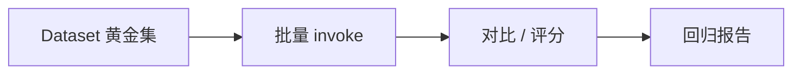

# LangChain.js 15 · LangSmith Eval 与 Datasets

> [11 Callbacks](./11-callbacks-langsmith.md) 讲了 trace；这篇讲 **Datasets 录 golden 用例**、**批量跑链/Agent**、**对比回归**——改 Prompt 或换模型前的安全网。

**系列导航：** [14 Community](./14-community-integrations.md) · [专系列首页](./README.md) · 下一篇：[16 Runnable 分支](./16-runnable-branch.md)

---

## 为什么需要 Eval

| 没有 Eval | 有 Eval |
|-----------|---------|
| 「感觉变差了」 | 20 条 golden 通过率 95% → 80% |
| 线上用户先踩坑 | Staging 先红 |
| 不知道哪类问题 | 按 tag 看 search vs chat |



---

## 创建 Dataset

### UI 方式

1. LangSmith → Datasets → Create
2. 每行：`input`（JSON）+ 可选 `reference_output`
3. 从生产 trace **一键加进 Dataset**（最有价值的 golden 来源）

### SDK 方式

```typescript
import { Client } from "langsmith";

const client = new Client();

const dataset = await client.createDataset("blog-rag-v1", {
    description: "博客 RAG 问答 golden",
});

await client.createExamples({
    inputs: [
        { question: "Runnable 是什么？" },
        { question: "LangGraph 和 LangChain 区别？" },
    ],
    outputs: [
        { answer: "应提到 pipe 与 Runnable 协议" },
        { answer: "应区分编排与积木" },
    ],
    datasetId: dataset.id,
});
```

| 字段 | 说明 |
|------|------|
| `inputs` | 链/Agent `invoke` 的入参对象 |
| `outputs` | 参考答案或 rubric 文本（给 judge 用） |
| `metadata` | `tag: search` 等，过滤报告 |

---

## 批量跑 evaluate

```typescript
import { evaluate } from "langsmith/evaluation";
import { StringOutputParser } from "@langchain/core/output_parsers";

// 你的 RAG 链
const chain = prompt.pipe(model).pipe(new StringOutputParser());

async function target(inputs: { question: string }) {
    return { answer: await chain.invoke({ question: inputs.question }) };
}

// 简单规则评估：参考输出包含关键词
function containsKeywords({ inputs, outputs, referenceOutputs }) {
    const ref = String(referenceOutputs?.answer ?? "");
    const out = String(outputs?.answer ?? "");
    const keywords = ref.match(/应提到 (.+)/)?.[1]?.split("、") ?? [];
    const score = keywords.every((k) => out.includes(k)) ? 1 : 0;
    return { key: "keyword_match", score };
}

await evaluate(target, {
    data: "blog-rag-v1", // dataset 名
    evaluators: [containsKeywords],
    experimentPrefix: "rag-prompt-v2",
});
```

| 参数 | 说明 |
|------|------|
| `data` | Dataset 名或 name 列表 |
| `evaluators` | 打分函数数组 |
| `experimentPrefix` | 实验名前缀，UI 对比 |

**底层：** 并行跑 target，每条写 run + evaluator score 到 LangSmith Experiments。

---

## LLM-as-Judge

规则不够时，用模型当评委：

```typescript
import { ChatOpenAI } from "@langchain/openai";

const judge = new ChatOpenAI({ model: "gpt-4o-mini", temperature: 0 });

async function llmJudge({ inputs, outputs, referenceOutputs }) {
    const res = await judge.invoke([
        {
            role: "system",
            content: "只输出 0 或 1。1=回答正确且基于参考要点。",
        },
        {
            role: "user",
            content: `问题：${inputs.question}\n参考：${referenceOutputs?.answer}\n实际：${outputs?.answer}`,
        },
    ]);
    const score = String(res.content).includes("1") ? 1 : 0;
    return { key: "llm_judge", score };
}
```

**成本：** 每条 golden 多一次 LLM；golden 集保持 20～50 条即可。

---

## 评估 LangGraph Agent

```typescript
async function agentTarget(inputs: { message: string }) {
    const result = await graph.invoke(
        { messages: [{ role: "user", content: inputs.message }] },
        { configurable: { thread_id: `eval-${crypto.randomUUID()}` } },
    );
    const last = result.messages.at(-1);
    return { answer: String(last?.content ?? "") };
}
```

**注意：** 每条 eval 用 **新 thread_id**，避免 checkpoint 串话。

Tool 类用例可加 evaluator：是否调了 `search_knowledge_base`（读 LangSmith trace 或解析 `tool_calls`）。

---

## CI 里跑 Eval

```yaml
# .github/workflows/agent-eval.yml 概念
- run: |
    export LANGCHAIN_TRACING_V2=true
    export LANGCHAIN_API_KEY=${{ secrets.LANGSMITH_API_KEY }}
    pnpm tsx scripts/run-eval.ts
```

| 实践 | 说明 |
|------|------|
| PR 改 Prompt/RAG | 跑 subset dataset |
| 分数低于 main 分支 | 警告或 block（阈值自定） |
|  nightly | 全量 golden |

---

## 与 11 trace 的关系

| trace | eval |
|-------|------|
| 单次请求调试 | 批量对比版本 |
| 开发时开 | CI + 发版前 |

从 trace「加入 Dataset」把真实坏 case 沉淀成 golden，闭环。

---

## 常见坑

**1. reference_output 写太模糊**  
「回答要好」无法自动打分。写可验证要点。

**2. eval 连生产库**  
用 staging 向量库 snapshot 或只读副本。

**3. 不固定 model 版本**  
gpt-4o-mini 行为漂移，分数波动。

**4. Agent eval 共用 thread_id**  
历史污染，结果无意义。

**5. 只看平均分**  
某 tag 全挂（如 `code` 类）被平均掩盖。按 metadata 分组看。

---

## 小结

| 步骤 | 工具 |
|------|------|
| 录 golden | Dataset UI / SDK |
| 批量跑 | `evaluate(target, ...)` |
| 规则分 | 自定义 evaluator |
| 语义分 | LLM-as-Judge |
| 回归 | Experiments 对比 |

**下一篇：** [16 Runnable 分支与路由链](./16-runnable-branch.md)
