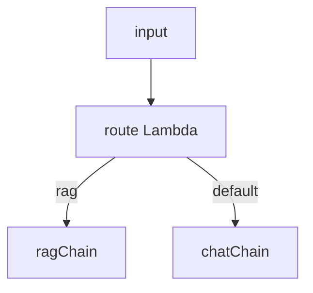

# LangChain.js 16 · Runnable 分支与路由链

> 不是所有路由都要上图。[01 Runnable](./01-runnable-lcel.md) 的 **RunnableBranch**、**RunnableLambda** 可在 LCEL 里做「意图分流」——适合 [12 Router](../12-multi-agent-systems.md#单层路由一个门卫分发请求) 的轻量版。

**系列导航：** [15 LangSmith Eval](./15-langsmith-eval.md) · [专系列首页](./README.md)

**何时上图：** 多轮 Tool、interrupt、checkpoint → [LangGraph 03 条件边](../langgraph/03-conditional-edges.md)

---

## RunnableBranch 基本形态

```typescript
import { RunnableBranch, RunnableLambda } from "@langchain/core/runnables";
import { StringOutputParser } from "@langchain/core/output_parsers";

const chatChain = chatPrompt.pipe(model).pipe(new StringOutputParser());
const ragChain = ragPrompt.pipe(model).pipe(new StringOutputParser());

const route = RunnableLambda.from((input: { question: string }) => {
    const q = input.question.toLowerCase();
    if (q.includes("查") || q.includes("搜索") || q.includes("文档")) return "rag";
    return "chat";
});

const router = RunnableBranch.from([
    [(state) => route.invoke(state) === "rag", ragChain],
    chatChain, // 默认分支
]);

await router.invoke({ question: "搜索 LangGraph 文档" });
```



| 组件 | 作用 |
|------|------|
| 条件数组 | `[predicate, runnable]` 对，先匹配先用 |
| 最后一个 runnable | 默认分支（无 predicate） |
| predicate | `(input) => boolean` 或 async |

---

## 与 withStructuredOutput Router 结合

字符串 `includes` 不稳，用 [02 structured output](./02-chat-models.md)：

```typescript
import { z } from "zod";

const routeSchema = z.object({
    intent: z.enum(["rag", "chat", "code"]),
});

const routerModel = model.withStructuredOutput(routeSchema);

const classify = RunnableLambda.from(async (input: { question: string }) => {
    const { intent } = await routerModel.invoke(input.question);
    return intent;
});

const branch = RunnableBranch.from([
    [(input) => classify.invoke(input) === "rag", ragChain],
    [(input) => classify.invoke(input) === "code", codeChain],
    chatChain,
]);
```

**代价：** 每请求至少 **1 次额外 LLM**（分类）；换更便宜的 `mini` 模型做 Router。

---

## RunnableParallel + Branch 组合

先并行抽特征，再分支：

```typescript
import { RunnableParallel } from "@langchain/core/runnables";

const enrich = RunnableParallel.from({
    question: (input) => input.question,
    intent: classify,
});

const chain = enrich.pipe(
    RunnableBranch.from([
        [(x) => x.intent === "rag", RunnableLambda.from((x) => ragChain.invoke(x.question))],
        RunnableLambda.from((x) => chatChain.invoke(x.question)),
    ]),
);
```

**使用场景：** 分类与主链输入结构不一致时的胶水层。

---

## RunnablePassthrough 保留原输入

```typescript
import { RunnablePassthrough } from "@langchain/core/runnables";

const withContext = RunnablePassthrough.assign({
    context: retriever.pipe(formatDocs),
}).pipe(
    RunnableBranch.from([
        [(x) => x.question.length > 200, longContextChain],
        shortContextChain,
    ]),
);

await withContext.invoke({ question: "..." });
```

`RunnablePassthrough.assign` 在 input 上 **追加字段** 再传给下游（见 [RunnablePassthrough.assign](https://reference.langchain.com/javascript/langchain-core/runnables/RunnablePassthrough/assign)）。

---

## LCEL Router vs LangGraph Router

| | RunnableBranch | LangGraph 条件边 |
|--|----------------|------------------|
| 状态 | 单次 input 对象 | State + checkpoint |
| Tool 循环 | 需手写 while | 原生 ReAct 图 |
| 流式 | 链 `stream` | `streamEvents` |
| 复杂度 | 低 | 中高 |
| 适合 | 2～3 条固定链 | Agent、审批、多 Agent |

[15 选型](../15-langchain-js-guide.md)：单链分流用 Branch；要记忆与 Tool 用 LangGraph。

---

## 流式注意

`RunnableBranch` 选中分支后，仅该分支 `stream` 事件透出。换分支不会同时流两路。

---

## 常见坑

**1. 条件顺序错**  
宽泛条件放前面会挡掉后面。把 **最具体** 分支放最前。

**2. classify 调两次**  
predicate 里重复 `classify.invoke` 烧双倍。先 `RunnablePassthrough.assign` 缓存 intent。

**3. 分支输入类型不一致**  
统一 enrich 层规范化。

**4. 默认分支忘记**  
无匹配抛错。始终留 chat 默认。

**5. 在 Branch 里写长 Agent 循环**  
应拆 LangGraph，Branch 只选入口链。

---

## 小结

| API | 场景 |
|-----|------|
| `RunnableBranch.from` | 多链选一 |
| `RunnableLambda` | 路由函数 |
| `withStructuredOutput` | 意图分类 |
| `RunnablePassthrough.assign` | 先 enrich 再分支 |

**LangChain 专系列 01～16 完结。** 生产部署见 [LangGraph 12 完整 Route](../langgraph/12-full-route-example.md)。
