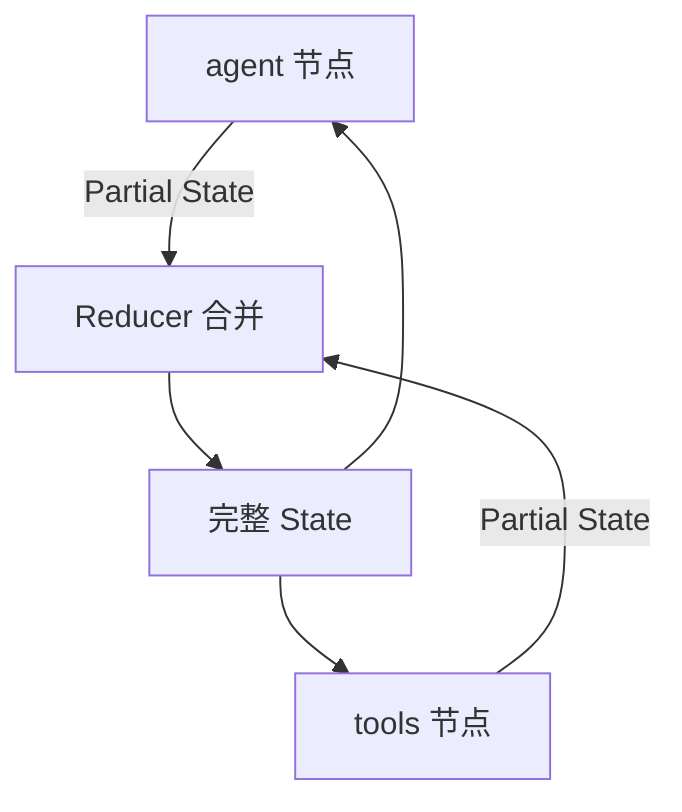

# LangGraph.js 01 · State 与 Annotation

> 图里所有节点读写的「黑板」叫 **State**。LangGraph 用 **Annotation** 定义每个字段的类型、默认值、以及多节点写入时如何 **合并（reducer）**。见 [Graph API — State](https://docs.langchain.com/oss/javascript/langgraph/graph-api)。

**系列导航：** [LangGraph 专系列首页](./README.md) · 下一篇：[02 StateGraph API](./02-stategraph-api.md)

---

## 为什么需要显式 State

[08 手写 ReAct](../08-build-first-agent.md) 用 `ReActStep[]` 数组自己拼历史。Multi-Agent 或审查打回时，还要加 `draft`、`reviewRound`、`status`——变量散落在闭包里。

LangGraph 的做法：**一张 typed 黑板**，每个节点只返回要改的字段；框架负责合并。



类比前端：**Redux reducer** 或 Vue `reactive` 的按 key 更新——不是整对象替换（除非 reducer 这么写）。

---

## Annotation.Root 基本用法

```typescript
import { Annotation } from "@langchain/langgraph";
import type { BaseMessage } from "@langchain/core/messages";

const AgentState = Annotation.Root({
    messages: Annotation<BaseMessage[]>({
        reducer: (left, right) => left.concat(right),
        default: () => [],
    }),
    stepCount: Annotation<number>({
        reducer: (_, update) => update,
        default: () => 0,
    }),
});
```

### 类型导出

```typescript
type State = typeof AgentState.State;   // 节点读到的完整状态
type Update = typeof AgentState.Update; // 节点可返回的 partial
```

节点函数签名：

```typescript
async function myNode(state: State): Promise<Update> {
    return { stepCount: state.stepCount + 1 };
}
```

---

## Annotation 字段的三要素

| 要素 | 作用 | 不写时行为 |
|------|------|------------|
| **类型** `Annotation<T>` | 该 key 的值类型 | — |
| **reducer** | `(left, right) => merged` | 新值 **覆盖** 旧值 |
| **default** | 初始值工厂 | `undefined` |

### reducer 详解

```typescript
// 追加型 — 对话消息最常用
reducer: (left, right) => left.concat(right)

// 覆盖型 — 标量、状态枚举
reducer: (_, update) => update

// 合并对象 — 元数据
reducer: (left, right) => ({ ...left, ...right })

// 累加 — Token 计数
reducer: (left, right) => (left ?? 0) + right
```

**底层执行顺序：**

1. 节点返回 `{ messages: [newMsg] }`（partial）
2. 对每个 key，框架取当前 `left`，与 `right` 调 reducer
3. 得到新 State，传给下一节点

**使用场景对照：**

| 字段 | 推荐 reducer | 场景 |
|------|--------------|------|
| `messages` | `concat` | 多轮对话、Tool 结果消息 |
| `draft` | 覆盖 | 报告草稿最新版 |
| `metadata` | 对象 merge | 引用来源、trace 信息 |
| `totalTokens` | 累加 | 成本统计 |

---

## MessagesAnnotation 预置

对话 Agent 几乎都要 `messages` 字段。官方提供预置（import 路径随版本可能变化）：

```typescript
import { MessagesAnnotation } from "@langchain/langgraph";

// MessagesAnnotation 已带好 messages 的 append reducer
const graph = new StateGraph(MessagesAnnotation)...
```

等价于手写：

```typescript
messages: Annotation<BaseMessage[]>({
    reducer: messagesStateReducer, // 处理单条或数组
    default: () => [],
})
```

**底层：** `messagesStateReducer` 还会处理 **RemoveMessage** 等特殊消息类型（删历史、摘要压缩时用到，[13 Memory 进阶](../13-advanced-memory.md) 会涉及）。

---

## 扩展 State：对齐 10 的工作记忆

[10 Memory](../10-memory-planning-agent.md) 区分对话历史与任务黑板。LangGraph State 可显式建模：

```typescript
const ResearchState = Annotation.Root({
  ...MessagesAnnotation.spec,
    plan: Annotation<string>({ reducer: (_, u) => u, default: () => "" }),
    sources: Annotation<string[]>({
        reducer: (l, r) => l.concat(r),
        default: () => [],
    }),
    phase: Annotation<"research" | "write" | "done">({
        reducer: (_, u) => u,
        default: () => "research",
    }),
});
```

| 字段 | 与 Memory 概念对应 |
|------|-------------------|
| `messages` | 短期对话 / 传给 LLM 的上下文 |
| `plan` | Planner 输出，工作记忆 |
| `sources` | 检索结果 URL，可进最终报告 |
| `phase` | 流水线阶段，供条件边路由 |

**注意：** Checkpoint 持久化的是 **整份 State**，不是只有 `messages`。长期用户偏好仍走向量库（[13](../13-advanced-memory.md)），别全塞进 State。

---

## State 大小与性能

| 风险 | 原因 | 做法 |
|------|------|------|
| Token 爆炸 | `messages` 无限 append | 节点内摘要、RemoveMessage |
| Checkpoint 过大 | State 塞满检索全文 | `sources` 只存 URL/id，正文放向量库 |
| 并发写同一 key | 单线程图一般无竞态 | 并行子图要注意 reducer 语义 |

---

## 与 TypeScript 类型安全

```typescript
import { StateGraph, START, END } from "@langchain/langgraph";

const graph = new StateGraph(AgentState)
    .addNode("increment", async (state) => ({
        stepCount: state.stepCount + 1,
    }))
    .addEdge(START, "increment")
    .addEdge("increment", END)
    .compile();
```

`addNode` 里 `state` 自动推断为 `AgentState.State`；返回类型必须是合法 `Update`。

---

## 常见坑

**1. messages reducer 用覆盖**  
第二轮对话丢历史，Agent「失忆」。必须 `concat` 或 `MessagesAnnotation`。

**2. 节点返回整份 State**  
应只返回 **变化的 key**；多余 key 仍走 reducer，可能意外合并。

**3. default 返回可变对象引用**  
`default: () => []` 每次新数组；不要 `default: []` 共享引用。

**4. 把 RAG 全文塞进 State**  
Checkpoint 序列化慢、内存高。存 chunk id，按需再查。

**5. State 与 Checkpoint 当向量记忆**  
Checkpoint 是「图跑到哪」；用户偏好是另一套存储（05 篇展开）。

---

## 小结

| 概念 | 一句话 |
|------|--------|
| `Annotation.Root` | 定义 State schema |
| reducer | 多节点写同一 key 时怎么合并 |
| default | 图启动时的初始值 |
| `MessagesAnnotation` | 对话 Agent 的 messages 标准写法 |

**下一篇：** [02 StateGraph API](./02-stategraph-api.md)
