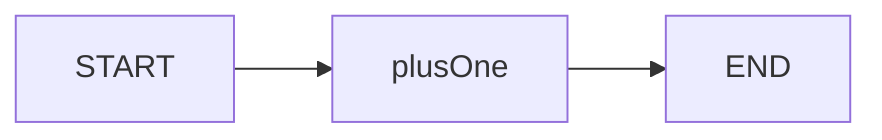

# LangGraph.js 02 · StateGraph API

> `StateGraph` 是 LangGraph 的核心类：注册节点、连边、编译成可 `invoke` 的图。这篇按 API 逐项说明参数、场景与编译后行为。

**系列导航：** [01 State](./01-state-and-annotation.md) · [专系列首页](./README.md) · 下一篇：[03 条件边](./03-conditional-edges.md)

---

## 最小完整图

```typescript
import { StateGraph, START, END } from "@langchain/langgraph";
import { Annotation } from "@langchain/langgraph";

const State = Annotation.Root({
    value: Annotation<number>({ reducer: (_, u) => u, default: () => 0 }),
});

const graphBuilder = new StateGraph(State)
    .addNode("plusOne", async (state) => ({ value: state.value + 1 }))
    .addEdge(START, "plusOne")
    .addEdge("plusOne", END);

const graph = graphBuilder.compile();

const result = await graph.invoke({ value: 1 });
// { value: 2 }
```



**`START` / `END`** 是特殊节点名，表示图入口与出口（历史版本曾用 `__start__` / `__end__`，以当前包导出为准）。

---

## `new StateGraph(schema)`

| 参数 | 类型 | 说明 |
|------|------|------|
| `schema` | `AnnotationRoot` | State 定义，见 [01 篇](./01-state-and-annotation.md) |

返回 **未编译** 的 builder；必须 `.compile()` 后才能调用。

---

## `addNode(name, action, options?)`

注册一个节点。

| 参数 | 类型 | 说明 |
|------|------|------|
| `name` | `string` | 节点唯一 ID，边里引用 |
| `action` | `(state, config?) => Update \| Promise<Update>` | 节点逻辑 |
| `options` | 见下 | 元数据、重试等 |

### `action` 函数

```typescript
.addNode("agent", async (state, config) => {
    // config.configurable.thread_id 等
    const response = await model.invoke(state.messages);
    return { messages: [response] };
});
```

| 入参 | 说明 |
|------|------|
| `state` | 当前完整 State |
| `config` | `RunnableConfig`，含 `configurable`、`callbacks` |

| 返回值 | 说明 |
|--------|------|
| `Partial<State>` | 只含要更新的 key |

**使用场景：** 调 LLM、执行 Tool、业务校验、写数据库——每个 **原子步骤** 一个节点。

### `options` 常用字段

| 字段 | 说明 |
|------|------|
| `retryPolicy` | 节点失败重试策略 |
| `metadata` | LangSmith 节点标签 |

---

## `addEdge(from, to)`

固定跳转：每次执行完 `from` 必定进入 `to`。

```typescript
.addEdge("tools", "agent")  // Tool 跑完回 LLM
.addEdge(START, "router")
.addEdge("finalize", END)
```

| 参数 | 限制 |
|------|------|
| `from` | 节点名或 `START` |
| `to` | 节点名或 `END` |

**不能** 从同一 `from` 连多条固定边到不同 `to`（分支用条件边）。

---

## `addConditionalEdges(source, path, pathMap?)`

条件路由的核心 API（专系列 03 篇展开模式）。

```typescript
function route(state: typeof State.State) {
    if (state.value > 10) return "end";
    return "plusOne";
}

graphBuilder
    .addConditionalEdges("plusOne", route, ["plusOne", END]);
```

| 参数 | 说明 |
|------|------|
| `source` | 哪个节点之后分支 |
| `path` | 函数 `(state) => string`，返回 **下一节点名** 或 `END` |
| `pathMap` | 可选，合法目标列表，用于校验与可视化 |

**底层：** `path` 的返回值必须在 `pathMap` 里（若提供）；框架根据返回值选边。

**使用场景：** ReAct「有 tool_calls 就 tools，否则结束」；审查 pass/revise。

---

## `compile(options?)`

把 builder 变成 **CompiledGraph**。

| 参数 | 类型 | 说明 |
|------|------|------|
| `checkpointer` | `BaseCheckpointSaver` | 持久化 State，见专系列 05 篇 |
| `interruptBefore` | `string[]` | 在这些节点 **前** 暂停等人输入 |
| `interruptAfter` | `string[]` | 在这些节点 **后** 暂停 |

```typescript
import { MemorySaver } from "@langchain/langgraph";

const checkpointer = new MemorySaver();
const graph = graphBuilder.compile({ checkpointer });
```

**编译期检查（底层）：**

- 孤立节点警告
- 不可达节点
- 条件边目标是否存在

**必须 compile 后才能：** `invoke`、`stream`、`streamEvents`、`getState`。

---

## 编译后：`invoke(input, config?)`

| 参数 | 说明 |
|------|------|
| `input` | 初始 State 或 partial（与 reducer/default 合并） |
| `config.configurable` | 如 `{ thread_id: "sess-1" }` |
| `config.callbacks` | LangSmith trace |

```typescript
const out = await graph.invoke(
    { messages: [new HumanMessage("你好")] },
    { configurable: { thread_id: "user-1" } },
);
```

**底层执行：**

1. 若有 checkpoint 且 `thread_id` 存在 → 加载已有 State
2. 用 `input` 经 reducer 合并进 State
3. 从 `START` 沿边执行节点，直到 `END`
4. 若有 checkpointer → 每个 **超步（superstep）** 后保存快照

**使用场景：** API 一次性返回；后台 Job 跑完再通知。

---

## 编译后：`stream(input, config?)`

流式返回 **State 快照** 或 **模式相关 chunk**（依 `streamMode`）。

```typescript
const stream = await graph.stream(
    { messages: [new HumanMessage("你好")] },
    { streamMode: "updates" },
);

for await (const chunk of stream) {
    console.log(chunk);
    // 例如 { agent: { messages: [...] } } 每个节点完成后的 update
}
```

### `streamMode` 常见值

| 模式 | 产出 | 使用场景 |
|------|------|----------|
| `updates` | 每节点 partial update | UI 按步骤更新 |
| `values` | 每步完整 State | 调试黑板 |
| `messages` | 消息流 | Chatbot token |

详见专系列 06 流式篇。

---

## 编译后：`getState` / `updateState`

有 checkpointer 时：

```typescript
const snapshot = await graph.getState({
    configurable: { thread_id: "sess-1" },
});
console.log(snapshot.values);      // 当前 State
console.log(snapshot.next);        // 下一批待执行节点（暂停时有用）
```

`updateState`：人工改 State 后续跑（人机协同、审批通过后注入消息）。

---

## 与 08 手写循环对照

| 08 手写 | StateGraph |
|---------|------------|
| `for (i < max)` | 条件边 `agent → tools → agent` + `stepCount` 封顶 |
| `steps.push(step)` | `messages` reducer append |
| `if (finalAnswer)` | 条件边到 `END` |
| `executeAction` | `tools` 节点或 `ToolNode` |
| 自己序列化历史 | `checkpointer` + `thread_id` |

---

## 常见坑

**1. 忘记 `compile()`**  
builder 不能 `invoke`，运行时报错。

**2. 条件边返回值拼写错误**  
`"tool"` vs `"tools"` 导致图挂起或抛错。用 `pathMap` 约束。

**3. 无 `END` 路径的死循环**  
`agent ↔ tools` 必须有无 tool_calls 的出口 + 迭代上限。

**4. `invoke` 不传 `thread_id` 却期望记忆**  
无 checkpointer 或每次新 thread，表现像失忆。

**5. Serverless 超时**  
长图 `invoke` 阻塞 HTTP。改 `stream` + SSE 或后台任务。

---

## 小结

| API | 作用 |
|-----|------|
| `addNode` | 注册步骤 |
| `addEdge` | 固定下一步 |
| `addConditionalEdges` | 分支 |
| `compile` | 生成可运行图 + 挂 checkpointer |
| `invoke` | 跑完全程 |
| `stream` | 分步/流式输出 |

**上一篇：** [01 State](./01-state-and-annotation.md) · **专系列：** [README](./README.md)
