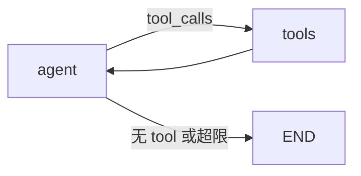

# LangGraph.js 03 · 条件边与路由

> 固定边只能「A 完了必定 B」。Agent 里大量 **if/else**——有没有 tool_calls、审查过没过、意图是搜索还是闲聊——都要靠 **条件边** `addConditionalEdges`。

**系列导航：** [02 StateGraph](./02-stategraph-api.md) · [专系列首页](./README.md) · 下一篇：[04 ReAct 与 ToolNode](./04-react-toolnode.md)

**对照：** [12 Router 模式](../12-multi-agent-systems.md#单层路由一个门卫分发请求)

---

## addConditionalEdges 三参数

```typescript
graphBuilder.addConditionalEdges(
    "agent",           // source：哪个节点执行完后分支
    shouldContinue,    // path：路由函数
    ["tools", END],    // pathMap：合法目标（可选但强烈建议）
);
```

| 参数 | 类型 | 说明 |
|------|------|------|
| `source` | `string` | 源节点名，不能是 `END` |
| `path` | `(state) => string` | 返回 **下一节点名** 或 `END` |
| `pathMap` | `string[]` 或 `Record` | 校验返回值；可映射别名 |

**底层：** 框架在 `source` 节点完成后调 `path(state)`，用返回值选边；若无匹配边则报错。

---

## 经典：ReAct 循环路由

```typescript
import { END } from "@langchain/langgraph";
import { isAIMessage } from "@langchain/core/messages";

function shouldContinue(state: typeof AgentState.State) {
    const last = state.messages.at(-1);
    if (!last || !isAIMessage(last)) return END;
    if (state.iteration >= 8) return END;
    return last.tool_calls?.length ? "tools" : END;
}

graphBuilder
    .addConditionalEdges("agent", shouldContinue, ["tools", END])
    .addEdge("tools", "agent");
```



| 分支条件 | 目标 | 场景 |
|----------|------|------|
| 有 `tool_calls` | `tools` | 继续 ReAct |
| 无 `tool_calls` | `END` | 直接回复用户 |
| `iteration >= N` | `END` | 防死循环 |

---

## Router：意图分发

对齐 [12 单层路由](../12-multi-agent-systems.md)：

```typescript
const RouterState = Annotation.Root({
    ...MessagesAnnotation.spec,
    route: Annotation<"search" | "chat">({ reducer: (_, u) => u, default: () => "chat" }),
});

async function routerNode(state: typeof RouterState.State) {
    const text = String(state.messages.at(-1)?.content ?? "");
    const route = text.includes("查") || text.includes("搜索") ? "search" : "chat";
    return { route };
}

function pickBranch(state: typeof RouterState.State) {
    return state.route === "search" ? "rag" : "chatbot";
}

graphBuilder
    .addNode("router", routerNode)
    .addConditionalEdges("router", pickBranch, ["rag", "chatbot"])
    .addEdge("rag", END)
    .addEdge("chatbot", END);
```

**更好做法：** Router 节点内调小模型 + [structured output](../langchain/02-chat-models.md)，返回 JSON，而不是字符串 `includes`。

---

## 审查打回：revise 循环

```typescript
function afterReview(state: typeof PipelineState.State) {
    if (state.status === "pass") return END;
    if (state.reviewRound >= 3) return END; // 硬封顶
    return "write";
}

graphBuilder.addConditionalEdges("review", afterReview, ["write", END]);
```

| 要点 | 原因 |
|------|------|
| `reviewRound` 写进 State | 条件边可读 |
| 上限 2～3 轮 | 防 Coder/Reviewer 互烧 Token |
| 打回时往 `messages` 塞审查意见 | 下游 `write` 节点可读 |

---

## pathMap 的两种写法

```typescript
// 数组：返回值必须是其中一项
.addConditionalEdges("router", fn, ["a", "b", END])

// 对象：映射内部名 → 节点名
.addConditionalEdges("router", fn, {
    search: "rag_node",
    chat: "chat_node",
})
```

函数可返回 **短名** `search`，由 map 转到真实节点 `rag_node`——适合 Router 输出与节点名不一致时。

---

## 与 Command（高级）

部分版本支持节点返回 `Command` 对象 **动态指定 goto**，用于 Multi-Agent handoff。概念上仍是条件边，但路由逻辑写在节点内部：

```typescript
// 概念示意，以当前版本文档为准
return new Command({ goto: "other_agent", update: { messages: [...] } });
```

**使用场景：** Supervisor 派活；比单独 `addConditionalEdges` 更灵活。

---

## 调试条件边

1. 在 `path` 函数里打日志：`route` 返回值 + 关键 State 字段
2. LangSmith 图可视化看 **走了哪条边**
3. 单测只 mock State 调 `path`，不测全图（对齐 [12 测试建议](../12-multi-agent-systems.md)）

---

## 常见坑

**1. 返回值拼写与节点名不一致**  
`"tool"` vs `"tools"` → 运行时找不到节点。

**2. 忘记在 pathMap 里包含 END**  
想结束却返回 `END` 却未声明。

**3. 条件边与固定边冲突**  
同一 `source` 不能同时 `addEdge` 和 `addConditionalEdges`（只能一种出口策略）。

**4. path 里调异步 LLM**  
`path` 应为 **同步** 读 State；要调模型应单独 `router` 节点，再条件边读结果字段。

**5. 无默认分支**  
State 异常时 `path` 抛错。加兜底 `return END` 或 `error_handler` 节点。

---

## 小结

| 模式 | path 读什么 | 去哪 |
|------|-------------|------|
| ReAct | `tool_calls` | tools / END |
| Router | `route` 字段 | rag / chat |
| Review | `status`, `reviewRound` | write / END |

**下一篇：** [04 ReAct 与 ToolNode](./04-react-toolnode.md)
