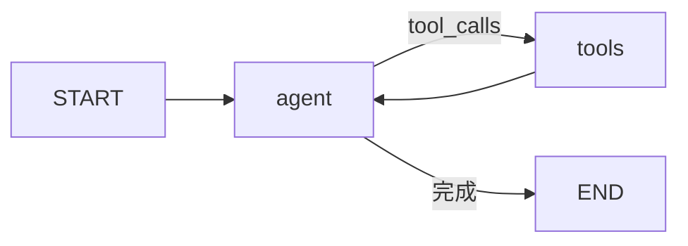

# LangGraph.js 04 · ReAct 与 ToolNode

> 把 [08 的 ReAct 循环](../08-build-first-agent.md#第四步实现-react-循环) 翻译成图：**agent 节点调 LLM，tools 节点跑 Tool，条件边决定循环或结束**。`ToolNode` 为官方预置；`createReactAgent` 为打包好的 ReAct 图（**已弃用**，见下文）。API 以 [LangGraph ReAct 文档](https://docs.langchain.com/oss/javascript/langgraph/workflows-agents) 为准。

**系列导航：** [03 条件边](./03-conditional-edges.md) · [专系列首页](./README.md) · 下一篇：[05 Checkpoint](./05-checkpointer.md)

**前置：** [LangChain 05 Tools](../langchain/05-tools.md) · [03 Messages](../langchain/03-messages.md)

---

## ReAct 图结构



| 节点 | 输入 State | 输出 Update |
|------|------------|-------------|
| `agent` | `messages` | 追加 `AIMessage` |
| `tools` | `messages`（含 tool_calls） | 追加 `ToolMessage[]` |

---

## 手写完整图

```typescript
import { StateGraph, START, END, MessagesAnnotation } from "@langchain/langgraph";
import { ToolNode } from "@langchain/langgraph/prebuilt";
import { ChatOpenAI } from "@langchain/openai";
import { isAIMessage } from "@langchain/core/messages";
import { tool } from "@langchain/core/tools";
import { z } from "zod";

const searchWiki = tool(/* 见 05 篇 */, { ... });

const model = new ChatOpenAI({ model: "gpt-4o-mini", temperature: 0 }).bindTools([searchWiki]);
const toolNode = new ToolNode([searchWiki]);

async function agentNode(state: typeof MessagesAnnotation.State) {
    const response = await model.invoke(state.messages);
    return { messages: [response] };
}

function shouldContinue(state: typeof MessagesAnnotation.State) {
    const last = state.messages.at(-1);
    if (!last || !isAIMessage(last)) return END;
    const toolCalls = last.tool_calls;
    if (!toolCalls?.length) return END;
    return "tools";
}

const graph = new StateGraph(MessagesAnnotation)
    .addNode("agent", agentNode)
    .addNode("tools", toolNode)
    .addEdge(START, "agent")
    .addConditionalEdges("agent", shouldContinue, ["tools", END])
    .addEdge("tools", "agent")
    .compile();
```

---

## ToolNode 底层做了什么

对最后一条 `AIMessage` 的每个 `tool_call`：

1. 按 `name` 找注册的 Tool
2. `tool.invoke(args)` 执行
3. 生成 `ToolMessage { content, tool_call_id, name }`
4. 合并为 `{ messages: ToolMessage[] }` 返回

**你不需要手写** [03 篇](../langchain/03-messages.md) 里 for 循环拼 ToolMessage。

### ToolNode 构造

```typescript
const toolNode = new ToolNode([searchWiki, calc], {
    handleToolErrors: true, // 错误转 ToolMessage 而非抛错
});
```

| 选项 | 说明 |
|------|------|
| `tools` | `StructuredToolInterface[]` |
| `handleToolErrors` | `true` 时异常变字符串 Observation |

**使用场景：** 希望模型看见「Tool 失败」并换策略；`false` 则整图中断便于调试。

---

## createReactAgent 快捷路径（已弃用）

> **官方状态：** `@langchain/langgraph/prebuilt` 的 `createReactAgent` 已标注 **deprecated**。新项目见 [LangChain v1 `createAgent`](https://docs.langchain.com/oss/javascript/langchain/agents)；本节保留 **与 08 手写 ReAct 对照** 及维护旧代码时的读图方式。

```typescript
import { createReactAgent } from "@langchain/langgraph/prebuilt";

const agent = createReactAgent({
    llm: new ChatOpenAI({ model: "gpt-4o-mini" }),
    tools: [searchWiki],
});

const result = await agent.invoke({
    messages: [{ role: "user", content: "介绍 LangGraph" }],
});
```

参考：[createReactAgent（Deprecated）](https://reference.langchain.com/javascript/langchain-langgraph/prebuilt/createReactAgent)

**等价于：** 下面的 `agent + tools + 条件边` 预置图。

| 何时手写 | 何时预置 |
|----------|----------|
| 加 `review` / `router` 节点 | 标准单 Agent Tool 循环 |
| 自定义 State 字段 | 快速 POC |
| 学习与 08 对照、维护旧代码 | 预置 `createReactAgent`（deprecated） |
| 新项目 | 手写 ReAct 图，或 LangChain v1 `createAgent` |

> `llm` 参数名、`ToolNode` 的 `handleToolErrors: true`、`MessagesAnnotation`、`START`/`END` 与 [官方 Graph API](https://docs.langchain.com/oss/javascript/langgraph/graph-api) 一致。

---

## 扩展 State 的 ReAct

在 `MessagesAnnotation` 上叠字段（[01 State](./01-state-and-annotation.md)）：

```typescript
const AgentState = Annotation.Root({
    ...MessagesAnnotation.spec,
    iteration: Annotation<number>({ reducer: (_, u) => u, default: () => 0 }),
});

async function agentNode(state: typeof AgentState.State) {
    const response = await model.invoke(state.messages);
    return { messages: [response], iteration: state.iteration + 1 };
}

function shouldContinue(state: typeof AgentState.State) {
    if (state.iteration >= 8) return END;
    // ... 同前
}
```

**使用场景：** 对齐 08 `maxIterations`；LangSmith 里看 iteration 曲线。

---

## 流式时的 ReAct

`agent` 节点内可 `model.stream`，把 chunk 通过自定义 writer 推出（进阶见 [06 流式篇](./06-streaming.md)）。预置 `createReactAgent` 支持配置流式事件。

单轮多 Tool **并行**：`ToolNode` 默认对多个 `tool_calls` 顺序执行；要并行需自定义 tools 节点内 `Promise.all` + 注意 API 限流。

---

## 与 08 逐步对照

| 08 手写 | LangGraph |
|---------|-----------|
| `generateStep` | `agent` 节点 |
| `parseResponse` | Model `tool_calls` |
| `executeAction` | `ToolNode` |
| `steps.push` | `messages` reducer |
| `onProgress(step)` | `stream` / `streamEvents` |
| `maxIterations` | 条件边 + `iteration` |

---

## 常见坑

**1. agent 节点未 bindTools**  
模型只输出文本，从不 `tool_calls`。

**2. Tool 列表与 ToolNode 不一致**  
`bindTools([a,b])` 但 `ToolNode([a])` → 调 b 时报找不到。

**3. 多 tool_calls 其中一个失败**  
开 `handleToolErrors` 或单测每个 Tool。

**4. 以为 createReactAgent 能审查打回**  
要加节点和边，见 [03 审查路由](./03-conditional-edges.md)。

**5. messages 里混用错误角色**  
Tool 结果必须是 `ToolMessage`，不能塞 `HumanMessage`。

---

## 小结

| 组件 | 作用 |
|------|------|
| `agent` 节点 | LLM + bindTools |
| `ToolNode` | 执行 tool_calls → ToolMessage |
| `shouldContinue` | 条件边 |
| `createReactAgent` | 以上打包 |

**下一篇：** [05 Checkpoint](./05-checkpointer.md)
