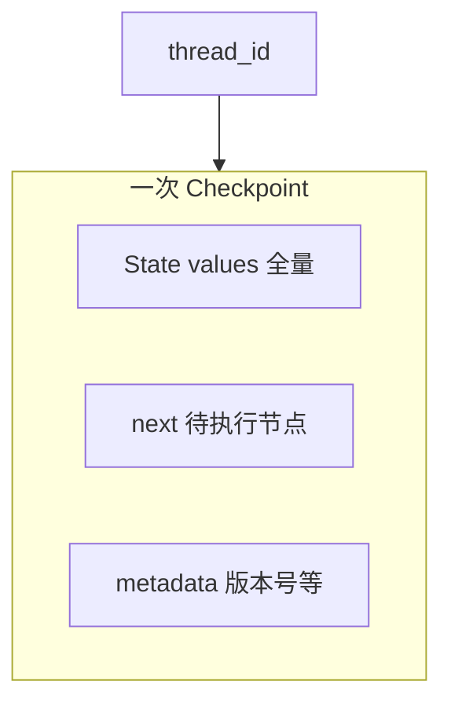

# LangGraph.js 05 · Checkpoint 与持久化

> **Checkpoint** 保存图执行过程中的 **完整 State 快照** + **下一批待跑节点**。配合 `thread_id`，实现多轮对话续跑、刷新不丢、人工审批后续执行。

**系列导航：** [04 ReAct](./04-react-toolnode.md) · [专系列首页](./README.md) · 下一篇：[06 流式](./06-streaming.md)

**对照：** [10 Memory](../10-memory-planning-agent.md) · [13 Memory 进阶](../13-advanced-memory.md)（Checkpoint ≠ 长期向量记忆）

---

## Checkpoint 存的是什么



| 内容 | 说明 |
|------|------|
| `values` | 当前 State（如 `messages`、`draft`） |
| `next` | 暂停时下一个要跑的节点（interrupt 时非空） |
| `config` | `thread_id`、checkpoint id 链 |
| `metadata` | `source: input|loop|update` 等 |

**不是：** 只存最后一句话；**是** 整张黑板，包括未喂给用户的中间 Tool 结果。

---

## MemorySaver：开发用内存实现

```typescript
import { MemorySaver } from "@langchain/langgraph";

const checkpointer = new MemorySaver();
const graph = workflow.compile({ checkpointer });

const config = { configurable: { thread_id: "session-abc" } };

await graph.invoke(
    { messages: [{ role: "user", content: "我叫 Jeek" }] },
    config,
);

await graph.invoke(
    { messages: [{ role: "user", content: "我叫什么？" }] },
    config, // 同一 thread_id
);
```

第二次 invoke **自动加载** 上次 checkpoint 的 `messages`，模型能答出名字。

### compile 参数

| 参数 | 说明 |
|------|------|
| `checkpointer` | `BaseCheckpointSaver` 实例 |
| `interruptBefore` | 指定节点 **执行前** 暂停 |
| `interruptAfter` | 指定节点 **执行后** 暂停 |

---

## thread_id 设计

| 实践 | 说明 |
|------|------|
| 格式 | `userId:sessionId` 或 UUID |
| 前端 | Chatbot 的 `conversationId` 原样传入 |
| 隔离 | 不同 thread 状态完全隔离 |
| 安全 | 校验 thread 归属当前用户，防越权读他人会话 |

```typescript
// Route Handler
const threadId = body.threadId ?? crypto.randomUUID();
await graph.invoke(input, {
    configurable: {
        thread_id: threadId,
        userId: session.user.id,
    },
});
```

---

## getState / getStateHistory

```typescript
const snapshot = await graph.getState(config);
console.log(snapshot.values.messages);
console.log(snapshot.next); // [] 表示已跑完或在 END

const history = await graph.getStateHistory(config);
for await (const snap of history) {
    console.log(snap.metadata?.step, snap.values);
}
```

**使用场景：**

- 调试「图卡在哪一步」
- **时间旅行**：回滚到历史 checkpoint（高级 API，视版本）
- 管理后台展示 Agent 执行轨迹

---

## updateState：人工改黑板

```typescript
await graph.updateState(
    config,
    { messages: [new HumanMessage("审批通过，继续")] },
    "review", // 作为从哪个节点之后更新（可选）
);
await graph.invoke(null, config); // 从暂停处续跑
```

**使用场景：** 人机协同——审查员点「通过」后注入消息并继续图。

---

## 生产 Checkpointer

| 实现 | 场景 |
|------|------|
| `MemorySaver` | 本地开发、单测 |
| `PostgresSaver` | 生产持久化、多实例共享 |
| `RedisSaver` | 低延迟、已有 Redis |

```bash
pnpm add @langchain/langgraph-checkpoint-postgres
```

**要点：**

- Serverless 多实例 **必须** 外存 checkpointer，不能 MemorySaver
- 定期清理旧 checkpoint（合规与磁盘）
- State 过大时做 messages 压缩再写入

---

## Checkpoint vs 其他「记忆」

| 机制 | 存什么 | 生命周期 |
|------|--------|----------|
| Checkpoint | 图 State 快照 | 单次任务 / 会话线程 |
| 聊天历史表 | 用户可见消息 | 长期 |
| 向量记忆 | 用户偏好 embedding | 跨会话 |
| [10 Working Memory](../10-memory-planning-agent.md) | 任务计划、来源列表 | 任务内，可进 State |

不要把「用户喜欢简短回答」只放 checkpoint——应用 [13](../13-advanced-memory.md) 向量或 profile 表。

---

## 与 interrupt 配合（预告）

```typescript
const graph = workflow.compile({
    checkpointer,
    interruptBefore: ["dangerous_action"],
});
```

首次 `invoke` 在危险节点前停下，`snapshot.next` 含该节点；人工确认后 `updateState` + 再 `invoke`。

详见专系列 08 人机协同（规划中）。

---

## 常见坑

**1. 生产用 MemorySaver**  
重启丢会话；多 pod 各一份内存。

**2. 每次新建 thread_id**  
用户感觉「没有记忆」——前端要持久化 threadId。

**3. State 塞满检索正文**  
checkpoint 体积爆炸、序列化慢。只存 id，正文走向量库。

**4. 不传 checkpointer 却期望多轮**  
每次从 START 空 State 起跑。

**5. messages 无限增长**  
checkpoint 每步更大。节点内或定时做摘要 + `RemoveMessage`。

---

## 小结

| API | 作用 |
|-----|------|
| `compile({ checkpointer })` | 启用持久化 |
| `configurable.thread_id` | 会话键 |
| `getState` | 读当前快照 |
| `updateState` | 人工注入后续跑 |

**上一篇：** [04 ReAct](./04-react-toolnode.md) · **专系列：** [README](./README.md) · **下一篇：** [06 流式](./06-streaming.md)
