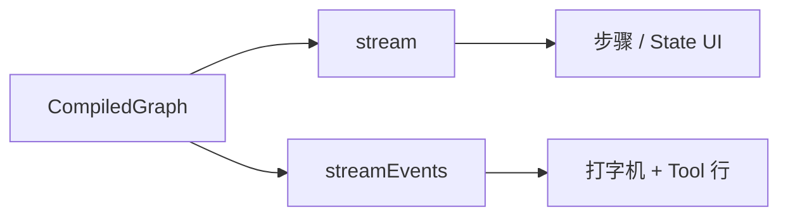

# LangGraph.js 06 · 流式与 streamEvents

> Chatbot 不能等整图跑完才响应。LangGraph 提供 **`stream`** 和 **`streamEvents`**，把节点更新和 LLM token 推到前端——对齐 [08 SSE ReAct UI](../08-build-first-agent.md)。

**系列导航：** [05 Checkpoint](./05-checkpointer.md) · [专系列首页](./README.md) · 下一篇：[07 子图与多 Agent](./07-subgraphs.md)

---

## stream vs streamEvents

| API | 产出 | 适合 |
|-----|------|------|
| `graph.stream` | State 更新或消息 chunk（依 `streamMode`） | 知节点进度 |
| `graph.streamEvents` | 细粒度事件（`on_chat_model_stream` 等） | Chatbot token、Tool 状态 |



---

## graph.stream 与 streamMode

```typescript
const stream = await graph.stream(
    { messages: [{ role: "user", content: "介绍 LangGraph" }] },
    {
        streamMode: "updates",
        configurable: { thread_id: "sess-1" },
    },
);

for await (const chunk of stream) {
    console.log(chunk);
    // updates 模式: { agent: { messages: [AIMessage] } }
}
```

### streamMode 常用值

| 模式 | 每次 yield | 使用场景 |
|------|------------|----------|
| `updates` | 节点名 → partial update | ReAct 步骤面板 |
| `values` | 完整 State | 调试黑板 |
| `messages` | 消息流 tuple | Chat UI（部分版本） |
| `debug` | 内部调试信息 | 开发 |

具体枚举以当前 `@langchain/langgraph` 文档为准；升级时跑一条 golden 流。

---

## streamEvents（推荐接 SSE）

```typescript
const eventStream = await graph.streamEvents(
    { messages: [{ role: "user", content: "北京天气" }] },
    { version: "v2", configurable: { thread_id: "sess-1" } },
);

for await (const event of eventStream) {
    const { event: name, name: nodeName, data } = event;
    if (name === "on_chat_model_stream") {
        const token = data?.chunk?.content;
        if (token) process.stdout.write(String(token));
    }
    if (name === "on_tool_start") {
        console.log("\n[tool]", nodeName, data?.input);
    }
    if (name === "on_tool_end") {
        console.log("[tool done]", data?.output);
    }
}
```

### 常见事件名

| 事件 | 含义 | 前端展示 |
|------|------|----------|
| `on_chat_model_stream` | LLM token chunk | 打字机 |
| `on_chat_model_start` | 开始调模型 | loading |
| `on_tool_start` | Tool 开始 | 「正在搜索…」 |
| `on_tool_end` | Tool 结束 | Observation 折叠 |
| `on_chain_start` / `end` | 节点级 | 步骤条 |

**`version: "v2"`** 事件结构更统一，新项目优先 v2。

---

## Next.js Route Handler → SSE

```typescript
// app/api/chat/route.ts
import { NextRequest } from "next/server";

export async function POST(req: NextRequest) {
    const { message, threadId } = await req.json();
    const encoder = new TextEncoder();

    const stream = await graph.streamEvents(
        { messages: [{ role: "user", content: message }] },
        { version: "v2", configurable: { thread_id: threadId } },
    );

    const body = new ReadableStream({
        async start(controller) {
            try {
                for await (const event of stream) {
                    const payload = JSON.stringify({
                        type: event.event,
                        node: event.name,
                        data: event.data,
                    });
                    controller.enqueue(encoder.encode(`data: ${payload}\n\n`));
                }
            } finally {
                controller.close();
            }
        },
    });

    return new Response(body, {
        headers: {
            "Content-Type": "text/event-stream",
            "Cache-Control": "no-cache",
            Connection: "keep-alive",
        },
    });
}
```

### 前端消费（fetch reader）

```typescript
const res = await fetch("/api/chat", {
    method: "POST",
    body: JSON.stringify({ message, threadId }),
});
const reader = res.body!.getReader();
const decoder = new TextDecoder();

while (true) {
    const { done, value } = await reader.read();
    if (done) break;
    const text = decoder.decode(value);
    // 解析 SSE data: 行，按 type 更新 UI
}
```

与 08 的 `EventSource` 类似；POST + SSE 用 `ReadableStream` 更灵活。

---

## 与 checkpoint 同时用

```typescript
await graph.streamEvents(input, {
    version: "v2",
    configurable: { thread_id: threadId },
});
```

流式过程中 checkpointer 仍按超步写入——用户刷新后 `getState` 能拿到已生成部分（取决于停在哪一步）。

---

## 取消与 Abort

```typescript
const ac = new AbortController();
// 部分版本 config 支持 signal
await graph.streamEvents(input, {
    signal: ac.signal,
    configurable: { thread_id: threadId },
});
// 用户点停止：ac.abort()
```

前端 **必须** 支持取消，避免 Token 继续烧。

---

## 映射到 08 ReAct UI

| 08 自定义 SSE | streamEvents |
|---------------|--------------|
| `type: thought` | 可从 model stream 或自定义节点日志 |
| `type: action` | `on_tool_start` |
| `type: observation` | `on_tool_end` |
| `type: token` | `on_chat_model_stream` |

复用 08 的折叠面板组件，只改事件解析层。

---

## 常见坑

**1. 忘设 SSE 响应头**  
浏览器缓冲整段才显示。

**2. JSON.stringify 整个 data**  
`data` 可能含循环引用；只序列化 `chunk.content`、`input` 摘要。

**3. Vercel 默认超时**  
长 Agent 流被切断。升配或换 Node 服务。

**4. stream 与 streamEvents 混用两套 UI**  
选一种主协议，避免双连接。

**5. 不对 on_tool_end 做截断**  
Observation 巨大撑爆前端。服务端 Tool 层截断。

---

## 小结

| API | 用途 |
|-----|------|
| `stream({ streamMode })` | 节点级进度 |
| `streamEvents({ version: "v2" })` | Token + Tool 细事件 |
| SSE Route | Chatbot 标配 |
| `AbortSignal` | 用户取消 |

**下一篇：** [07 子图与多 Agent](./07-subgraphs.md)
