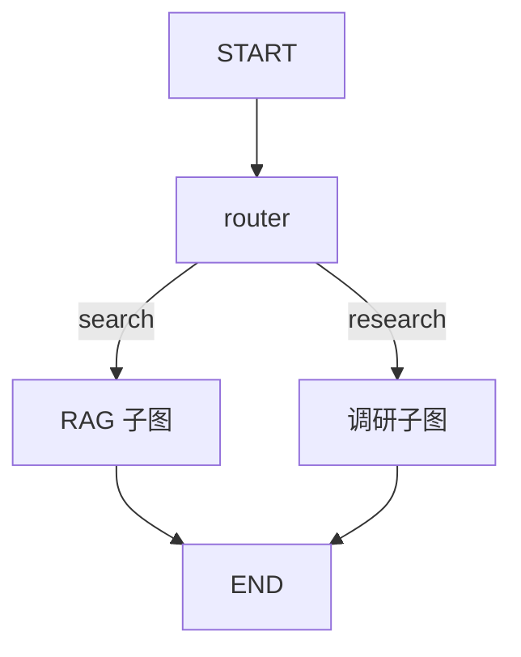

# LangGraph.js 07 · 子图与多 Agent

> 单个图变大后，把 **研究员 / 写手 / 审查** 或 **RAG / 聊天** 拆成 **子图（Subgraph）**，主图只负责路由和汇总——对齐 [12 Multi-Agent](../12-multi-agent-systems.md) 的流水线与 Supervisor。

**系列导航：** [06 流式](./06-streaming.md) · [专系列首页](./README.md) · 下一篇：[08 人机协同](./08-human-in-the-loop.md)

---

## 为什么用子图

| 问题 | 子图解法 |
|------|----------|
| 主图节点几十个 | 按职责拆文件、拆 compile |
| 研究员要独立 ReAct 循环 | 子图内完整 agent↔tools |
| 团队分工 | 每人维护一个 subgraph |
| 复用 | 同一 RAG 子图挂多个入口 |



---

## 子图作为节点

```typescript
import { StateGraph, START, END, MessagesAnnotation } from "@langchain/langgraph";

// 子图：简单 RAG
function buildRagGraph() {
    const g = new StateGraph(MessagesAnnotation)
        .addNode("retrieve", retrieveNode)
        .addNode("answer", answerNode)
        .addEdge(START, "retrieve")
        .addEdge("retrieve", "answer")
        .addEdge("answer", END);
    return g.compile();
}

const ragGraph = buildRagGraph();

// 主图：把编译后的子图当节点
const main = new StateGraph(MessagesAnnotation)
    .addNode("router", routerNode)
    .addNode("rag", ragGraph) // 嵌套 compiled graph
    .addNode("chat", chatNode)
    .addConditionalEdges("router", routeFn, ["rag", "chat"])
    .addEdge("rag", END)
    .addEdge("chat", END)
    .compile();
```

**底层：** 子图节点执行时，内部跑完自己的 START→END；对外只返回 **对父 State 的 partial update**（通常仍是 `messages` append）。

---

## State 对齐

父子图共用 `MessagesAnnotation` 时最省事——子图只读写 `messages`。

不同 State 时：

```typescript
// 父图多字段
const ParentState = Annotation.Root({
    ...MessagesAnnotation.spec,
    route: Annotation<string>({ reducer: (_, u) => u, default: () => "chat" }),
});

// 子图入口节点：从 parent state 映射
async function callResearchSub(state: typeof ParentState.State) {
    const subResult = await researchGraph.invoke({
        messages: state.messages,
    });
    return { messages: subResult.messages.slice(-1) }; // 只带回最终消息
}
```

**使用场景：** 子图 State 更复杂，父图只吸收摘要。

---

## Supervisor 模式

```typescript
const members = ["researcher", "writer", "reviewer"] as const;

async function supervisorNode(state: typeof State.State) {
    const decision = await supervisorModel.invoke([
        new SystemMessage(`下次派给谁：${members.join(", ")}。只输出名字。`),
        ...state.messages,
    ]);
    const next = String(decision.content).trim();
    return { nextAgent: next };
}

function assignWorker(state: typeof State.State) {
    return state.nextAgent ?? "researcher";
}

graphBuilder
    .addNode("supervisor", supervisorNode)
    .addNode("researcher", researcherGraph)
    .addNode("writer", writerGraph)
    .addNode("reviewer", reviewerGraph)
    .addEdge(START, "supervisor")
    .addConditionalEdges("supervisor", assignWorker, members)
    .addEdge("researcher", "supervisor")
    .addEdge("writer", "supervisor")
    .addEdge("reviewer", "supervisor");
```

| 要点 | 说明 |
|------|------|
| 每工人跑完回 **supervisor** | 动态派活 |
| `maxRounds` 在 supervisor | 防无限循环 |
| 工人内部可各自封装 ReAct 子图 | 见 [04](./04-react-toolnode.md)（新项目优先手写图或 LangChain v1 `createAgent`） |

对照 [12 Supervisor](../12-multi-agent-systems.md#supervisor动态派活)。

---

## 固定流水线子图

调研 → 写作 → 审查（[12 固定流水线](../12-multi-agent-systems.md#固定流水线调研--写作--审查)）：

```typescript
const pipeline = new StateGraph(PipelineState)
    .addNode("research", researchGraph)
    .addNode("write", writeNode)
    .addNode("review", reviewNode)
    .addEdge(START, "research")
    .addEdge("research", "write")
    .addConditionalEdges("review", afterReview, ["write", END])
    .compile();
```

**比 Supervisor 省 Token**——路径固定，无额外「派活」LLM 调用。

---

## Map-Reduce 子图

```typescript
import pLimit from "p-limit";

async function mapNode(state: typeof State.State) {
    const items = state.sources; // 多个 URL
    const limit = pLimit(3);
    const summaries = await Promise.all(
        items.map((url) => limit(() => summarizeOne(url))),
    );
    return { summaries };
}
```

**不要** `Promise.all` 无限并发——[12 常见坑](../12-multi-agent-systems.md#常见坑) 429。

---

## 流式与子图

`streamEvents` 会包含 **子图内部事件**，`name` 可能带命名空间前缀。前端按 `event.name` 过滤或展示层级。

---

## 常见坑

**1. 子图 State 不一致**  
父图传错字段，子图空跑。

**2. 子图返回整段 messages 覆盖**  
应用 reducer append，或只 slice 需要的一条。

**3. Supervisor 无上限**  
Token 爆炸。`supervisorRound` + 条件边封顶。

**4. 为酷拆太多 Agent**  
先单 Agent + 好 Tool，再拆（12 篇原则）。

**5. 子图内不 compile 就 addNode**  
需 `.compile()` 后的 CompiledGraph。

---

## 小结

| 模式 | 结构 |
|------|------|
| 嵌套 compile | `addNode("rag", ragGraph)` |
| Supervisor | 中心节点 + 条件边回环 |
| 流水线 | 固定边 + 审查条件边 |
| Map-Reduce | map 节点 + 限流 |

**下一篇：** [08 人机协同 interrupt](./08-human-in-the-loop.md)
