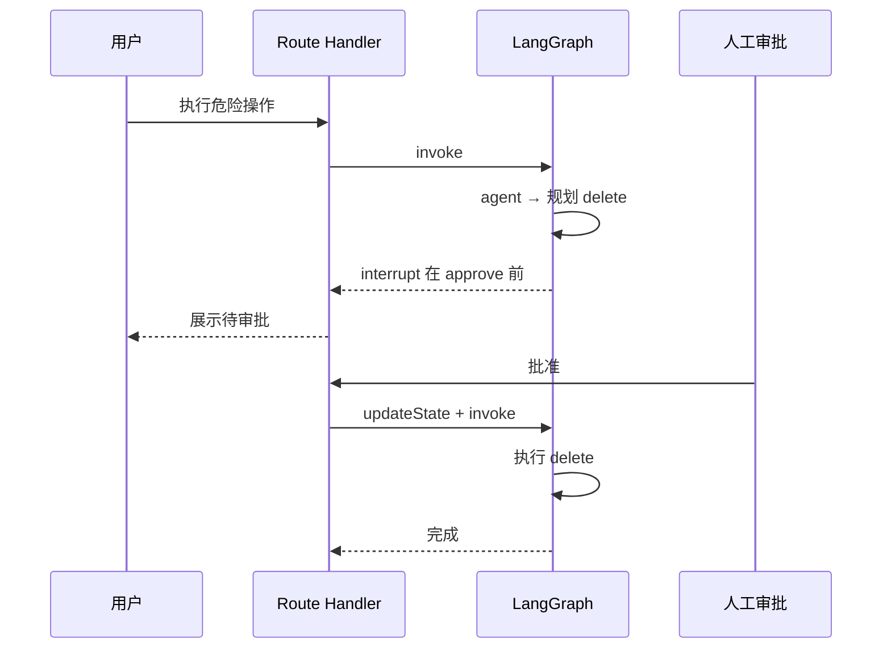

# LangGraph.js 08 · 人机协同 interrupt

> 有些步骤不能自动执行：付款、发邮件、删数据。LangGraph 用 **interrupt** 在指定节点 **暂停图**，等人确认后 `updateState` + 再 `invoke` 续跑——依赖 [05 Checkpoint](./05-checkpointer.md)。

**系列导航：** [07 子图](./07-subgraphs.md) · [专系列首页](./README.md) · 下一篇：[09 生产 Checkpointer](./09-production-checkpointer.md)

**对照：** [09 Tool 权限](../langchain/05-tools.md) · [12 审查循环](../12-multi-agent-systems.md)

---

## interrupt 解决什么



没有 checkpoint，暂停后 State 丢失，无法续跑。

---

## compile 时声明断点

```typescript
const graph = workflow.compile({
    checkpointer,
    interruptBefore: ["execute_action"], // 进入该节点前停
    // interruptAfter: ["plan"],         // 该节点跑完后停
});
```

| 选项 | 行为 |
|------|------|
| `interruptBefore` | 节点 **未执行**，`snapshot.next` 含该节点名 |
| `interruptAfter` | 节点 **已执行**，下一跳前停 |

**使用场景：**

- `interruptBefore`：危险 Tool 执行前审批
- `interruptAfter`：展示计划让人改，再续跑

---

## 首次 invoke 暂停

```typescript
const config = { configurable: { thread_id: "approval-1" } };

await graph.invoke(
    { messages: [new HumanMessage("删除订单 12345")] },
    config,
);

const snapshot = await graph.getState(config);
console.log(snapshot.next); // ['execute_action']
console.log(snapshot.values); // 含模型拟执行的计划
```

API 返回给前端：

```json
{
    "status": "pending_approval",
    "threadId": "approval-1",
    "plannedAction": "…",
    "nextNode": "execute_action"
}
```

---

## 批准后续跑

```typescript
// 人工批准：可注入说明
await graph.updateState(
    config,
    { messages: [new HumanMessage("已批准，继续执行")] },
);

// 继续（input 可为 null，从 checkpoint 续）
await graph.invoke(null, config);
```

拒绝场景：

```typescript
await graph.updateState(config, {
    messages: [new HumanMessage("已拒绝，不要删除")],
});
await graph.invoke(null, config);
// 后续节点应读消息决定取消或改计划
```

---

## 动态 interrupt（节点内 Command）

部分版本支持节点返回 **Command** 动态暂停：

```typescript
import { Command } from "@langchain/langgraph";

async function planNode(state) {
    return new Command({
        update: { plan: "将删除订单 12345" },
        goto: "execute_action",
        // 或配合 interrupt 元数据
    });
}
```

以当前包文档为准；概念是 **运行时可决定暂停点**。

---

## 与纯 UI 确认的区别

| 方式 | 行为 |
|------|------|
| 前端弹窗，未调 Agent | 只是拦 HTTP，Agent 无状态 |
| interrupt + checkpoint | 图 **真暂停**，续跑同一 State |
| Tool 内 `throw` 等人输入 | 难恢复，不推荐 |

生产 **高危操作** 用 interrupt 或 **独立审批服务**，不要只靠 Prompt「请勿执行」。

---

## 前端 UX 要点

1. 持久化 `threadId`，审批页可刷新
2. 展示 `snapshot.values` 里计划与参数
3. 批准/拒绝按钮调不同 `updateState` 文案
4. 续跑可用 `streamEvents` 流式展示执行结果（[06](./06-streaming.md)）
5. 超时未审批：checkpoint 保留，任务过期策略业务自定

---

## 与审查节点（review）对比

| | review 自动节点 | interrupt 人工 |
|--|-----------------|----------------|
| 决策者 | LLM reviewer | 人 |
| 场景 | 草稿质量 | 合规、支付、删库 |
| 实现 | 条件边打回 | compile interrupt |

可组合：review 自动 2 轮 + 仍不满意则 `interruptBefore` 人工。

---

## 常见坑

**1. 无 checkpointer**  
interrupt 无法恢复。

**2. invoke null 未带同一 config**  
thread 对不上，从新会话开始。

**3. 批准后不 updateState**  
模型不知道已授权，仍拒绝执行。

**4. interrupt 节点过多**  
每步都等人，体验差。只对 **白名单高危 Tool** 中断。

**5. 多实例 MemorySaver**  
审批在 A 实例，续跑在 B 实例，状态不在。用 Postgres checkpointer。

---

## 小结

| API | 作用 |
|-----|------|
| `interruptBefore` / `After` | 编译期断点 |
| `getState` | 读暂停时 next + values |
| `updateState` | 注入审批结果 |
| `invoke(null, config)` | 从断点续跑 |

**上一篇：** [07 子图](./07-subgraphs.md) · **下一篇：** [09 生产 Checkpointer](./09-production-checkpointer.md) · **专系列：** [README](./README.md)
