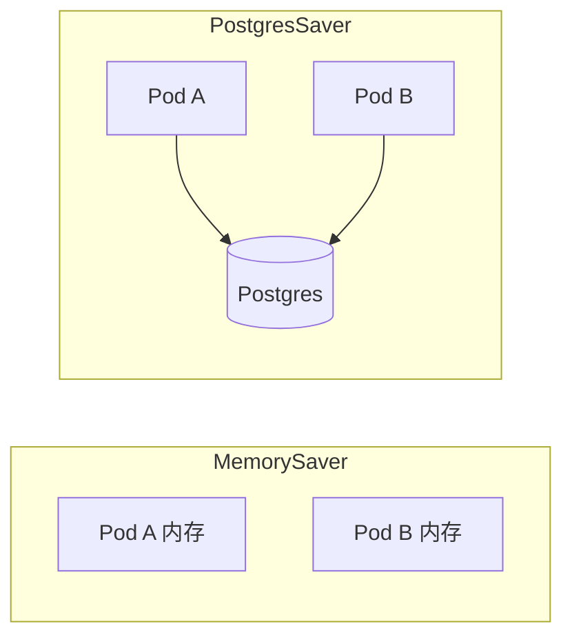

# LangGraph.js 09 · 生产级 Checkpointer

> [05 MemorySaver](./05-checkpointer.md) 只适合开发。生产要 **Postgres / Redis** 等外存 checkpointer：多实例共享、重启不丢、配合 [08 interrupt](./08-human-in-the-loop.md) 跨请求续跑。

**系列导航：** [08 人机协同](./08-human-in-the-loop.md) · [专系列首页](./README.md) · 下一篇：[10 Command](./10-command-api.md)

---

## 为什么生产不能用 MemorySaver

| 问题 | 后果 |
|------|------|
| 进程重启 | 全部会话丢失 |
| 多 Pod / Serverless | 请求 1 在 A，续跑在 B，无状态 |
| 内存增长 | 长会话 State 占满 heap |
| 无审计 | 合规难追溯 |



---

## Postgres Checkpointer

```bash
pnpm add @langchain/langgraph-checkpoint-postgres pg
```

```typescript
import { PostgresSaver } from "@langchain/langgraph-checkpoint-postgres";
import pg from "pg";

const pool = new pg.Pool({ connectionString: process.env.DATABASE_URL });

const checkpointer = new PostgresSaver(pool);
await checkpointer.setup(); // 首次建表

const graph = workflow.compile({ checkpointer });
```

### setup() 与表结构

`setup()` 创建 checkpoint 相关表（具体 schema 以包文档为准），通常含：

- checkpoint blob（序列化 State）
- `thread_id`
- parent checkpoint 链（版本链）

**运维：** 迁移走版本化 SQL；备份纳入常规 DB 备份策略。

---

## 使用方式与 05 相同

```typescript
const config = { configurable: { thread_id: threadId } };

await graph.invoke({ messages: [...] }, config);
await graph.invoke({ messages: [...] }, config); // 同 thread 续聊

const snap = await graph.getState(config);
```

| API | 生产注意 |
|-----|----------|
| `invoke` / `stream` | 连接池不要每请求 new Pool |
| `getState` | 校验 thread 归属 userId |
| `updateState` | 审批流写审计日志 |

---

## Redis / 其他实现

部分版本提供 `RedisSaver` 或社区实现——选型看：

| 因素 | Postgres | Redis |
|------|----------|-------|
| 持久化默认 | 强 | 需 AOF/RDB |
| 复杂查询 thread | SQL 方便 | 需自研索引 |
| 延迟 | 中 | 低 |
| 已有栈 | 已用 Neon/Supabase | 已用 Redis 会话 |

**原则：** 跟现有基础设施走，不为 checkpoint 单独引入新数据库种类（除非值得）。

---

## State 体积控制

Checkpoint 存 **整份 State**。生产必做：

1. `messages` 定期摘要 + `RemoveMessage`（[01 State](./01-state-and-annotation.md)）
2. 大字段（检索全文）只存 id
3. 过期策略：30 天未活跃 thread 归档/删除
4. 监控单 checkpoint 字节数

---

## Serverless 注意

- 冷启动 + `setup()`：表已存在则跳过
- 函数超时 < 长 Agent 执行时间 → 流式 + 异步 Job（[06 流式](./06-streaming.md)）
- Pool 在 serverless 用 **连接池代理**（Neon、PgBouncer）

---

## 与 RunnableWithMessageHistory 分工

| | Postgres checkpointer | DB chat history |
|--|----------------------|-----------------|
| 内容 | 全 State、next 节点 | 用户可见消息 |
| 用途 | Agent 续跑、interrupt | 聊天列表 UI |

可双写：UI 读 chat 表；Agent 读 checkpoint。`thread_id` = `session_id` 对齐。

---

## 常见坑

**1. 未 await setup()**  
首请求建表失败。

**2. 每请求 new PostgresSaver 不释放**  
连接泄漏。

**3. thread_id 可预测被遍历**  
用 UUID + 鉴权。

**4. checkpoint 含敏感 PII**  
加密列或脱敏；合规留存政策。

**5. 升级 langgraph 后 schema 不迁移**  
锁版本，读迁移指南。

---

## 小结

| 项 | 建议 |
|----|------|
| 开发 | `MemorySaver` |
| 生产 | `PostgresSaver` 或 Redis |
| `setup()` | 首次部署 |
| 体积 | 摘要 + 过期清理 |

**下一篇：** [10 Command 动态路由](./10-command-api.md)
