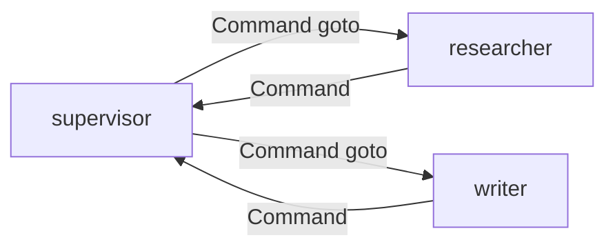

# LangGraph.js 10 · Command 与动态路由

> [03 条件边](./03-conditional-edges.md) 的路由函数只能 **读 State**。节点返回 **Command** 可以在执行中 **指定下一跳 + 更新 State**——适合 Multi-Agent handoff、动态 interrupt。

**系列导航：** [09 生产 Checkpointer](./09-production-checkpointer.md) · [专系列首页](./README.md) · 下一篇：[11 调试与时间旅行](./11-debugging-time-travel.md)

**对照：** [12 handoff](../12-multi-agent-systems.md) · [07 Supervisor](./07-subgraphs.md)

---

## Command 是什么

```typescript
import { Command } from "@langchain/langgraph";

return new Command({
    update: { messages: [new AIMessage("转给研究员")], nextWorker: "researcher" },
    goto: "researcher",
});
```

| 字段 | 说明 |
|------|------|
| `update` | 对 State 的 partial update（走 reducer） |
| `goto` | 下一节点名，**绕过** 静态 `addEdge` |
| `graph` | 跳到另一子图（高级） |

**与条件边对比：**

| | `addConditionalEdges` | `Command.goto` |
|--|----------------------|----------------|
| 决策位置 | 边函数，节点外 | 节点内 |
| 动态性 | 读 State | 节点运行时决定 |
| 适用 | 固定分支表 | handoff、运行时改路 |

---

## Supervisor handoff 示例

```typescript
async function supervisorNode(state: typeof State.State) {
    const decision = await supervisorModel.invoke(state.messages);
    const worker = parseWorkerName(decision.content);

    return new Command({
        update: { lastWorker: worker },
        goto: worker,
    });
}

graphBuilder
    .addNode("supervisor", supervisorNode, { ends: ["researcher", "writer", "reviewer", END] })
    .addNode("researcher", researcherNode)
    .addNode("writer", writerNode)
    .addNode("reviewer", reviewerNode);

// researcher / writer / reviewer 完成后 Command goto supervisor
```

`ends` 声明 **Command 可能跳转的目标**，编译期校验（具体 API 以当前版本为准）。



---

## 与 interrupt 组合

```typescript
return new Command({
    update: { pendingAction: plan },
    goto: "human_approval",
    // 部分版本: resume 相关元数据
});
```

配合 `interruptBefore: ["human_approval"]`：先到审批节点前暂停，人确认后 `updateState` 再 `Command` 到执行节点。见 [08](./08-human-in-the-loop.md)。

---

## 父图 ↔ 子图跳转

```typescript
return new Command({
    goto: "rag_subgraph",
    graph: Command.PARENT, // 或子图常量，依版本
});
```

**使用场景：** 工人 Agent 完成后 **交还主图** 而非回本地 supervisor。

---

## 条件边 + Command 混用

- **固定流水线**（research → write → review）：用 `addEdge` + `addConditionalEdges`
- **动态派活**（Supervisor）：用 `Command`
- **不要** 同一出口混两种风格导致难 trace——团队统一一种主模式

---

## LangSmith 里怎么看

Command 跳转在 trace 里表现为 **非默认边** 的节点跳转；`goto` 目标应在 metadata 可辨。改路由后对比 trace 是否派对人（[12 测试建议](../12-multi-agent-systems.md#常见坑)）。

---

## 常见坑

**1. goto 目标未在 ends 声明**  
编译警告或运行错误。

**2. Command 与 addEdge 冲突**  
同一节点既有固定边又有 goto，行为依实现——避免双出口。

**3. update 忘记带 messages**  
handoff 丢上下文。

**4. 无限 supervisor 循环**  
`supervisorRound` 封顶 + `goto: END`。

**5. 版本 API 差异**  
`Command` 字段名升级时查 Changelog。

---

## 小结

| 机制 | 何时用 |
|------|--------|
| `addConditionalEdges` | 读 State 分支 |
| `Command.goto` | 节点内动态下一跳 |
| `Command.update` | 跳转同时改 State |
| `ends` | 声明合法 goto 目标 |

**下一篇：** [11 调试与时间旅行](./11-debugging-time-travel.md)
