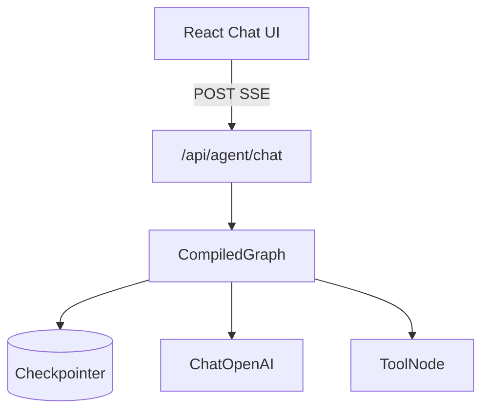

# LangGraph.js 12 · 完整 Route 示例

> 把 [04 ReAct](./04-react-toolnode.md)、[05 checkpoint](./05-checkpointer.md)、[06 流式](./06-streaming.md)、[08 interrupt](./08-human-in-the-loop.md) 收成 **一个 Next.js Route** + **最小前端**——可直接当 Chatbot 骨架（对齐 [10 预告](../10-memory-planning-agent.md)）。

**系列导航：** [11 调试](./11-debugging-time-travel.md) · [专系列首页](./README.md) · 下一篇：[13 Redis/Neon 部署](./13-redis-neon-deployment.md)

---

## 架构一览



| 层 | 职责 |
|----|------|
| 前端 | `threadId`、流式渲染、停止按钮 |
| Route | 鉴权、`streamEvents`、SSE |
| Graph | ReAct + 可选 interrupt |
| Checkpointer | 多轮 + 续跑 |

---

## 图定义（服务端模块）

```typescript
// lib/agent/graph.ts
import { StateGraph, START, END, MessagesAnnotation, MemorySaver } from "@langchain/langgraph";
import { ToolNode } from "@langchain/langgraph/prebuilt";
import { ChatOpenAI } from "@langchain/openai";
import { tool } from "@langchain/core/tools";
import { isAIMessage } from "@langchain/core/messages";
import { z } from "zod";

const searchDocs = tool(
    async ({ query }) => {
        // 接 12 Retriever 或自研检索
        return `检索结果（${query}）…`;
    },
    {
        name: "search_docs",
        description: "搜索内部技术文档",
        schema: z.object({ query: z.string() }),
    },
);

const model = new ChatOpenAI({ model: "gpt-4o-mini", temperature: 0 }).bindTools([searchDocs]);
const toolNode = new ToolNode([searchDocs], { handleToolErrors: true });

async function agentNode(state: typeof MessagesAnnotation.State) {
    const res = await model.invoke(state.messages);
    return { messages: [res] };
}

function shouldContinue(state: typeof MessagesAnnotation.State) {
    const last = state.messages.at(-1);
    if (!last || !isAIMessage(last)) return END;
    return last.tool_calls?.length ? "tools" : END;
}

const checkpointer = new MemorySaver(); // 生产换 09 Postgres

export const graph = new StateGraph(MessagesAnnotation)
    .addNode("agent", agentNode)
    .addNode("tools", toolNode)
    .addEdge(START, "agent")
    .addConditionalEdges("agent", shouldContinue, ["tools", END])
    .addEdge("tools", "agent")
    .compile({ checkpointer });
```

---

## Route Handler：流式 SSE

```typescript
// app/api/agent/chat/route.ts
import { NextRequest } from "next/server";
import { graph } from "@/lib/agent/graph";

export const runtime = "nodejs"; // 避免 Edge 限制 DB/长连接
export const maxDuration = 60;

export async function POST(req: NextRequest) {
    const session = await getSession(req); // 自研鉴权
    if (!session?.userId) {
        return new Response("Unauthorized", { status: 401 });
    }

    const { message, threadId } = await req.json();
    const tid = threadId ?? crypto.randomUUID();

    const encoder = new TextEncoder();
    const stream = await graph.streamEvents(
        { messages: [{ role: "user", content: message }] },
        {
            version: "v2",
            configurable: {
                thread_id: tid,
                userId: session.userId,
            },
        },
    );

    const body = new ReadableStream({
        async start(controller) {
            const send = (obj: unknown) => {
                controller.enqueue(encoder.encode(`data: ${JSON.stringify(obj)}\n\n`));
            };
            try {
                send({ type: "meta", threadId: tid });
                for await (const event of stream) {
                    if (event.event === "on_chat_model_stream") {
                        const chunk = event.data?.chunk?.content;
                        if (chunk) send({ type: "token", content: String(chunk) });
                    }
                    if (event.event === "on_tool_start") {
                        send({ type: "tool_start", name: event.name });
                    }
                    if (event.event === "on_tool_end") {
                        send({ type: "tool_end", name: event.name });
                    }
                }
                send({ type: "done" });
            } catch (e) {
                send({ type: "error", message: (e as Error).message });
            } finally {
                controller.close();
            }
        },
    });

    return new Response(body, {
        headers: {
            "Content-Type": "text/event-stream",
            "Cache-Control": "no-cache",
            Connection: "keep-alive",
        },
    });
}
```

---

## 审批续跑 Route（interrupt）

```typescript
// app/api/agent/approve/route.ts
export async function POST(req: NextRequest) {
    const { threadId, approved, comment } = await req.json();
    const config = { configurable: { thread_id: threadId } };

    const snap = await graph.getState(config);
    if (!snap.next?.length) {
        return Response.json({ status: "nothing_pending" });
    }

    await graph.updateState(config, {
        messages: [{
            role: "user",
            content: approved ? `批准：${comment ?? ""}` : `拒绝：${comment ?? ""}`,
        }],
    });

    // 可再开 SSE 续跑，或 invoke 非流式
    await graph.invoke(null, config);
    return Response.json({ status: "continued" });
}
```

图需 `compile({ checkpointer, interruptBefore: ["dangerous_node"] })` 时才有 `snap.next`。

---

## 最小 React 客户端

```tsx
// components/AgentChat.tsx 简化
export function AgentChat() {
    const [threadId, setThreadId] = useState<string | null>(null);
    const [text, setText] = useState("");
    const [streaming, setStreaming] = useState("");
    const abortRef = useRef<AbortController | null>(null);

    async function send() {
        abortRef.current?.abort();
        abortRef.current = new AbortController();
        setStreaming("");

        const res = await fetch("/api/agent/chat", {
            method: "POST",
            body: JSON.stringify({ message: text, threadId }),
            signal: abortRef.current.signal,
        });

        const reader = res.body!.getReader();
        const decoder = new TextDecoder();
        let buf = "";

        while (true) {
            const { done, value } = await reader.read();
            if (done) break;
            buf += decoder.decode(value, { stream: true });
            const lines = buf.split("\n\n");
            buf = lines.pop() ?? "";
            for (const line of lines) {
                if (!line.startsWith("data: ")) continue;
                const evt = JSON.parse(line.slice(6));
                if (evt.type === "meta") setThreadId(evt.threadId);
                if (evt.type === "token") setStreaming((s) => s + evt.content);
            }
        }
    }

    return (/* input + 显示 streaming + Stop 调 abort */);
}
```

`threadId` 存 `localStorage` 可刷新续聊。

---

## 与 08 ReAct UI 对齐

| 08 SSE type | 本 Route |
|-------------|----------|
| thought | 可选自定义节点日志 |
| action | `tool_start` |
| observation | `tool_end` |
| token | `token` |

复用 08 折叠面板组件，改事件解析即可。

---

## 生产清单（简表）

| 项 | 建议 |
|----|------|
| Checkpointer | [09 Postgres](./09-production-checkpointer.md) |
| 超时 | `maxDuration` / 反向代理超时对齐 |
| 限流 | 按 userId |
| 日志 | `threadId` + LangSmith |
| Eval | [LC 15](../langchain/15-langsmith-eval.md) PR 回归 |

---

## 常见坑

**1. Edge Runtime 跑 graph**  
无 Node pg、超时短。用 `nodejs`。

**2. 不返 threadId**  
前端每次新会话。

**3. SSE 未 flush**  
检查响应头与 Nginx `proxy_buffering off`。

**4. Tool 无鉴权**  
`configurable.userId` 进 Tool（[05](../langchain/05-tools.md)）。

**5. 整段 Observation 进 SSE**  
截断展示。

---

## 小结

| 文件 | 内容 |
|------|------|
| `lib/agent/graph.ts` | compile + checkpointer |
| `api/agent/chat` | streamEvents → SSE |
| `api/agent/approve` | updateState 续跑 |
| `AgentChat.tsx` | threadId + 流式 |

**上一篇：** [11 调试](./11-debugging-time-travel.md) · **下一篇：** [13 Redis/Neon](./13-redis-neon-deployment.md) · **专系列：** [README](./README.md)
