# go语言基础

## go语言本身

1. 为什么学习go语言？
2. go语言2008年前后由google公司开发，开发人员都是c语言的大佬
3. 2020年4月TIOBE排名12位
4. 开发速度快，执行效率高：
   1. 开发速度：c < go < python
   2. 效率：python < go < c
5. go语言开发的项目：docker， k8s，区块链项目（以太坊，fabric）
6. 公司开发新项目、旧项目重构：**后台服务器、web服务器**  ==》 使用go语言
7. go语言找工作一般都会认为是其他语言转行过来，一般会理解为c语言转行过来的（尤其体现在面试上）
8. go语言在中国的发展格外迅速： 七牛云、滴滴

# 安装开发环境goland

见安装文档

# go语言与c语言对比

https://hyperpolyglot.org/c  //<<==== 重要

go语言： golang，vscode(不是vitual studio，vscode也是微软开发的文本编辑器，可以安装各种语言的插件)

开发工具：goland

# 一、Go语言概述

## 1. 工程管理

### - GOPATH

gopath是所有项目的根路径

go语言的项目，需要有特定的目录结构进行管理，不能随便写，一个标准的go工程需要有三个目录：使用一个名为GOPATH的环境变量来指定：

- src
  - 放我们自己的源代码
- bin
  - 编译之后的程序之后，使用标准命令go install之后存放位置
- pkg
  - 缓存包

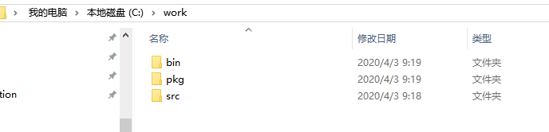

### - GOROOT

存放go语言的标准库sdk: software development kit

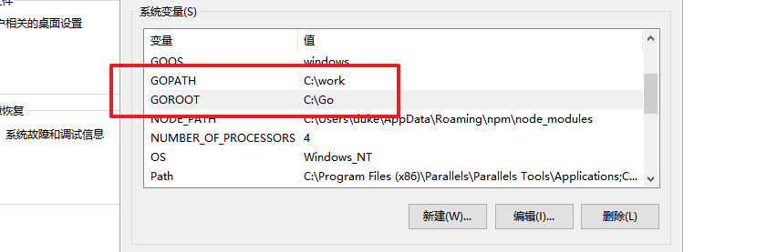


配置goland，打开工程

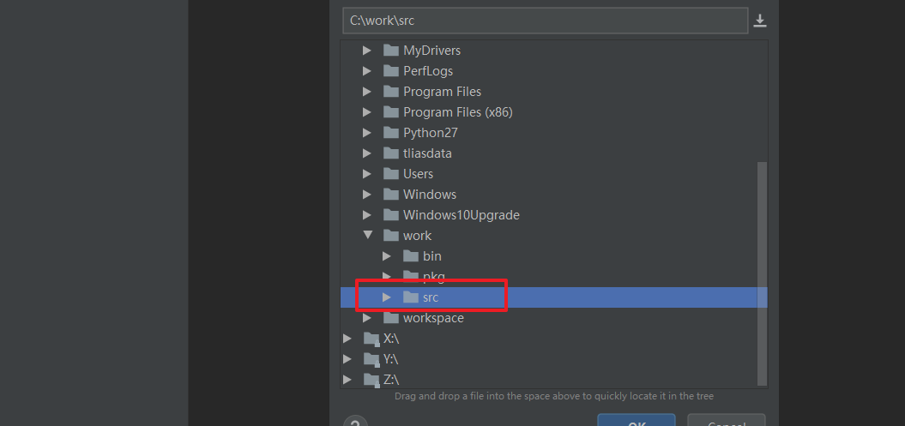


## 2. helloworld 概览

```go
package main

import "fmt"

func main()  {
	fmt.Println("hello world")
}
```

解析：

```go
//每个go程序，都必须有一个 package main
//每个go程序，都是.go结尾的
//go程序中没有.h，没有.o, 只有.go
//一个package，包名，相当于命名空间
//std::cout
package main

//这是导入一个标准包fmt，format，一般用于格式化输出
import "fmt"

//主函数，所有的函数必须使用func 开头
//一个函数的返回值，不会放在func前，而是放在参数后面
//函数左花括号必须与函数名同行，不能写到下一行
func main() {

	//go语言语句不需要使用分号结尾
	fmt.Println("hello world");
}
```

## 3. go语言特点

1. 没有头文件概念,  .go走天下
2. 强类型的语言，编译性语言（python是弱类型，解释性语言）
3. 一个go语言的应用程序，在运行的时候是不需要依赖外部库的
   1. 把执行时需要的所有库都打包到程序中
   2. go程序比较大
   3. 如果import的包在程序中没有使用，那么程序不允许编译
4. go语法是不区分平台的，在windows下面也可以编译一个程序，在linux下运行，需要两个环境变量来控制：
   1. GOOS：设定运行的平台
      1. mac：GOOS=darwin
      2. linux: GOOS= linux
      3. windows :GOOS=windows
   2. GOARCH: 目标平台的体系构架
      1. 386： GOARCH=386
      2. amd64: GOARCH=amd64
      3. arm : GOARCH=arm
   3. 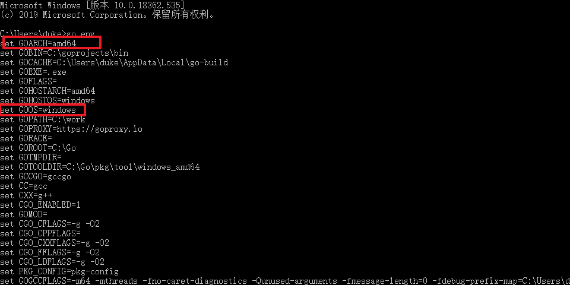

## 4. goland终端配置成shell

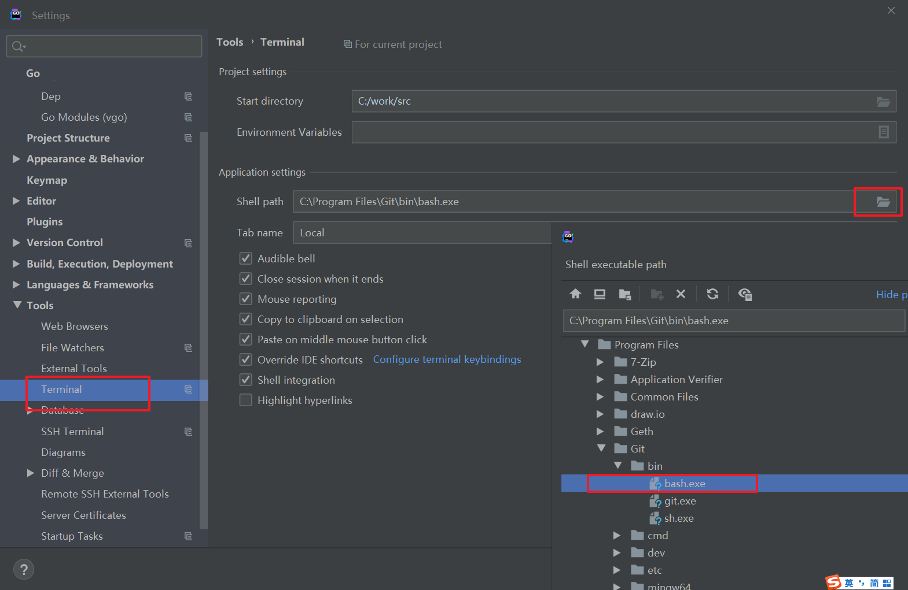

重新加载一下终端即可：

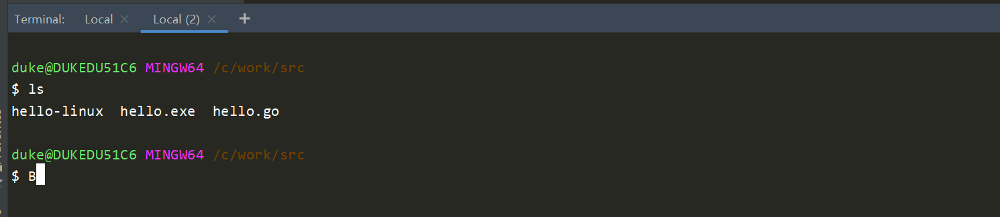

## 5. go命令（build/run/install/get/env）

> go get gitxxxx/

1. 编译.go文件，-o指定生成文件的命令

   1. go build -o test.exe main.go xxx.go
   2. go build *.go

2. 直接运行程序，不会编译成exe文件

   1. go run *.go

   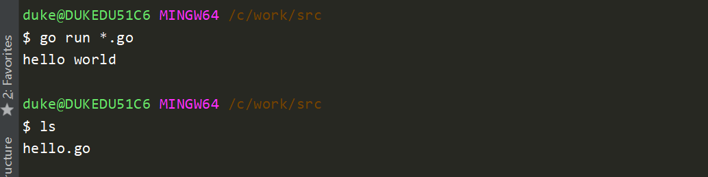

3. 安装程序  go install
   1. 拿到一个c源码，想自己编译出exe
      1. ./configure
      2. make
      3. make install  ===> 将编译好的程序安装到指定的目录/usr/bin
   2. 使用go install，可以将应用程序安装到GOBIN下面: $GOPATH/bin
      1. go install ==> 需要实现在环境变量中设置GOBIN的目录

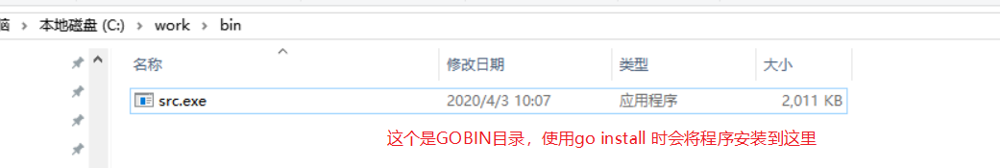

4. go env，可以查看当前go的环境变量
5. 如果重新设置了环境变量，需要重新启动goland才能生效

# 二、基础语法

## 1. 变量定义

```go
package main

import "fmt" //goland会帮我们自动导入程序中使用的包

func main() {
	//变量定义： var
	//常量定义： const

	//01-先定义变量，再赋值 var 变量名 数据类型
	var name string
	name = "duke" //Ctrl + Alt +l 可以快速格式化代码

	var age int
	age = 20

	fmt.Println("name:", name)
	fmt.Printf("name is :%s, %d\n", name, age)

	//02 定义时直接赋值
	var gender = "man"
	fmt.Println("gender:", gender)

	//03 定义直接赋值，使用自动推导 （最常用的）
	address := "北京"
	fmt.Println("address:", address)

	//灰色部分表示形参
	test(10, "str")

	//04-平行赋值
	i, j := 10, 20 //同时定义两个变量
	fmt.Println("变换前==》 i:", i, ", j:", j)

	i, j = j, i
	fmt.Println("变换后==》i:", i, ", j:", j)

}

func test(a int, b string) {
	fmt.Println(a)
	fmt.Println(b)
}

```

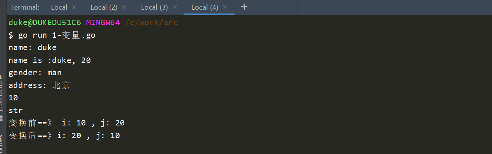

基础数据类型：

```go
int,int8 int16, int32, int64
uint8 ... uint64

float32
float64

true/false
```

## 2. 自增语法

c语言：i++, i--, --i, ++i

go语言：i++, i--， 没有--i，++i， 自增语法必须单独一行

```go
package main

import "fmt"

func main() {
	i := 20
	i++
	//++i //这个也是错的， 语义更加明确
	//fmt.Println("i:", i++)  //这是错误的，不允许和其他代码放在一起，必须单独一行
	fmt.Println("i:", i)

}

```

## 3. 指针

```go
package main

import "fmt"

func main() {
	//go语义也有指针
	//结构体成员调用时：   c语言:   ptr->name  go语言:  ptr.name
	//go语言在使用指针时，会使用内部的垃圾回收机制(gc : garbage collector)，开发人员不需要手动释放内存
	//c语言不允许返回栈上的指针，go语言可以返回栈上的指针，程序会在编译的时候就确定了变量的分配位置：
	//编译的时候，如果发现有必要的话，就将变量分配到堆上

	name := "lily"
	ptr := &name
	fmt.Println("name:", *ptr)
	fmt.Println("name ptr:", ptr)

	//02-使用new关键字定义
	name2Ptr := new(string)
	*name2Ptr = "Duke"

	fmt.Println("name2:", *name2Ptr)
	fmt.Println("name2 ptr:", name2Ptr)

	//可以返回栈上的指针，编译器在编译程序时，会自动判断这段代码，将city变量分配在堆上
	res := testPtr()
	fmt.Println("res city :", *res, ", address:", res)
    
	//空指针，在c语言： null， c++: nullptr，go： nil

	//if两端不用加()
	//即使有一行代码，也必须使用{}
	if res == nil {
		fmt.Println("res 是空，nil")
	} else {
		fmt.Println("res 是非空")
	}

}

//定义一个函数，返回一个string类型的指针, go语言返回写在参数列表后面
func testPtr() *string {
	city := "深圳"
	ptr := &city
	return ptr
}

```

## 4. 不支持的语法汇总

1. 自增--i, ++i不支持
2. 不支持地址加减
3. 不支持三目运算符 ? :
4. 只有false才能代码逻辑假，数字0和nil不能(只有false/true才能表示逻辑真假，数字不能代表逻辑值)

```go
package main

import "fmt"

func main() {
	//if 0 {
	//	fmt.Println("hello")
	//}

	//if nil {
	//	fmt.Println("hello")
	//}

	if true {
		fmt.Println("hello")
	}

	//a, b := 1, 2
	//x := a > b ? 0:-1
}
```


## 5. 字符串string

```go
package main

import "fmt"

//char C语言，go语言: byte ==> uint8
//type byte = uint8

func main() {
	//1- 定义
	name := "duke"

	//需要换行，原生输出字符串时，使用反引号``
	usage := `./a.out <option> 
         -h   help 
		 -a  xxxx`
	//c语言使用单引号 + \来解决
	fmt.Println("name :", name)
	fmt.Println("usage :", usage)

	//2. 长度，访问
	//C++:   name.length
	//GO: string没有.length方法，可以使用自由函数len()进行处理
	//len: 很常用
	l1 := len(name)
	fmt.Println("l1:", l1)

	//不需要加()
	for i := 0; i < len(name); i++ {
		fmt.Printf("i: %d, v: %c\n", i, name[i])
	}

	//3-拼接
	i, j := "hello", "world"
	fmt.Println("i+j=", i+j)

	//使用const修饰为常量，不能修改
	const address = "beijing" //在编译期就确定了类型，是预处理，所以不需要推导
	const test = 100
	//address = "上海"
	fmt.Println("address:", address)
    
    //可以直接对比字符串，使用ASCII的值进行比较
    if i > j {
        ;
    }
}

```

## 5. 定长数组

```go
package main

import "fmt"

func main() {

	//1-定义，定义一个具有10个数字的数组
	//c语言定义: int nums[10] ={1,2,3,4}
	//go语言定义：
	// 	nums := [10]int{1,2,3,4} (常用方式)
	//  var nums = [10]int{1,2,3,4}
	// var nums [10]int = [10]int{1,2,3,4}

	nums := [10]int{1, 2, 3, 4,0,0,0,0}

	//2-遍历，方式一
	for i := 0; i < len(nums); i++ {
		fmt.Println("i:", i, ", j:", nums[i])
	}

	//方式二： for range   ===> python支持
	//key是数组下标，value是数组的值
	for key, value := range nums {
		//key=0, value=1  => nums[0]
		value += 1
		//value全程只是一个临时变量，不断的被重新赋值，修改它不会修改原始数组
		fmt.Println("key:", key, ", value:", value, "num:", nums[key])
	}

	//在go语言中，如果想忽略一个值，可以使用_
	//如果两个都忽略，那么 就不能使用 := ,而应该直接使用 =
	for _, value := range nums {
		fmt.Println("_忽略key, value:", value)
	}

	//不定长数组定义
	//3-使用make进行创建数组
}
```

## 6. 不定长数组（切片、slice）

切片：slice，它的底层也是数组，可以动态改变长度

### 切片1：

```go
package main

import "fmt"

func main() {
	//切片：slice，它的底层也是数组，可以动态改变长度
	//定义一个切片，包含多个地名
	//names := [10]string{"北京", "上海", "广州", "深圳"}
	names := []string{"北京", "上海", "广州", "深圳"}
	for i, v := range names {
		fmt.Println("i:", i, "v:", v)
	}

	//1.追加数据
	names1 := append(names, "海南")
	fmt.Println("names:", names)
	fmt.Println("names1:", names1)

	fmt.Println("追加元素前,name的长度:", len(names), "，容量:", cap(names))
	names = append(names, "海南")
	//fmt.Println("names追加元素后赋值给自己:", names)
	fmt.Println("追加元素后,name的长度:", len(names), "，容量:", cap(names))

	names = append(names, "西藏")
	fmt.Println("追加元素后,name的长度:", len(names), "，容量:", cap(names))

	//2.对于一个切片，不仅有'长度'的概念len()，还有一个'容量'的概念cap()
	nums := []int{}
	for i := 0; i < 50; i++ {
		nums = append(nums, i)
		fmt.Println("len:", len(nums), ", cap:", cap(nums))
	}
}

```

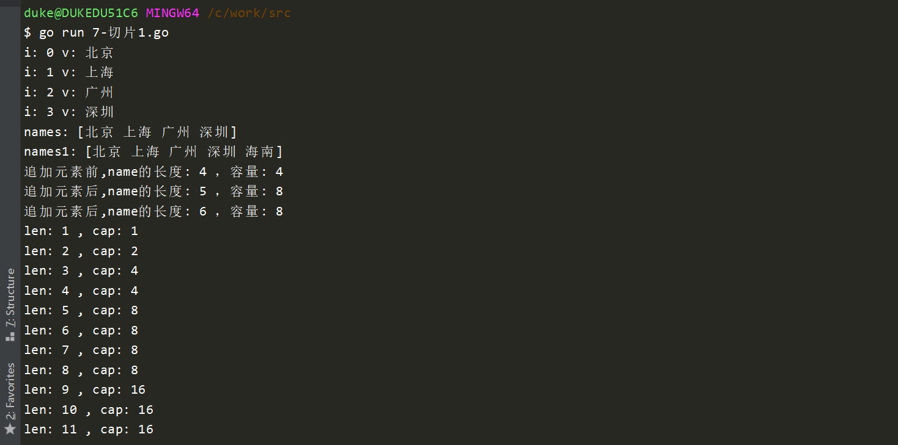

小结:

1. 可以使用append进行追加数据
2. len获取长度，cap获取容量
3. 如果容量不足，再次追加数据时，会动态分配2倍空间


### 切片2

```go
package main

import "fmt"

func main() {
	names := [7]string{"北京", "上海", "广州", "深圳", "洛阳", "南京", "秦皇岛"}

	//想基于names创建一个新的数组
	names1 := [3]string{}
	names1[0] = names[0]
	names1[1] = names[1]
	names1[2] = names[2]

	//切片可以基于一个数组，灵活的创建新的数组
	names2 := names[0:3] //左闭右开
	fmt.Println("names2:", names2)

	names2[2] = "Hello"
	fmt.Println("修改names[2]之后, names2:", names2)
	fmt.Println("修改names[2]之后, names:", names)

	//1. 如果从0元素开始截取，那么冒号左边的数字可以省略
	names3 := names[:5]
	fmt.Println("name3:", names3)

	//2. 如果截取到数组最后一个元素，那么冒号右边的数字可以省略
	names4 := names[5:]
	fmt.Println("name4:", names4)

	//3. 如果想从左至右全部使用，那么冒号左右两边的数字都可以省略
	names5 := names[:]
	fmt.Println("name5:", names5)

	//4. 也可以基于一个字符串进行切片截取 : 取字符串的字串 helloworld
	sub1 := "helloworld"[5:7]
	fmt.Println("sub1:", sub1) //'wo'

	//5. 可以在创建空切片的时候，明确指定切片的容量，这样可以提高运行效率
	//创建一个容量是20，当前长度是0的string类型切片
	//make的时候，初始的值都是对应类型的零值 : bool ==> false, 数字==> 0, 字符串 ==> 空
	str2 := make([]string, 10, 20) //第三个参数不是必须的，如果没填写，则默认与长度相同
	fmt.Println("str2:", &str2[0])

	fmt.Println("str2: len:", len(str2), ", cap:", cap(str2))
	str2[0] = "hello"
	str2[1] = "world"

	//6.如果想让切片完全独立于原始数组，可以使用copy()函数来完成
	namesCopy := make([]string, len(names))
	//func copy(dst, src []Type) int
	//names是一个数组，copy函数介收的参数类型是切片，所以需要使用[:]将数组变成切片
	copy(namesCopy, names[:])
	namesCopy[0] = "香港"
	fmt.Println("namesCopy:", namesCopy)
	fmt.Println("naemes本身:", names)

}
```

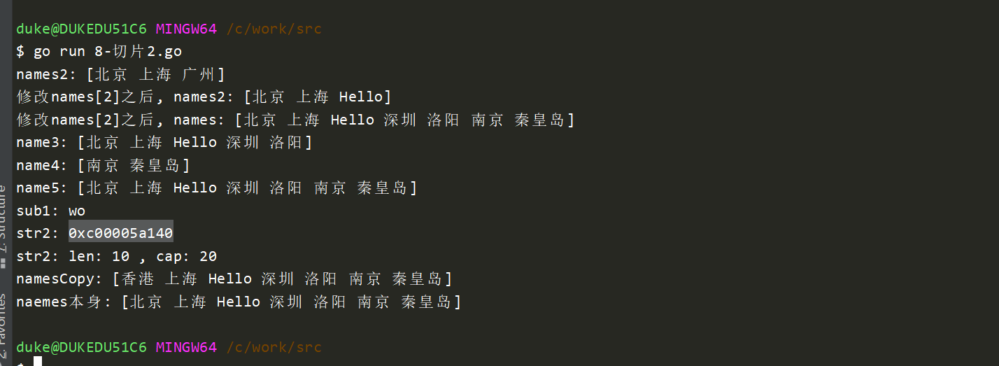

## 7.字典（map)

哈希表 ， key=>value， 存储的key是经过哈希运算的

```go
package main

import "fmt"

func main() {
	//1. 定义一个字典
	//学生id ==> 学生名字  idNames
	var idNames map[int]string //定义一个map，此时这个map是不能直接赋值的，它是空的

	idNames[0] = "duke"
	idNames[1] = "lily"

	for key, value := range idNames {
		fmt.Println("key:", key, ", value:", value)
	}
}

```

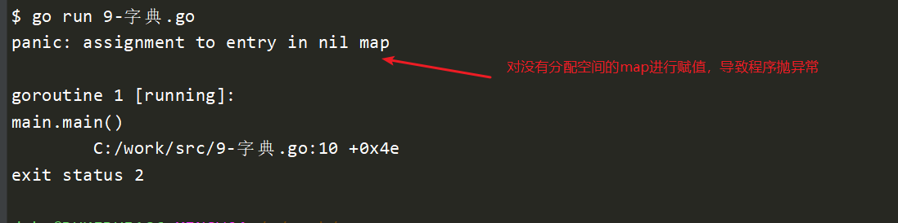

2. 使用map之前，一定要对map进行分配空间

```go
package main

import "fmt"

func main() {
	//1. 定义一个字典
	//学生id ==> 学生名字  idNames
	var idNames map[int]string //定义一个map，此时这个map是不能直接赋值的，它是空的

	//2. 分配空间，使用make，可以不指定长度，但是建议直接指定长度，性能更好
	idScore := make(map[int]float64)   //这个也是正确的
	idNames = make(map[int]string, 10) //建议使用这种方式

	//3. 定义时直接分配空间
	//idNames1 := make(map[int]string, 10) //这是最常用的方法

	idNames[0] = "duke"
	idNames[1] = "lily"

	//4. 遍历map
	for key, value := range idNames {
		fmt.Println("key:", key, ", value:", value)
	}

	//5. 如何确定一个key是否存在map中
	//在map中不存在访问越界的问题，它认为所有的key都是有效的，所以访问一个不存在的key不会崩溃，返回这个类型的零值
	//零值：  bool=》false， 数字=》0，字符串=》空
	name9 := idNames[9]
	fmt.Println("name9:", name9)               //空
	fmt.Println("idScore[100]:", idScore[100]) //0

	//无法通过获取value来判断一个key是否存在,因此我们需要一个能够校验key是否存在的方式
	value, ok := idNames[1] //如果id=1是存在的，那么value就是key=1对应值，ok返回true, 反之返回零值，false
	if ok {
		fmt.Println("id=1这个key是存在的，value为:", value)
	}

	value, ok = idNames[10]
	if ok {
		fmt.Println("id=10这个key是存在的，value为:", value)
	} else {
		fmt.Println("id=10这个key不存在，value为:", value)
	}

	//6. 删除map中的元素
	//使用自由函数delete来删除指定的key
	fmt.Println("idNames删除前:", idNames)
	delete(idNames, 1)   //"lily"被kill
	delete(idNames, 100) //不会报错
	fmt.Println("idNames删除后:", idNames)

	//并发任务处理的时候，需要对map进行上锁 //TODO
}

```

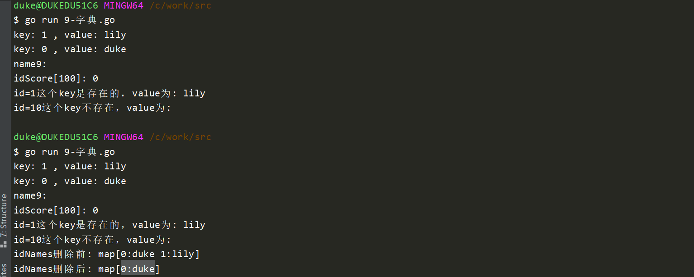

## 8. 函数

```go
package main

import "fmt"

//1.函数返回值在参数列表之后
//2.如果有多个返回值，需要使用圆括号包裹，多个参数之间使用,分割
func test2(a int, b int, c string) (int, string, bool) {
	return a + b, c, true
}

func test3(a, b int, c string) (res int, str string, bl bool) {

	var i, j, k int
	i = 1
	j = 2
	k = 3
	fmt.Println(i, j, k)

	//直接使用返回值的变量名字参与运算
	res = a + b
	str = c
	bl = true

	//当返回值有名字的时候，可以直接简写return
	return

	//return a + b, c, true
}

//如果返回值只有一个参数，并且没有名字，那么不需要加圆括号
func test4() int {
	return 10
}

func main() {
	v1, s1, _ := test2(10, 20, "hello")
	fmt.Println("v1:", v1, ",s1:", s1)

	v3, s3, _ := test3(20, 30, "world")
	fmt.Println("v3:", v3, ", s3:", s3)
}

```

内存逃逸：

```go
package main

import "fmt"

func main() {
	p1 := testPtr1()
	fmt.Println("*p1:", *p1)
}

//定义一个函数，返回一个string类型的指针, go语言返回写在参数列表后面
func testPtr1() *string {
	name := "Duke"
	p0 := &name
	fmt.Println("*p0:", *p0)

	city := "深圳"
	ptr := &city
	return ptr
}

```

```go
go build -o test.exe --gcflags "-m -m -l" 11-内存逃逸.go  > 1.txt  2>&1

grep -E "name|city" 1.txt --color
```

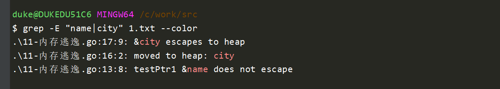

## 9. import

把一个文件夹当成一个包名

创建目录结构：

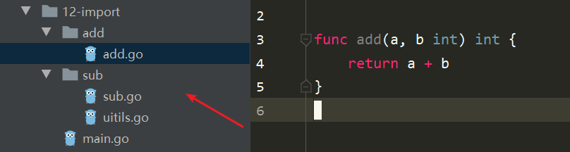


add.go

```go
package add

func add(a, b int) int {
	return a + b
}
```

sub.go

```go
package sub

//在go语言中，同一层级目录，不允许出现多个包名
func Sub(a, b int) int {
	test4() //由于test4与sub.go在同一个包下面，所以可以使用，并且不需要sub.形式
	return a - b
}
```

utils.go

```go
package sub

//package utils //不允许出现多个包名

import "fmt"

func test4() {
	fmt.Println("this is test4() in sub/utils!")
}
```

main.go

```go
package main

import (
	SUB "12-import/sub" //SUB是我们自己重命名的包名
	//"12-import/sub" //sub是文件名，同时也是包名
	. "12-import/sub" //.代表用户在调用这个包里面的函数时，不需要使用包名.的形式，不见一使用的
	"fmt"
)

func main() {
	//res := sub.Sub(20, 10) //包名.函数去调用
	res := SUB.Sub(20, 10) //包名.函数去调用
	fmt.Println("sub.Sub(20,10) =", res)

	res1 := Sub(30, 20)
	fmt.Println("Sub(30, 20) :", res1)

	//这个无法被调用，是因为函数的首写字母是小写的
	//如果一个包里面的函数想对外提供访问权限，那么一定要首写字母大写,
	// 大写字母开头的函数相当于 public,
	// 小写字母开头的函数相当于 private, 只有相同包名的文件才能使用
	//add.add(10,20)
}
```


结果：

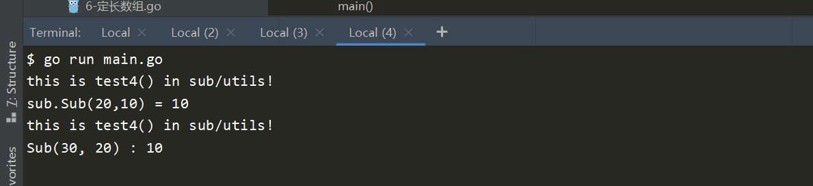

自定义代码块

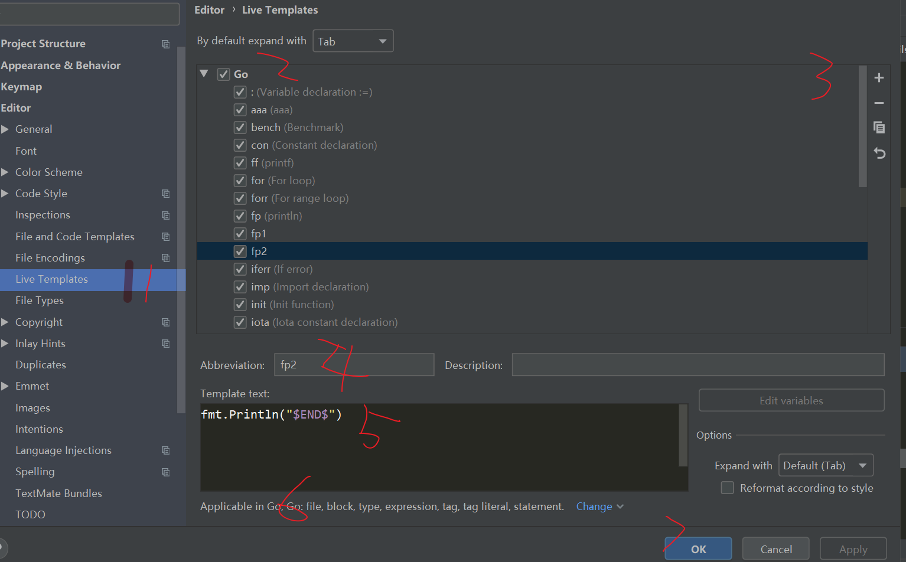
