# 一、基础语法补充

## 1. switch

```go
package main

import (
	"fmt"
	"os"
)

//从命令输入参数，在switch中进行处理

func main() {
	//C: argc , **argv
	//Go: os.Args ==> 直接可以获取命令输入，是一个字符串切片 []string
	cmds := os.Args

	//os.Args[0] ==> 程序名字
	//os.Args[1] ==> 第一个参数 ，以此类推
	for key, cmd := range cmds {
		fmt.Println("key:", key, ", cmd:", cmd, ", cmds len:", len(cmds))
	}

	if len(cmds) < 2 {
		fmt.Println("请正确输入参数！")
		return
	}

	switch cmds[1] {
	case "hello":
		fmt.Println("hello")
		//go 的switch, 默认加上break了，不需要手动处理
		//如果想向下穿透的话，那么需要加上关键字: fallthrough
		fallthrough
	case "world":
		fmt.Println("world")
	default:
		fmt.Println("default called!")
	}
}
```

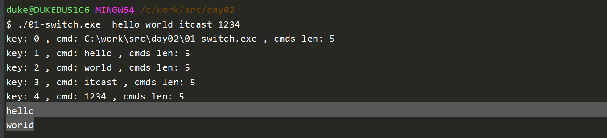


## 2. 标签

```go
package main

import "fmt"

func main() {
	//标签 LABEL1
	//goto LABEL  ===> 下次进入循环时，i不会保存之前的状态，重新从0开始计算，重新来过
	//continue LABEL1 ===> continue会跳到指定的位置，但是会记录之前的状态，i变成1
	//break LABEL1  ==> 直接跳出指定位置的循环

	//标签的名字是自定义的，后面加上冒号
LABEL121:
	for i := 0; i < 5; i++ {
		for j := 0; j < 5; j++ {
			if j == 3 {
				//goto LABEL1
				//continue LABEL1
				break LABEL121
				//break
			}

			fmt.Println("i:", i, ",j:", j)
		}
	}

	fmt.Println("over!")
}

```

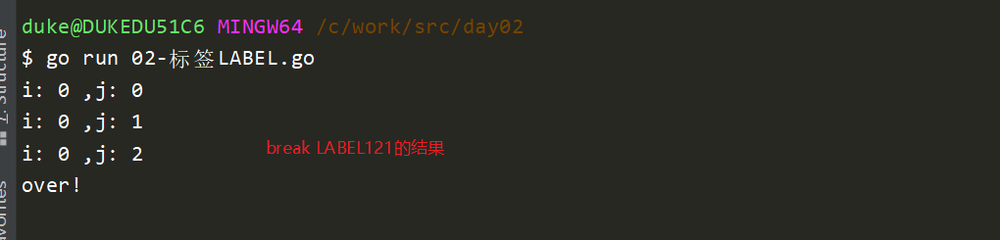


## 3. 枚举const+iota

```go
package main

import "fmt"

//在go语言中没有枚举类型，但是我们可以使用const + iota（常量累加器）来进行模拟
//模拟一个一周的枚举
const (
	MONDAY    = iota       //0
	TUESDAY   = iota       //1
	WEDNESDAY = iota       //2
	THURSDAY               //3  ==> 没有赋值，默认与上一行相同iota ==> 3
	FRIDAY                 //4
	SATURDAY               //5
	SUNDAY                 //6
	M, N      = iota, iota //const属于预编译期赋值，所以不需要:=进行自动推导
)

const (
	JANU = iota + 1 //1
	FER             //2
	MAR             //3
	APRI            //4
)

//1. iota是常量组计数器
//2.iota从0开始，每换行递增1
//3. 常量组有个特点如果不赋值，默认与上一行表达式相同
//4.如果同一行出现两个iota，那么两个iota的值是相同的
//5.每个常量组的iota是独立的，如果遇到const iota会重新清零

func main() {

	fmt.Println("打印周:")
	fmt.Println(MONDAY)
	fmt.Println(TUESDAY)
	fmt.Println(WEDNESDAY)
	fmt.Println(THURSDAY)
	fmt.Println(FRIDAY)
	fmt.Println("M:", M, ",N:", N)

	fmt.Println("打印月份:")
	fmt.Println(JANU) //1
	fmt.Println(FER)  //2
	fmt.Println(MAR)  //3

	//var number int
	//var name string
	//var flag bool
	//
	//
	////可以使用变量组来将统一定义变量
	//var (
	//	number int
	//	name string
	//	flag bool
	//)

}

```


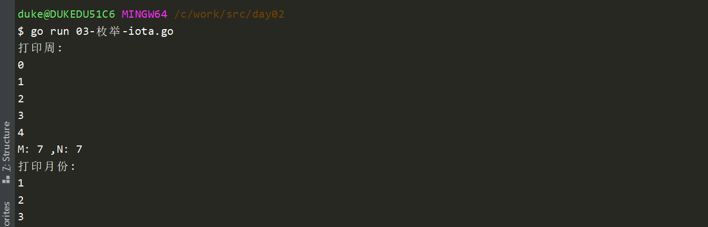


在goland中配置git shell，并且显示中文：

https://www.bbsmax.com/A/n2d9YvN6dD/

```sh
我的安装路径D:\Program Files (x86)\Tools\Git\Git\etc）下bash.bashrc文件

export LANG="zh_CN.UTF-8"
export LC_ALL="zh_CN.UTF-8"
```


git终端显示中午设置：

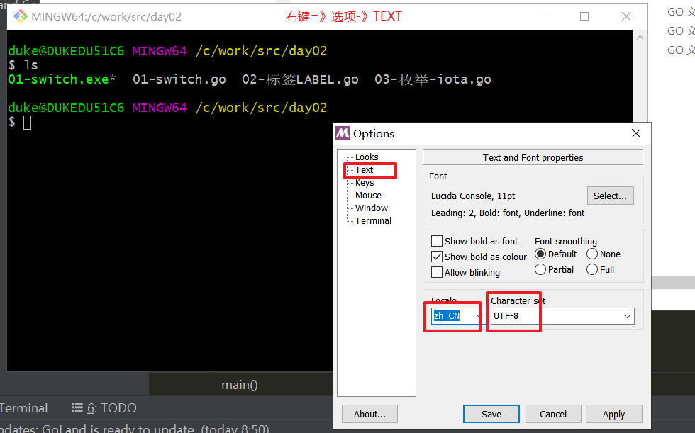


## 4. 结构体

在go语言中，使用结构体来模拟类

```go
package main

import "fmt"

//c语言里面，我们可以使用typedef  int MyInt
type MyInt int //type相当于typdef

//C:
//struct Person {
//
//}

//go语言结构体使用type + struct来处理
type Student struct {
	name   string
	age    int
	gender string
	score  float64
}

func main() {
    t1 := struct {
        a int
    }{
        a : 100
    }
    
    fmt.Println(t1)
    
	var i, j MyInt
	i, j = 10, 20

	fmt.Println("i+j:", i+j)

	//创建变量，并赋值
	lily := Student{
		name:   "Lily",
		age:    20,
		gender: "女生",
		//score:  80, //最后一个元素后面必须加上逗号，如果不加逗号则必须与}同一行
		//}
		score: 80} //最后一个元素后面必须加上逗号，如果不加逗号则必须与}同一行

	//使用结构体各个字段
	fmt.Println("lily:", lily.name, lily.age, lily.gender, lily.score)

	//结构体没有-> 操作
	s1 := &lily
	fmt.Println("lily 使用指针s1.name打印:", s1.name, s1.age, s1.gender, s1.score)
	fmt.Println("lily 使用指针(*s1).name打印:", (*s1).name, s1.age, s1.gender, s1.score)

	//在定义期间对结构体赋值时，如果每个字段都赋值了，那么字段的名字可以省略不写
	//如果只对局部变量赋值，那么必须明确指定变量名字
	Duke := Student{
		name: "Duke",
		age:  28,
		//"男生",
		// 99,
	}
	Duke.gender = "男生"
	Duke.score = 100

	fmt.Println("Duke:", Duke)
}

```

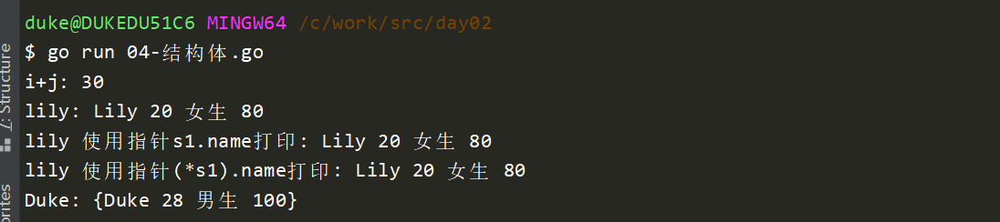


## 5.init函数

C语言没有init函数，C语言一般需要自己去写init，然后在构造函数中调用

Go语言自带init函数，每一个包都可以包含一个或多个init函数

```go
package sub

import "fmt"

//0.这个init会在包被引用的时候(import)进行自动调用
//1.init函数没有参数，没有返回值，原型固定如下
//2.一个包中包含多个init时，调用顺序是不确定的(同一个包的多个文件中都可以有init)
//3. init函数时不允许用户显示调用的
//4. 有的时候引用一个包，可能只想使用这个包里面的init函数（mysql的init对驱动进行初始化）
//但是不想使用这个包里面的其他函数，为了防止编译器报错，可以使用_形式来处理
//import _ "xxx/xx/sub"
func init() {
	fmt.Println("this is first init() in package sub ==> sub.go")
}

func init() {
	fmt.Println("this is second init() in package sub ==> sub.go ")
}

//在go语言中，同一层级目录，不允许出现多个包名
func Sub(a, b int) int {
	//init() ==> 不允许显示调用
	test4() //由于test4与sub.go在同一个包下面，所以可以使用，并且不需要sub.形式
	return a - b
}

```


utils.go

```go
package sub

//package utils //不允许出现多个包名

import "fmt"

func init() {
	fmt.Println("this is init in sub utils.go")
}

func test4() {
	fmt.Println("this is test4() in sub/utils!")
}

```


main.go

```go
package main

import (
	_ "day02/05-init函数/sub" //此时，只会调用sub里面的init函数，编译还不会出错
	//"fmt"
)

func main() {
	//res := sub.Sub(10, 5)
	//fmt.Println("sub.Sub(20,10) =", res)
}

```

效果：

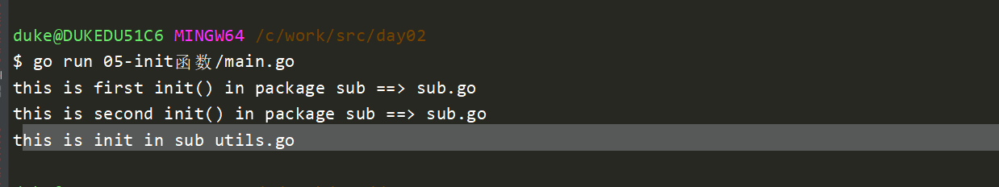

使用init场景，在配置文件管理器中写init，用于加载配置文件并解析：

```go
configManager {
	//解析加载配置文件
	//IP, PORT
}
```


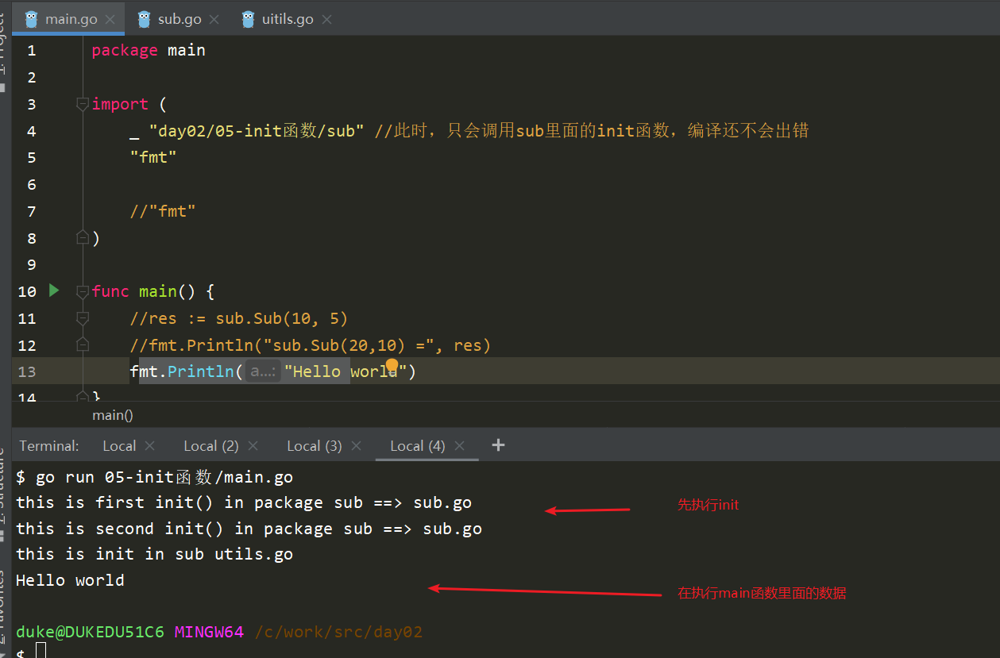


## 6.defer(延迟)

延迟，关键字，可以用于修饰语句，函数，确保这条语句可以在当前栈退出的时候执行

```go
lock.Lock()
a = "hello"
lock.Unlock()   <=== 经常容易忘掉解锁
```

go语言可以使用defer来解决这个问题

```go
{
    lock.Lock()
    defer lock.Unlock()   <=== 在当前栈退出的时候（例如：函数结束时）
    a = "hello"
}

{
    f1,_ := file.Open()
    defer f1.Close()
}
```


实例：

```go
package main

import (
	"fmt"
	"os"
)

func main() {
	//1.延迟，关键字，可以用于修饰语句，函数，确保这条语句可以在当前栈退出的时候执行
	//2. 一般用于做资源清理工作
	//3. 解锁、关闭文件
	//4. 在同一个函数中多次调用defer，执行时类似于栈的机制：先后入后出

	filename := "01-switch.go"
	readFile(filename)
}

func readFile(filename string) {
	//func Open(name string) (*File, error) {
	//1. go语言一般会将错误码作为最后一个参数返回
	//2. err一般nil代表没有错误，执行成功，非nil表示执行失败
	f1, err := os.Open(filename)

	//匿名函数,没有名字，属于一次性的逻辑 ==> lamada表达式
	defer func(a int) {
		fmt.Println("准备关闭文件, code:", a)
		_ = f1.Close()
	}(100) //创建一个匿名函数，同时调用

	if err != nil {
		fmt.Println("os.Open(\"01-switch.go\") ==> 打开文件失败, err:", err)
		return
	}

	defer fmt.Println("0000000")
	defer fmt.Println("1111111")
	defer fmt.Println("2222222")

    buf := make([]byte, 1024)  //byte ==> char ==> uint8
	//func (f *File) Read(b []byte) (n int, err error) {
	n, _ := f1.Read(buf)
	fmt.Println("读取文件的实际长度:", n)
	fmt.Println("读取的文件内容:", string(buf))  ==> 类型转换

}
```


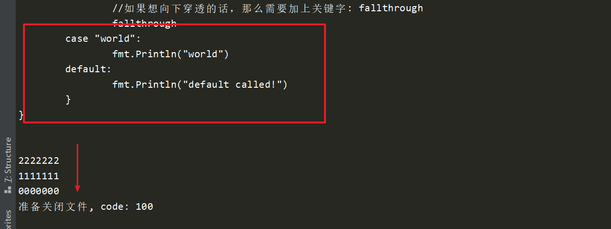


# 二、类相关操作

go语言支持类的操作，但是没有class关键字，使用struct来模拟类

## 1.封装-绑定方法

```go
package main

import "fmt"

//Person类，绑定方法：Eat，Run，Laugh, 成员
//public，private
/*
class Person {
public :
    string name
	int age

public :
	Eat() {
		xxx
	}
}

*/

//任何type的类型，都可以绑定方法
type MyInt1 int

func (mi *MyInt1) printMyInt() {
	fmt.Println("MyInt value is:", *mi)
}

type Person struct {
	//成员属性:
	name   string
	age    int
	gender string
	score  float64
}
/*
Person:::Eat() {
    
}
*/

//在类外面绑定方法
func (this *Person) Eat() {
	//fmt.Println("Person is eating")
	//类的方法，可以使用自己的成员
	//fmt.Println(this.name + " is eating!")
	this.name = "Duke"
}

func (this Person) Eat2() {
	fmt.Println("Person is eating")
	//类的方法，可以使用自己的成员
	this.name = "Duke"
}

func main() {
	lily := Person{
		name:   "Lily",
		age:    30,
		gender: "女生",
		score:  10,
	}

	lily1 := lily

	fmt.Println("Eat，使用p *Person，修改name的值 ...")
	fmt.Println("修改前lily:", lily) //lily
	lily.Eat()
	fmt.Println("修改后lily:", lily) //Duke

	fmt.Println("Eat2，使用p Person，但是不是指针 ...")
	fmt.Println("修改前lily:", lily1) //lily
	lily1.Eat2()
	fmt.Println("修改后lily:", lily1) //lily

	var myint1 MyInt1 = 100
	myint1.printMyInt()
}

```

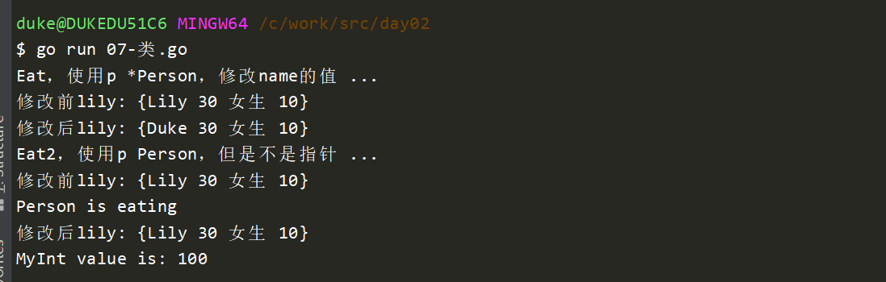


## 2. 类继承

```go
package main

import "fmt"

type Human struct {
	//成员属性:
	name   string
	age    int
	gender string
}

//在类外面绑定方法
func (this *Human) Eat() {
	fmt.Println("this is :", this.name)
}

//定义一个学生类，去嵌套一个Hum
type Student1 struct {
	hum    Human //包含Human类型的变量, 此时是类的嵌套
	score  float64
	school string
}

//定义一个老师，去继承Human
type Teacher struct {
	Human          //直接写Huam类型，没有字段名字，默认会创建一个同名的字段
	subject string //学科
}

func main() {
	s1 := Student1{
		hum: Human{
			name:   "Lily",
			age:    18,
			gender: "女生",
		},
		school: "昌平一中",
	}

	fmt.Println("s1.name:", s1.hum.name)
	fmt.Println("s1.school:", s1.school)

	t1 := Teacher{}
	t1.subject = "语文"
	t1.name = "荣老师" //下面这几个字段都是继承自Human
	t1.age = 35
	t1.gender = "女生"

	fmt.Println("t1 :", t1)
	t1.Eat()

	//继承的时候，虽然我们没有定义字段名字，但是会自动创建一个默认的同名字段
	//这是为了在子类中依然可以操作父类，因为：子类父类可能出现同名的字段
	fmt.Println("t1.Human.name:", t1.Human.name)
}

```

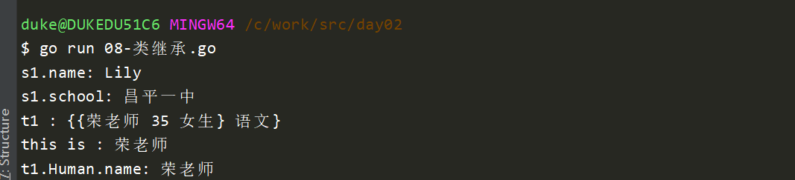


访问权限

```c
//在go语言中，权限都是通过首字母大小来控制
//1. import ==》 如果包名不同，那么只有大写字母开头的才是public的
//2. 对于类里面的成员、方法===》只有大写开头的才能在其他包中使用
```


## 3. interface（接口）

```go
package main

import "fmt"

//在C++中，实现接口的时候，使用纯虚函数代替接口
//在go语言中，有专门的关键字 interface来代表接口
//interface不仅仅是用于处理多态的，它可以接受任意的数据类型，有点类似void

func main() {
	//func Println(a ...interface{}) (n int, err error) {
	fmt.Println("")

	//var i,j,k int
	//定义三个接口类型
	var i, j, k interface{}  //空接口
	names := []string{"duke", "lily"}
	i = names
	fmt.Println("i代表切片数组:", i)

	age := 20
	j = age
	fmt.Println("j代表数字：", j)

	str := "hello"
	k = str
	fmt.Println("k代表字符串:", k)

}

```

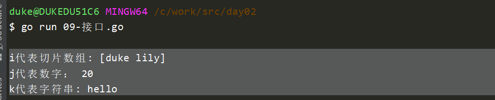


```go
package main

import "fmt"

//在C++中，实现接口的时候，使用纯虚函数代替接口
//在go语言中，有专门的关键字 interface来代表接口
//interface不仅仅是用于处理多态的，它可以接受任意的数据类型，有点类似void

func main() {
	//func Println(a ...interface{}) (n int, err error) {
	fmt.Println("")

	//var i,j,k int
	//定义三个接口类型
	var i, j, k interface{}
	names := []string{"duke", "lily"}
	i = names
	fmt.Println("i代表切片数组:", i)

	age := 20
	j = age
	fmt.Println("j代表数字：", j)

	str := "hello"
	k = str
	fmt.Println("k代表字符串:", k)

	//我们现在只知道k是interface，但是不能够明确知道它代表的数据的类型
	kvalue, ok := k.(int)  //<<<==== 做类型的二次确认
	if !ok {
		fmt.Println("k不是int")
	} else {
		fmt.Println("k是int， 值为:", kvalue)
	}

	//最常用的场景： 把interface当成一个函数的参数，（类似于print），使用switch来判断用户输入的不同类型
	//根据不同类型，做相应逻辑处理

	//创建一个具有三个接口类型的切片
	array := make([]interface{}, 3)
	array[0] = 1
	array[1] = "Hello world"
	array[2] = 3.14

	for _, value := range array {
		//可以获取当前接口的真正数据类型
		switch v := value.(type) {
		case int:
			fmt.Printf("当前类型为int, 内容为：%d\n", v)
		case string:
			fmt.Printf("当前类型为string, 内容为: %s\n", v)
		case bool:
			fmt.Printf("当前类型为bool, 内容为: %v\n", v) //%v可以自动推到输出类型
		default:
			fmt.Println("不是合理的数据类型")
		}
	}
}
```

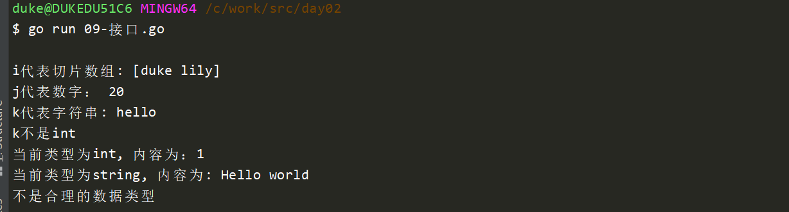


## 4. 多态

C语言的多态需要父子继承关系

go语言的多态不需要继承，只要实现相同的接口即可

```go
package main

import "fmt"

//实现go多态，需要实现定义接口
//人类的武器发起攻击，不同等级子弹效果不同

//定义一个接口, 注意类型是interface
type IAttack interface {
	//接口函数可以有多个，但是只能有函数原型，不可以有实现
	Attack()
	//Attack1()
}

//低等级
type HumanLowLevel struct {
	name  string
	level int
}

func (a *HumanLowLevel) Attack() {
	fmt.Println("我是:", a.name, ",等级为:", a.level, ", 造成1000点伤害")
}

//高等级
type HumanHighLevel struct {
	name  string
	level int
}

func (a *HumanHighLevel) Attack() {
	fmt.Println("我是:", a.name, ",等级为:", a.level, ", 造成5000点伤害")
}

//定义一个多态的通用接口,传入不同的对象，调用同样的方法，实现不同的效果 ==》 多态
func DoAttack(a IAttack) {
	a.Attack()
}

func main() {
	//var player interface{}
	var player IAttack //定义一个包含Attack的接口变量

	lowLevel := HumanLowLevel{
		name:  "David",
		level: 1,
	}

	highLevel := HumanHighLevel{
		name:  "David",
		level: 10,
	}

	lowLevel.Attack()
	highLevel.Attack()

	//对player赋值为lowLevel，接口需要使用指针类型来赋值
	player = &lowLevel
	player.Attack()

	player = &highLevel
	player.Attack()

	fmt.Println("多态......")
	DoAttack(&lowLevel)
	DoAttack(&highLevel)
}

```

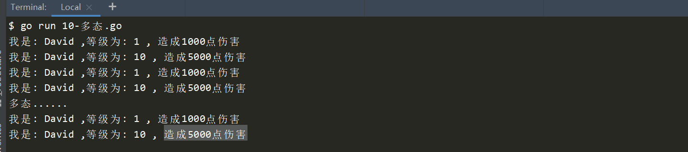

1. 定义一个接口，里面设计好需要的接口，可以有多个（Attack (), Attack()1 ..）

2. 任何实现了这个接口的类，都可以赋值给这个接口，从而实现多态

3. 多个类之间不需要有继承关系

4. 如果interface中定义了多个接口，那么实际的类必须全部实现接口函数，才可以赋值

   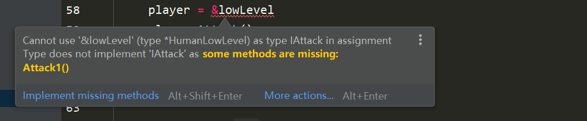


# 三、并发相关

## 1. 基础

并发：电脑同时听歌，看小说，看电影。cpu根据时间片进行划分，交替执行这个三个程序。我们人可以感觉是同时产生的。

并行：多个CPU（多核）同时执行


c语言里面实现并发过程使用的是多线程（C++的最小资源单元），进程

go语言里面不是线程，而是`go程` ==> goroutine，go程是go语言原生支持的

每一个go程占用的系统资源远远小于线程，一个go程大约需要4K~5K的内存资源

一个程序可以启动大量的go程：

- 线程 ==》几十个
- go程可以启动成百上千个， ===》 对于实现高并发，性能非常好
- 只需要在目标函数前加上go关键字即可


```go
package main

import (
	"fmt"
	"time"
)

//这个将用于子go程使用
func display() {
	count := 1
	for {
		fmt.Println("=============> 这是子go程:", count)
		count++
		time.Sleep(1 * time.Second)
	}
}

func main() {
	//启动子go程
	//go display()
	go func() {
		count := 1
		for {
			fmt.Println("=============> 这是子go程:", count)
			count++
			time.Sleep(1 * time.Second)
		}
	}()

	//主go程
	count := 1
	for {
		fmt.Println("这是主go程:", count)
		count++
		time.Sleep(1 * time.Second)
	}
}

```

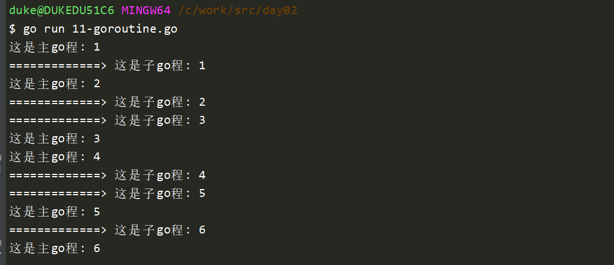


启动多个字go程，他们会竞争cpu资源

```go
package main

import (
	"fmt"
	"time"
)

//这个将用于子go程使用
func display(num int) {
	count := 1
	for {
		fmt.Println("=============> 这是子go程:", num, "当前count值:", count)
		count++
		//time.Sleep(1 * time.Second)
	}
}

func main() {
	//启动子go程
	for i := 0; i < 3; i++ {
		go display(i)
	}

	//go func() {
	//	count := 1
	//	for {
	//		fmt.Println("=============> 这是子go程:", count)
	//		count++
	//		time.Sleep(1 * time.Second)
	//	}
	//}()

	//主go程
	count := 1
	for {
		fmt.Println("这是主go程:", count)
		count++
		time.Sleep(1 * time.Second)
	}
}

```


## 2. 提前退出go程

```go
package main

import (
	"fmt"
	"runtime"
	"time"
)

//return  ===> 返回当前函数
//exit ===> 退出当前进程
//GOEXIT ===> 提前退出当前go程

func main() {
	go func() {
		go func() {
			func() {
				fmt.Println("这是子go程内部的函数!")
				//return //这是返回当前函数
				//os.Exit(-1) //退出进程
				runtime.Goexit() //退出当前go程
			}()

			fmt.Println("子go程结束!") //这句会打印吗？ 会1：  不打印2
			fmt.Println("go 2222222222 ")

		}()
		time.Sleep(2 * time.Second)
		fmt.Println("go 111111111111111")
	}()

	fmt.Println("这是主go程!")
	time.Sleep(3 * time.Second)
	fmt.Println("OVER!")
}

```

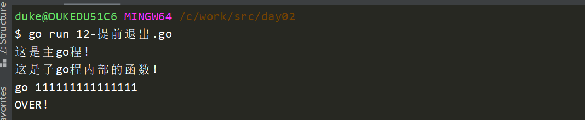


## 3. 无缓冲管道channel

```go
package main

import (
	"fmt"
	"time"
)

func main() {
	//sync.RWMutex{}
	//当涉及到多go程时，c语言使用互斥量，上锁来保持资源同步，避免资源竞争问题
	//go语言也支持这种方式，但是go语言更好的解决方案是使用管道、通道 channel
	//使用通道不需要我们去进行加解锁
	//A 往通道里面写数据  B从管道里面读数据，go自动帮我们做好了数据同步

	//创建管道：  创建一个装数字的管道 ==> channel
	//strChan := make(chan string) //装字符串的管道

	//make(map[int]string, 10)
	//装数字的管道，使用管道的时候一定要make， 同map一样，否则是nil
	//此时是无缓冲的管道
	//numChan := make(chan int)

	//有缓冲的管道，有点像数组，但是不能使用下标访问
	numChan := make(chan int, 10)

	//创建两个go程，父亲写数据，儿子读数据
	go func() {
		for i := 0; i < 50; i++ {
			data := <-numChan
			fmt.Println("子go程1 读取数据  ===》 data:", data)
		}
	}()

	go func() {
		for i := 0; i < 20; i++ {
			//向管道中写入数据
			numChan <- i
			fmt.Println("子go程2 写入数据:", i)
			//time.Sleep(1 * time.Second)
		}
	}()

	for i := 20; i < 50; i++ {
		//向管道中写入数据
		numChan <- i
		fmt.Println("======> 这是主go程, 写入数据:", i)
		//time.Sleep(1 * time.Second)
	}

	time.Sleep(5 * time.Second)
}

```

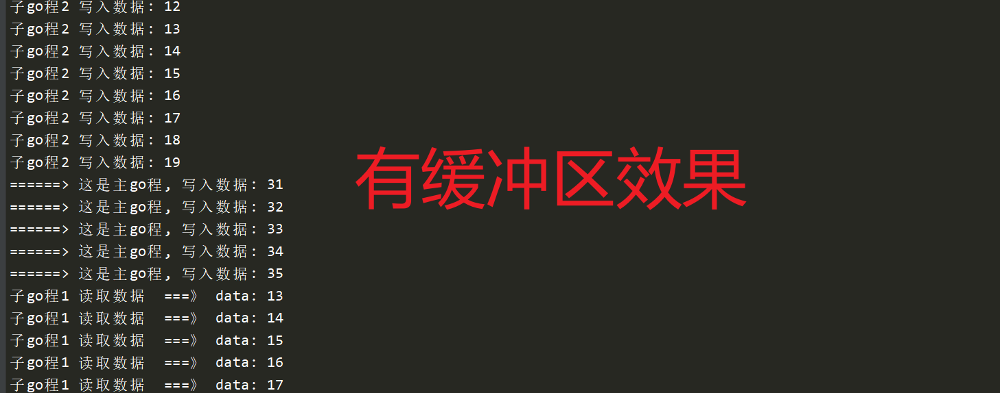


## 4. 有缓冲区管道

```go
package main

import (
	"fmt"
	"time"
)

func main() {
	//numsChan := make(chan int, 10)
	//1. 当缓冲写满的时候，写阻塞，当被读取后，再恢复写入
	//2. 当缓冲区读取完毕，读阻塞
	//3. 如果管道没有使用make分配空间，那么管道默认是nil的，读取、写入都会阻塞
	//4. 对于一个管道，读与写的次数，必须对等

	var names chan string //默认是nil的
	names = make(chan string, 10)

	go func() {
		fmt.Println("names:", <-names)
	}()

	names <- "hello" //由于names是nil的，写操作会阻塞在这里
	time.Sleep(1 * time.Second)

	numsChan1 := make(chan int, 10)

	//写
	go func() {
		for i := 0; i < 50; i++ {
			numsChan1 <- i
			fmt.Println("写入数据:", i)
		}
	}()

	//读,当主程序被管道阻塞时，那么程序将锁死崩溃
    //要求我们一定要读写次数保持一致
	func() {
		for i := 0; i < 60; i++ {
			fmt.Println("主程序准备读取数据.....")
			data := <-numsChan1
			fmt.Println("读取数据:", data)
		}
	}()

	for {
		;
	}
}

```

1. 当管道的读写次数不一致的时候
   1. 如果阻塞在主go程，那么程序会崩溃
   2. 如果阻塞在子go程，那么会出现内存泄露


## 5. for range遍历

```go
package main

import "fmt"

func main() {

	numsChan2 := make(chan int, 10)

	//写
	go func() {
		for i := 0; i < 50; i++ {
			numsChan2 <- i
			fmt.Println("写入数据:", i)
		}
		fmt.Println("数据全部写完毕，准备关闭管道!")
		close(numsChan2)
	}()

	//遍历管道时，只返回一个值
	//for range是不知道管道是否已经写完了，所以会一直在这里等待
	//在写入端，将管道关闭，for range遍历关闭的管道时，会退出
	for v := range numsChan2 {
		fmt.Println("读取数据 :", v)
	}

	fmt.Println("OVER!")
}
```


## 6. ==管道总结==

1. 当管道写满了，写阻塞

2. 当缓冲区读完了，读阻塞

3. 如果管道没有使用make分配空间，管道默认是nil，从nil的管道读取数据、写入数据，都会阻塞（注意，不会崩溃）

4. 从一个已经close的管道读取数据时，会返回零值（不会崩溃）  《=== 验证

5. 向一个已经close的管道写数据时，会崩溃   《== 验证

6. 关闭一个已经close的管道，程序会崩溃  《== 验证

7. 关闭管道的动作，一定要在写端，不应该放在读端，否则写的继续写会崩溃

8. 读和写的次数，一定对等，否则：

   1. 在多个go程中：资源泄露
   2. 在主go程中，程序崩溃（deadlock)

   

## ==三个场景使用make==

切片，map，管道，如果不初始化空间，默认值都是nil


切片：

```go
var names []string
names = make([]string, 长度, 容量)

names := []string{} //不推荐这样使用
```

字典/map/哈希表：

```go
var idNames map[int]string
idNames = make(map[int]string, 容量)
```

管道：

```go
var numChan chan int
numChan = make(chan int, 容量)
```


## 7. 多go程读写

略，上面有

## 8. 判断管道是否已经关闭

需要知道一个管道的状态，如果已经关闭了，读不怕，会返回零，如果再写入的话，有崩溃的风险。

map: ==>  v, ok := m1[0]

channel: ==> v, ok := <- numChan   《---- 别忘记箭头

```go
package main

import "fmt"

func main() {
    
	numChan := make(chan int, 10)

	//写
	go func() {
		for i := 0; i < 10; i++ {
			numChan <- i
			fmt.Println("写入数据:", i)
		}

		close(numChan) //close在写完不要忘记关闭
	}()

	//读数据
	//for v := range numChan {
	//	fmt.Println("v:", v)
	//}

	for {
		v, ok := <-numChan // ok-idom模式判断
		if !ok {
			fmt.Println("管道已经关闭了，准备退出!")
			break
		}

		fmt.Println("v:", v)
	}

	fmt.Println("OVER!")
}

```

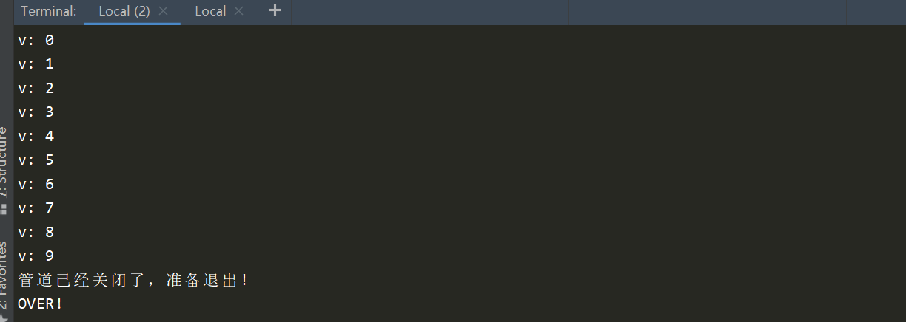


## 9. 单向通道

numChan := make(chan int, 10)    ==> 双向通道， 既可以读，也可以写

单向通道：为了明确语义，一般用于函数参数 

- 单向读通道:   var numChanReadOnly  <- chan int
- 单向写通道:  var numChanWriteOnly chan <- int 

- 双向通道可以转化成单向通道，单向无法转成双向
- 管道在函数间传递时，相当于引用传递

```go
package main

import (
	"fmt"
	"time"
)

func main() {
	//- 单向读通道:
	//var numChanReadOnly <-chan int
	//- 单向写通道:
	//var numChanWriteOnly chan<- int

	//生产者消费者模型
	//C: 数组+锁   thread1 : 写， thread2：读
	//Go: goroutine + channel

	//1. 在主函数中创建一个双向通道 numChan
	numChan1 := make(chan int, 5)

	//2. 将numChan 传递给producer， 负责生产
	go producer(numChan1) //双向通道可以赋值给同类型的单向通道, 单向不能转双向

	//2. 将numChan 传递给consumer 负责消费
	go consumer(numChan1)

	time.Sleep(2 * time.Second)
	fmt.Println("OVER!")
}

// producer 生产者   ===> 提供一个只写的通道
func producer(out chan<- int) {
	for i := 0; i < 10; i++ {
		out <- i
		//data := <-out  //写通道不允许有读取操作
		fmt.Println("====> 向管道中写入数据:", i)
	}

	close(out)
}

// consumer 消费者   ===> 提供一个只读的通道
func consumer(in <-chan int) {
	//in <- 10  //读通道不允许有写入操作
	for v := range in {
		fmt.Println("从管道读取数据：", v)
	}

	fmt.Println("consumer end 111111!")
}

```

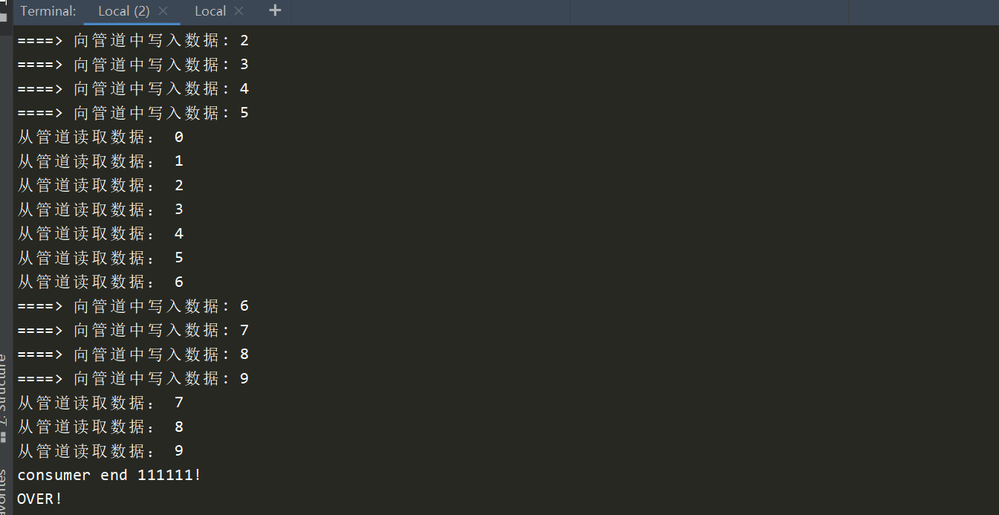


学员问题：

> 多go程其中一个写的go程关闭了管道，会对其他的写和读产生什么影响 ?

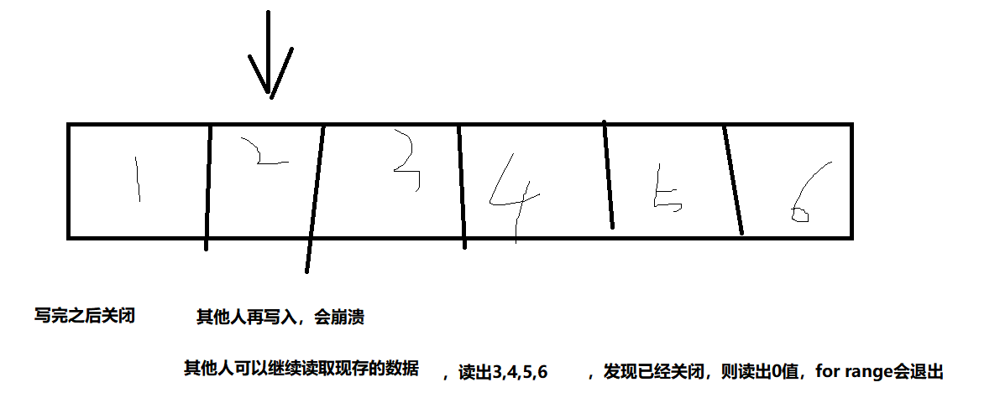


## 10. select

当程序中有多个channel协同工作，ch1, ch2， 某一个时刻，ch1或chan2触发了，程序要做响应的处理

使用select来监听多个通道，当管道被触发时（写入数据，读取数据，关闭管道）

select语法与switch case很像，但是所有的分支条件都必须是通道io

```go
package main

import (
	"fmt"
	"time"
)

//当程序中有多个channel协同工作，ch1, chan2， 某一个时刻，ch1或chan2触发了，程序要做响应的处理
//使用select来监听多个通道，当管道被触发时（写入数据，读取数据，关闭管道）
//select语法与switch case很像，但是所有的分支条件都必须是通道io

func main() {
	//var chan1, chan2 chan int
	chan1 := make(chan int)
	chan2 := make(chan int)

	//启动一个go程，负责监听两个channel
	go func() {
		for {
			fmt.Println("监听中.......")
			select {
			case data1 := <-chan1:
				fmt.Println("从chan1读取数据成功, data1:", data1)
			case data2 := <-chan2:
				fmt.Println("------------->从chan2读取数据成功, data2:", data2)
			default:
				fmt.Println("select default分支called!")
				time.Sleep(time.Second)
			}
		}
	}()

	//启动go1 写chan1
	go func() {
		for i := 0; i < 10; i++ {
			chan1 <- i
			time.Sleep(1 * time.Second / 2)
		}
	}()

	//启动go2 写chan2
	go func() {
		for i := 0; i < 10; i++ {
			chan2 <- i
			time.Sleep(1 * time.Second)
		}
	}()

	for {
		fmt.Println("OVER!")
		time.Sleep(5 * time.Second)
	}
}

```

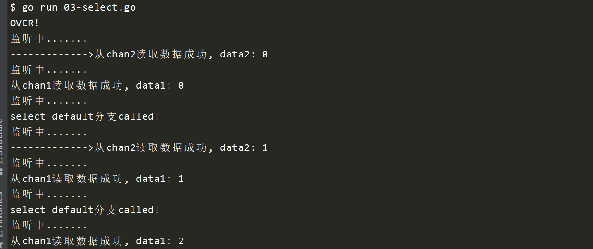


demo验证当多个channel同时触发的时候select会选择哪一响应呢？

> select会随机响应一个，另外一个会在下一轮响应

```go
package main

import "fmt"

func main() {
	c1 := make(chan int)
	c2 := make(chan int)
	c3 := make(chan int)

	//将三个管道都关闭，从关闭的管道读取数据，不会崩溃，会返回零值
	//close(c1)
	close(c2)
	close(c3)

	var c1Count, c2Count, c3Count int

	for i := 0; i < 1000; i++ {
		select {
		case <-c1:
			c1Count++
		case <-c2:
			c2Count++
		case <-c3:
			c3Count++
		}
	}

	fmt.Println("c1Count:", c1Count)
	fmt.Println("c2Count:", c2Count)
	fmt.Println("c3Count:", c3Count)
}

```

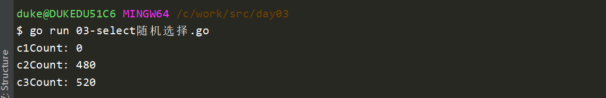
