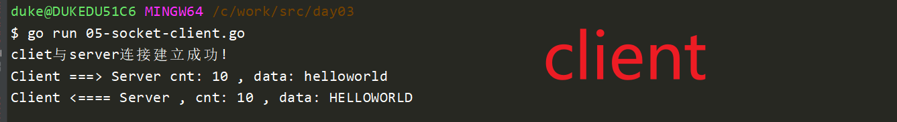

# 一、网络分层


# 二、socket


### - Server Demo

接收一个链接，而且只能发送一次数据

```go
package main

import (
	"fmt"
	"net"
	"strings"
)

func main() {
	//创建监听
	ip := "127.0.0.1"
	port := 8848
	address := fmt.Sprintf("%s:%d", ip, port)

	//func Listen(network, address string) (Listener, error) {
	//net.Listen("tcp", ":8848") //简写，冒号前面默认是本机: 127.0.0.1
	listener, err := net.Listen("tcp", address)

	if err != nil {
		fmt.Println("net.Listen err:", err)
		return
	}

	fmt.Println("监听中...")

	//Accept() (Conn, error)
	conn, err := listener.Accept()
	if err != nil {
		fmt.Println("listener.Accept err:", err)
		return
	}

	fmt.Println("连接建立成功!")

	//创建一个容器，用于接收读取到的数据
	buf := make([]byte, 1024) //使用make来创建字节切片, byte ==> uint8

	//Read(b []byte) (n int, err error)
	//cnt：真正读取client发来的数据的长度
	cnt, err := conn.Read(buf)
	if err != nil {
		fmt.Println("conn.Read err:", err)
		return
	}

	fmt.Println("Client =====> Server, 长度:", cnt, "，数据:", string(buf[0:cnt]))

	//服务器对客户端请求进行响应 ,将数据转成大写 "hello" ==> HELLO
	//func ToUpper(s string) string {
	upperData := strings.ToUpper(string(buf[0:cnt]))

	//Write(b []byte) (n int, err error)
	cnt, err = conn.Write([]byte(upperData))
	fmt.Println("Client  <====== Server, 长度:", cnt, "，数据:", upperData)

	//关闭连接
	conn.Close()
}

```

### - client demo

```go
package main

import (
	"fmt"
	"net"
)

func main() {
	conn, err := net.Dial("tcp", ":8848")
	if err != nil {
		fmt.Println("net.Dial err:", err)
		return
	}

	fmt.Println("cliet与server连接建立成功!")
	sendData := []byte("helloworld")

	//向服务器发送数据
	cnt, err := conn.Write(sendData)
	if err != nil {
		fmt.Println("conn.Write err:", err)
		return
	}

	fmt.Println("Client ===> Server cnt:", cnt, ", data:", string(sendData))

	//接收服务器返回的数据
	//创建buf，用于接收服务器返回的数据
	buf := make([]byte, 1024)
	cnt, err = conn.Read(buf)
	if err != nil {
		fmt.Println("conn.Read err:", err)
		return
	}

	fmt.Println("Client <==== Server , cnt:", cnt, ", data:", string(buf[0:cnt]))

	conn.Close()
}

```





socket-server处理多个连接，每个连接可以接收多次数据

```go
package main

import (
	"fmt"
	"net"
	"strings"
)

func main() {
	//创建监听
	ip := "127.0.0.1"
	port := 8848
	address := fmt.Sprintf("%s:%d", ip, port)

	//func Listen(network, address string) (Listener, error) {
	//net.Listen("tcp", ":8848") //简写，冒号前面默认是本机: 127.0.0.1
	listener, err := net.Listen("tcp", address)

	if err != nil {
		fmt.Println("net.Listen err:", err)
		return
	}

	//需求：
	// server可以接收多个连接， ====> 主go程负责监听，子go程负责数据处理
	// 每个连接可以接收处理多轮数据请求

	for {
		fmt.Println("监听中...")

		//Accept() (Conn, error)
		conn, err := listener.Accept()
		if err != nil {
			fmt.Println("listener.Accept err:", err)
			return
		}

		fmt.Println("连接建立成功!")

		go handleFunc(conn)
	}
}

//处理具体业务的逻辑，需要将conn传递进来，每一新连接，conn是不同的
func handleFunc(conn net.Conn) {
	for { //这个for循环，保证每一个连接可以多次接收处理客户端请求
		//创建一个容器，用于接收读取到的数据
		buf := make([]byte, 1024) //使用make来创建字节切片, byte ==> uint8

		fmt.Println("准备读取客户端发送的数据....")

		//Read(b []byte) (n int, err error)
		//cnt：真正读取client发来的数据的长度
		cnt, err := conn.Read(buf)
		if err != nil {
			fmt.Println("conn.Read err:", err)
			return
		}

		fmt.Println("Client =====> Server, 长度:", cnt, "，数据:", string(buf[0:cnt]))

		//服务器对客户端请求进行响应 ,将数据转成大写 "hello" ==> HELLO
		//func ToUpper(s string) string {
		upperData := strings.ToUpper(string(buf[0:cnt]))

		//Write(b []byte) (n int, err error)
		cnt, err = conn.Write([]byte(upperData))
		fmt.Println("Client  <====== Server, 长度:", cnt, "，数据:", upperData)
	}

	//关闭连接
	_ = conn.Close()
}

```


当client多次发送数据时：


# 三、http

## 1. 概述

编写web语言：

1. java
2. php， 现在都在尝试使用go语言重写
3. python，豆瓣
4. go语言    ===》 beego，gin两个主流的web框架


https协议：我们使用浏览器访问的时候发送的就是http请求

1. http是应用层的协议，底层还是依赖传输层：tcp（短连接），网络层（ip）

2. 无状态的，每一次请求都是独立的，下次请求需要重新建立连接

3. https：

   1. http是标准协议 ==》 明文传输，不安全

   2. https不是标准协议   ===》 https = http + ssl（非对称加密，数字证书）--》加密的

   3. 现在所有网站都会尽量要求使用https开发：安全

      

## 2. http请求报文格式


一个http请求可以分为4部分：

1. 请求行：包含三部分
   1. 格式：  方法   +   URL   + 协议版本号
   2.  实例： POST  +   /chapter17/user   + HTTP/1.1
   3. 请求方法：
      1. GET：获取数据
      2. POST：上传数据（表单格式，json格式）
      3. PUT：修改数据
      4. DELETE： 用于删除数据
2. 请求头
   1. 格式：  key ：value
   2. 可以有很多个键值对（包含协议自带，也包含用户自定义的）
   3. 常见重要头：
      1. Accept : 接收数据的格式
      2. User-Agent : 描述用户浏览器的信息
      3. Connection： Keep-Alive (长链接)， Close（短连接）
      4. Aceept-Encoding : gzip, xxx  , 描述可以接受的编码
      5. Cookie: 由服务器设置的key=value数据，客户端下次请求的时候可以携带过来
      6. Content-Type: 
         1. appliction/-form(表示上传的数据是表单格式), 
         2. application/json(表示body的数据是json格式)
      7. 用户可以自定义的：
         1. name : Duke
         2. age : 18
3. 空行
   1. 告诉服务器，请求头结束了，用于分割
4. 请求包体(可选的)
   1. 一般在POST方法时，会配套提供BODY
   2. 在GET的时候也可以提供BODY，但是这样容易让人混淆，建议不要这样使用
   3. 上传两种数据格式：
      1. 表单： 姓名，性别，年龄
      2. json数据格式


启动tcp的server案例，使用postman发起http请求，查看http请求头信息：

```go
package main

import (
	"fmt"
	"net"
	"strings"
)

func main() {
	//创建监听
	ip := "127.0.0.1"
	port := 8848
	address := fmt.Sprintf("%s:%d", ip, port)

	//func Listen(network, address string) (Listener, error) {
	//net.Listen("tcp", ":8848") //简写，冒号前面默认是本机: 127.0.0.1
	listener, err := net.Listen("tcp", address)

	if err != nil {
		fmt.Println("net.Listen err:", err)
		return
	}
	fmt.Println("server start ...")

	//需求：
	// server可以接收多个连接， ====> 主go程负责监听，子go程负责数据处理
	// 每个连接可以接收处理多轮数据请求

	for {
		fmt.Println("监听中...")

		//Accept() (Conn, error)
		conn, err := listener.Accept()
		if err != nil {
			fmt.Println("listener.Accept err:", err)
			return
		}

		fmt.Println("连接建立成功!")

		go handleFunc(conn)
	}
}

//处理具体业务的逻辑，需要将conn传递进来，每一新连接，conn是不同的
func handleFunc(conn net.Conn) {
	for { //这个for循环，保证每一个连接可以多次接收处理客户端请求
		//创建一个容器，用于接收读取到的数据
		buf := make([]byte, 1024) //使用make来创建字节切片, byte ==> uint8

		fmt.Println("准备读取客户端发送的数据....")

		//Read(b []byte) (n int, err error)
		//cnt：真正读取client发来的数据的长度
		cnt, err := conn.Read(buf)
		if err != nil {
			fmt.Println("conn.Read err:", err)
			return
		}

		fmt.Println("Client =====> Server, 长度:", cnt, "，数据:", string(buf[0:cnt]))

		//服务器对客户端请求进行响应 ,将数据转成大写 "hello" ==> HELLO
		//func ToUpper(s string) string {
		upperData := strings.ToUpper(string(buf[0:cnt]))

		//Write(b []byte) (n int, err error)
		cnt, err = conn.Write([]byte(upperData))
		fmt.Println("Client  <====== Server, 长度:", cnt, "，数据:", upperData)
	}

	//关闭连接
	_ = conn.Close()
}

```

postman: 


结果：


前端与后台传输数据方法：

1. 放在请求头中 （常用）
2. 放在请求包体中
3. 放在url中： GET /user?id=1001&score=90&school=middleschool  （常用）
   1. ？分割参数和uri
   2. 多个参数之间使用&分割，每一个参数数据都是一个键值对
   3. 一般在url中传输参数的时候，参数值一般会做base64处理，为了防止与url特殊字符混淆
      1. 0~9
      2. a-zA-Z
      3. _/


## 3. http响应消息格式


http响应格式也分为4部分：

1. 第一部分：状态行

   1. 协议格式：   协议版本号 +   状态码   + 状态描述

   2. 实例1：HTTP/1.1   + 200  + OK

   3. 实例2：HTTP/1.1   +404 +  not found

   4. 常用的状态码：

      - 1xx  ===》客户端可以即系发送请求（一般感知不到）
      - 2xx  ===》正常访问， 200
      - 3xx  ===》重定向
      - 4xx
        - 401  ===》 未授权 not authorized
        - 404  ===> Not found
      - 5xx
        - 501 ==> Internal Error  （服务器内部错误）

      

2. 第二部分：响应头

   1. Content-Type : application/json
   2. Server: Apache 
   3. Data : Mon, 12 Sep ...
   4. ....

3. 第三部分：空行

   1. 用于分割，表示下面没有响应头了

4. 第四部分：响应包体

   1. 通常是返回json数据


## 4. http client

```go
package main

import (
	"fmt"
	"io/ioutil"
	"net/http"
)

func main() {
	//http包
	client := http.Client{}

	//func (c *Client) Get(url string) (resp *Response, err error) {
	resp, err := client.Get("https://www.baidu.com")
	if err != nil {
		fmt.Println("client.Get err:", err)
		return
	}

	//放在上面，内容很多
	body := resp.Body
	fmt.Println("body 111:", body)
	//func ReadAll(r io.Reader) ([]byte, error) {
	readBodyStr, err := ioutil.ReadAll(body)
	if err != nil {
		fmt.Println("read body err:", err)
		return
	}

	fmt.Println("body string:", string(readBodyStr))

	//beego, gin  ==> web框架
	ct := resp.Header.Get("Content-Type")
	date := resp.Header.Get("Date")
	server := resp.Header.Get("Server")

	fmt.Println("content-type:", ct)
	fmt.Println("date:", date)
	//BWS是Baidu Web Server,是百度开发的一个web服务器 大部分百度的web应用程序使用的是BWS
	fmt.Println("server:", server)

	url := resp.Request.URL
	code := resp.StatusCode
	status := resp.Status

	fmt.Println("url:", url)       //https://www.baidu.com
	fmt.Println("code:", code)     //200
	fmt.Println("status:", status) //OK

}

```


## 5. http server

```go
package main

import (
	"fmt"
	"io"
	"net/http"
)

func main() {
	//注册路由 router
	//xxxx/user  ===> func1
	//xxxx/name  ===> func2
	//xxxx/id    ===> func3

	//https://127.0.0.1:8080/user, func是回调函数，用于路由的响应，这个回调函数原型是固定
	http.HandleFunc("/user", func(writer http.ResponseWriter, request *http.Request) {
		//request : ===> 包含客户端发来的数据
		fmt.Println("用户请求详情:")
		fmt.Println("request:", request)
		
        //这里是具体处理业务逻辑xxx
        
		//writer :  ===> 通过writer将数据返回给客户端
		_, _ = io.WriteString(writer, "这是/user请求返回的数据!")
	})
	//https://127.0.0.1:8080/name
	http.HandleFunc("/name", func(writer http.ResponseWriter, request *http.Request) {
		_, _ = io.WriteString(writer, "这是/name请求返回的数据!")
	})

	//https://127.0.0.1:8080/id
	http.HandleFunc("/id", func(writer http.ResponseWriter, request *http.Request) {
		_, _ = io.WriteString(writer, "这是/id请求返回的数据!")
	})

	fmt.Println("Http Server start ...")
	//func ListenAndServe(addr string, handler Handler) error {
	if err := http.ListenAndServe("127.0.0.1:8080", nil); err != nil {
		fmt.Println("http start failed, err:", err)
		return
	}
	//if err != nil {
	//	fmt.Println("http start failed, err:", err)
	//	return
	//}
}

```


## 6. JSON

```json
{
	"name":"矮大紧",							
	"sex":"man",								
	"age":131,								
	"girls":["金莲","凤姐","码蓉","春哥"],			
	"成绩": [2, 14, 9, 78, 96],					
	"家电":{"彩电":"海尔", "洗衣机":"三星"},
  "stars": [
    { "name":"Faye" ,"address":" 北京 " },
    { "name":"andy" ,"address":" 香港 " },
    { "name":"eddie","address":" 台湾 " }
  ]
 }
```

记住，json语法要求最后一个元素后面，不能加逗号


### - json编解码

在网络中传输的时候，把Student结构体，编码成json字符串，传输  ===》 结构体 ==》 字符串  ==》 编码

接收字符串，需要将字符串转换成结构体，然后操作 ==》 字符串 ==》 结构体  ==》解密

```go
package main

import (
	"encoding/json"
	"fmt"
)

type Student struct {
	Id     int
	Name   string
	Age    int
    
    //注意，gender是小写的, 小写字母开头的，在json编码时会忽略掉
	gender string 
}

func main() {
	//在网络中传输的时候，把Student结构体，编码成json字符串，传输  ===》 结构体 ==》 字符串  ==》 编码
	//接收字符串，需要将字符串转换成结构体，然后操作 ==》 字符串 ==》 结构体  ==》解密

	lily := Student{
		Id:     1,
		Name:   "Lily",
		Age:    20,
		gender: "女士",
	}

	//编码（序列化）,结构=》字符串
	//func Marshal(v interface{}) ([]byte, error) {
	encodeInfo, err := json.Marshal(&lily)
	if err != nil {
		fmt.Println("json.Marshal err:", err)
		return
	}

	fmt.Println("encodeInfo:", string(encodeInfo))

	//对端接收到数据
	//反序列化（解码）： 字符串=》结构体

	var lily2 Student

	//func Unmarshal(data []byte, v interface{}) error {
	if err := json.Unmarshal([]byte(encodeInfo), &lily2); err != nil {
		fmt.Println("json.Unmarshal err:", err)
		return
	}

	fmt.Println("name:", lily2.Name)
	fmt.Println("gender:", lily2.gender)
	fmt.Println("age:", lily2.Age)
	fmt.Println("id:", lily2.Id)

}
```


### - 结构体标签

```go
package main

import (
	"encoding/json"
	"fmt"
)

type Teacher struct {
	Name    string `json:"-"`                 //==> 在使用json编码时，这个编码不参与
	Subject string `json:"Subject_name"`      //==> 在json编码时，这个字段会编码程Subject_name
	Age     int    `json:"age,string"`        //==>在json编码时，将age转成程string类型, 一定要两个字段:名字,类型，中间不能有空格
	Address string `json:"address,omitempty"` //==》在json编码时，如果这个字段是空的，那么忽略掉，不参与编码

	//注意，gender是小写的, 小写字母开头的，在json编码时会忽略掉
	gender string
}

type Master struct {
	Name    string
	Subject string
	Age     int
	Address string
	gender  string
}

func main() {

	t1 := Teacher{
		Name:    "Duke",
		Subject: "Golang",
		Age:     18,
		gender:  "Man",
		Address: "北京",
	}

	fmt.Println("t1:", t1)
	encodeInfo, _ := json.Marshal(&t1)

	fmt.Println("encodeInfo:", string(encodeInfo))

	//解码
	t2 := Teacher{}
	_ = json.Unmarshal(encodeInfo, &t2)
	fmt.Println("t2:", t2.Subject)

	m1 := Master{}
	_ = json.Unmarshal(encodeInfo, &m1)
	fmt.Println("m1:", m1)

}
```


总结：

1. 对于结构体进行编码时(json)： 字段的首字母必须大写，否则无法编码

2. 如果json格式要求key小写，那么可以通过标签（tag）来解决

3. tag细节：

   ```go
   //==> 在使用json编码时，这个编码不参与	
   Name    string `json:"-"`            
   	
   //==> 在json编码时，这个字段会编码程Subject_name
   Subject string `json:"Subject_name"`
   
   //==>在json编码时，将age转成程string类型, 一定要两个字段:名字,类型，中间不能有空格
   Age     int    `json:"age,string"`        
   ```

